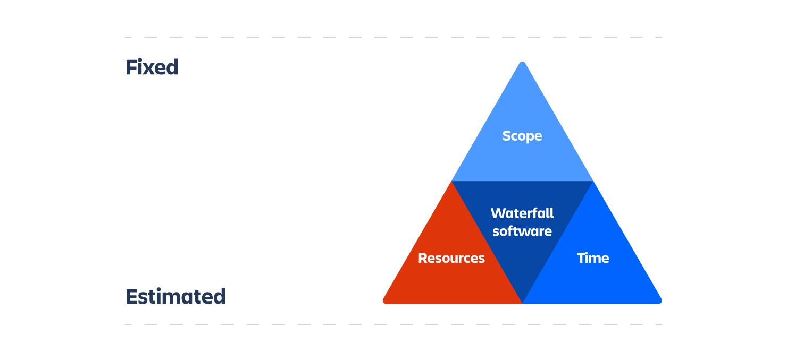
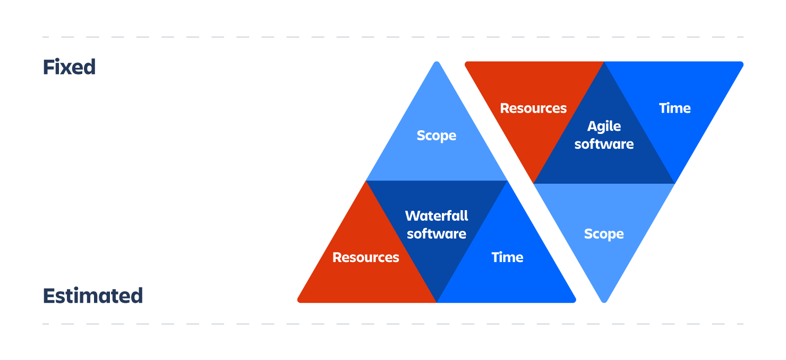
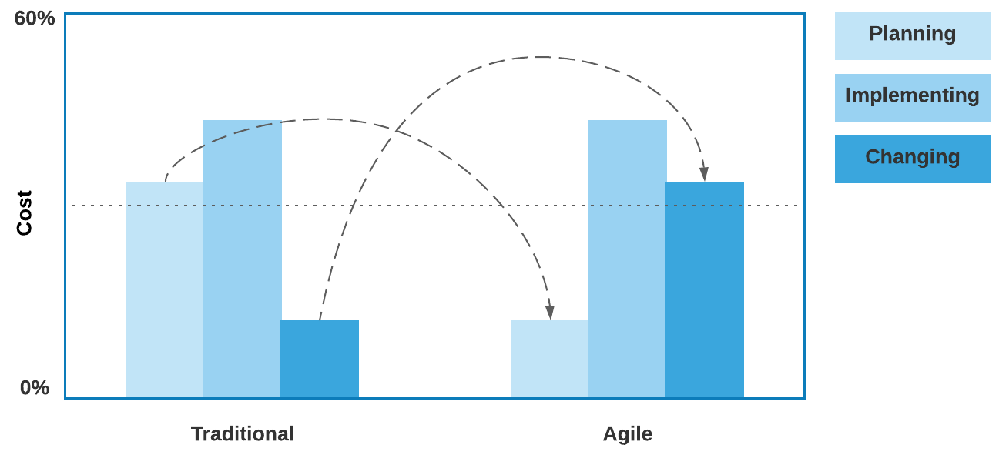

## Waterfall Methodology

### Use Cases:

-   **Well-defined requirements**: Waterfall is the best project life cycle option for projects with precise, stable, and in-depth established requirements.
-   **Regulatory Compliance**: This is fundamental in industries with substantial regulatory requirements. These requirements require the formulation of documentation of various stages, and regulatory bodies could authorize the performance of the same.
-   **Predictable and Low-Risk Projects**: It fits projects with minimal risk possibilities, where possible outcomes can easily be worked out.
-   **Complex Interdependencies**: This is best for projects that feature complicated interconnections between the phases, where one part involves another, and where execution and planning are of great importance.

### Business Benefits:

-   **Structured Approach:** Step-by-step activities demonstrate the structure and method of the solution to achieve a complete product or service.
-   **Detailed Documentation:** Detailed documentation is a valuable resource for both maintenance personnel and compliance auditors.
-   **Predictability:** Known delivery timeframes and task benefits facilitate a better understanding of tasks, which leads to more accurate and less costly resource balance planning and budgeting.
-   **Risk Management:** The engineering department can minimize the risk posed by additional work requirements through meticulous requirement analysis at the very beginning.

### Costs for Business:
-   **Inflexibility:** Implementing changes in the project at a later stage may be very costly and sometimes impossible to achieve.
-   **Long Feedback Loop:** If feedback is received early, there is always a chance that the work will be in sync with stakeholder goals.
-   **High Initial Costs:** A big chunk of bold capital investment is the keen focus on planning and documentation.
-   **Requires Skilled Teams:** Success requires teams with a high level of skill, collaboration, and experience to predict and make it right from the first try.

## Agile Methodology

### Use Cases:

-   **Evolving Requirements:** Agile suits projects when the requirements change or evolve depending on the feedback.
-   **Customer-Centric Focus:** Perfect for projects that utilize the customer's feedback to develop the final product.
-   **High Uncertainty and Innovation:** This is the best way to implement innovative projects with uncertainty, where flexibility and rapid iteration are the keys.

### Benefits:

-   **Flexibility and Adaptability:** The organization can make a quick shift in any situation whenever there are new developments and new information.
-   **Continuous Improvement:** This way of continuous improvement starts when the product development is developed and with the regular feedback loops, the ones responsible for the product will be able to continuously improve it.
-   **Customer Satisfaction:** The company provides a good product due to the customer's full participation in the design process.
-   **Early Detection of Issues:** Regular testing and reviews help identify and resolve early, thus decreasing the possibility of significant defects.

### Costs:

-   **Less Predictability:** The `flexible nature` of the project's scope can make it difficult to predict timelines and costs.
-   **Potential for Scope Creep:** Without effective leadership, uncontrolled changes, known as scope creep, can happen due to changing requirements.

## Choosing the Right Path for Your Business

### Waterfall:

-   **Profit Potential:** Using Waterfall's structured approach, the completion of big, complex projects is manageable, and the outcomes are expected. Moreover, it switches those risks presented by scope change to other areas where they are less prominent, making it easier to manage for less dynamic projects. Another aspect that makes implementation a challenge is the rigidity of the waterfall model. Every time new requirements are imposed, the cost of making changes increases. Further, the model's rigidity needs to enable customer feedback, bringing about unnecessarily expensive changes upon them.
-   **Cost Considerations:** The costs of initial planning and documentation are high, and the inflexibility can make the changes, if necessary, costly when the requirements evolve in due course.

### Agile:

-   **Profit Potential:** Due to the cyclical nature of Agile, companies can decrease the time-to-market time of their products to be released on the market more and more with each cycle. Thus, companies can keep up with the market and update their products with the feedback received. This is also the case with stone products produced based on incremented user feedback. As a result, the company can achieve higher customer satisfaction and competitive advantage.
-   **Cost Considerations:** Agile projects can be staff-intensive, meaning they get the best out of the employee's commitment to the project, and the development team is also managed. In addition to stakeholder interactions, skilled teams are necessary to maintain projects. The fluid nature of the models means that the budget and time often do not follow the plan, but usually, they result in a product that satisfies users' requirements and the market. It is likely that both predictive budgeting and forecasting will  be reduced since the agile methodic approach can potentially.

## Conclusion

Waterfall is a straight, organized approach that is good for projects with well-defined requirements and regulatory needs.

Agile is more flexible and adaptable, which can be a perfect fit for dynamic environments with changing requirements and allows companies to focus on customer satisfaction.

Some people find that Agile and Waterfall on the same team would be trouble. However, it depends on the circumstances. They may fail to play together in well-established projects based on well-defined requirements.

Some experts recommend the mixing of the two models. They argue that using both Agile and Waterfall methods in projects can provide the benefits of both methods.

---

**[Paul Keen](https://www.linkedin.com/in/paul-keen/)** is a CTO at [JetThoughts](https://jetthoughts.com/).

---

References:

-  [Iron triangle project management and agile](https://www.atlassian.com/agile/agile-at-scale/agile-iron-triangle)

Images by:

- [Szoke, Akos](https://www.blogger.com/profile/05240832433109599062) on [Planning constraints in agile projects](https://blog.kese.hu/2021/10/planning-constraints-in-agile-projects.html)
- [Iron triangle project management and agile](https://www.atlassian.com/agile/agile-at-scale/agile-iron-triangle)
