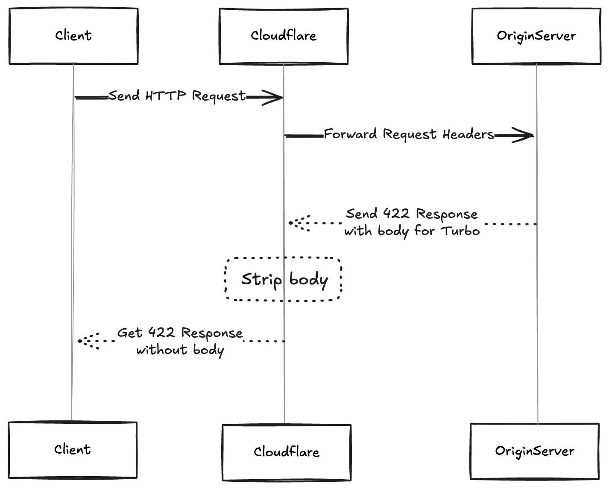

Recently, we encountered a bug in our application. A user reported that after submitting a form, nothing happened. No messages appeared, and the form didn’t update. We set out to find the issue.

First, we reproduced the problem in our development environment. Everything worked fine, but the form showed validation messages when needed, so we tested it in production.

At first, we couldn’t see the problem in production either. The form seemed to work for us, but the user kept experiencing the issue. Determined to find the cause, we dug deeper.

Our application uses Hotwire. When a user submits an invalid form, it returns a 422 response with a body. This response should show error messages on the page. However, the response body was missing in production, so the user didn’t see any validation messages.

After investigating, we found the root cause. Our application uses Cloudflare as a proxy. Cloudflare handles incoming requests and responses. When a 422 error occurs, Cloudflare only forwards the response headers. It does not forward the response body. As a result, the user’s browser didn’t receive the error messages, so the form didn’t show any validation updates.

We applied a quick fix by disabling the Cloudflare proxy. This allowed the response body to be forwarded, and the validation messages appeared as expected. But turning off the proxy wasn’t ideal because it could expose our application to security risks.

We needed a better solution. Since Cloudflare doesn't provide an option to forward response bodies for 4xx errors by default, we adjusted our application's error handling. Instead of returning a 422 status code for validation errors, we modified the server to return a 200 status code with the error messages in the response body. This way, Cloudflare wouldn't strip the response body, and the user's browser would receive the necessary validation messages.

After making this change, we tested the form again in production. The validation messages appear correctly when an invalid form is submitted, resolving the user's issue.

**What to Do If You Face a Similar Issue**

**Check Your Proxy Settings**: Check if you’re using a service like Cloudflare and understand how it handles different HTTP status codes and responses.
- **Review Error Handling in Your Application**: Consider modifying how your application responds to validation errors. Using a 200 status code with error information in the body can bypass proxy limitations.
- **Test in Multiple Environments**: To understand the issue's scope and reproduce it in both development and production.
- **Consult Documentation**: Look into the proxy service's documentation for workarounds or settings that might help.
- **Test After Changes**: Always verify that your changes work as expected in production.

Understanding how intermediary services like proxies affect your application is crucial. Proper configuration and error handling can prevent confusing bugs and improve user experience.
