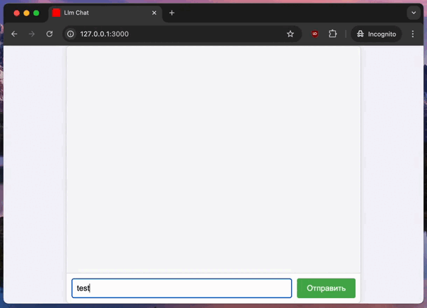

## Why You Need to Work with LLMs Today
Large Language Models (LLMs) are reshaping how we build apps. Knowing how to use LLMs lets you create smart, interactive tools that understand and generate text. This skill is now key in modern development. Whether you build chatbots or text analyzers, LLMs can add value. So, let’s dive into how to run an LLM server locally and use it in a Ruby on Rails (RoR) project.

## Running LLM Locally with Docker
We will run the [Llama 3.1](https://github.com/ollama/ollama?tab=readme-ov-file) model using Docker. Llama 3.1 is popular for personal use, and Docker simplifies the setup.

**Install Docker**: Use [the official Docker client](https://www.docker.com/) with a UI.

- **Run the LLM Server**: Use the following command to start the Llama 3.1 with API server
  ```bash
  docker run -d -v ollama:/root/.ollama -p 11434:11434 --name ollama 
  ollama/ollama
  ```
- **Select LLM model:**
  ```bash
  docker exec -it ollama ollama run llama3
  ```
- **Test the server with:** 
  ```bash
  curl http://localhost:11434/api/generate -d '{"model": "llama3", "prompt":"Why is the sky blue? Answer with 10 words"}'
  ```
If the result looks something like this, then the server has started successfully:
  ```
{"model":"llama3","created_at":"2024-08-28T15:01:07.826076294Z","response":"Short","done":false}
{"model":"llama3","created_at":"2024-08-28T15:01:08.154276586Z","response":" wavelength","done":false}
{"model":"llama3","created_at":"2024-08-28T15:01:08.314917461Z","response":" blue","done":false}
{"model":"llama3","created_at":"2024-08-28T15:01:08.490800211Z","response":" light","done":false}
{"model":"llama3","created_at":"2024-08-28T15:01:08.661478628Z","response":" sc","done":false}
{"model":"llama3","created_at":"2024-08-28T15:01:08.83101417Z","response":"atters","done":false}
{"model":"llama3","created_at":"2024-08-28T15:01:09.002102128Z","response":" more","done":false}
{"model":"llama3","created_at":"2024-08-28T15:01:09.175030712Z","response":" in","done":false}
{"model":"llama3","created_at":"2024-08-28T15:01:09.34067667Z","response":" Earth","done":false}
{"model":"llama3","created_at":"2024-08-28T15:01:09.512882962Z","response":"'s","done":false}
{"model":"llama3","created_at":"2024-08-28T15:01:09.685311962Z","response":" atmosphere","done":false}
{"model":"llama3","created_at":"2024-08-28T15:01:09.87469392Z","response":".","done":false}
{"model":"llama3","created_at":"2024-08-28T15:01:10.089219045Z","response":"","done":true,"done_reason":"stop","context":[128006,882,128007,271,10445,374,279,13180,6437,30,22559,449,220,605,4339,128009,128006,78191,128007,271,12755,46406,6437,3177,1156,10385,810,304,9420,596,16975,13],"total_duration":12195522088,"load_duration":7132571086,"prompt_eval_count":21,"prompt_eval_duration":2754452000,"eval_count":13,"eval_duration":2263609000}
   ```

Llama server [API documentation](https://github.com/ollama/ollama/blob/main/docs/api.md).

## Building a Ruby on Rails App
Let’s create a simple RoR app that connects to our LLM server.

- **Create a New Ruby on Rails Project**:
```bash
rails new llm-chat
```

- **Generate a Controller with actions**:
```bash
rails g controller chat index create
```

- **Add a Routes for Chat**: In config/routes.rb, add:
```ruby
root "chat#index"
post "/", to: "chat#create", controller: :chat
```

- **Add WebSocket Route**: In config/routes.rb, add:
```ruby
mount ActionCable.server => '/cable'
``` 

- **Generate a WebSocket Channel**:
```bash 
rails generate channel Chat
```

- **Update the Chat Channel**: In `app/channels/chat_channel.rb`, update the code:
```ruby
class ChatChannel < ApplicationCable::Channel
  def subscribed
    stream_from "chat_channel"
  end

  def unsubscribed
  end
end
```

- **Update the Controller**: In `app/controllers/chat_controller.rb`, modify the create method:
```ruby
class ChatController < ApplicationController
  def index; end

  def create
    LlmJob.perform_later("http://localhost:11434/api/generate", params[:chat][:query])

    head :ok
  end
end
```

- Create LlmJob: 
```bash
╰─ $ rails generate job Llm
      invoke  test_unit
      create    test/jobs/llm_job_test.rb
      create  app/jobs/llm_job.rb
```
- LlmJob code:
```ruby
require 'net/http'

class LlmJob < ApplicationJob
  queue_as :default

  def perform(api_endpoint, prompt)
    uri = URI(api_endpoint)
    req = Net::HTTP::Post.new(uri, 'Content-Type' => 'application/json')
    req.body = { model: "llama3", prompt: prompt }.to_json

    Net::HTTP.start(uri.hostname, uri.port) do |http|
      http.request(req) do |response|
        response.read_body do |chunk|
          parsed_response = JSON.parse(chunk)
          ActionCable.server.broadcast(
            "chat_channel",
            { message: parsed_response['response'], done: parsed_response['done'] }
          )
        end
      end
    end
  end
end
```

- Frontend Chat Channel: In app/javascript/channels/chat_channel.js, add:

```javascript
import { createConsumer } from "@rails/actioncable"

const consumer = createConsumer()

consumer.subscriptions.create("ChatChannel", {
  received(data) {
    document.getElementById("send-request").disabled = true;
    const chatBox = document.getElementById('chat-box');

    let botMessageElement = chatBox.querySelector('div[data-status="pending"]');

    if (!botMessageElement) {
      botMessageElement = document.createElement('div');
      botMessageElement.className = 'message bot';
      botMessageElement.setAttribute('data-status', 'pending');
      chatBox.appendChild(botMessageElement);
    }

    botMessageElement.textContent += ` ${data.message}`;

    if (data.done) {
      botMessageElement.setAttribute('data-status', 'done');
      document.getElementById("send-request").disabled = false;
    }

    chatBox.scrollTop = chatBox.scrollHeight;
  }
});
```





## Conclusion
Now, you have a basic RoR app that interacts with an LLM server. The server sends responses in chunks, and the app displays them in real-time. This setup is a powerful way to integrate AI into your apps.

Full code you can find here: [Github repo](https://github.com/jetthoughts/llm-chat)