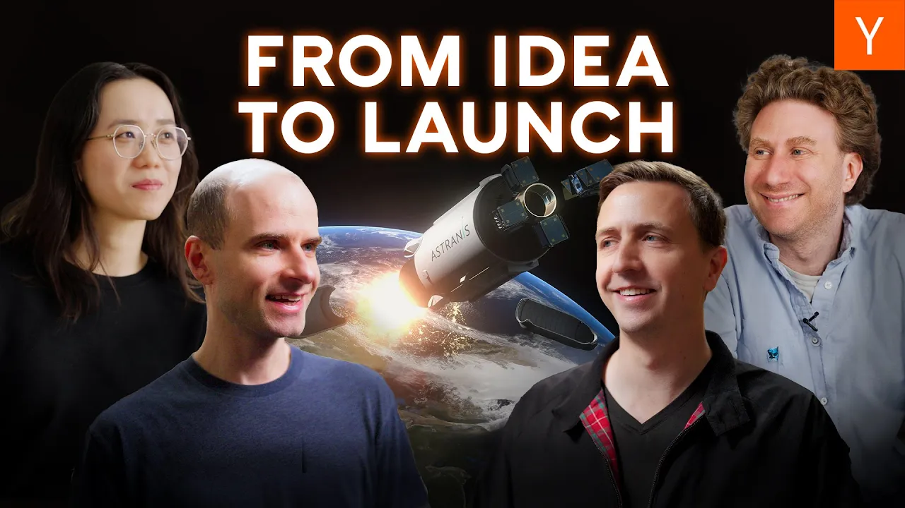

Last year, the team at Astranis launched their first commercial satellite into space, marking a significant milestone in the aerospace industry. They’ve proven that you don’t need billions to build a hard tech company. Their journey from a small apartment to launching satellites is inspiring for aspiring founders.

### Key Takeaways

*   **Start Small**: Begin with a minimum viable product (MVP) to test your ideas.
*   **Set Ambitious Goals**: Aim high during critical phases like funding rounds.
*   **Scrappy Mindset**: Use limited resources creatively to achieve your objectives.
*   **Prove Your Concept**: Demonstrate your technology works before seeking large investments.

### The Birth of Astranis

Astranis started in a small apartment in downtown San Francisco. Co-founders John Gedmark and Ryan McLinko had a vision to create a new kind of satellite. They realized that the traditional approach to satellite design was outdated and saw an opportunity to innovate.

### The Journey Begins

John, an aerospace engineer, and Ryan, who had experience in pioneering space startups, teamed up to turn their idea into reality. They applied to Y Combinator (YC) in Winter 2016, a pivotal moment that set them on the path to success. At that time, the aerospace industry was just beginning to see a wave of new startups inspired by the success of SpaceX.

### Setting Goals at Y Combinator

During their time at YC, they faced the challenge of raising a significant amount of money to launch their satellite. To stand out, they set ambitious goals for what they could achieve in just three months. They aimed to build a prototype satellite, a task that typically takes years for other companies.

### Building the Prototype

The first step was to create a basic satellite that could demonstrate their technology. They worked in their apartment, using simple materials and a lot of creativity. They even built a clean room using PVC pipes and shower curtains to ensure their components were protected from dust and static.

### Demo Day Success

Their hard work paid off at demo day, where they showcased their prototype. The presentation was a hit, addressing common investor concerns about the feasibility of their project. They successfully raised one of the largest seed rounds at YC, which provided the funds needed to launch their satellite.

### Growing the Company

Fast forward eight years, and Astranis has grown to over 400 employees, now operating out of a historic building at Pier 70. They’ve maintained their scrappy spirit while scaling up their operations. Their manufacturing facility is where the real magic happens, with teams working on assembling satellites and conducting rigorous testing.

### Testing and Launching Satellites

Astranis is preparing to launch four new satellites on a dedicated SpaceX Falcon 9 rocket. They’ve developed in-house testing capabilities, including vibration tests to simulate the rocket launch and thermal vacuum tests to ensure their satellites can withstand the harsh conditions of space.

### The Future of Astranis

As they gear up for their upcoming launches, Astranis is also working on next-generation systems. Their journey shows that with the right mindset, experience, and determination, anyone can start a hard tech company. You don’t need to be a billionaire; you just need to be willing to work hard and think creatively.

In conclusion, the story of Astranis is a testament to what can be achieved with a scrappy approach and a clear vision. If you’re inspired by their journey, maybe it’s time to start your own hard tech company!
