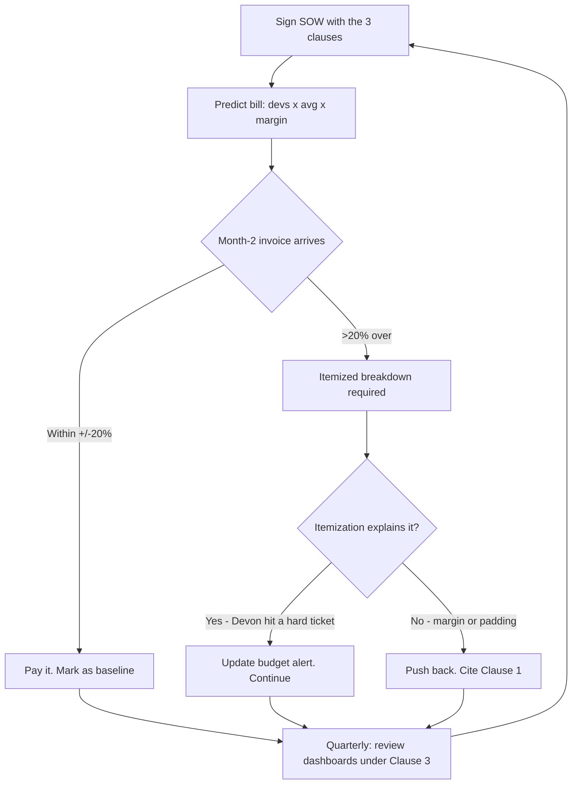

> **Going further (AI in production) · Step 2 of 3** · [Tech for Non-Technical Founders 2026](/course/tech-for-non-technical-founders-2026/) course.
> Input: a signed agency contract OR a hire who claims "AI-augmented." Output: monthly AI cost predicted within ±20% + 3 contract clauses you add to the next SOW.

> **Supplementary content.** This chapter is relevant after you've shipped (Module 4+) and your product touches AI in production. Bookmark and return when needed.

A founder posted in r/SaaS last month: **"Our dev shop just sent the month-2 invoice. There's a $1,860 line called 'AI Services - passthrough.' We never agreed to this. The contract is for $14K/month flat. What is going on?"** The replies told her what the line was. None of them told her how to predict it for month 3.

That is the gap this post closes. By the end of one coffee you will know the per-developer AI cost ranges that should be in your invoice, the formula that predicts your bill within ±20%, and the 3 clauses you paste into your next SOW so the surprise never happens again.

**What one developer costs you in AI tokens per month (2026 pass-through ranges, above the hourly rate):**

| Line item | Per dev / month | What you control |
|-----------|-----------------|------------------|
| Cursor or Copilot Enterprise seat | $20-60 | Fixed monthly. Easy to predict. Pick a tier and stay |
| Anthropic API (Claude Code) | $30-200 | Usage discipline. Same dev = 7x range depending on agent-loop habits |
| OpenAI API (gpt-4o, o3) | $50-300 | Whether the team uses it at all. Less common in 2026 if Claude Code dominates |
| **Disciplined team total** | **$80-$120** | Cursor + Claude Code + budget alerts at $150 |
| **Undisciplined team total** | **$300-$500** | 5 AI tools, no budget alerts, agent loops left running |

Multiply by your team size. A 4-dev team at the undisciplined end is $1,200-$2,000/month before margin.

> **Read this if**: you've hired an agency in 2026 OR your dev shop is starting to mention "AI tooling" line items in invoices.

## Why this hits in month 2-3

Month 1 your invoice arrives clean. The agency is still negotiating, the team is staffing up, and AI usage is light because the developers are reading your codebase, not generating against it. Month 2 production starts. By month 3 the team is shipping daily, and one or two developers fall in love with Claude Code agent loops that run for 40 minutes against a hard ticket. The invoice arrives with a new line: "AI Services," "Tooling pass-through," or "Engineering AI." There is no breakdown. The number is between $800 and $4,000. The agency owner says "yeah we use AI now, it's industry standard." You sign it because the alternative is fighting about it for two weeks while the project stalls.

That conversation is preventable in 20 minutes of contract reading and 10 minutes of math. The next 1,200 words show you how.

## The 2026 cost ranges

Three line items make up almost every dev shop's AI bill in 2026. Memorize the ranges and you can spot a wrong invoice in 30 seconds.

### Per-developer Cursor (or Copilot Enterprise) seat: $20-$60/mo

Cursor Pro is $20/month per seat ([Cursor pricing](https://cursor.com/pricing)). Cursor Business is $40/seat with admin controls and usage analytics. Cursor Ultra is $200/seat for heavy users. GitHub Copilot Enterprise sits at $39/seat ([GitHub Copilot pricing](https://github.com/features/copilot/plans)). Most agencies pick one - Cursor Business is the modal choice in 2026 because it bundles team admin and gives the agency owner a usage dashboard. This line is fixed and predictable. It should never surprise you.

### Per-developer Anthropic API spend: $30-$200/mo

This is where the variance starts. Claude Code (the terminal agent) uses the Anthropic API directly. A disciplined developer running 30-60 short prompts a day on Claude Sonnet 4.5 spends $30-80/month. A developer who fires off 5-minute agent loops on hard tickets - the kind where Claude reads 12 files and writes 400 lines of diff - can hit $150-200/month without trying. Sonnet 4.5 input is **$3 per million tokens**, output is **$15 per million tokens** ([Anthropic API pricing](https://www.anthropic.com/pricing)). One agent loop on a complex ticket can burn 200K-400K tokens in an afternoon.

### Per-developer OpenAI API spend: $50-$300/mo

Less common in 2026 since Claude Code dominates the agent-loop workflow, but teams that run Codex, gpt-4o for image-heavy tasks, or o3 for "deep thinking" tickets still see this. gpt-4o input is **$2.50 per million tokens**, output is **$10 per million** ([OpenAI API pricing](https://openai.com/api/pricing/)). o3 is dramatically more expensive on output tokens. Some agencies route a fraction of work to GPT for variety; others do not touch OpenAI at all. Ask which during the discovery call.

### Total per developer: $80-$500/mo above the hourly rate

The disciplined-team end of the range is **$80-$120/dev/month**: Cursor Business seat ($40), Claude Code with budget alerts ($60-80), no OpenAI. The undisciplined end is **$300-$500/dev/month**: 5 AI tools concurrent, no per-developer budget caps, agent loops left running on lunch break. Most dev shops in 2026 sit at the disciplined end if they are profitable, the undisciplined end if they are still figuring out their AI workflow.

## The math: predict your bill

Take your invoice in three numbers.

**Formula:**

> Monthly AI bill = (number of developers on your project) × (avg per-dev AI cost) × (1 + agency margin %)

**Worked example - 4-dev disciplined team:**

- Developers on project: 4
- Avg per-dev AI cost: $100/month (disciplined: Cursor seat + Claude Code with budget alerts)
- Agency margin: 0% (per Clause 1 in the SOW)
- Expected monthly AI line: **$400 ± 20% = $320 to $480**
- If invoice shows $1,800: undisciplined developer (Devon in the table above), 30% hidden margin, or both - 15-minute conversation either way

**Worked example - 2-dev team with one heavy agent-loop user:**

- Developers on project: 2
- Avg per-dev AI cost: $200/month (mid-range: one runs heavy agent loops on hard tickets)
- Agency margin: 0%
- Expected monthly AI line: **$400 ± 20% = $320 to $480**
- Same total as the 4-dev team, very different reasoning - which is why per-dev breakdown matters more than the total

The trade-off you are accepting: ±20% is a wide band. AI usage is genuinely variable - a sprint full of refactoring tickets burns 2-3x more tokens than a sprint full of UI work. The point of the formula is not pinpoint accuracy; it is catching the 200%-over-estimate invoices that show up when nobody is watching.

## The 3 contract clauses to add

Paste these into your next SOW under "Pricing and Pass-Through Costs." If the agency redlines all three, that tells you something. If they accept all three with a shrug, that also tells you something useful.

### Clause 1 - Pass-through caps

> "AI tooling and API pass-through fees are billable at cost plus 0% margin. Total monthly AI pass-through is capped at $500 per developer per month without prior written approval from Client. Charges above the cap require an itemized written request and Client's signature before invoicing."

What it does: blocks the agency from quietly marking up your AI bill 20-30% (yes, this happens) and gives you a per-dev ceiling that any reasonable team stays under without thinking about it. The "prior written approval" bit forces an email conversation before a $4,200 invoice surprise.

### Clause 2 - Itemization

> "Each monthly invoice itemizes AI tooling pass-through separately by developer and by tool (Cursor seat, Anthropic API, OpenAI API, other). The itemization shows tokens consumed per tool per developer for the period."

What it does: makes the "AI Services - $1,860" line illegal. Instead you get the right-hand invoice in the graphic below. With per-dev itemization, when month-3 spikes, you know whether it is one developer on one hard ticket (workflow conversation) or a margin slipped in (contract conversation).

**Bad invoice vs good invoice for a 4-developer team in month 2:**

| Line item | Bad invoice (reject) | Good invoice (accept) | Why it matters |
|-----------|----------------------|------------------------|----------------|
| AI tooling line | "AI services (passthrough) - $2,340" with no breakdown | Per developer, per tool, tokens shown (Maria $135, Devon $1,095, Priya $175, Alex $150) | When the AI line doubles in month 3, you have something to push back on |
| Pass-through margin | Not stated (hidden 20-30% markup possible) | "Pass-through margin: 0%" stated on the invoice | Blocks the agency from quietly marking up the AI bill |
| Budget alert | None | "Budget alert threshold (per dev): $300" | Devon blew past $300 - conversation possible, not surprise invoice |
| Question you can answer | "Who used what AI tool to do what work?" - no | Yes, per-line | Without it, every month-3 spike is an argument; with it, every spike is a 5-minute conversation |

### Clause 3 - Visibility

> "Client receives read-only access to the Anthropic Console, OpenAI Platform, and Cursor admin billing dashboards for the project workspace, scoped to project usage. Access provisioned within 5 business days of contract execution."

What it does: collapses the information asymmetry. You see the dashboards the agency sees. When Anthropic rolls out a new model that is 40% cheaper on the same workload, you spot it before the agency does. When usage spikes on a Tuesday, you can see which developer and which day without asking. The agency that refuses this clause is telling you they want the asymmetry.

The trade-off: provisioning read-only project access takes 5-30 minutes per platform. An agency with 12 active clients adds an hour or two of admin per month. That is the cost of trust - cheap.

## What to do tomorrow

Three actions. In order.

- **Open your last 3 invoices and find the AI line.** If there isn't one, ask in writing: "What is your team's average AI tooling spend per developer per month, and where is it billed?" If the answer is "we absorb it" or "it's in the rate," ask for a written breakdown of the rate showing the AI carve-out. The breakdown either exists or the agency is improvising; both answers are useful.
- **Calculate your expected month-3 bill using the formula above.** Write it in a Notion doc with a date. When month 3 arrives, compare. If actual is within ±20% of predicted, the agency is being straight with you. If actual is 50% over, you have a conversation, not an argument, because you have a number to start from.
- **Open your in-flight SOW redline (or your next one) and paste the 3 clauses under "Pricing."** Send the redline back the same day. The agency that returns the SOW with all 3 accepted is telling you they have the workflow already. The agency that accepts 2 of 3 is negotiating in good faith. The agency that strikes all 3 is telling you to walk.

> AI tooling is not magic - it is a metered utility. Every agency in 2026 should be able to tell you per-developer Cursor seat plus Anthropic API plus OpenAI API to two significant figures. The ones that cannot are billing you for their own learning curve.

## Further reading

- [Anthropic API pricing](https://www.anthropic.com/pricing) - the canonical Sonnet, Opus, and Haiku per-million-token rates. Read the input vs output split; it is where most invoice surprises live.
- [OpenAI API pricing](https://openai.com/api/pricing/) - the gpt-4o, o3, and o1 per-token rates. Note the cached input rates if your team uses prompt caching aggressively.
- [Cursor pricing](https://cursor.com/pricing) - Pro, Business, and Ultra tiers. Business is the modal agency choice in 2026.
- [GitHub Copilot pricing](https://github.com/features/copilot/plans) - Individual, Business, Enterprise. The fallback for teams that have not switched to Claude Code.
- The Pragmatic Engineer, [The state of AI coding tools in 2025](https://newsletter.pragmaticengineer.com/p/state-ai-coding-tools-2025) - per-developer spend ranges from a survey of senior engineers, useful for sanity-checking the numbers above.
- Simon Willison, [Pelican on a bicycle benchmarks](https://simonwillison.net/2024/Oct/25/llm-pricing/) - running cost comparison across models with public token-cost ranges.
- Latent Space, [The AI engineer's stack 2026](https://www.latent.space/p/ai-engineer-stack) - which model and tool combinations large engineering orgs settle on, with cost commentary.

Related course posts:
- ["We Use AI": 5 Follow-Up Questions for Your Agency](/course/tech-for-non-technical-founders-2026/agency-ai-five-questions/) - sister chapter; the 5-question script for AI theatre detection includes the cost question this post expands.
- [Reading the SOW Clause by Clause](/course/tech-for-non-technical-founders-2026/hire-track-supplementary-reference/#reading-the-sow) - hire track contract reading guide; pair with the 3 AI clauses above when redlining your next SOW.
- [The Quality Tax for AI MVPs](/blog/quality-tax-ai-mvp-cost/) - the rebuild bill that arrives when AI-generated code meets production load nobody planned for.
- [The Hidden Cost of Poor Vendor Management](/blog/hidden-cost-poor-development-vendor-management-fix/) - the broader pattern: surprise line items follow the contracts you did not read carefully.

---

*Built by [JetThoughts](https://jetthoughts.com) as part of the [Tech for Non-Technical Founders 2026](/course/tech-for-non-technical-founders-2026/) curriculum.*
