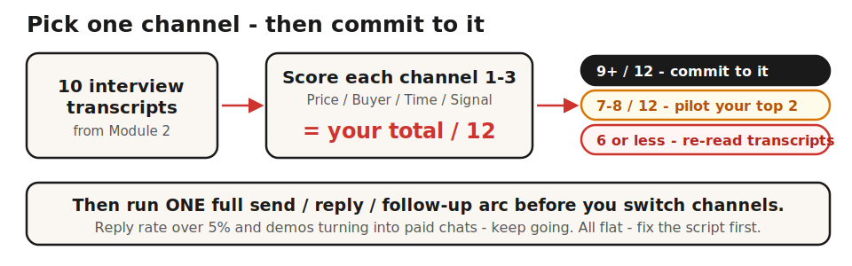

> **Module 5 · Lesson 5.2 · [OPTIONAL] - skip if you already know your channel** · [From Idea to First Paying Customer](/course/tech-for-non-technical-founders-2026/)
>
> **Input:** 10 Mom Test interview transcripts from Module 2 + your live MVP from Module 4 (Lesson 4.4) + the ICP (Ideal Customer Profile - the specific kind of person your hypothesis names; introduced in Lesson 1.1) you sharpened across Modules 1-2
>
> **Output:** one channel hypothesis committed long enough to read the signal
>
> **Progress:** M5 · 2 of 7 · [OPTIONAL] - run this only if you don't yet know which channel your buyers actually use

> **TL;DR:** Pick one channel from your interview evidence and commit for a full send/reply/follow-up arc. Channel-hopping is the most common newbie mistake - you can't read a signal you never let stabilize.

The channel-flailing pattern: switch every 10 days - LinkedIn for two weeks, cold email for two weeks, a Slack community for two weeks, back to LinkedIn. Six weeks in, 8 conversations, zero paid pilots, and no idea which channel actually worked. The fix is rarely a smarter channel - it's committing to one from your interview evidence through a full send/reply/follow-up arc.

After this lesson you will be able to: **pick one outreach channel from your interview evidence and write a commitment statement you'll hold before scaling.**

---



## Commit before you read the signal

Stick with one channel long enough to read the signal, not chase the algorithm. A cold-email sequence needs time to deliver, more time for replies to accumulate, and more still before the "not now" replies reveal whether non-replies are disinterest or bad timing. Run a batch, call the channel dead on 2 quick replies, and you threw away the signal.

Your 10 interview transcripts from [Module 2](/course/tech-for-non-technical-founders-2026/find-10-people-with-problem-outreach-2026/) already name the channel. Your interviewees told you how they find tools like yours - they just did not use the word "channel." Pull them up and look for how they discover tools ("Slack group," "Google search," "network referral"), which channel they first came to you through, and what tools they use every day.

## Score and pick

Score each candidate channel 1-3 on four dimensions - price fit, buyer type, your honest time budget, and interview signal - for a total out of 12. **≥9/12 = commit to that channel.** 7-8/12 = run a 1-week pilot on your top two to break the tie; the higher reply rate wins. ≤6/12 = no channel fits yet; re-read your transcripts for missing signal before scaling outbound at all. The full scoring rubric and the 4-channel comparison (LinkedIn, cold email, community, social) live in the [deeper reference](/course/tech-for-non-technical-founders-2026/reference/channel-selection-full/).

## Pressure-test with AI first

After you pull the signal from your transcripts, run one [Claude](https://claude.ai) prompt to pressure-test your hypothesis before you commit to it:

```text
I am a founder building [paste your one-sentence Founding Hypothesis from Lesson 1.1].
My must-have user is [CUSTOMER] (your Lesson 5.1 must-have segment - title, company size, industry).
My price point is [monthly or per-seat price].

From 10 customer interviews, I heard these channel signals:
- [customer quote] from your Lesson 2.5 transcripts
- [customer quote] from your Lesson 2.5 transcripts
- [... up to 5 signals]

I am considering [channel A] vs [channel B] for my first stretch of outbound.

Based on the buyer persona and interview signals, which channel is more likely to reach them in the mode where they are open to discovering new tools? What would I need to believe for [channel A] to be right vs [channel B]?
```

Claude cannot guarantee the right answer - it does not know your specific market. But it will surface the assumptions behind each choice and flag contradictions you missed. If your interview evidence points one way (8 of 10 saying "I found it on LinkedIn") while your gut points another (cold email feels safer), name the gap to yourself: which signal are you ignoring, and why?

> **What the prompt can and cannot tell you.** It pressure-tests your hypothesis against interview evidence, surfaces the assumptions behind each choice, and flags contradictions between your transcripts and your gut. It cannot tell you which channel will actually convert, your real reply rate, or whether the channel degrades over time - only a real send/reply/follow-up arc can. **The real gate:** ≥9/12 channel-fit score + a full arc with reply rate >5%.

---

> **Do this now:**
>
> 1. Open your 10 interview transcripts. Mark every channel signal (how they discover tools, where they came from, daily tools).
> 2. Score each candidate channel 1-3 on the four dimensions. Total each out of 12.
> 3. Run the Claude prompt against your transcripts to pressure-test your top pick.
> 4. Write the channel name + your commitment statement (why + evaluation criteria) in a [Notion](https://www.notion.so) doc. The clock starts the day you send your first outbound message.
> 5. **Success check:** one channel scored ≥9/12, one written commitment statement, and you will not switch until you have run a full send/reply/follow-up arc.

---

**If this fails: no channel scores ≥9/12.**
- **Why:** your interview transcripts are missing channel signal.
- **Fix:** re-read them for "how do you find tools like this" and "what tools do you use every day" - the answers are usually already in there. If they truly are not, [Lesson 5.3](/course/tech-for-non-technical-founders-2026/first-ten-customers-network-list/) works your personal network first, where the channel is simply "people who already know you."

---

The decision matters more than the channel itself. Committing to one channel and iterating on the script beats splitting your time across three, because the learning loop is tighter. With 30 focused messages you get a reply rate you can diagnose; with 10 spread across three channels you get nothing to act on.

The first place to apply this is your personal network in [Lesson 5.3](/course/tech-for-non-technical-founders-2026/first-ten-customers-network-list/). Once that is exhausted, [going outbound without a sales team](/course/tech-for-non-technical-founders-2026/outbound-without-sales-team/) covers running the channel you just chose: the filter, the script, the Calendly-to-Stripe pipeline, and what the reply rate actually means.

> **Deeper reference:** [The full channel-selection walkthrough and worksheet](/course/tech-for-non-technical-founders-2026/reference/channel-selection-full/) - the commitment-rule phase table, reading signals from transcripts, the 4-dimension scoring, the 4-channel comparison, the Engineering-as-Marketing side door, and the fill-in worksheet.

> **Done:** you scored your candidate channels, chose one at ≥9/12, and wrote your commitment statement (channel name + why + evaluation criteria).
>
> **You have now:** a committed channel (5.2) chosen from your interview evidence. The 50-name list to run it on is next.
>
> **Next:** [5.3 · Build Your 50-Name Network List](/course/tech-for-non-technical-founders-2026/first-ten-customers-network-list/) - the personal-network list you'll run this channel on first.
>
> **If blocked:** If no channel scores ≥9/12, your interview transcripts are missing channel signal. Re-read the transcripts looking for "how do you find tools like this" and "what tools do you use every day" - the answers are already in there.

---

*See it in action: [Module 5 walkthrough: Mia gets paid](/course/tech-for-non-technical-founders-2026/module-5-walkthrough-mia/)*

*Built by [JetThoughts](https://jetthoughts.com) as part of the [From Idea to First Paying Customer](/course/tech-for-non-technical-founders-2026/) curriculum.*
