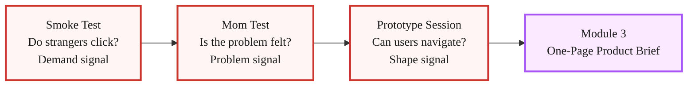
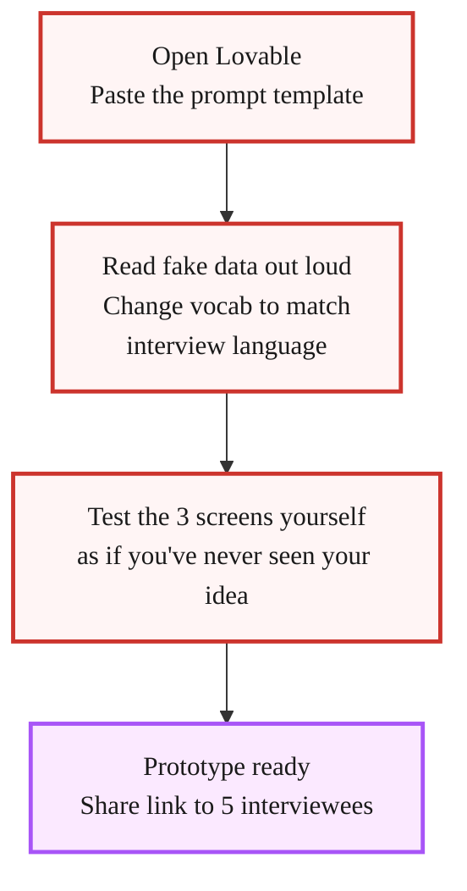

> **Module 2 · Lesson 2.6 · [CORE]** · [From Idea to First Paying Customer](/course/tech-for-non-technical-founders-2026/)
>
> **Input:** a BUILD decision plus your validated problem statement from [2.5](/course/tech-for-non-technical-founders-2026/mom-test-synthesis-build-pivot-kill/), and 5 of the 10 Mom Test interviewees (recruited in [2.3](/course/tech-for-non-technical-founders-2026/find-10-people-where-to-look/), messaged in [2.4](/course/tech-for-non-technical-founders-2026/find-10-people-with-problem-outreach-2026/)) - pick the strongest-signal ones (scored per the Ch 2.1 rubric)
>
> **Output:** 5 of them watched navigating a throwaway clickable prototype, with pass/fail per session
>
> **Progress:** M2 · 6 of 6 · Results so far: question list + 30-name list + 10 scored interviews + a build/pivot/kill verdict and validated problem statement

> **TL;DR:** Three throwaway screens, five silent-observation sessions. Watch whether users can navigate your solution without coaching - something interviews cannot tell you.

> **How this chapter relates to Ch 2.3-2.4:** [Ch 2.3-2.4](/course/tech-for-non-technical-founders-2026/find-10-people-with-problem-outreach-2026/) already booked and ran your 10 past-behavior Mom Test interviews. This chapter takes 5 of those 10 (the ones who scored 7+ on the Mom Test) and re-engages them for a 30-min silent-observation session with a throwaway Lovable prototype. You are NOT recruiting fresh people; you are re-asking warm contacts for a different kind of time. Ch 2.3-2.4 validated THE PROBLEM; Ch 2.6 validates THE SOLUTION SHAPE.

The [Mom Test](/course/tech-for-non-technical-founders-2026/mom-test-ask-about-past-not-future/) tells you whether the problem is real and felt. A clickable prototype tells you something the Mom Test cannot: whether the user knows what to do when you hand them a solution.

Those signals do not measure the same thing.

After this lesson you will be able to: **watch 5 real customers try to use your solution before it exists - and score what they do, not what they say.**

A founder we advised had run 8 Mom Test interviews that came back strong: workaround evidence, named monthly costs, real frustration language. She moved to Lovable (an AI app builder; see the gloss in [Chapter 4.3](/course/tech-for-non-technical-founders-2026/self-serve-mvp-stack-lovable-supabase-stripe-2026/)) and built a working app over several weeks.

When she had 5 of the same interviewees log in to try the live app, several stalled on screen 2 - they recognised the problem the app was solving but could not figure out which button to click next. Validating the problem had not validated whether the interface shape was something they could navigate.

A throwaway prototype run in front of 5 of your interview subjects would have surfaced that early, not after the real build had landed. The rest of this chapter walks you through running one.

> **This is a research tool, not the start of your MVP.**
>
> You will build 3 throwaway screens, show them to 5 of your Mom Test interviewees, watch what they do without coaching, then archive everything. The only outputs that carry forward into Module 3 are (a) the pass/fail signal and (b) the exact words your users used when describing what they saw. The prototype CODE is discarded.
>
> If you try to polish this prototype into your MVP later, you'll spend much longer on it, carry every throwaway compromise into production, and invalidate the shape test. The actual MVP is a fresh build in Module 4 ([Ch 4.3](/course/tech-for-non-technical-founders-2026/self-serve-mvp-stack-lovable-supabase-stripe-2026/) defines the stack, [Ch 4.4](/course/tech-for-non-technical-founders-2026/self-serve-mvp-stack-build-phases/) walks the phases), started from the one-page brief (Chapter 3.1) with real auth, real Stripe, real domain.

## Why a Clickable Prototype Catches What Interviews Miss

A Mom Test interview pulls the interviewee into the past. You ask "tell me about the last time this happened" because you are trying to find out whether the problem actually occurred and how badly it hurt when it did.

A prototype session does the opposite: it puts the interviewee into a possible future and watches what they do.

You hand them three screens and watch whether they can figure out which button to click next without you coaching them. That is the signal interviews cannot give you.

Three things break at the prototype stage that looked clean in interviews:

| Failure | What happens | Why interviews miss it |
|---|---|---|
| **Workflow backward** | The founder designed the three screens in the order she thought about the problem. The user thinks about it in the opposite order. Screen 1 asks for the wrong piece of information; the user stalls. | An interview asks "how do you do X" - it never asks "what would you click first on a screen." |
| **Vocabulary wrong** | Founder calls it "reconciliation." User's accountant calls it "matching." Button says "Reconcile"; user clicks everything else on the screen first. | Verbal language in an interview doesn't expose what label a user expects on a button. |
| **Scope wrong** | User opens the prototype, sees three screens, asks "where do I upload the CSV?" That feature was in Module 5 of the founder's plan; she considered it obvious context. It isn't. | Interview answers paint the system the founder describes, not the surface the user touches. |

None of these show up in a Mom Test interview - they only appear the moment a real person touches the interface, which is why both validation methods matter.

The prototype session is the third validation pillar. The other two tests cover different ground.

The [smoke test](/course/tech-for-non-technical-founders-2026/smoke-test-landing-page-7-day-demand-test/) shows whether strangers will click your headline. The Mom Test shows whether the problem you found is one your interviewees actually feel.

Neither answers the question this chapter is built around - whether a real user can find their way through your interface without someone over their shoulder telling them what to do.



## This Is Throwaway

> Three screens, fake data hard-coded in, CTAs that navigate but do not save. You are building a question - "Does the user know what to do?" - not a product. Then you archive it.

Try to "polish the prototype into the MVP later" and you spend much longer on it, add features that invalidate the shape test, and carry every throwaway compromise into production. The [Module 4 Lovable build](/course/tech-for-non-technical-founders-2026/self-serve-mvp-stack-lovable-supabase-stripe-2026/) starts fresh with a proper one-page brief, real auth, and a real database. This prototype has one goal: three screens, five sessions, then archive.

## Build 3 Screens with Lovable

[Lovable](https://lovable.dev) is an AI app builder that generates a working web app from a prompt. Free trial available. No coding required.

Three screens is the constraint - not five, not ten - because each extra screen multiplies the build effort without sharpening the validation signal.

> **The two caps that replace "spend a weekend on it".** (1) **Stop at 3 screens.** The fourth screen is the prototype turning into the MVP - exactly the failure mode this chapter prevents. (2) **Aim for a navigable 3-screen prototype within your first ~10 Lovable exchanges.** If after 10 messages the screens still aren't navigable, the hypothesis or the prompt is too vague - sharpen the prompt (or go back to Ch 1.1) before continuing. Do NOT keep adding messages hoping to brute-force coherence.

### Screen 1 - The entry point

Whatever the user sees first when they open your product. For a workflow tool that is usually a dashboard or an upload screen. For a booking product, a calendar or a search bar. Keep it to one dominant action. The user should be able to answer "what does this screen want me to do?" in 5 seconds.

### Screen 2 - The core action

The step where the value is delivered. For the reconciliation tool: the screen where matched transactions appear. For a booking product: the screen where the user picks a time. For a document tool: the screen where the user sees the processed output. This is where users stall if the vocabulary or layout is wrong.

### Screen 3 - The confirmation or result

What the user sees after the core action succeeds. A confirmation message, a summary, a next-step prompt. This is what the user walks away holding in their memory. If they cannot describe it 10 minutes after the session, the outcome of the product is not clear.

### The Lovable Prompt Template

> **📋 Save this template.** Copy the prompt below into your notes. You'll reuse the same structure in [Module 4's real MVP build](/course/tech-for-non-technical-founders-2026/self-serve-mvp-stack-lovable-supabase-stripe-2026/) - same Lovable tool, same 3-screen skeleton, but with real auth, real database, and real Stripe.

> **Practical Lovable onramp.** [Lovable](https://lovable.dev) is an AI app builder that generates a working web app from a prompt - you type what you want in English, it ships the screens. The **free trial** gives you a small number of messages per day with no credit card required, which is enough to ship this 3-screen throwaway prototype. **Paid plans lift the cap - check Lovable's pricing page.** They only become worth it if you later need higher message volume - not required for this chapter.
>
> If you hit the daily message cap mid-build: save your work-in-progress (Lovable auto-saves to your account, but copy the prompt + the current screen output to a note), come back tomorrow when the cap resets, or upgrade if you want to ship in one focused session. The 3-screen prototype rarely needs more than 10 total messages once your prompt is well-formed - the cap usually bites only on poorly-scoped first attempts.

Open [Lovable](https://lovable.dev), create a new project, and paste the following. Replace all `[PLACEHOLDERS]` with your specific problem and solution.

---

**Prompt template to paste into Lovable** (placeholders in `[brackets]`):

```text
Build a 3-screen clickable prototype for a [PRODUCT CATEGORY] tool targeting [TARGET USER].

This is a throwaway validation prototype. Use hard-coded fake data only. No backend, no auth, no database. All buttons should navigate between screens or show a static success state.

SCREEN 1 - [ENTRY POINT NAME]:
- [PRIMARY ACTION the user takes on this screen]
- Show [FAKE DATA EXAMPLE]
- One prominent CTA button: "[BUTTON LABEL]"

SCREEN 2 - [CORE ACTION NAME]:
- [WHAT THE USER SEES after taking the Screen 1 action]
- Show [FAKE DATA EXAMPLE]
- [KEY VOCABULARY the user must understand]
- One action: "[BUTTON LABEL]"

SCREEN 3 - [RESULT/CONFIRMATION NAME]:
- [WHAT SUCCESS LOOKS LIKE]
- Next step prompt: "[WHAT YOU WANT THE USER TO DO NEXT]"

Design: Clean, minimal. Dark sidebar, white content area. [YOUR COLOR] accent. No login screen. No settings. No navigation beyond these 3 screens. Make it look functional, not finished.
```

**Filled-in worked example.** Below is the same prompt with every blank replaced for one made-up product - a transaction-reconciliation tool for freelance bookkeepers. The category isn't the point; the *level of specificity* is. Read it before you fill yours in, so you can see what kind of answer each blank expects:

```text
Build a 3-screen clickable prototype for a transaction-reconciliation tool targeting freelance bookkeepers who reconcile Stripe + QuickBooks for client accounts.

This is a throwaway validation prototype. Use hard-coded fake data only. No backend, no auth, no database. All buttons should navigate between screens or show a static success state.

SCREEN 1 - Upload Statements:
- The user uploads 3 CSVs (one Stripe export, one QuickBooks export, one bank export)
- Show 3 uploaded files listed: Q1-report.csv, march-invoices.csv, stripe-export.csv
- One prominent CTA button: "Match transactions"

SCREEN 2 - Match Review:
- A side-by-side table of Stripe rows next to QuickBooks rows, with a "match" indicator
- Show 12 matched transactions, 3 flagged for review (use the word "match" not "reconcile" - the bookkeeper vocabulary is "match")
- Use the word "match" not "reconcile" - the bookkeeper vocabulary in the field is "match"
- One action: "Approve all matches"

SCREEN 3 - Summary:
- A summary card showing "12 transactions matched, $4,320 reconciled. 3 flagged need your review."
- Next step prompt: "Download client-ready report (PDF)"

Design: Clean, minimal. Dark sidebar, white content area. Teal accent. No login screen. No settings. No navigation beyond these 3 screens. Make it look functional, not finished.
```

If you can't fill in even the worked example's level of specificity (real product category, real user, real vocabulary, real fake-data examples), the prototype isn't your blocker - the hypothesis is. Go back to [Chapter 1.1](/course/tech-for-non-technical-founders-2026/form-your-founding-hypothesis-90-minute-sprint/) and sharpen it first.

---

That prompt typically produces a navigable 3-screen prototype in Lovable in our experience - results vary with prompt detail and Lovable model availability that day. Once the screens render, spend the rest of the build on one thing: reading the fake data out loud and asking yourself "does this make sense to someone who has never heard my idea?" If you hesitate, change the wording.

Two rules for the Lovable session itself.

First, use the vocabulary you heard in Mom Test interviews, not the vocabulary you use when you describe the problem to other founders. If 7 of your 10 interviewees called it "matching" and you call it "reconciliation," the prototype uses "matching."

Second, resist adding a fourth screen. The constraint is the test. If you feel the prototype needs a fourth screen to "make sense," that is a finding: your solution has more steps than a single session can validate. Note it and keep the prototype to three screens. You are testing legibility of the shape, not the completeness of the product.



## Run a Silent-Observation Session with 5 Interviewees

| During the session | What TO do | What NOT to do |
|---|---|---|
| **They pause on a screen** | Write down which button they reached for, how many seconds they paused | Don't explain what the screen does |
| **They ask you a question** | Say "I'd love to hear what you're thinking, keep going" | Don't answer directly |
| **They click the wrong button** | Record which button they clicked and note it | Don't tell them the right path |
| **They finish Screen 3** | Ask: "Describe in one sentence what that tool just did" | Don't prompt or rephrase their answer |

### Setup - recruit and book

Choose 5 of the 10 interviewees whose Mom Test scores were 7 or higher. You already have a relationship with them. They already confirmed the problem is real. Now you are asking them for 30 minutes of a different kind of time: watching them use the interface, not answering your questions.

Book the sessions as 30-minute video calls. Send the Lovable prototype link 10 minutes before - not earlier. You do not want them exploring it solo before you can observe.

**The re-engagement message** (paste into LinkedIn DM or reply to your original Ch 2.3-2.4 thread):

> *"Hi [name] - thank you for the 40 minutes last week. I built a quick clickable prototype based on what you told me about [their specific workaround from the Mom Test transcript]. I'd like 30 more minutes to watch you try it without me explaining anything - just silent observation while you click through. I'll send the link 10 minutes before. Would Tuesday afternoon or Wednesday afternoon work?"*

Expect 4-5 of 5 to say yes. They invested 40 minutes in the first call; the second ask is shorter and a different motion. The *"I built something based on what you told me"* line is what gets them to say yes - it signals you listened, and it makes the prototype session feel like the natural continuation of the first conversation rather than a fresh cold outreach.

> **Slow-path variant for the part-time founder**: scheduling 5 live observation calls on top of your only weekly window is unrealistic. Async alternative: send each interviewee the Lovable prototype link + a short Loom prompt ("record yourself trying these 3 tasks"). Use [Maze](https://maze.co) (free tier covers a handful of testers - check current limits) or [UserTesting](https://www.usertesting.com) (paid) if you want screen recording with click heatmaps. You lose the real-time follow-up question ability, but you gain async scheduling - the testers record on their own time, you watch the 5 recordings in one batch. Recordings surface less than live sessions do (you miss the "what were you about to click" follow-ups), and still far more than skipping the validation step because you couldn't schedule it.

### Script - the prototype session

**What most founders say first (and why it ruins the session):**

> "Hi! Thanks so much for testing my prototype. I'm really excited to show you what I've been working on - I've been building this for the last few weeks. Just click around and tell me what you think! Don't worry, it's still early. Let me know if anything's confusing and I can walk you through it."

Every sentence above quietly biases the test:

- **"my prototype"** + **"I've been building"** - the interviewee now knows it's YOUR baby. They're going to be kind, not honest.
- **"really excited"** - sets the emotional contract: please don't disappoint me.
- **"click around and tell me what you think"** - asks for opinion, not behavior. Opinions are cheap and polite.
- **"I can walk you through it"** - signals you will rescue them if they get stuck. The whole point of the test is to find where they get stuck WITHOUT rescue.

You now run a session where the interviewee performs satisfaction for you instead of doing the thing. You learn nothing about whether the screens make sense.

**Opening (read verbatim, do not paraphrase):**

"Thank you for your time. I'm going to share a link with you - I'm sending it now in the chat. It's a very early rough prototype, not a real product. I want to watch you use it and understand where it's clear and where it's confusing. Please don't try to be kind to me. The most useful thing you can do is think out loud while you click through it and tell me when you're confused or when something doesn't make sense. I won't explain anything while you use it. Just start from Screen 1 and try to do what the screen is asking. I'll stay quiet."

*[Paste the Lovable link in the chat. Start your screen recording. Say nothing.]*

**While they work through it:**

- Start a timer when they first touch the interface.
- Write down: the first 3 things they click or try to click.
- Note the first moment they pause for more than 5 seconds.
- Note any words they say out loud ("what does this mean", "where do I", "I thought it would").
- Do not respond to questions. Say "I'd love to hear what you're thinking, just keep going" if they ask you a direct question. Do not explain. Do not coach.

**After they reach Screen 3 (or after 10 minutes, whichever is first):**

"Thank you. Can you describe to me in one sentence what that tool just did for you?"

Write down their exact words. Do not prompt. If they give a vague answer, say: "Say more about that." If they stall, say: "What would you tell a colleague this does?"

**Closing questions (pick 2, not all 4):**

- "What was the moment you felt most lost?"
- "What did you expect to see on the second screen that wasn't there?"
- "If you used this every week, what would you call the thing it does for you?"
- "What would have to be true for you to pay [your target price] for this?" (Use the price hypothesis you tested in [Chapter 1.5](/course/tech-for-non-technical-founders-2026/price-hypothesis-on-smoke-test-page/) - if you haven't run that test yet, the $49-$299 band from the [full price-test reference](/course/tech-for-non-technical-founders-2026/reference/stripe-price-test-full/) is your default starting point.)

Thank them. End the call. Score the session immediately.

### Scoring - what to record live

When the user pauses on Screen 2 for 8 seconds and clicks the wrong button, you will want to help. Do not. The pause and the wrong click are the signal you came for. Write down exactly which button they clicked and how long they paused. That is the data.

If the user says "I give up" or "I have no idea what this wants me to do" - that is a fail. Thank them, ask the closing questions, end the call. A session where the user cannot get past Screen 1 is a strong signal: the entry point is wrong.

## Pass/Fail Scoring

Score each session immediately after the call ends. Use three signals.

| Signal | Pass | Fail |
|---|---|---|
| Gets to Screen 3 without coaching | Yes, under 5 minutes | No, or needs explanation |
| Describes the product accurately in 1 sentence | Names the core action correctly | Vague ("it does something with data") or wrong |
| First 3 clicks are correct | Navigates toward the CTA | Clicks UI elements that aren't the intended path |

A session is a **pass** if all three signals are green. A session is a **fail** if any signal is red.

The prototype gate:

- **4 or 5 passes out of 5 sessions:** Shape is legible. Advance to [Module 3 - One-Page Product Brief](/course/tech-for-non-technical-founders-2026/one-page-product-brief-vibe-prd/).
- **2 or 3 passes:** Revise one element (vocabulary, Screen 1 layout, or CTA label) and run 2 replacement sessions. One iteration only.
- **0 or 1 pass:** The shape is wrong. The problem statement may be right but the solution concept needs a different starting point. Return to Chapter 2.1 before writing any brief. Shape mismatch usually means the problem signal you got from interviews was off - re-running the Mom Test with sharper questions catches what a prototype rebuild would miss.

The common fixable failures:

**The vocabulary fail.** The user understands the goal but uses a different word than your interface. Fix: run a word-swap on Screen 2. Match the vocabulary you heard in the sessions. Test with one new session before advancing.

**The wrong first click.** The user clicks a secondary element on Screen 1 first - a logo, a link, a visual that looks interactive. Fix: remove everything on Screen 1 that is not the primary CTA. Prototype UI clutter is a signal that the real product will have the same problem.

**The "what am I supposed to do?" question.** The user asks you what the product does before touching it. Fix: add one line of microcopy above the primary CTA on Screen 1 that names the action in the user's vocabulary. Not a headline about the product. One instruction sentence.

The throwaway nature of the prototype matters here too.

When you find a vocabulary fail on Screen 2 of session 3, you fix the Lovable prompt, run 2 more sessions, and discard the whole project once you've banked the insight. You do not carry the prototype forward.

You carry the insight forward - into the [One-Page Product Brief](/course/tech-for-non-technical-founders-2026/one-page-product-brief-vibe-prd/), where it becomes a vocabulary constraint that shapes the real build.

## What to Do With Results

| Pass count | Outcome | Next step |
|---|---|---|
| **4-5 passes** | Shape is legible. Users navigate without coaching. | Write the [One-Page Product Brief](/course/tech-for-non-technical-founders-2026/one-page-product-brief-vibe-prd/) using the exact "describe in one sentence" words from closing questions. This vocabulary is worth more than marketing copy. |
| **2-3 passes** | Shape is mostly legible but something broke. | Revise one element (vocabulary, Screen 1 layout, or CTA label) and run 2 replacement sessions. One iteration only. |
| **0-1 pass** | Shape is wrong. Solution concept needs a different starting point. | Read the "what did you expect to see" answers - that is the user's mental model. Return to Chapter 2.1 before restarting. Do not write the brief yet. |

Catching a shape mismatch here costs you a single throwaway prototype.

Catching it in Module 4, after you have started the real build, costs the real build. The throwaway prototype buys you the cheaper version of that lesson.

## Artifacts you carry out of Module 2

After finishing Ch 2.1-2.6, you have five artifacts. Each one feeds a specific downstream destination - this table is the map:

| Artifact | Where it goes next |
|---|---|
| **Validated Problem Statement** (Ch 2.5 synthesis applied to your Ch 2.3-2.4 transcripts) | Ch 3.1 Section 1 - copy verbatim. This is the PRD's foundation. (PRD = product requirements document, the one-page spec a team or AI agent builds from.) |
| **Pass/fail prototype log** (5 sessions from this chapter) | Reference doc: did we get the shape right? If yes, write the brief. If no, the table above routes you to a revision or restart. |
| **Verbatim "describe in one sentence" vocabulary** (closing answers from this chapter) | Ch 3.1 Section 3 ("what you're building") + Ch 4.3-4.4 Lovable prompts. The user's words beat your marketing copy. |
| **10 raw transcripts** (Ch 2.3-2.4 interview recordings + notes) | Archive. Reference if you ever pivot - they hold the language for a re-targeted ICP. |
| **30 raw verbatim sentences** (Ch 2.3-2.4 step 2, Reddit/forum complaints) | Reference for Ch 3.1 Section 1 supplementary evidence + the bank for Ch 2.3-2.4 cold-message subject lines in any future round 2. |

## Iterate or proceed? The combined Module-2 decision matrix

Each signal has its own iteration guidance (Ch 2.5's build/pivot/kill call on the scored interviews, and the Ch 2.6 pass count above). The COMBINED decision uses both signals together:

| Interview signal (Ch 2.5 synthesis) | Ch 2.6 prototype signal | Decision |
|---|---|---|
| 7+ of 10 scored ≥7 | 4-5 of 5 passed | **PROCEED** - write the Ch 3.1 brief tonight |
| 7+ of 10 scored ≥7 | 2-3 of 5 passed | **ONE iteration round** - revise the prototype's worst-failing screen, re-run 2 replacement sessions (NOT new interviews) |
| 4-6 of 10 scored ≥7 | 4-5 of 5 passed | **ONE iteration round** - re-interview 3 of the polite-yes scorers asking sharper past-behavior questions (NOT a new prototype) |
| 4-6 of 10 scored ≥7 | 2-3 of 5 passed | **STOP and re-evaluate** - read all 10 transcripts; either the ICP is wrong (re-target) or the problem framing is wrong (re-write hypothesis at Ch 1.1) |
| Under 4 of 10 scored ≥7 | (any) | **KILL** - the problem is too weak for this ICP. Return to Ch 1.1 with a different customer or problem blank rewritten. |
| (any) | 0-1 of 5 passed | **STOP, don't proceed to M3** - the solution shape is fundamentally wrong; return to Ch 2.1 |

The trap to avoid: doing 2-3 iteration rounds when the matrix says STOP. Module 2 is the cheapest place in the course to discover the problem or ICP is wrong - don't burn another round of interviews trying to massage signal into a problem that isn't there.

---

The artifacts from this chapter (pass/fail log + vocabulary) plus the validated problem statement from Ch 2.5 synthesis are everything Module 3 needs. The brief goes into [Module 4's fresh Lovable build](/course/tech-for-non-technical-founders-2026/self-serve-mvp-stack-lovable-supabase-stripe-2026/).

## What to do next

| Step | Action | Output |
|---|---|---|
| **1** | Open Lovable and paste this chapter's 3-screen prompt template with every `[PLACEHOLDER]` filled in. Aim for a navigable 3-screen prototype within your first ~10 Lovable exchanges; stop at 3 screens (a 4th is the prototype turning into the MVP). | Throwaway 3-screen prototype with link |
| **2** | Book 5 silent-observation sessions with interviewees who scored 7+ on the Mom Test. Send the prototype link 10 minutes before each call. | 5 sessions on the calendar |
| **3** | Tally the pass count from 5 sessions. Copy the exact "describe in one sentence" answers into a doc - those words go into the [One-Page Product Brief](/course/tech-for-non-technical-founders-2026/one-page-product-brief-vibe-prd/) verbatim. | Pass/fail count + verbatim vocabulary |

Nothing from the throwaway prototype carries forward except what you learned.

## Further Reading

- Rob Fitzpatrick, [The Mom Test (book site)](https://www.momtestbook.com/) - the problem-signal validation this prototype session builds on.
- Steve Krug, [Don't Make Me Think](https://sensible.com/dont-make-me-think/) - the thinking-aloud usability test that the silent-observation session above is adapted from.
- Y Combinator, [How to Talk to Users (Startup Library)](https://www.ycombinator.com/library) - how the prototype observation fits into the broader customer-discovery arc.
- [Lovable](https://lovable.dev) - the AI builder used in this chapter's throwaway prompt-to-prototype workflow.

> **Done:** 5 silent-observation sessions are complete, scored with pass/fail per session, and you have verbatim vocabulary from the closing "describe in one sentence" answers.
> **Founder OS · Module 2 bundle:** 10 scored Mom Test transcripts (from Ch 2.3 + 2.4) + the validated problem statement (Ch 2.5) + 5 prototype session pass/fail signals + the `Prototype Vocabulary - [date]` doc with verbatim "describe in one sentence" answers. Drop them all in your `Founder OS` folder; Ch 3.1 reads the vocabulary into Section 3 of the brief.
>
> **You have now:** all Module 2 artifacts - scored interviews (2.1-2.4), the build/pivot/kill decision (2.5), and prototype feedback from 5 real customers (2.6). Module 2 closes here.
>
> **Next:** [3.1 · The One-Page Product Brief](/course/tech-for-non-technical-founders-2026/one-page-product-brief-vibe-prd/)
>
> **If blocked:** If 0-1 of 5 sessions passed, the solution shape is wrong. Read the "what did you expect to see" answers from the closing questions - that is the user's mental model. Return to Ch 2.1 before writing the brief.

> **Module 2 closes here.** Before opening Module 3, you should have: (1) a sharpened question list after the AI persona rehearsal (Ch 2.2), (2) a 30-name ICP list built from real complaints (Ch 2.3), (3) 10 interview transcripts scored per the Ch 2.1 rubric (calls booked in Ch 2.4), (4) a one-page validated problem statement with build/pivot/kill verdict (Ch 2.5 synthesis), and (5) 5 prototype sessions with verbatim "describe in one sentence" vocabulary (this chapter). All five in your `Founder OS` folder. Missing one? Go back - Module 3 cannot start without the validated problem statement + prototype vocabulary.

---

*See it in action: [Module 2 walkthrough: Mia interviews ten parents](/course/tech-for-non-technical-founders-2026/module-2-walkthrough-mia/)*

*Built by [JetThoughts](https://jetthoughts.com) as part of the [From Idea to First Paying Customer](/course/tech-for-non-technical-founders-2026/) curriculum.*
