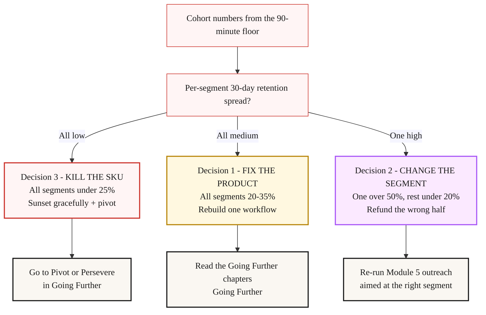

> **Going further · Continuation chapter** · [From Idea to First Paying Customer](/course/tech-for-non-technical-founders-2026/)
>
> **Input:** a live product with paying customers AND a churn rate above 30%/month
>
> **Output:** a 3-decision triage (fix the product, change the segment, or kill the SKU - shut this product down and stop selling it) backed by cohort data you can read in 60 minutes

## Acquisition Is Not Your Problem

A B2B SaaS founder I worked with in early 2026 - call her R. - opened her dashboard on a Wednesday morning and saw 32 paying users at $29/month. She had texted me the screenshot the night before with one line: *"net new this month is 3, what am I doing wrong with my ads."*

*Illustrative composite based on patterns from real founder builds, not a single client story.*

Here is what the numbers under that screenshot looked like. Her trial-to-paid conversion was healthy (around 11%). Her Meta Ads spend was $4,800/month. Her dev support invoice for keeping the signup flow patched was $1,400/month. New paid signups: 24. Churn in the same 30 days: 21. The bucket was leaking faster than the funnel could fill it. Net new customer count: 3. All-in spend per net new customer: $2,066. She was paying enterprise-CAC (customer-acquisition cost - what you spend to win one customer) numbers for a $29/month SMB (small and mid-size business) product.

Her instinct, the same one every founder has when they see a 0.4% net-growth number, was to lift the funnel: better ads, lower CAC, more landing-page tests. We pulled the cohort data instead. Forty minutes in, the picture was obvious. The product worked great for one segment - 3-person teams using it as a shared workflow tool retained at around 70% by week 4. Solo users, who made up two-thirds of her signups, retained at 8% by week 4. She had been selling a 3-person workflow tool to people who wanted a single-user productivity tool. The ads were not the problem. The audience the ads were buying was the problem.

The fix was not a better Meta Ads brief. The fix was to stop the ads, run a 90-minute cohort analysis, and make one of three triage decisions before she spent another dollar.

### The leaky bucket - what the spend actually buys

| In | Out | Net |
|---|---|---|
| **+24 new signups / month** | **-21 churning / month** | **+3 net new** |
| Driven by $4,800 Meta Ads + $1,400 dev support | 65% will churn within 30 days | $2,066 spend per net new user |
| Top of funnel is healthy (~11% trial-to-paid) | Wrong segment, no 7-day return | The fix is not the ads |

Bucket holds **32 paying users at $29 / month**. Stop the ads. Run the 90-minute cohort triage. Decide: fix the product, change the segment, or kill the SKU.

Module 5 (Lessons 5.1-5.7) teaches you how to land your first paying customers. This chapter covers what Module 5 does not - what to do when the customers you already have are leaving faster than the funnel can replace them. It is the chapter for the messy middle - the founder who hit Module 5 once, got customers, and watched them slip away faster than the spreadsheet predicted.

The KISS rule for this chapter: if your churn is above 30% in a 30-day window, every dollar you spend on acquisition is wasted until you triage. Read on.

## The 90-Minute Cohort Floor

### Step 1 - pick a free analytics tool

You do not need a data analyst, a Snowflake instance, or a custom dashboard. You need 90 minutes, a free analytics tool, and four numbers. Mixpanel, Amplitude, and Heap all ship a free tier in 2026 that handles up to 20K monthly events - enough for any product under 10,000 users. Pick one. PostHog is the open-source option if you prefer self-host.

### Step 2 - wire three events (30 minutes)

Three events: `signup_completed`, `core_action_completed` (define the one thing your product is for - send first invoice, schedule first job, run first import), `returned_after_signup` (any session 7+ days after signup). Pipe them in via the snippet your team or your no-code tool already has. If you are on Lovable, Bubble, or Webflow, the integration is a copy-paste API key.

### Step 3 - answer the four questions

The cohort tool already groups users by signup week, so this is a matter of reading the table.

1. **Of users who signed up in the last 90 days, what percent completed `core_action_completed` within 7 days?** This is your activation rate. Industry floor for SaaS is 40%; under 25% means your onboarding fails before the user gets to the value moment.
2. **Of those activated users, what percent triggered `returned_after_signup` within 14 days?** This is your week-2 return rate. Anything under 30% is a 7-day novelty product, not a habitual one.
3. **Of those week-2 returners, what percent are still active at day 30?** This is your 30-day retention. Sean Ellis-style must-have products land at 60-80%; struggling products land at 8-15%.
4. **Slice question 3 by segment.** Job title from your signup form. Company size from your signup form. Use case from a single-question post-onboarding survey. One segment will retain dramatically higher than the rest. That segment is the answer to the triage question.

R. ran this slice in 70 minutes flat. Her overall 30-day retention was 19%. Solid not-a-business numbers. Sliced by segment: 3-person teams 70%, freelancers 12%, solo founders 8%. The average hid the only real customer she had.

### Cohort retention by segment - one product, four shapes

Cohorts that finish day 30 above the 40% retention line are habitual, below it are novelty. (Sean Ellis's 40% is a different number - the survey very-disappointed share from [Lesson 5.1](/course/tech-for-non-technical-founders-2026/must-have-segment-pmf-test/); don't conflate the two.)

| Cohort | Day 7 → Day 30 retention | Verdict |
|---|---|---|
| 3-person teams | 88% → **70%** | Above must-have line - your real customer |
| Small agencies | 75% → 32% | Borderline - could lift with workflow fix |
| Freelancers | 58% → 12% | Wrong audience - below must-have |
| Solo founders | 40% → **8%** | Wrong audience - refund and redirect |

Same product, two answers. The 3-person team segment is the customer; the other three were the wrong audience the ads were buying.

Print the [Churn Triage Worksheet](/course/tech-for-non-technical-founders-2026/first-paying-customer-operating-kit/) (in the operating kit) before you start. One A4 page: the four numbers, the segment slice, and the triage decision box. If you are filling it in on a screen, you are stalling.

The trade-off worth naming: a 90-minute cohort analysis on 32 users is directional, not statistically significant. You will not pass a peer review. You will get a clear-enough picture to make a triage decision before another month of ad spend. That is the point.

## The 3-Decision Triage

The cohort numbers route you to one of three decisions. There is no fourth option. "Keep running ads" is not a fourth option; it is the option you took before reading this chapter, and the bucket numbers tell you how that ends.

### Decision 1 - FIX THE PRODUCT

Cohort retention is uniform across segments but stuck around 20-35%. Nobody is having a great time. The product genuinely does not deliver the must-have job for anyone yet. The Q3 verbatims from your [must-have segment test](/course/tech-for-non-technical-founders-2026/must-have-segment-pmf-test/) will read hedged ("it is OK", "I would use it more if it had X").

The fix is to stop adding features and rebuild one workflow until it actually works. Pick the workflow that the highest-retaining cohort describes as the reason they came back. Ship that workflow rebuilt in 4-6 weeks. Re-run the cohort. If retention bumps to 40%+ in the must-have segment, you have a product. If it does not, you are in Decision 3 territory.

### Decision 2 - CHANGE THE SEGMENT

One segment retains at 50%+ while others languish under 20%. The product works; the audience is wrong. R.'s case from the opening was Decision 2 - 70% retention for 3-person teams, 8% for solo founders, two-thirds of her customers paying for a product that did not fit their job.

The fix has two parts. First, fire the wrong segment - refund their last 30 days, recommend an alternative tool, and remove them from the customer list. Second, double down on the right segment - rewrite the landing page headline for 3-person teams, redirect ad spend to that audience, and re-run [Lesson 5.3 personal-network outreach](/course/tech-for-non-technical-founders-2026/first-ten-customers-network-list/) within the segment that retains.

R. did this on a Friday afternoon. By the following Friday she had 11 paying customers (the right ones) and a refund tab of $5,800 (the wrong ones). Her net month-end customer count went from 35 to 11, and her churn rate dropped from 65% to 14% the next 30 days. Fewer customers, less revenue, but a real business instead of a leaking one.

### Decision 3 - KILL THE SKU

No segment retains above 25%. You have a feature, not a product. The pain is real but your build does not relieve it - users try it once, do not see the value, and never come back regardless of who they are.

This is the hardest decision because it feels like quitting. It is not quitting; it is recovering the runway you would otherwise burn proving the same thing for another two months. Sunset the SKU. Refund the active subscribers (Stripe handles this in two API calls; your support inbox handles the rest). Move the operating decision to [the Pivot or Persevere chapter](/course/tech-for-non-technical-founders-2026/pivot-or-persevere-decision-framework/), which walks the six pivot types and the trigger conditions. The cohort data you collected in the 90-minute floor is the strongest single piece of evidence you will hand into the pivot decision.

The most common founder failure mode at this triage step is to refuse to pick. The cohort data says Decision 2; the founder spends six more weeks "trying to lift the solo segment retention" because saying goodbye to two-thirds of paying customers feels worse than burning $4,800/month. Six weeks later the metrics are unchanged and the runway is shorter. The triage works only if you commit to the decision in the same week you ran the cohort.

## The Refund-the-Wrong-Segment Script

Decision 2 is the hardest to execute because it requires telling 18 of your 30 paying customers, in writing, that you built the wrong product for their situation. The default response is to flinch at this step. They run an "improvement campaign" instead, hoping the wrong segment will start retaining if the product gets a few more features. It will not. The wrong segment never converts to the right segment.

Refunds are cheaper than churn. If a wrong-segment user churns at month 2, you have collected $58 and lost $200 in CAC and ~$25 in support time - net negative. If you proactively refund their last 30 days at month 2, you have lost $58 plus the same $200 CAC, but you have gained a goodwill quote, a clean Stripe ledger, and 20 minutes of support time you would otherwise spend explaining why the product feels off. The math on a wrong-segment refund campaign is positive against the alternative of waiting for churn.

Here is the email template that worked for R.'s 18 wrong-segment customers. Send it from your founder address (`founder@product.com`), not from the support queue. Send it on a Tuesday or Wednesday morning - never Friday afternoon, when refunds get parsed as bad news.

> Subject: Refunding your last 30 days, and a recommendation
>
> Hi [FIRST_NAME],
>
> I am writing to tell you something I should have figured out earlier. We built [PRODUCT] as a workflow tool for 3-person teams to share invoice tracking. Looking at how you have been using it - mostly solo, a few times a week - I do not think we built the right product for your situation. The features that make this useful (shared comments, the team activity feed, the assignee column) are not the features you came here for.
>
> I am refunding the last 30 days to your card. You should see the credit in 3-5 business days. You can keep using the account through the end of the month if you want; after that I am going to suggest you look at [SPECIFIC_ALTERNATIVE_TOOL], which is built for solo invoice tracking and is one-third the price.
>
> No pitch, no follow-up. If we ever build a solo version (we are not planning to), I will email you first.
>
> Thanks for trying us out and for the 6 weeks of payments.
>
> [YOUR_NAME]

The script does three things at once. It admits the misfit in the founder's voice (not a support template). It hands the user a concrete alternative (so they do not have to start the search over). It removes the future-pitch hook (which is the part wrong-segment users actually appreciate). R.'s response rate to this email was 14 of 18 sent - 11 thank-yous, 2 questions about the alternative tool, 1 angry user, 0 chargebacks. The 1 angry user wanted to keep using the product anyway; she comped them a year and removed their seat from the team metrics.

The honest trade-off: a refund-the-wrong-segment campaign cuts your customer count and your MRR (monthly recurring revenue - what your subscriptions bring in each month) in the short term. R.'s MRR went from $928 to $319 the week she sent the emails. By month 3 she was back above $928 with the right segment, with churn at 11% instead of 65%. The instinct is to flinch and not let the MRR number drop in week 1; the founders who hold the line are the ones who get out of the leaky-bucket cycle.

## Hand This to the Next Chapter

You walk out of this chapter holding one of three artifacts: a fix-the-product plan with a 4-6 week ship date, a change-the-segment plan with a refund script and a redirected outreach motion, or a kill-the-SKU verdict pointing toward a pivot decision. Pick the next move from your verdict and re-run the cohort floor every 6 weeks until the bucket stops leaking.

1. **If Decision 1 (FIX THE PRODUCT):** open the [hire-track supplementary reference](/course/tech-for-non-technical-founders-2026/hire-track-supplementary-reference/#the-fractional-cto-bridge) for the salvage-vs-rebuild decision and feed it the cohort data. Use the same numbers in the brief to whoever rebuilds the workflow - dev shop, fractional CTO, or AI tooling - so they know which workflow to rebuild and which to leave alone.
2. **If Decision 2 (CHANGE THE SEGMENT):** re-run [Lesson 5.3 - personal-network outreach](/course/tech-for-non-technical-founders-2026/first-ten-customers-network-list/) aimed at the high-retention segment. R.'s 11 kept customers seeded her next outreach run - she asked each for two intros to similar 3-person teams and landed 7 paid pilots in 3 weeks. Your cohort data ("we have 11 customers who look like you and they retain at 70%") is the warmest possible referral.
3. **If Decision 3 (KILL THE SKU):** open [Pivot or Persevere](/course/tech-for-non-technical-founders-2026/pivot-or-persevere-decision-framework/). The cohort floor numbers are the evidence the pivot framework asks for - four cohorts saying the same thing, not a hunch.

## Further reading

- Sean Ellis and Morgan Brown, [*Hacking Growth*](https://hackinggrowth.org/) - the cohort-and-segment-driven north-star approach Ellis used at Dropbox and LogMeIn.
- Lenny Rachitsky, [How to know if you've got product-market fit](https://www.lennysnewsletter.com/p/how-to-know-if-youve-got-productmarket) - the Sean Ellis must-have-user framing the segment slice in this chapter operationalizes.
- ProfitWell / Paddle, [How to calculate and reduce revenue churn](https://www.paddle.com/resources/revenue-churn) - the unit-economics math that explains why refunds beat churn for wrong-segment customers.
- Rahul Vohra, [How Superhuman built an engine to find product-market fit](https://review.firstround.com/how-superhuman-built-an-engine-to-find-product-market-fit/) - segment-isolation playbook layered on top of the 40% test.
- Lenny Rachitsky, [What is good retention](https://www.lennysnewsletter.com/p/what-is-good-retention-issue-29) - the B2B SaaS retention floors used in the 90-minute cohort questions.
- Steve Blank, [The Customer Development Manifesto](https://steveblank.com/2009/08/31/the-customer-development-manifesto-reasons-for-the-revolution-part-1/) - the foundational framing for "fire the wrong customer before adding more."

---

*Built by [JetThoughts](https://jetthoughts.com) as part of the [From Idea to First Paying Customer](/course/tech-for-non-technical-founders-2026/) curriculum.*
