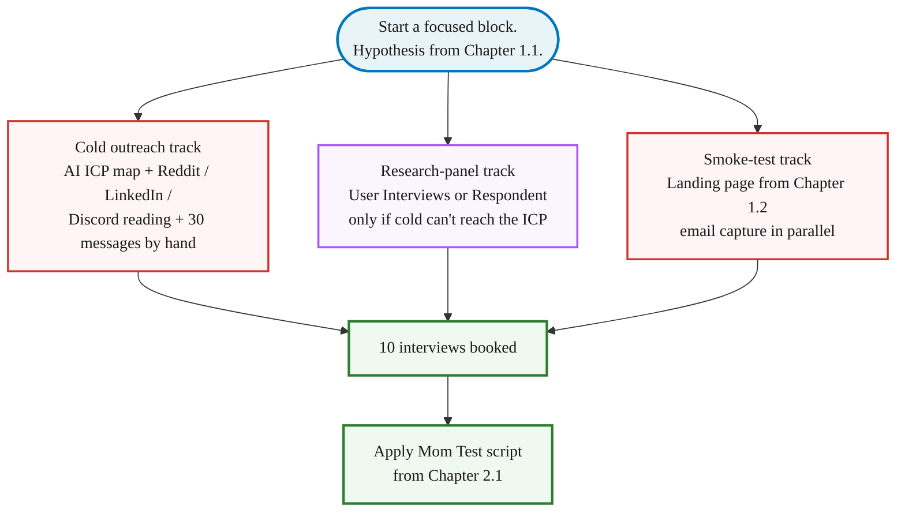

> **Module 2 · Step 3 of 4** · [From Idea to First Paying Customer](/course/tech-for-non-technical-founders-2026/)
>
> **Input:** a hypothesis you suspect is real (from Ch 1.1) + a sharpened Mom Test question list (built in Ch 2.1, polished in Ch 2.2)
>
> **Output:** 10 ICP interviewees booked + transcripts in hand, ready to score per the Ch 2.1 rubric

> **TL;DR:** Read where your ICP is already complaining online, then write to named individuals about the post you read. Thirty hand-picked names from Reddit/LinkedIn/Discord will book 10 interviews.

> **Before you start:** your Ch 1.2 smoke test should have cleared roughly 3%+ email conversion rate (or the equivalent paid-click signal in your channel). If it didn't, you have a demand-side problem, not an interview-recruitment problem. Go back to [Ch 1.1](/course/tech-for-non-technical-founders-2026/form-your-founding-hypothesis-90-minute-sprint/) and rewrite the weakest blank in your hypothesis before booking interviews. Ten calls on a failed hypothesis just produce ten polite conversations about the wrong problem.

> **How this chapter relates to Ch 2.4:** this chapter recruits 10 fresh interviewees and runs PAST-BEHAVIOR interviews about whether the problem is real. [Ch 2.4](/course/tech-for-non-technical-founders-2026/clickable-prototype-validation-2-hour-lovable/) takes the 5 strongest-signal interviewees from these 10 and runs a DIFFERENT kind of session - silent observation while they click through a throwaway Lovable prototype. Same recruitment pool; different methodology; sequential, not parallel. Run Ch 2.3 first to validate THE PROBLEM, then Ch 2.4 to validate THE SOLUTION SHAPE with the 5 strongest of your 10.

This is interview recruitment, not sales. You're asking for time and insight, not money - different message template, different channels, different reciprocity. Don't use the Chapter 5.5 cold-email script here; it scares interview subjects who don't yet know you have a product.

A consumer-app founder we spoke with started where most non-technical founders start: "I'll just message my LinkedIn network." Sixty polite DMs over a week, 3 calls booked - two old colleagues showing up to be nice, one real lead who ghosted on reschedule. So she dropped the network, spent a morning reading Reddit threads where her exact problem showed up, and wrote to the people complaining by name about the post she'd just read. By Thursday afternoon she had **12 interview calls on the calendar**.

Her hypothesis was the same and her work hours were the same. What she changed was where she went looking. The DM-the-network move - 60 messages to people who knew her but not necessarily the problem - is the default first-time-founder move, and it usually books 2-3 polite calls with old colleagues. The Reddit move - reading where strangers were already complaining about the exact thing she had hypothesised, then writing back to those specific complainers about the post she had just read - took her half a day and produced a calendar.

> **Calendar reality for the 10-interview round.** A full-time founder with daytime availability typically books 10 interviews across 2-4 calendar weeks. An evening-only founder (the 2-4 hr/week pattern this course is built for) typically takes 6-8 calendar weeks for the full round: send messages over 1-2 weeks, wait for replies to mature across a 2nd week, schedule and run the calls in the 3rd-6th week, score within 5 minutes of each call. Plan your calendar around the 6-8 week version, not the optimistic 2-3 week version. Module 3 cannot start until 10 transcripts are scored.

The journey, top to bottom:

1. **Translate the hypothesis into an ICP map** - paste your three sentences and two competitor URLs into Claude or ChatGPT. Ask for the ICP profile and the exact subreddits, Slack/Discord channels, and LinkedIn search strings where these people post.
2. **Read where they're already complaining** - work through the channels the AI proposed. Note 30 sentences in their real words.
3. **Build a list of 30 specific people** from those threads. You're picking individuals you can name because you read what they wrote.
4. **Write to each one about the post you read.** One person, one message, one reply at a time. 5-10% will say yes.
5. **10 interview calls on the calendar.**

## Before you start: write three sentences

Write three sentences in your own words before you open Reddit. Without them, every interview answer sounds encouraging and you can't tell which ones confirm the bet and which ones kill it:

| Profile | What to write | Bad vs Good |
|---------|---------------|------------|
| **Customer (one sentence)** | *Who* is this person, in real-world detail? Role, company size, the moment in their week when the pain happens. | Bad: "small-business owners"<br/>Good: "a 12-person law-firm office manager on Friday afternoon trying to invoice ten clients before Quickbooks logs her out" |
| **Business (one sentence)** | What kind of business are *you* building? B2B SaaS, B2B services, B2C app, marketplace. Free or paid. Self-serve or sales-led. This decides which Reddit, which Apollo filter, which interview question you lead with. | Bad: "a SaaS tool"<br/>Good: "B2B SaaS, self-serve, $29-49/month annual billing" |
| **Solution (one sentence)** | Not a feature list-a sentence about the change. You won't pitch this in calls (the Mom Test forbids it), but you need it written down to know which conversations confirm or kill it. | Bad: "a tool that automates invoicing"<br/>Good: "I think a one-click invoice export to Stripe and Wave saves the office manager 90 minutes every Friday" |

If you can't write all three on a single napkin, do that first. The deeper version of these three lines is the [one-page Product Brief in Chapter 3.1](/course/tech-for-non-technical-founders-2026/one-page-product-brief-vibe-prd/) - that's the structured workshop. For Chapter 2.3 outreach, a napkin draft of the three sentences is enough; you'll refine them in Chapter 3.1 after the 10 interviews land.

## How to find 10 people who actually have this problem

You can do every part of this with a Reddit account, a Gmail address, and short daily blocks. AI does the heavy lifting that used to need a researcher; the rest is reading and writing.

### Translate the hypothesis into an ICP map

The 2026 shortcut: AI does the part that used to take a week of research. You hand it your three sentences plus two competitor URLs; it returns the ICP profile, the exact places those people post, and the search strings to find named individuals.

Paste this prompt into Claude or ChatGPT:

```text
You are helping me find the first 10 customer interviews for a product I'm validating.

My hypothesis (3 sentences):
- Customer: [paste your customer sentence]
- Business: [paste your business sentence]
- Solution: [paste your solution sentence]

Two competitors or adjacent products serving a similar customer:
- [competitor 1 URL]
- [competitor 2 URL]

Return:
1. A sharper ICP profile (role, industry, company size, the moment in their week when the pain happens, one quote in their language).
2. 8 subreddits, Slack/Discord communities, and forums where this person posts. For each, give the community's topic focus, typical post frequency (e.g., "20 new posts/day" or "2-3 per week"), and 2-3 short keyword phrases that come up most often. Do NOT generate URLs - you cannot browse the web. Sam will verify the community herself with these inputs.
3. 5 Google + LinkedIn search strings I can paste in today to find named people complaining about this problem (use `site:`, quotes, and `intext:` where helpful).
4. 5 second-degree adjacent search terms I might miss (workarounds they use, related complaints, tool names they'd mention while frustrated).

If you cannot describe a real community for any item, respond with "NOT FOUND - [item]" rather than guessing. A NOT FOUND response is more useful than a fabricated community.
```

> No competitor URLs yet? If you ran the [naive Claude/ChatGPT prompt in Chapter 1.1](/course/tech-for-non-technical-founders-2026/form-your-founding-hypothesis-90-minute-sprint/) with the follow-up "name 3-5 competitors," you already have them. Otherwise: Google your problem in plain words plus `tool` or `software`, grab the top 2 results that aren't blog posts. The AI cares about positioning, not perfect picks.

What you get back: the channels you'll read next and the search strings you'll use to build the list. If a community the AI proposes turns out to be dead or off-topic, drop it and ask: `Suggest 3 alternatives more focused on [vertical].`

If your hypothesis is consumer-facing, swap "Slack/Discord" for "TikTok hashtags, Instagram comments, YouTube comment threads, and product subreddits."

### Read where they're already complaining

Read before you write a single message. You're looking for the exact words people use when their problem flares up - those words become your subject lines when you write the cold messages.

**The simplest way:**

1. Open one of the channels the AI proposed in the ICP map.
2. In the search bar, paste the exact problem phrase in quotes (e.g. `"invoicing takes forever"`).
3. Sort by Top → Past Month. Read the top 30 results.
4. Open a Google Doc. Each time a complaint matches your hypothesis, copy the sentence verbatim - with the username and URL.
5. Repeat for two more channels.

When you're done you should have 30 real sentences and 30 named people. Don't paraphrase. The exact wording is the point.

**Where to search (the AI gave you specifics; here are the common starting points):**

- **Reddit** - subreddits in your vertical. Sort by Top → Past Month. The 1% willing to complain in public are usually willing to take a 20-minute call. Free tool [Keyworddit](https://keyworddit.com) surfaces the keywords a given subreddit is currently using, so you can search those phrases back into Reddit and find the named complainers. If Keyworddit is down or off-topic for your vertical, use Reddit's own search at `reddit.com/search/?q=` directly - less compact, same data.
- **LinkedIn** - paste the problem in quotes into search, filter to Posts → Past Week.
- **Industry Slack and Discord** - Indie Hackers, Lovable, No Code Founders, and the vertical-specific communities your AI map named. Public channels where the daily question is "has anyone else hit X."
- **G2 and Capterra reviews** - pull every 2-star and 3-star review of the closest competitor. Pain a stranger typed for free, organized by feature.
- **Twitter/X** - the 280-character constraint forces complaints to be precise.
- **Personal network referrals** - text 10 people you know: `Do you know anyone who [painful task] regularly? Research call, not sales.` Warm referrals book at 70%+ show rates.

One Reddit rule: don't blast a launch post on day one. Read the sub for a week, leave three real comments, then post a research question. The [self-promotion on Reddit guide](/blog/self-promote-on-reddit-without-getting-banned-promotion/) covers the karma floor and the unwritten rules.

Write down 30 specific sentences in their language with the username next to each. That bank is your raw material when you write the cold messages. Don't paraphrase.

### Build a list of 30 specific people

Turn the 30 sentences into 30 names. Open each thread you saved while reading, click each useful username, and copy four things into a spreadsheet:

- **Name** (theirs, not their company)
- **Role + company** (one cell)
- **The post you'll reference** (paste the URL)
- **One specific line they wrote** (the phrase you'll quote back when you write to them)

Aim for 30 hand-picked people in one focused sitting.

**This is the most important step in the chapter.** A list of 30 individuals you can name - because you read what they wrote - replies at **3-5× the rate** of a list of 30 strangers a tool exported for you. Get this step right and the rest of the chapter shrinks.

If you run out of named posters before you hit 30, [Apollo](https://apollo.io)'s free tier (credit-based: roughly 100 email credits + 10 export credits per month, no credit card) lets you filter on role + industry + company size and export the rest (at 10 exports/month, this fills the gap over several weeks, not one sitting). Treat it as backfill, not the source - the hand-picked names always perform better.

> **Save the Apollo filter and whatever contacts your monthly export credits cover (roughly 10 per month on the free tier) to a tab named "Module 5 cold seed" in your outreach spreadsheet.** You will reuse this exact filter in [Ch 5.5 cold outbound](/course/tech-for-non-technical-founders-2026/outbound-without-sales-team/) (where the same six dimensions are listed). Rebuilding the filter from scratch in Module 5 costs you an hour and risks drift; the saved tab is the one carry-forward artifact this Apollo step produces beyond the 10 interviews.

> **Optional: the full AI-assisted Step 3 workflow.** If you ran the Step-1 AI prompt and the Step-2 monitoring tools above, you can compress this whole section: (1) paste your Step-1 ICP filter (role + company size + industry) into Apollo's free tier - the free monthly export credits (roughly 10) get you a small named-contacts batch in one click; (2) cross-reference those Apollo contacts against the Reddit usernames you saved in Step 2 - these warm-cold targets fit the ICP filter AND have already complained publicly about the problem (highest reply rate of any cold list you can build); (3) scrub the final list for deliverability with [NeverBounce](https://neverbounce.com) ($8 for 1K verifications) before sending (optional - for a 30-name interview list, skip this step; it matters only when you're sending 200+ cold emails). Apollo's free tier (credit-based: roughly 100 email credits + 10 export credits per month, no credit card) + NeverBounce verification keeps the cost of this assisted path inside the same single-digit-dollar band as the manual one.

Filter the final list on six dimensions:

1. **Buyer OR user** - not both
2. **Company size** in your sweet spot (50-500 for most B2B SaaS)
3. **One industry** first - vertical depth beats horizontal spread
4. **One timezone** - so the calls are actually bookable
5. **The tool you replace or integrate with** - filters out the "different problem" lookalikes
6. **A recent funding or hiring signal** - movement = budget = openness

Drop anyone outside the band. You want signal, not volume.

> **Consumer founders** - skip the database backfill. Your buyer is on Reddit, Discord, TikTok comments, and Instagram. The hand-picked path is the only one that works for you.

## What to write so they don't ignore you

Send 30 messages staggered, not in one burst. A handful a day, by hand, beats a single bulk-send. Reply rate runs 5-10% when each message names a specific post you read - 2-3 booked calls per batch, which is enough to hit 10 interviews when stacked with replies still trickling in.

You can do this from Gmail and a [NeetoCal](https://www.neeto.com/neetocal) booking link. If 6 a day by hand is too slow, [Gmail's multi-send](https://support.google.com/mail/answer/12018150) (up to 1,500/day on Workspace, ~500/day on personal) or [Streak](https://www.streak.com/) does the mail merge for you. Reply by hand either way - the back-and-forth is where the interview actually gets booked.

### The message most non-technical founders write first

Before we hand you a working sequence, look at the version a founder typically sends on attempt one. This is composed from real first-draft messages we've seen across rescues:

```text
Subject: quick chat?

Hi Marcus,

My name is [your name] and I'm building a tool that helps small-business
owners with invoicing. I'd love 30 minutes of your time to learn more about
your business and see if my product would be a good fit.

Would you be open to a quick chat next week? Calendar is here: [link]

Thanks!
```

Reply rate on that message hovers around 1%. Here's why each sentence dies:

- **"quick chat?"** subject - generic; competes against every recruiter cold email in their inbox. Doesn't name a topic they'd open.
- **"building a tool that helps small-business owners with invoicing"** - pitches a solution to a stranger who didn't ask. The Mom Test (Chapter 2.1) forbids this; the stranger now thinks they're being sold to, not consulted.
- **"learn more about your business"** - vague. They don't owe you a free strategy session; they need to know what you'll do with their 30 minutes.
- **"see if my product would be a good fit"** - sales language. The reader hears "I'm prospecting," closes the tab.
- **No mention of how you found them.** The reader can't tell whether you're spamming 500 people from a list or actually paying attention to them specifically.

The rewrite fixes one thing at a time: subject names the topic they posted about, opening line names the specific post you read, the ask is for 20 minutes of their experience (not their feedback on your idea), and you make it explicit you're not selling.

### The working 3-message sequence

Copy the 3-message sequence below. Replace bracketed parts with their words from when you read where they're complaining, not yours.

```text
Day 0 - intro (reply rate target: 20-30%)
Subject: quick question about [their exact workaround]
"Saw your post on r/SaaS last week about [the thread]. I'm a [role]
looking into the same problem. Not selling - 20 min so I can ask 5
questions about how you handle [task] today? Calendar: [NeetoCal link]."
```

**Day-3 bump message - pick the version that fits your stage:**

- **First-round variant (you have 0-9 interviews done):** "Hi [name] - circling back on the [topic] piece. Running my first 10 conversations on this problem - still learning, would value 25 minutes if you have it."
- **Experienced variant (you have 10+ interviews done):** "Hi [name] - circling back on the [topic] piece. Already 30+ founders in - the conversations are sharper than I expected; happy to share the pattern if you have 25 min."

Day-3 bump recovers 8-12% of non-responders. Subject line: `re: [their workaround]`.

```text
Day 7 - close (recovers 3-5% more)
Subject: last try - 20 min on [topic]
"Last note. If this isn't your problem, no worries - I'll stop. If it is
and you haven't had a chance: [NeetoCal]. Running interviews through next
Friday."
```

In our 2026 outreach engagements that sequence ran 30-45% reply rates when the Day-0 subject referenced something the recipient had actually posted - your mileage will vary by audience tightness and recency of the posted content. It collapses to 1-5% with a generic "love to pick your brain" opener - the difference is the reading you did to find named people. The [cold-email conversion playbook from YC Startup School](/blog/how-convert-customers-with-cold-emails-startup-school/) walks through more variations on the opener pattern.

The same 3-email pattern works as LinkedIn DMs. Subject becomes the connection-request note. Skip Day 7 on LinkedIn (too aggressive in DM context).

### Volume targets

Send 30 to 50 messages to land 10 interviews. Target a reply rate of 20% or higher - below that, your opener is too generic or you're in the wrong channel. Of the replies who say yes, expect 50% or more to actually show. If your show rate drops below 50%, add a 24-hour reminder message and confirm the meeting time the day before.

## What if cold outreach can't reach them

### Backup with a research panel

If your ICP can't be reached cold - a CFO at a regulated bank, an oncology nurse, a top-100 retailer's head of operations - cold messages will not work no matter how sharp the opener is. The shortcut: a research panel that pays interviewees for their time.

**[User Interviews](https://userinterviews.com)** and **[Respondent](https://respondent.io)** are the two big ones. You write a screener, upload the interview script, and they ship booked calls in 3-5 days. Respondent tends to reach business roles (CFOs, engineering directors, ops leads) more reliably; User Interviews has broader consumer coverage.

The cost is real - each booked call has a meaningful incentive attached - so panels are not the default. Use them only when the cold-outreach path can't reach your ICP. When they do work, run them in parallel with cold outreach: the two samples bias differently (free-time strangers vs. paid-time strangers), and together they give you a more honest read.

### The parallel smoke-test landing page

While the cold-outreach path books the calls, the smoke-test landing page from [Chapter 1.2](/course/tech-for-non-technical-founders-2026/smoke-test-landing-page-7-day-demand-test/) measures whether strangers will give you their email for the thing you described. Run it in parallel and drop the URL into your messages - it doubles as the warmest opener:

> "You signed up for the waitlist on [page] last Tuesday - up for a 20-minute call?"

Reply rates on that opener run 60%+ - the highest in this whole chapter. The chapter 1.2 page covers how to build it; here we only use it.



Run the cold-outreach track first - that's where the 10 calls usually come from. Run the smoke-test in parallel because it costs nothing extra (it's already built in Chapter 1.2). Add the research panel only if your ICP can't be reached cold; the two tracks fail differently, and having both gives you a more honest read.

## What to do next

| Step | Action | Target |
|---|---|---|
| **1** | Pick the highest-conviction problem hypothesis from Chapter 1.1. Write it as one sentence: `I think [persona] currently does [task] in [painful way] and would pay $X to do it [better way].` | One hypothesis. Not three. |
| **2** | Run the AI ICP map prompt with your hypothesis + 2 competitor URLs. Read the channels it returns; note 30 sentences in their words. | List of 30 named people + 30 verbatim sentences |
| **3** | Write the 3-message sequence using their words, not yours. | Sequence ready to send |
| **4** | Send a handful of messages by hand. Reply by hand to anyone who answers. | First replies trickle in over the next couple of days |
| **5** | Check the reply rate. If under 10%, rewrite Day-0 subject line referencing a specific post and resend. If 10-30%, let the sequence run its course. If 30%+, move to [Mom Test script](/course/tech-for-non-technical-founders-2026/mom-test-interview-script/). | Calibrate by reply rate band |

> **Slow-path variant for the part-time founder** (working evenings only, day-job constraints): the staggered cadence above assumes daytime availability. If your only window is one evening block a week, batch-send instead: sort 30 names into priority buckets first, then personalize and send all 30 in one go using Gmail multi-send (a Gmail Workspace feature that personalizes the first line per recipient and sends in batches) or LinkedIn Sales Navigator's bulk-DM feature. Expect a lower reply rate (~8-12% vs 20-30%) because the messages land in a burst instead of a stagger - compensate by booking the first 2-3 interviews from your fastest responders quickly, before the cold batch goes silent. The batch-send variant costs you 1-2 fewer interviews per round but lets you fit the round inside a single evening rather than across workdays you don't have. The same slow-path pattern applies in [Ch 2.4](/course/tech-for-non-technical-founders-2026/clickable-prototype-validation-2-hour-lovable/) (async prototype observation) and [Ch 5.3](/course/tech-for-non-technical-founders-2026/first-ten-customers-personal-network/) (single-evening batch outreach to your personal network) - look for the same callout style.

The [Outreach Sequence Template](/course/tech-for-non-technical-founders-2026/outreach-sequence-template/) carries the verbatim sequence plus the LinkedIn DM openers, cold-email subject lines, Reddit research-comment template, and NeetoCal page copy. Print it, paste it into Gmail at the start of your next outreach block, ship.

## What happens after the 10 calls are booked

This chapter's output is 10 booked interviewees - the inputs. Running them, scoring them, and turning them into the validated problem statement that Module 3 needs is the linear sequence below.

> **You are now on Pass 2 of Ch 2.1.** Open Ch 2.1 on a second tab and scroll to the [Synthesis section](/course/tech-for-non-technical-founders-2026/mom-test-ask-about-past-not-future/#synthesis-write-down-what-you-heard-decide-whats-next). That section holds the scoring rubric, the strong-signal count, the validated problem statement template, and the build / pivot / kill decision tree. The chain below tells you which Ch 2.1 sub-step lands where.

Nothing in this chapter teaches the interview technique itself; that's Ch 2.1 (which you already read). What this section names is the chain of artifacts the booked calls produce:

1. **Run each interview using the Ch 2.1 5-question Mom Test technique.** Open the [Mom Test Interview Script](/course/tech-for-non-technical-founders-2026/mom-test-interview-script/) artifact on a second monitor; read the 5 questions verbatim; do NOT improvise. 30-40 minutes per call.
2. **Score each call 1-10 within 5 minutes of hanging up** per the Ch 2.1 scoring rubric. If you score later you will round up. Write the score in your notes file before opening the next browser tab.
3. **After all 10 calls are done, fill the [Validated Problem Statement template](/course/tech-for-non-technical-founders-2026/validated-problem-statement-template/)** using the Ch 2.1 synthesis section. One page. Named persona, named industry, dated 10-call sample, one verbatim quote, one quantified cost.
4. **Pick the 5 strongest-signal interviewees** (Mom Test score ≥ 7) for Ch 2.4 prototype sessions. These are the same people, asked for a different kind of time - 30 minutes to watch them use a clickable prototype, not answer questions.
5. **Two artifacts now flow into Module 3 + later modules:**
   - The Validated Problem Statement (Section 1 of the Ch 3.1 one-page brief, lifted verbatim)
   - The 5 strongest-signal interviewees (Ch 2.4 input - and later, your Week-5 Module-5 onramp invitees in Ch 4.3, plus your warm-list seed in Ch 5.3)

If fewer than 7 of 10 calls score ≥ 7, the problem is too weak for this ICP. Re-evaluate the ICP, the problem framing, or the question wording before booking another 10 calls. Sometimes Q1 is wrong (the problem context is too narrow); retry with broader phrasing first. The full kill / iterate / proceed decision lives in [Ch 2.1's scoring section](/course/tech-for-non-technical-founders-2026/mom-test-ask-about-past-not-future/).

Skip this module and start building, and the typical failure mode is burning months of build time and a five-figure contractor budget before discovering the problem you assumed was real wasn't. The [pre-PMF founder sales rule](/blog/sales-pre-pmf-should-be-done-by-founders/) - you do this yourself, you don't hire it out - is the same logic.

Validation is founder work because the signal disappears when an intermediary handles the conversation.

## Variations and optional upgrades

These are skip-by-default paths. The main chapter works without any of them; reach for one only when the matching condition applies.

**Upgrade the AI ICP map prompt with a deep-research tool (Step 1).** The Claude/ChatGPT version above is fast and free; the trade-off is the AI synthesizes text without source links. For a verifiable evidence trail, swap in Perplexity Pro ($20/mo) or Gemini Deep Research ($20/mo Advanced) with the same prompt - both return real-source citations (specific subreddit threads, G2 reviews, podcast transcripts) for every claim. Two payoffs: (1) spot-check that each proposed community is alive and on-topic before you invest reading time; (2) grab verbatim quote snippets you can reuse as cold-message subject lines later in this chapter. **What this is NOT**: a substitute for the manual reading. The AI cites where the language exists; you still read the threads to internalize how the problem feels in your ICP's words.

**Offline-heavy verticals - paid panel as Plan A (Step 2).** If your ICP lives in trades, nursing, in-store retail, elderly users, or regulated B2B, the Reddit / LinkedIn / G2 flow returns nothing useful - your buyer is not in those threads. Use a paid panel instead. [UserInterviews](https://www.userinterviews.com/) and [Respondent](https://www.respondent.io/) have screened participants across these verticals; cost is $30-$100 per interview, higher than a free Reddit DM but cheaper than 3 weeks of failed cold outreach into the wrong channel. The Mom Test technique (Ch 2.1) applies unchanged; only the recruitment channel switches. **If your buyer lives on TikTok or Instagram instead:** the message templates still work - swap "Saw your post on r/SaaS" for "Saw your comment on [video URL]" and send via the platform's DM, not email. Decision rule: if your ICP description names an offline trade, an over-60 user, or a regulated profession, budget for a paid panel as Plan A.

**Monitoring tools that cut the manual reading load (Step 2).** [Keyworddit](https://keyworddit.com) (free, no signup) surfaces the high-frequency keywords inside any subreddit - paste the subreddit name, get back the language people are actually using so you can search those phrases back to find named complainers. [F5Bot](https://f5bot.com) (free) sends email alerts when your keywords appear on Reddit, Hacker News, or Lobste.rs - best for catching new threads later, when your hypothesis evolves and you need fresh evidence. [Reddinbox](https://reddinbox.com) / [Pushshift](https://pushshift.io) (free) searches Reddit's full archive for high-commercial-intent phrases like "how to automate X" or "sick of doing Y manually" - paste one of your Ch 2.3 search strings and read every matching post from the last 12 months. [Common Room](https://www.commonroom.io/) (free tier exists) surfaces where your ICP hangs out across Reddit + Slack + Discord + GitHub - useful when your Step 1 AI proposed communities you've never heard of. **What this is NOT**: a substitute for reading the threads yourself. The 30 verbatim sentences in their own language is the artifact you carry into your Mom Test questions (Ch 2.1); tools surface the threads faster, you still read them.

**If you skim ahead to the message template (Step 3).** If you want the message template first, scroll up to "What to write so they don't ignore you." The list-building methods above are the recommended path; the message template will make more sense after, but if you're a reader who needs to see the destination before the journey, jump and come back.

## Further reading

- Rob Fitzpatrick, [The Mom Test (book site)](https://www.momtestbook.com/) - the past-behavior interview technique you'll run on every call this chapter books.
- Y Combinator, [Talking to Users (Startup Library)](https://www.ycombinator.com/library/6g-how-to-talk-to-users) - the canonical YC essay on why this conversation has to happen.
- [Apollo](https://www.apollo.io/) - contact database that lets a non-technical founder filter by role + industry + company size when the hand-picked list runs thin.
- [Clay](https://www.clay.com/) - list enrichment with email verification, useful once you're past 5 paying customers and the manual sequence can't keep up.
- [User Interviews](https://www.userinterviews.com/) and [Respondent](https://respondent.io) - research panels for ICPs that cannot be reached cold (regulated industry, hard-to-find consumer, top-100 executive).

> **Done when:** 10 interview calls are booked on your calendar and you have sent the first batch of outreach messages.
> **Next click:** Return to [2.1 · The Mom Test](/course/tech-for-non-technical-founders-2026/mom-test-ask-about-past-not-future/) to run the interviews using the 5-question script, then return to Ch 2.1's Synthesis section to score the transcripts.
> **If blocked:** If your reply rate is under 10%, your Day-0 subject line is too generic. Rewrite it to reference a specific post you read by that person. If your ICP can't be reached cold, switch to a paid research panel (User Interviews or Respondent).

---

*Built by [JetThoughts](https://jetthoughts.com) as part of the [From Idea to First Paying Customer](/course/tech-for-non-technical-founders-2026/) curriculum.*
