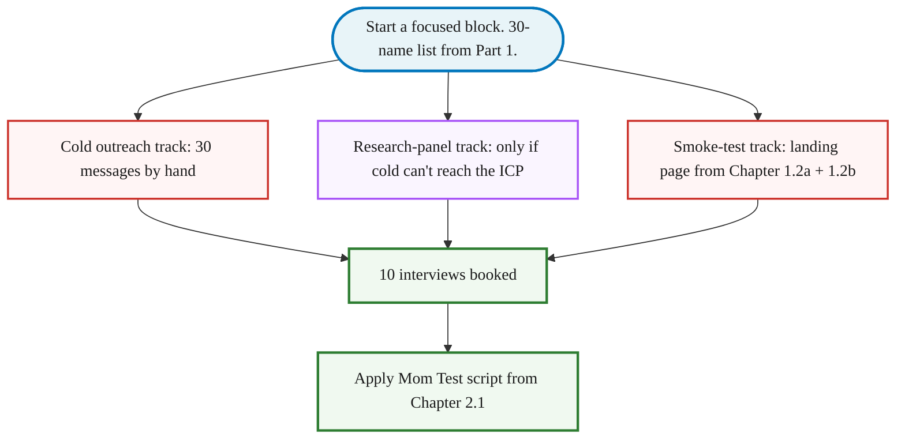

> **Module 2 · Step 3b of 4** · [From Idea to First Paying Customer](/course/tech-for-non-technical-founders-2026/)
>
> **Input:** a 30-name list from [Part 1: Where to Look](/course/tech-for-non-technical-founders-2026/find-10-people-where-to-look/) - specific people you can name because you read what they posted
>
> **Output:** 10 interview calls booked, transcripts in hand, ready to score per the Ch 2.1 rubric

> **TL;DR:** Send 30 staggered messages referencing specific posts you read. A 3-message sequence (Day 0 intro + Day 3 bump + Day 7 close) books 10 interviews. Reply rate runs 20-30% when each message names a specific post; 1-5% when it doesn't.

> **This is Part 2 of 2.** [Part 1: Where to Look](/course/tech-for-non-technical-founders-2026/find-10-people-where-to-look/) covers the ICP mapping, reading threads, and building the 30-name list. You need the list from Part 1 before the templates below will work - generic openers collapse to 1-5% reply rates.

> **How this chapter relates to Ch 2.4:** this chapter recruits 10 fresh interviewees and runs PAST-BEHAVIOR interviews about whether the problem is real. [Ch 2.4](/course/tech-for-non-technical-founders-2026/clickable-prototype-validation-2-hour-lovable/) takes the 5 strongest-signal interviewees from these 10 and runs a DIFFERENT kind of session - silent observation while they click through a throwaway Lovable prototype. Same recruitment pool; different methodology; sequential, not parallel. Run Ch 2.3 (a + b) first to validate THE PROBLEM, then Ch 2.4 to validate THE SOLUTION SHAPE.

This is interview recruitment, not sales. You're asking for time and insight, not money - different message template, different channels, different reciprocity. Don't use the Chapter 5.5 cold-email script here; it scares interview subjects who don't yet know you have a product.

## What to write so they don't ignore you

Send 30 messages staggered, not in one burst. A handful a day, by hand, beats a single bulk-send. Reply rate runs 20-30% when each message names a specific post you read - 2-3 booked calls per batch, which is enough to hit 10 interviews when stacked with replies still trickling in.

You can do this from Gmail and a [NeetoCal](https://www.neeto.com/neetocal) booking link. If 6 a day by hand is too slow, [Gmail's multi-send](https://support.google.com/mail/answer/12018150) (up to 1,500/day on Workspace, ~500/day on personal) or [Streak](https://www.streak.com/) does the mail merge for you. Reply by hand either way - the back-and-forth is where the interview actually gets booked.

### The message most non-technical founders write first

Before we hand you a working sequence, look at the version a founder typically sends on attempt one. This is composed from real first-draft messages we've seen across rescues:

```text
Subject: quick chat?

Hi Marcus,

My name is [your name] and I'm building a tool that helps small-business
owners with invoicing. I'd love 30 minutes of your time to learn more about
your business and see if my product would be a good fit.

Would you be open to a quick chat next week? Calendar is here: [link]

Thanks!
```

Reply rate on that message hovers around 1%. Here's why each sentence dies:

- **"quick chat?"** subject - generic; competes against every recruiter cold email in their inbox.
- **"building a tool that helps small-business owners with invoicing"** - pitches a solution to a stranger who didn't ask.
- **"learn more about your business"** - vague. They need to know what you'll do with their 30 minutes.
- **"see if my product would be a good fit"** - sales language. The reader hears "I'm prospecting," closes the tab.
- **No mention of how you found them.** The reader can't tell whether you're spamming 500 people or actually paying attention.

The rewrite fixes one thing at a time: subject names the topic they posted about, opening line names the specific post you read, the ask is for 20 minutes of their experience (not their feedback on your idea), and you make it explicit you're not selling.

### The working 3-message sequence

Copy the 3-message sequence below. Replace bracketed parts with their words from when you read where they're complaining in [Part 1](/course/tech-for-non-technical-founders-2026/find-10-people-where-to-look/), not yours.

```text
Day 0 - intro (reply rate target: 20-30%)
Subject: quick question about [their exact workaround]
"Saw your post on r/SaaS last week about [the thread]. I'm a [role]
looking into the same problem. Not selling - 20 min so I can ask 5
questions about how you handle [task] today? Calendar: [NeetoCal link]."
```

**Day-3 bump message - pick the version that fits your stage:**

- **First-round variant (you have 0-9 interviews done):** "Hi [name] - circling back on the [topic] piece. Running my first 10 conversations on this problem - still learning, would value 25 minutes if you have it."
- **Experienced variant (you have 10+ interviews done):** "Hi [name] - circling back on the [topic] piece. Already 30+ founders in - the conversations are sharper than I expected; happy to share the pattern if you have 25 min."

Day-3 bump recovers 8-12% of non-responders. Subject line: `re: [their workaround]`.

```text
Day 7 - close (recovers 3-5% more)
Subject: last try - 20 min on [topic]
"Last note. If this isn't your problem, no worries - I'll stop. If it is
and you haven't had a chance: [NeetoCal]. Running interviews through next
Friday."
```

In our 2026 outreach engagements that sequence ran 30-45% reply rates when the Day-0 subject referenced something the recipient had actually posted - your mileage will vary by audience tightness and recency of the posted content. It collapses to 1-5% with a generic "love to pick your brain" opener - the difference is the reading you did in Part 1 to find named people. The [cold-email conversion playbook from YC Startup School](/blog/how-convert-customers-with-cold-emails-startup-school/) walks through more variations on the opener pattern.

The same 3-email pattern works as LinkedIn DMs. Subject becomes the connection-request note. Skip Day 7 on LinkedIn (too aggressive in DM context).

### Volume targets

Send 30 to 50 messages to land 10 interviews. Target a reply rate of 20% or higher - below that, your opener is too generic or you're in the wrong channel. Of the replies who say yes, expect 50% or more to actually show. If your show rate drops below 50%, add a 24-hour reminder message and confirm the meeting time the day before.

## What if cold outreach can't reach them

### Backup with a research panel

If your ICP can't be reached cold - a CFO at a regulated bank, an oncology nurse, a top-100 retailer's head of operations - cold messages will not work no matter how sharp the opener is. The shortcut: a research panel that pays interviewees for their time.

**[User Interviews](https://userinterviews.com)** and **[Respondent](https://respondent.io)** are the two big ones. You write a screener, upload the interview script, and they ship booked calls in 3-5 days. Respondent tends to reach business roles (CFOs, engineering directors, ops leads) more reliably; User Interviews has broader consumer coverage.

The cost is real - each booked call has a meaningful incentive attached - so panels are not the default. Use them only when the cold-outreach path can't reach your ICP. When they do work, run them in parallel with cold outreach: the two samples bias differently (free-time strangers vs. paid-time strangers), and together they give you a more honest read.

### The parallel smoke-test landing page

While the cold-outreach path books the calls, the smoke-test landing page from [Chapter 1.2b](/course/tech-for-non-technical-founders-2026/smoke-test-landing-page-7-day-demand-test/) (built in [1.2a](/course/tech-for-non-technical-founders-2026/smoke-test-build-landing-page/)) measures whether strangers will give you their email for the thing you described. Run it in parallel and drop the URL into your messages - it doubles as the warmest opener:

> "You signed up for the waitlist on [page] last Tuesday - up for a 20-minute call?"

Reply rates on that opener run 60%+ - the highest in this whole chapter.



Run the cold-outreach track first - that's where the 10 calls usually come from. Run the smoke-test in parallel because it costs nothing extra. Add the research panel only if your ICP can't be reached cold.

## What to do next

| Step | Action | Target |
|---|---|---|
| **1** | Open your 30-name list from Part 1. Customize the Day-0 message for the first 5 names - one specific reference per message from the line you quoted. | First 5 messages drafted |
| **2** | Send the first 5 by hand. Reply by hand to anyone who answers. | First replies trickle in |
| **3** | Send the remaining 25 staggered over the next few days. Day-3 bumps to non-responders. | Full 30-message batch out |
| **4** | Check the reply rate. If under 10%, rewrite Day-0 subject line referencing a specific post and resend. If 10-30%, let the sequence run. If 30%+, move to [Mom Test script](/course/tech-for-non-technical-founders-2026/mom-test-interview-script/). | Calibrate by reply rate band |

> **Slow-path variant for the part-time founder** (working evenings only, day-job constraints): the staggered cadence above assumes daytime availability. If your only window is one evening block a week, batch-send instead: sort 30 names into priority buckets first, then personalize and send all 30 in one go using Gmail multi-send. Expect a lower reply rate (~8-12% vs 20-30%) because the messages land in a burst instead of a stagger - compensate by booking the first 2-3 interviews from your fastest responders quickly.

The [Outreach Sequence Template](/course/tech-for-non-technical-founders-2026/outreach-sequence-template/) carries the verbatim sequence plus the LinkedIn DM openers, cold-email subject lines, Reddit research-comment template, and NeetoCal page copy.

## What happens after the 10 calls are booked

This chapter's output is 10 booked interviewees. Running them, scoring them, and turning them into the validated problem statement that Module 3 needs is the linear sequence below.

> **You are now ready to run the interviews using Ch 2.1's 5-question script.** Open Ch 2.1 on a second tab and scroll to the scoring rubric. Then move to [Mom Test Synthesis: Build, Pivot, or Kill](/course/tech-for-non-technical-founders-2026/mom-test-synthesis-build-pivot-kill/) once all 10 transcripts are scored.

The chain of artifacts the booked calls produce:

1. **Run each interview using the Ch 2.1 5-question Mom Test technique.** Open the [Mom Test Interview Script](/course/tech-for-non-technical-founders-2026/mom-test-interview-script/) artifact on a second monitor; read the 5 questions verbatim. 30-40 minutes per call.
2. **Score each call 1-10 within 5 minutes of hanging up** per the Ch 2.1 scoring rubric. Write the score before opening the next browser tab.
3. **After all 10 calls are done, fill the [Validated Problem Statement template](/course/tech-for-non-technical-founders-2026/validated-problem-statement-template/)** using the [Mom Test Synthesis](/course/tech-for-non-technical-founders-2026/mom-test-synthesis-build-pivot-kill/) page.
4. **Pick the 5 strongest-signal interviewees** (Mom Test score ≥ 7) for Ch 2.4 prototype sessions.
5. **Two artifacts now flow into Module 3 + later modules:**
   - The Validated Problem Statement (Section 1 of the Ch 3.1 one-page brief, lifted verbatim)
   - The 5 strongest-signal interviewees (Ch 2.4 input - and later, your Module 5 onramp invitees in Ch 4.3 (a + b), plus your warm-list seed in Ch 5.3)

If fewer than 7 of 10 calls score ≥ 7, the problem is too weak for this ICP. Re-evaluate the ICP, the problem framing, or the question wording before booking another 10 calls. The full kill / iterate / proceed decision lives in the [Mom Test Synthesis](/course/tech-for-non-technical-founders-2026/mom-test-synthesis-build-pivot-kill/) page.

Skip this module and start building, and the typical failure mode is burning months of build time and a five-figure contractor budget before discovering the problem you assumed was real wasn't. Validation is founder work because the signal disappears when an intermediary handles the conversation.

## Further reading

- Rob Fitzpatrick, [The Mom Test (book site)](https://www.momtestbook.com/) - the past-behavior interview technique you'll run on every call this chapter books.
- Y Combinator, [Talking to Users (Startup Library)](https://www.ycombinator.com/library/6g-how-to-talk-to-users) - the canonical YC essay on why this conversation has to happen.
- [Apollo](https://www.apollo.io/) - contact database for filtering by role + industry + company size when the hand-picked list runs thin.
- [User Interviews](https://www.userinterviews.com/) and [Respondent](https://respondent.io) - research panels for ICPs that cannot be reached cold.

> **Done when:** 10 interview calls are booked on your calendar and you have sent the first batch of outreach messages.
> **Next click:** Return to [2.1 · The Mom Test](/course/tech-for-non-technical-founders-2026/mom-test-ask-about-past-not-future/) to run the interviews using the 5-question script, then move to [Mom Test Synthesis](/course/tech-for-non-technical-founders-2026/mom-test-synthesis-build-pivot-kill/) to score the transcripts.
> **If blocked:** If your reply rate is under 10%, your Day-0 subject line is too generic. Rewrite it to reference a specific post you read by that person. If your ICP can't be reached cold, switch to a paid research panel (User Interviews or Respondent).

> **Case Study: Tomas & Mia**
>
> **Tomas**: Sends the 3-message sequence to 30 controllers on LinkedIn. Books 12 interviews from 30 reaches (40% reply rate - high because Tomas was an accountant and speaks their language).
>
> **Mia**: Sends the 3-message sequence to 30 parents via Facebook DM. Books 14 interviews from 30 reaches (47% - high because Mia was a teacher and parents trust her).

---

*Built by [JetThoughts](https://jetthoughts.com) as part of the [From Idea to First Paying Customer](/course/tech-for-non-technical-founders-2026/) curriculum.*
