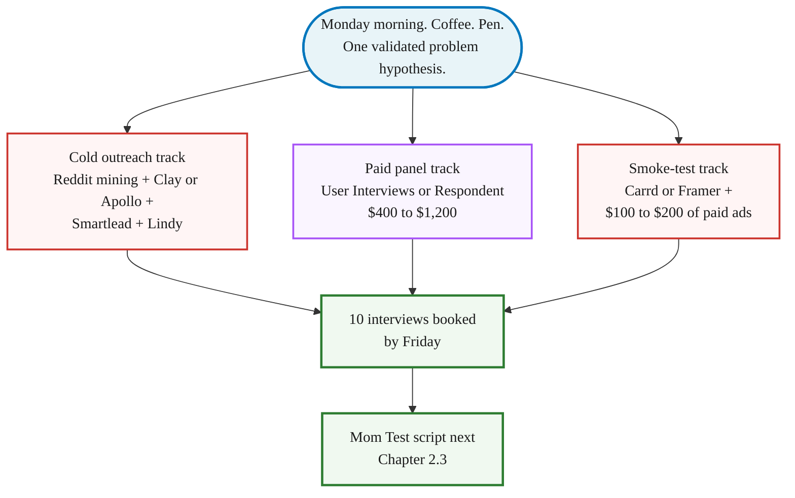

> **Module 2 · Step 2 of 4** · [Tech for Non-Technical Founders 2026](/course/tech-for-non-technical-founders-2026/) course.
> Input: a hypothesis you suspect is real (from Chapter 1.1, refined by AI persona rehearsal in Chapter 2.1). Output: 10 ICP interviewees booked for next week.

This is interview recruitment, not sales. You're asking for time and insight, not money - different message template, different channels, different reciprocity. Don't use the Chapter 5.5 cold-email script here; it scares interview subjects who don't yet know you have a product.

A consumer-app founder we spoke with last month opened with the same plan most non-technical founders try first: "I'll just message my LinkedIn network." She sent 60 polite DMs over a week and booked 3 calls. Two were old colleagues who showed up to be nice. One was real, then ghosted on reschedule. She pivoted to the stack below on a Monday morning - Reddit mining, an Apollo list, a Lindy AI agent, and $400 on a User Interviews panel - and had **12 calls booked by Thursday afternoon**. Same founder, same problem hypothesis, same week. The difference was where she looked and how she opened.

The funnel, top to bottom:

1. **Mine where they're complaining** - Reddit, LinkedIn, Discord, G2. Pull 30 sentences in their words.
2. **Build the ICP list** - Clay (~$149/mo) or Apollo ($49-$149). Export 80-120 rows.
3. **Run the 3-email sequence** - Smartlead ($37-$94) plus a Lindy AI agent ($49).
4. **Backup with a paid panel** - User Interviews or Respondent, $50-$150 per booked call.
5. **10 calls booked by Friday afternoon.**

## Why this matters in 2026

A Y Combinator manifesto says you can validate a startup without writing a line of code. It leaves out the hard part: getting the first 10 strangers to spend 30 minutes telling you about their problem. Most non-technical founders quit here. They post once on LinkedIn, ask their network, get three polite "sounds cool" replies, and start building anyway.

> Then they spend $30K to $80K finding out the problem they assumed was real wasn't. The 2026 outreach stack costs $200 to $500 in tools and panels and ships you 10 honest conversations in one week. Validation isn't the bottleneck anymore. Discipline is.

## Before you start: write three sentences

Outreach without a hypothesis is cold-calling. You need three lines on paper, in your own words, before you open Reddit:

| Profile | What to write | Bad vs Good |
|---------|---------------|------------|
| **Customer (one sentence)** | *Who* is this person, in real-world detail? Role, company size, the moment in their week when the pain happens. | Bad: "small-business owners"<br/>Good: "a 12-person law-firm office manager on Friday afternoon trying to invoice ten clients before Quickbooks logs her out" |
| **Business (one sentence)** | What kind of business are *you* building? B2B SaaS, B2B services, B2C app, marketplace. Free or paid. Self-serve or sales-led. This decides which Reddit, which Apollo filter, which interview question you lead with. | Bad: "a SaaS tool"<br/>Good: "B2B SaaS, self-serve, $29-49/month annual billing" |
| **Solution (one sentence)** | Not a feature list—a sentence about the change. You won't pitch this in calls (the Mom Test forbids it), but you need it written down to know which conversations confirm or kill it. | Bad: "a tool that automates invoicing"<br/>Good: "I think a one-click invoice export to Stripe and Wave saves the office manager 90 minutes every Friday" |

If you can't write all three in 10 minutes, do that first. The deeper version of these three lines is the [one-page Product Brief in Chapter 3.1](/course/tech-for-non-technical-founders-2026/one-page-product-brief-vibe-prd/) - that's the structured workshop. For Chapter 2.2 outreach, a napkin draft of the three sentences is enough; you'll refine them in Chapter 3.1 after the 10 interviews land.

## The 5-step outreach sequence

> **No-budget version: skip the tool stack, send 30 manual DMs.**
> The full sequence below uses Clay (~$149/mo), Apollo ($49-$149/mo), Smartlead ($37-$94/mo), and Lindy AI (~$49/mo). For a pre-revenue founder that's $300-500/month before you've validated anything - which contradicts this course's "validate cheap" rule.
>
> The manual minimum-viable version costs $0 and proves the same thing:
>
> 1. **Search Reddit + LinkedIn + Discord** for your problem keywords - 1 hour, free.
> 2. **DM 30 people** whose recent posts match your problem - 30 min, free (Reddit + LinkedIn allow this for cold-but-relevant DMs).
> 3. **Book interview calls** from the replies - 3 days instead of 1 morning. Use a free Calendly link in your message.
>
> Reply rate: 5-10% manually vs 30-45% with the tool stack. The lower rate just means you start with 30 messages instead of 15. You still need 7-10 interviews. The conversation quality and the signal are identical.
>
> **Upgrade to the tool stack when:** you have 5 paying customers and the manual sequence can't keep up. Until then, the manual version is what the course recommends - it keeps you in the validation mindset and your cash in the bank.

### Step 1 - Mine where they're already complaining

Read for two hours before you write a single message. The people who have your problem are already typing about it somewhere; your job is to find their exact phrasing.

Open Reddit and search the words your prospect would use. For a typical ICP-E B2B SaaS founder, the productive subreddits are **r/SaaS**, **r/startups**, **r/Entrepreneur**, and one or two niche subs (r/sysadmin for IT, r/marketing for CMOs, r/smallbusiness for owner-operators). Sort by Top - Past Month. Read the top 50 posts. Note complaints (the exact wording of the problem) and existing workarounds.

Then sweep the other five wells in the same hour:

- **LinkedIn** - search the problem in quotes, filter to Posts - Past Week. The 1% willing to complain in public are usually willing to take a 20-minute call.
- **Twitter/X** - DM directly. The 280-character constraint means their complaints are precise.
- **Personal network referrals** - text 10 people you know: "Do you know anyone who does [painful task] regularly? Research calls, not sales." Warm referrals book at 70%+ show rates versus 30% cold.
- **G2 and Capterra reviews** - pull every 2-star and 3-star review for the closest competitor. Pain a stranger typed for free.
- **Industry Discord and Slack** - Indie Hackers, Lovable, No Code Founders. Public channels where the daily question is "has anyone else hit X."

One Reddit warning: don't blast a launch post on day one. Read the sub for a week, comment on three threads with real answers, then post your research question. The [self-promotion on Reddit guide](/blog/self-promote-on-reddit-without-getting-banned-promotion/) covers the karma floor.

Write down 30 specific sentences in their language. That bank is the raw material for Step 3 messages. Don't paraphrase.

### Step 2 - Build the ICP list

Turn the language into a list. Two tools matter in 2026.

**Clay** (clay.com, ~$149/mo for the Starter plan) enriches contact rows from 50+ sources at once and handles deduplication plus email verification. If you need 100 clean contacts, this is the cheapest hour you'll spend.

**Apollo** (apollo.io, $49-$149/mo) is the budget alternative. Smaller database, but the filters are good and export-to-CSV is one click. Enough for a single morning targeting 50-100 contacts.

Filter on six dimensions: (1) job title (buyer OR user, not both), (2) company size (50-500 is the sweet spot - reachable decision-maker, big enough to have the problem), (3) industry (one vertical first), (4) geography (one timezone, so calls are bookable), (5) technology used (filter for the tool you replace or integrate with), (6) recent funding or hiring signal. Export 80-120 rows; send to 50, hold 30 in reserve, drop the bottom 40.

Consumer founders: Apollo and Clay don't help much - your buyer is on Reddit and Discord, not a B2B database. Skip to Step 4 (paid panels) and Step 5 (smoke-test landing page) earlier.

### Step 3 - Run the sequence

Founders who write one cold email and send it manually from Gmail hit a 2% reply rate. The 2026 stack does better because the sequence runs itself and an AI agent handles the calendar back-and-forth.

**Smartlead** (smartlead.ai, $37-$94/mo) or **Instantly** (instantly.ai, similar pricing) is the sending layer. Upload the list, write a 3-email sequence, and the tool handles deliverability - warmup, rotating inboxes across 5-10 Google Workspace or Microsoft 365 mailboxes, bounce handling. A single founder sending 50 messages a day from one inbox lands in spam by day 4; rotation keeps you alive.

**Lindy** (lindy.ai, ~$49/mo) is the AI agent layer. Configure it to read replies, classify them as "yes / maybe / no / unsubscribe," send the right follow-up, and when a reply says yes, drop your Calendly link and confirm the booking. The agent handles the 3-day back-and-forth most founders abandon. 8-12 calls land in the calendar without touching the inbox after day one.

Copy the 3-email sequence below into Smartlead. Replace bracketed parts with your specifics.

```text
Day 0 - intro (reply rate target: 20-30%)
Subject: quick question about [their exact workaround]
"Saw your post on r/SaaS last week about [the thread]. I'm a [role]
looking into the same problem. Not selling - 20 min so I can ask 5
questions about how you handle [task] today? Calendar: [Calendly link]."
```

```text
Day 3 - bump (recovers 8-12% of non-responders)
Subject: re: [their workaround]
"Bumping. 20 minutes, your time. Not pitching - asking how you do [task]
today and what breaks. 30 founders already - genuinely useful on your end
too. [Calendly]."
```

```text
Day 7 - close (recovers 3-5% more)
Subject: last try - 20 min on [topic]
"Last note. If this isn't your problem, no worries - I'll stop. If it is
and you haven't had a chance: [Calendly]. Running interviews through next
Friday."
```

In our 2026 outreach engagements that sequence ran 30-45% reply rates when the Day-0 subject referenced something the recipient had actually posted - your mileage will vary by audience tightness and recency of the posted content. It collapses to 1-5% with a generic "love to pick your brain" opener - the difference is the research from Step 1. The [cold-email conversion playbook from YC Startup School](/blog/how-convert-customers-with-cold-emails-startup-school/) walks through more variations on the opener pattern.

The same 3-email pattern works as LinkedIn DMs. Subject becomes the connection-request note. Skip Day 7 on LinkedIn (too aggressive in DM context).

### Step 4 - Backup via paid panels

If your ICP is too niche for Clay or Apollo - an executive at a small set of companies, a regulated industry, a consumer audience - paid panels are the shortcut.

**User Interviews** (userinterviews.com) charges $50-$150 per interviewee. Write the screener, upload the script, set the budget; they ship booked calls in 3-5 days. A typical 8-person B2B SaaS panel runs $400-$1,200 all-in.

**Respondent** (respondent.io) is the B2B-leaning sibling, often cheaper for hard-to-reach roles like CFOs, engineering directors, ops leaders.

Run the paid panel in parallel with Step 3, not as a replacement. Cold outreach reaches people willing to talk to a stranger for free; paid panels reach people who treat their time as a transaction. Both samples are biased; together they're useful.

### Volume targets

Send 30 to 50 outreach messages to land 10 interviews. That's the math. Target a reply rate of 20% or higher - below that, the opener is too generic or the channel is wrong. Of the replies who say yes, expect 50% or more to actually show for the call. If your show rate drops below 50%, add a 24-hour reminder message and confirm the meeting time the day before.

### Step 5 - The parallel smoke-test landing page

While Steps 1-4 book the calls, Step 5 measures whether strangers will give you their email for the thing you described.

Build a one-page site on **Carrd** (carrd.co, $19/year) or **Framer** (framer.com, $5-$15/mo). Headline names the problem in their language. Subhead names the solution in one sentence. One CTA: "Be first on the waitlist." Email capture only - no pricing, no signup, no fake product screenshot.

Drive $100-$200 of paid traffic from Google Ads or LinkedIn Ads, targeting the same keywords you searched in Step 1. Aim for 200-500 visitors over 5 days.

Signal targets: below 2% signup means the headline or the offer is wrong (rewrite both before spending another dollar). Between 2-5% means directionally right but wording isn't sharp. Above 5% means strangers find the problem real enough to give you an email for a product that doesn't exist yet. This isn't product-market fit - the [stop-looking-for-product-market-fit guide](/blog/stop-looking-for-product-market-fit-startup-tutorial/) covers what email-capture signal actually means.

The landing page also doubles as the warmest opener for Step 3: "You signed up for the waitlist on [page] last Tuesday - up for a 20-minute call?" runs 60%+ reply rates.



Run all three tracks in parallel because they fail differently: cold outreach fails when the message is generic, paid panels fail when the screener is wrong, the landing page fails when the headline doesn't name the pain in their words. Three tracks gives you a real Friday number even if two flop.

## What to do tomorrow

| Day | Action | Target |
|---|---|---|
| **Monday AM** | Pick the highest-conviction problem hypothesis from Chapter 1.1. Write it as one sentence: "I think [persona] currently does [task] in [painful way] and would pay $X to do it [better way]." | One hypothesis. Not three. |
| **Monday AM–noon** | Mine language (Reddit, LinkedIn, Discord, G2) for 2 hours. Build the Clay or Apollo list in 1 hour. | List + 30 specific sentences in prospect language |
| **Monday 3pm** | Write the 3-email sequence using their words, not yours. | Sequence ready for Tuesday morning |
| **Tuesday AM** | Run Step 3 in Smartlead + Lindy. Watch reply rate by Wednesday afternoon. | 30%+ reply rate = on track for 10 calls Friday |
| **Wednesday check** | If under 10%, rewrite Day-0 subject line referencing a specific post and resend. If 10-30%, let sequence run 7 days. If 30%+, move to [Mom Test script](/course/tech-for-non-technical-founders-2026/mom-test-interview-script/). | Calibrate by reply rate band |

The [Outreach Sequence Template](/course/tech-for-non-technical-founders-2026/outreach-sequence-template/) carries the verbatim sequence plus the LinkedIn DM openers, cold-email subject lines, Reddit research-comment template, and Calendly page copy. Print it, paste it into Smartlead Tuesday morning, ship.

Founders who skip this module and start building usually burn 4 to 8 months and a five-figure budget before they discover the problem they assumed was real wasn't. The [pre-PMF founder sales rule](/blog/sales-pre-pmf-should-be-done-by-founders/) - you do this yourself, you don't hire it out - is the same logic. Validation is founder work because the signal disappears when an intermediary handles the conversation.

## Further reading

- Clay, [data orchestration for go-to-market teams](https://www.clay.com/) - the list-building layer of Step 2.
- Apollo, [sales intelligence and engagement](https://www.apollo.io/) - the budget alternative for Step 2.
- Lindy, [AI agents for sales and operations](https://www.lindy.ai/) - the inbox-and-calendar AI of Step 3.
- Smartlead, [cold email infrastructure](https://www.smartlead.ai/) - the deliverability layer of Step 3.
- User Interviews, [participant recruiting for research](https://www.userinterviews.com/) - the paid panel of Step 4.
- Rob Fitzpatrick, [The Mom Test (book site)](https://www.momtestbook.com/) - the past-behavior interview technique for the calls Step 3 books.
- Y Combinator, [Talking to Users (Startup Library)](https://www.ycombinator.com/library/6g-how-to-talk-to-users) - the canonical YC essay on why this conversation has to happen.

---

*Built by [JetThoughts](https://jetthoughts.com) as part of the [Tech for Non-Technical Founders 2026](/course/tech-for-non-technical-founders-2026/) curriculum.*
