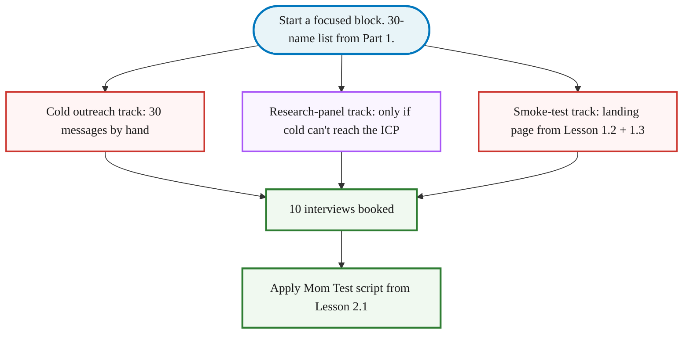

> **Module 2 · Lesson 2.4 · [CORE]** · [From Idea to First Paying Customer](/course/tech-for-non-technical-founders-2026/)
>
> **Input:** a 30-name list from [Part 1: Where to Look](/course/tech-for-non-technical-founders-2026/find-10-people-where-to-look/) - specific people you can name because you read what they posted
>
> **Output:** 10 interview calls booked and the first outreach batch sent - you'll run the calls with the Lesson 2.1 script, then score them in Lesson 2.5
>
> **Progress:** M2 · 4 of 6 · Results so far: question list + 30-name prospect list

> **TL;DR:** Send 30 staggered messages referencing specific posts you read, using a 3-message sequence (Day 0 intro + Day 3 bump + Day 7 close). Reply rate runs 20-30% when each message names a specific post; 1-5% when it doesn't. Plan to extend the list once or twice before all 10 calls are booked.

> **Read [Lesson 2.3 - Where to Look](/course/tech-for-non-technical-founders-2026/find-10-people-where-to-look/) first.** It covers the ICP mapping, reading threads, and building the 30-name list. You need that list before the templates below will work - generic openers collapse to 1-5% reply rates.

> **How this chapter relates to Lesson 2.6:** this chapter recruits 10 fresh interviewees and runs PAST-BEHAVIOR interviews about whether the problem is real. [Lesson 2.6](/course/tech-for-non-technical-founders-2026/clickable-prototype-validation-2-hour-lovable/) takes the 5 strongest-signal interviewees from these 10 and runs a DIFFERENT kind of session - silent observation while they click through a throwaway Lovable prototype. Same recruitment pool; different methodology; sequential, not parallel.

This is interview recruitment, not sales. You're asking for time and insight, not money - different message template, different channels, different reciprocity. Don't use the Lesson 5.7 cold-email script here; it scares interview subjects who don't yet know you have a product.

After this lesson you will be able to: **send outreach that names something the person actually wrote - and book 10 interviews from your 30-name list.**

## What to write so they don't ignore you

Send 30 messages staggered, not in one burst. A handful a day, by hand, beats a single bulk-send. In outreach runs we've coached, reply rates land around 20-30% when each message names a specific post you read - 2-3 booked calls per batch of 30; stack batches until 10 calls are on the calendar.

You can do this from Gmail and a [NeetoCal](https://www.neeto.com/neetocal) booking link. Reply by hand - the back-and-forth is where the interview actually gets booked. Too slow at 6 a day? The [full reference](/course/tech-for-non-technical-founders-2026/reference/find-10-people-full/#slow-path-variant-for-the-part-time-founder) covers Gmail multi-send and the part-time batch-send variant.

### The Day-0 message that has to work

The Day-0 message is the one that has to work - the whole sequence rests on a first line that names something they actually wrote. Copy it verbatim, replace the brackets with their words from when you read where they're complaining in [Part 1](/course/tech-for-non-technical-founders-2026/find-10-people-where-to-look/), not yours:

> Subject: your post about [THEIR_EXACT_WORDS]
>
> Hi [NAME] - you wrote that [ONE SPECIFIC LINE FROM THEIR POST, PARAPHRASED]. I'm researching exactly that problem and would trade 20 minutes for everything you learned the hard way. No pitch, nothing to sell - I don't even have a product yet. Would [DAY] or [DAY] work? Booking link if that's easier: [NEETOCAL LINK]

Full 3-message sequence (Day 0 + Day 3 bump + Day 7 close) - copy it from the [Outreach Sequence Template](/course/tech-for-non-technical-founders-2026/outreach-sequence-template/).

That three-message shape is the whole engine. It collapses to 1-5% with a generic "love to pick your brain" opener - the difference is the reading you did in Part 1 to find named people. The [full reference](/course/tech-for-non-technical-founders-2026/reference/find-10-people-full/) has the bad-first-draft teardown (why each generic line dies) and the LinkedIn-DM variation.

### Why people say yes (or don't)

Teresa Torres names three reasons a stranger turns down an interview ask, and the sequence above already answers two of them ([Product Talk](https://www.producttalk.org/customer-interviews/)):

- **Limited time** - ask for 20 minutes, not "a quick chat" or an open-ended hour. The Day-0 template already does this.
- **Unclear benefit** - say what they get out of it. Talking about their own expertise to someone actually listening is the benefit; the opener leans on it.
- **Fear of the unknown** - people hesitate when they can't picture how the time will be spent. This is the one most first drafts skip. Tell them exactly what happens with one added sentence: *"We'll walk through what happened the last time you [PROBLEM] - no prep, no pitch."* Drop it into the Day-0 message right after the ask.

### Volume targets

Work through the 30-name list first, then extend it with Part 1's second-degree searches until 10 interviews are booked - plan on 50-100 messages total. Target a reply rate of 20% or higher. Under 10% means your opener is too generic or you're in the wrong channel - rewrite the Day-0 message before sending more. 10-20% is workable: let the sequence run and tighten the subject line on the next batch. Of the replies who say yes, expect roughly half or more to actually show. If your show rate drops below 50%, add a 24-hour reminder message and confirm the meeting time the day before.

## Three tracks to 10 booked calls

Cold outreach is the main track. Two others run alongside it when they fit:

- **Research panel** - if your ICP can't be reached cold (a CFO at a regulated bank, an oncology nurse), a paid panel like [User Interviews](https://userinterviews.com) or [Respondent](https://respondent.io) books screened interviewees for a few hundred dollars. Use it only when replies run thin.
- **Smoke-test landing page** - the page from [Lesson 1.4](/course/tech-for-non-technical-founders-2026/smoke-test-landing-page-7-day-demand-test/) doubles as your warmest opener: *"You signed up for the waitlist on [PAGE] last Tuesday - up for a 20-minute call?"*

Both tracks, the parallel-run logic, and the part-time founder's batch-send variant are in the [full reference](/course/tech-for-non-technical-founders-2026/reference/find-10-people-full/).

> **Done:** 10 interview calls are booked on your calendar and you have sent the first batch of outreach messages.
>
> **You have now:** question list (2.1-2.2) + 30-name list (2.3) + 10 booked interviews (2.4). The problem itself is still unvalidated - the interviews you run next test it.
>
> **Next:** return to [2.1 · The Mom Test](/course/tech-for-non-technical-founders-2026/mom-test-ask-about-past-not-future/) to run the interviews using the 5-question script, then move to [Mom Test Synthesis](/course/tech-for-non-technical-founders-2026/mom-test-synthesis-build-pivot-kill/) to score the transcripts. The [full reference](/course/tech-for-non-technical-founders-2026/reference/find-10-people-full/#what-happens-after-the-10-calls-are-booked) has the complete artifact chain from booked call to validated problem statement.
>
> **If blocked:** If your reply rate is under 10%, your Day-0 subject line is too generic. Rewrite it to reference a specific post you read by that person. If your ICP can't be reached cold, switch to a paid research panel (User Interviews or Respondent).
>
> **Deeper reference:** [Message teardowns, the panel fallback, the slow-path variant, and the post-booking artifact chain](/course/tech-for-non-technical-founders-2026/reference/find-10-people-full/)

---

*See it in action: [Module 2 walkthrough: Mia interviews ten parents](/course/tech-for-non-technical-founders-2026/module-2-walkthrough-mia/)*

*Built by [JetThoughts](https://jetthoughts.com) as part of the [From Idea to First Paying Customer](/course/tech-for-non-technical-founders-2026/) curriculum.*
</content>
