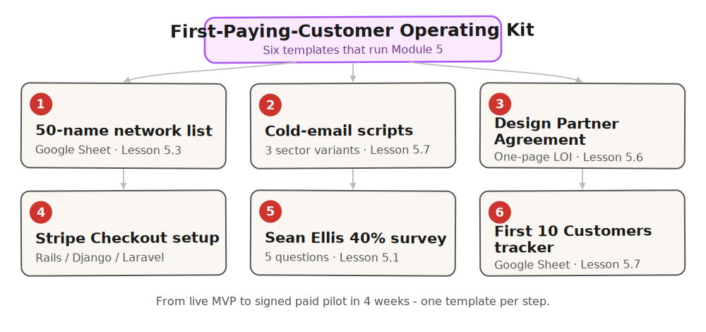

Template companion to [Module 5 of the From Idea to First Paying Customer course](/course/tech-for-non-technical-founders-2026/). Six artifacts that take you from live MVP to signed paid pilot in 4 weeks - the Design Partner Agreement is live below; the other five ship as they are ready.

> **Status: shipping.** The DPA template (component 3) is live below - copy and paste into Google Docs. The other 5 components are described here and shipping as each is ready. There is no email signup; when a template is downloadable, the link appears inline below. Bookmark and check back.

*Prefer paper? <a href="first-paying-customer-operating-kit.pdf" data-course-event="pdf-download">Download the PDF</a> - same content, print-ready.*

*From live MVP to signed paid pilot in 4 weeks - the templates Module 5 runs on.*

## What this kit covers

Module 5 of this course runs seven lessons (5.1-5.7): the Sean Ellis 40% test, channel choice, the personal-network outreach arc, the paid-pilot contract, and the cold-outbound pipeline. The lessons reference these templates. This page hosts them as each one ships. The DPA template is live below (component 3); the remaining 5 are described and shipping next.



## The 6 components

### 1. 50-name network list template (Google Sheets)

The fill-in spreadsheet from [Chapter 5.3](/course/tech-for-non-technical-founders-2026/first-ten-customers-network-list/). Six columns - Name, Company, Role, Bucket, Relationship strength, Last contact date - plus four progress columns for tracking replies and demos. Pre-sorted by bucket: 5 champions on top, then 10 hot, 15 warm, 20 cold. Three blank rows in each bucket for week-2 additions.

In practice: turns a vague "I should reach out to people" instinct into 50 named messages going out by Friday EOD.

### 2. Cold-email scripts (3 variants)

The verbatim 4-line scripts from [Chapter 5.7](/course/tech-for-non-technical-founders-2026/outbound-without-sales-team/). Three sector-specific versions:

- **B2B SaaS Rails context** - the script for founders who built on Rails and are selling to operators in the same space.
- **B2B services** - for fractional CTOs, consultancies, and managed-services founders who sell time rather than license.
- **B2C app** - for direct-to-user products where the Loom + claim-link motion replaces a Calendly call.

Each script comes with three sample subject lines that have cleared 25%+ open rates in 2026 founder cold-outbound runs, plus a 3-message follow-up cadence (day 0, day 4, day 11).

Why it matters: removes the "what do I say in the email" friction so you spend 60-90 seconds per name on personalization, not 20 minutes.

### 3. Design Partner Agreement template (one-page LOI + paid pilot)

The one-page DPA from [Chapter 5.6](/course/tech-for-non-technical-founders-2026/paid-pilot-charge-before-ship/). Six sections plus signature block. Plain English, mutual-edit document, no lawyer required for v1. Comes in three formats: Google Docs (default), PDF (for customers who want to print), DocuSign-import (for customers who want to e-sign with audit trail).

Two annotated examples: a $1,500 B2B SaaS pilot DPA and a $5,000 B2B services pilot DPA, both based on real (anonymized) 2026 founder deals.

The outcome: makes the "we run paid pilots" conversation a 15-second handoff instead of a three-week back-and-forth.

**Copy-pasteable DPA template - copy into Google Docs, fill the [BLANKS], send:**

```text
DESIGN PARTNER AGREEMENT

Between: [Your Company Name] ("Company") and [Customer Company Name] ("Design Partner")
Date: [YYYY-MM-DD]

1. SCOPE OF PILOT
The Company will deliver the following outcomes during the pilot period:
  1. [Outcome 1 - measurable, e.g. "Reduce weekly report prep from 3 hours to 30 minutes"]
  2. [Outcome 2]
  3. [Outcome 3]
Specific use cases covered: [Use case 1], [Use case 2].
Anything outside this list is out of scope until year-one conversion.

2. DURATION + DATES
Start date: [YYYY-MM-DD]
End date: [YYYY-MM-DD] (6-8 weeks)
Weekly Friday demo at [time] [timezone]. 15 minutes. Loom or live screenshare.

3. PILOT FEE + DEPOSIT
One-time deposit: $[500-6,000] (10-30% of year-one ACV).
Paid via Stripe before pilot kickoff. Credited dollar-for-dollar toward year-one invoice on conversion.
If Design Partner cancels before week 4: deposit forfeited.
If Company cancels for any reason: 100% refund within 14 days.

4. SUCCESS CRITERIA
The pilot is successful if 2 of 3 criteria are met by [end date]:
  1. [Measurable criterion 1 - e.g. "Report prep time reduced to <=30 min/week, verified in Friday demo"]
  2. [Measurable criterion 2]
  3. [Measurable criterion 3]
If 2+ criteria met: year-one contract auto-converts unless Design Partner opts out in writing within 7 days.
If <2 criteria met: both parties walk. Company retains deposit as paid consideration for pilot work.

5. CONVERSION TERMS
Year-one price: $[amount] / [month or year]
Billing: [monthly / annual]
Conversion: auto-convert at pilot end unless Design Partner opts out in writing.
Post year-one: 30-day written notice to cancel.

6. DATA, IP, TERMINATION
Design Partner keeps their data. Company keeps the product IP.
Either party may exit at 30 days written notice during pilot.
Design Partner's data remains exportable for 90 days after termination.

SIGNED:

_________________________  Date: __________
[Your Name], [Your Company]

_________________________  Date: __________
[Champion Name], [Customer Company]
```

### 4. Stripe Checkout setup checklist (Rails / Django / Laravel)

Five steps to a working Stripe payment link, no engineer required. Plus optional Rails / Django / Laravel snippets for founders who want to wire deposits back into their app after the first pilot ships.

The Rails snippet uses `Stripe::Checkout::Session.create` from the official `stripe` Ruby gem. The Django snippet uses `stripe.checkout.Session.create` from `stripe-python`. The Laravel snippet uses `Stripe\Checkout\Session::create()` from `stripe/stripe-php`. All three produce the same hosted checkout URL Stripe Payment Links produces; the difference is whether the deposit row gets logged in your app database in real time or you import the CSV at the end of the month.

What it does: 15-minute payment-link setup so the first deposit arrives Wednesday, not three weeks after kickoff.

### 5. Sean Ellis 40% survey template (5 questions, Typeform-import ready)

The exact 5 questions from [Chapter 5.1](/course/tech-for-non-technical-founders-2026/must-have-segment-pmf-test/), in three importable formats:

- **Typeform JSON** - drag-and-drop into a new Typeform.
- **Tally.so spec** - paste into Tally's import flow.
- **Google Forms** - copy the question list into a new Google Form (Forms does not support import, but the template is short).

Plus a one-tab Google Sheet that computes per-segment must-have % from your CSV export. Pivot the Q1 column by the Q5 segment column and the per-segment number appears in cell B2.

Result: 24 hours from "I should run the test" to a scored result you can act on.

### 6. The "First 10 Customers" Google Sheet tracker

The Google Sheet from [Chapter 5.7](/course/tech-for-non-technical-founders-2026/outbound-without-sales-team/). Pre-filled columns - Name, Company, Bucket, Loom sent, Reply, Demo, DPA sent, Deposit - with color-coded bucket pills (champion / hot / warm / cold) and date stamps on every progress column. Filters: "Replied this week," "Demo this week," "Pilot landed this month."


The payoff: turns Friday afternoon into a 10-minute "what shipped this week" review instead of a 90-minute scroll through Gmail.

### Bonus: the pilot kickoff call agenda (60-minute template)

The Stripe deposit cleared on Friday. The pilot starts Monday. Your customer is asking "so what happens next?" - and the course's [Charge Before You Ship](/course/tech-for-non-technical-founders-2026/paid-pilot-charge-before-ship/) chapter taught you how to get to the deposit, not what to run after it. This is the 60-minute kickoff call that turns a deposit into an operating pilot:

| Minute | Section | What to cover | Output |
|--------|---------|---------------|--------|
| **0-5** | Introductions | Founder + 1-2 customer stakeholders by name; one-line each on what each person wants from the pilot (champion's measurable win + power-user's daily-job-to-be-done) | Each name + job-to-be-done in your Notion doc |
| **5-15** | Success criteria recap from the DPA | Read aloud the 1-3 success criteria you wrote into the Design Partner Agreement. Confirm the customer still agrees with them this week. Ask: "If we hit these by Friday week 4, do you renew at the standard price?" | One-line yes/no answer recorded |
| **15-30** | Friday demo cadence | Lock the recurring Friday 15-min demo slot for 4 weeks. You demo what shipped that week against the success criteria. Customer brings one piece of feedback or one new question. Calendar invites sent during the call. | 4 calendar invites on both sides |
| **30-40** | Shared Slack / Discord / WhatsApp channel | Create the channel during the call. Add 2 customer-side stakeholders + you. Standing rule: bug reports go in the channel, not email. Channel name: `pilot-[customer-name]`. | Channel live + invite link shared |
| **40-50** | Single point of contact + escalation | Identify the one person on each side who owns "is this pilot on track?" Customer side is usually the champion who signed the DPA, not their CTO. Your side is you. Escalation path: if the champion is unreachable for 7 days, you escalate to who? Document. | Escalation tree in Notion |
| **50-60** | Week 1 commitment + go/no-go gate naming | What ships this week (1-3 specific things, not a roadmap). When the go/no-go gate runs (end of week 4, by default - the [DPA template](/course/tech-for-non-technical-founders-2026/paid-pilot-charge-before-ship/) covers this). What "go" means (renew at standard price) and what "no-go" means (refund or graceful exit, no hard feelings, written reference from the customer). | Week 1 commitment + go/no-go date on both calendars |

The trap to avoid: skipping the kickoff and treating the deposit as the end-state. The deposit clears, both sides assume the other knows what happens Monday, and 14 days later the champion is asking "have you started yet?" while you are asking "have they used the tool yet?" - 14 days lost. The 60-minute kickoff is the cheapest insurance against that gap.

For your second pilot onwards, re-use this agenda as a Notion template - 90% of the call is identical across customers; only the success criteria + stakeholders change. The Friday demo cadence is the single biggest churn-prevention move you can make in the first 4 weeks: if your customer sees something new every Friday they are in for the long run, even if you ship small.

## How to use the kit

The kit runs Monday-to-Friday for the four weeks of Module 5. The sequence:

**Week 1 (must-have segment).** Run the Sean Ellis survey (template 5). Compute per-segment must-have %. Pick your target segment.

**Week 2 (personal network).** Fill the 50-name template (template 1). Record Loom. Send champion + hot Monday, warm Tuesday, cold Thursday.

**Week 3 (paid pilot).** Send DPA (template 3) and Stripe link (template 4) to 1-2 warm leads who agreed to demos. Bank first deposit.

**Week 4 (cold outbound).** Filter 30 prospects in Apollo or Sales Navigator. Personalize 60-90 seconds each. Send the script (template 2). Track in the tracker (template 6).

By Friday of week 4, you should have: a segment-isolated persona doc, 50 sent messages with 30+% reply rate, 1-2 signed paid pilots, and 30 cold-outbound prospects with 3-5 booked demos for week 5.

## What this kit is not

The kit is not a substitute for a sales course or a CRM. It will not teach the conversational mechanics of objection-handling, so if you have never run a customer call, read [the Mom Test interview script](/course/tech-for-non-technical-founders-2026/mom-test-interview-script/) and run 10 user calls first. It will not track touch counts past the first 30 customers the way HubSpot, Pipedrive, or Salesforce does - past 30, the Sheet breaks and you graduate to a real CRM. It also does not replace the must-have-segment test from [Chapter 5.1](/course/tech-for-non-technical-founders-2026/must-have-segment-pmf-test/) - if your overall must-have % from template 5 is under 25%, your pipeline will fill, the demos will go fine, and conversions will stall at the deposit conversation. Run the 40% test first; download the kit second.

## How to get the kit

The DPA template (component 3) is copy-pasteable inline above. When the remaining templates ship, they will appear in their matching component sections - no mailing list, no funnel, just the file.

## Where this fits in the course

This kit is the template companion to Module 5 of the [From Idea to First Paying Customer](/course/tech-for-non-technical-founders-2026/) course - the module that lands the first paying customer right after the MVP ships. The lessons it serves:

- 5.1 [Your First Customer Is Not a Marketing Problem](/course/tech-for-non-technical-founders-2026/must-have-segment-pmf-test/) - run the Sean Ellis 40% test against your 10-30 MVP users.
- 5.3 [Build Your 50-Name Network List](/course/tech-for-non-technical-founders-2026/first-ten-customers-network-list/) - 50-name list, 4 buckets; the [5.4 outreach message](/course/tech-for-non-technical-founders-2026/first-ten-customers-outreach-message/) and [5.5 send-and-track sequence](/course/tech-for-non-technical-founders-2026/first-ten-customers-send-track/) follow.
- 5.6 [Charge Before You Ship](/course/tech-for-non-technical-founders-2026/paid-pilot-charge-before-ship/) - one-page Design Partner Agreement plus Stripe Checkout setup.
- 5.7 [Going Outbound Without a Sales Team](/course/tech-for-non-technical-founders-2026/outbound-without-sales-team/) - filtered cold outbound for customers 11-20.

Module 5 ends here. The kit ships alongside Module 5 as each artifact is ready.

## Built by

[JetThoughts](https://jetthoughts.com), a Rails-first dev shop that has rescued non-technical founders' codebases for 20 years. We published this course because the same five mistakes kept showing up in the rescue calls. The kit ships open for the same reason.
