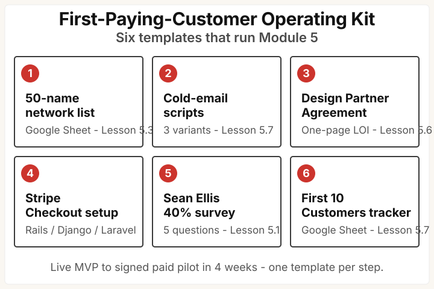
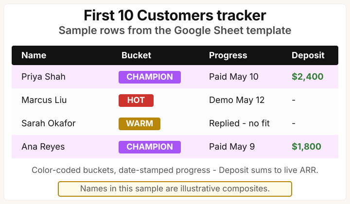

Template companion to [Module 5 of the From Idea to First Paying Customer course](/course/tech-for-non-technical-founders-2026/). Six artifacts that take you from live MVP to signed paid pilot in 4 weeks - each one lives in a Module 5 lesson or its reference page, and this kit is the one-page index.

> **How this works:** every component below links straight to the lesson or reference page that hosts it, copy-pasteable at the source. The DPA deposit clause is inline below as well. There is no email signup and nothing to wait for - just the links.

*Prefer paper? <a href="first-paying-customer-operating-kit.pdf" data-course-event="pdf-download">Download the PDF</a> - same content, print-ready.*

## What this kit covers

Module 5 of this course runs seven lessons (5.1-5.7): the Sean Ellis 40% test, channel choice, the personal-network outreach arc, the paid-pilot contract, and the cold-outbound pipeline. The lessons carry these templates; this page is the index that points at each one.



## The 6 components

<div class="kit-grid">
<div class="module-card">
<span class="module-card__badge">Component 1</span>
<h3>50-name network list template</h3>
<p class="module-card__output">The fill-in Google Sheet from <a href="/course/tech-for-non-technical-founders-2026/first-ten-customers-network-list/">Lesson 5.3</a>. Six columns plus four progress columns, pre-sorted by bucket: 5 champions on top, then 10 hot, 15 warm, 20 cold. Seed it with your 2.4 interviewees, 1.4 waitlist signups, and 2.3 30-name list before hunting LinkedIn.</p>
<p class="module-card__leave"><strong>Payoff:</strong> turns a vague "I should reach out to people" instinct into 50 named messages going out by Friday EOD.</p>
</div>
<div class="module-card">
<span class="module-card__badge">Component 2</span>
<h3>Cold-email scripts (3 variants)</h3>
<p class="module-card__output">The verbatim 4-line scripts in three sector versions: B2B SaaS inline in <a href="/course/tech-for-non-technical-founders-2026/outbound-without-sales-team/">Lesson 5.7</a>, B2B services and B2C in the <a href="/course/tech-for-non-technical-founders-2026/reference/outbound-full/">outbound reference</a>. Each opens with one personalized reference and carries one currency anchor (deposit or beta price). Follow up with non-responders once only.</p>
<p class="module-card__leave"><strong>Payoff:</strong> you spend 60-90 seconds per name on personalization, not 20 minutes deciding what to say.</p>
</div>
<div class="module-card">
<span class="module-card__badge">Component 3</span>
<h3>Design Partner Agreement template</h3>
<p class="module-card__output">The one-page DPA from <a href="/course/tech-for-non-technical-founders-2026/paid-pilot-charge-before-ship/#dpa-template">Lesson 5.6</a> - six sections plus signature block, plain English, no lawyer required for v1. Typical fills: $1,500 deposit for a B2B SaaS pilot, $5,000 for a B2B services pilot - both inside the 10-30% of year-one ACV band. The clause that carries the pilot, the deposit, is inline just below this grid.</p>
<p class="module-card__leave"><strong>Payoff:</strong> makes the "we run paid pilots" conversation a 15-second handoff instead of a three-week back-and-forth.</p>
</div>
<div class="module-card">
<span class="module-card__badge">Component 4</span>
<h3>Stripe Checkout setup checklist</h3>
<p class="module-card__output">Five steps to a working Stripe payment link, no engineer required - the setup walk lives in <a href="/course/tech-for-non-technical-founders-2026/paid-pilot-charge-before-ship/">Lesson 5.6</a> with the framework detail in the <a href="/course/tech-for-non-technical-founders-2026/reference/paid-pilot-full/">paid-pilot reference</a>. Optional Rails / Django / Laravel snippets wire deposits into your app database after the first pilot ships.</p>
<p class="module-card__leave"><strong>Payoff:</strong> 15-minute payment-link setup so the first deposit arrives Wednesday, not three weeks after kickoff.</p>
</div>
<div class="module-card">
<span class="module-card__badge">Component 5</span>
<h3>Sean Ellis 40% survey template</h3>
<p class="module-card__output">The exact 5 questions, verbatim, in <a href="/course/tech-for-non-technical-founders-2026/must-have-segment-pmf-test/">Lesson 5.1</a> - type them into Typeform, Tally, or a Google Form. The CSV scoring walk, including the per-segment must-have % formula, is in the <a href="/course/tech-for-non-technical-founders-2026/reference/must-have-survey-full/">survey reference</a>: pivot the Q1 column by the Q5 segment column and the per-segment number appears.</p>
<p class="module-card__leave"><strong>Payoff:</strong> 24 hours from "I should run the test" to a scored result you can act on.</p>
</div>
<div class="module-card">
<span class="module-card__badge">Component 6</span>
<h3>The "First 10 Customers" tracker</h3>
<p class="module-card__output">The Google Sheet tracker from <a href="/course/tech-for-non-technical-founders-2026/outbound-without-sales-team/">Lesson 5.7</a> - columns for Name, Company, Bucket, Loom sent, Reply, Demo, DPA sent, Deposit, with color-coded bucket pills and filters like "Replied this week" and "Pilot landed this month."</p>

<p class="module-card__leave"><strong>Payoff:</strong> turns Friday afternoon into a 10-minute "what shipped this week" review instead of a 90-minute scroll through Gmail.</p>
</div>
</div>

The deposit clause from component 3, verbatim - copy it into Google Docs and apply the $1,500 or $5,000 sector fill:

```text
DESIGN PARTNER AGREEMENT

3. PILOT FEE + DEPOSIT
One-time deposit: $[500-6,000] (10-30% of year-one ACV).
Paid via Stripe before pilot kickoff. Credited dollar-for-dollar toward year-one invoice on conversion.
If Design Partner cancels before week 4: deposit forfeited.
```

### Bonus: the pilot kickoff call agenda (60-minute template)

The Stripe deposit cleared on Friday. The pilot starts Monday. Your customer is asking "so what happens next?" - and the course's [Charge Before You Ship](/course/tech-for-non-technical-founders-2026/paid-pilot-charge-before-ship/) lesson taught you how to get to the deposit, not what to run after it. This is the 60-minute kickoff call that turns a deposit into an operating pilot:

| Minute | Section | What to cover | Output |
|--------|---------|---------------|--------|
| **0-5** | Introductions | Founder + 1-2 customer stakeholders by name; one-line each on what each person wants from the pilot (champion's measurable win + power-user's daily-job-to-be-done) | Each name + job-to-be-done in your Notion doc |
| **5-15** | Success criteria recap from the DPA | Read aloud the 1-3 success criteria you wrote into the Design Partner Agreement. Confirm the customer still agrees with them this week. Ask: "If we hit these by Friday week 4, do you renew at the standard price?" | One-line yes/no answer recorded |
| **15-30** | Friday demo cadence | Lock the recurring Friday 15-min demo slot for 4 weeks. You demo what shipped that week against the success criteria. Customer brings one piece of feedback or one new question. Calendar invites sent during the call. | 4 calendar invites on both sides |
| **30-40** | Shared Slack / Discord / WhatsApp channel | Create the channel during the call. Add 2 customer-side stakeholders + you. Standing rule: bug reports go in the channel, not email. Channel name: `pilot-[CUSTOMER_NAME]`. | Channel live + invite link shared |
| **40-50** | Single point of contact + escalation | Identify the one person on each side who owns "is this pilot on track?" Customer side is usually the champion who signed the DPA, not their CTO. Your side is you. Escalation path: if the champion is unreachable for 7 days, you escalate to who? Document. | Escalation tree in Notion |
| **50-60** | Week 1 commitment + go/no-go gate naming | What ships this week (1-3 specific things, not a roadmap). When the go/no-go gate runs (end of week 4, by default - the [DPA template](/course/tech-for-non-technical-founders-2026/paid-pilot-charge-before-ship/) covers this). What "go" means (renew at standard price) and what "no-go" means (refund or graceful exit, no hard feelings, written reference from the customer). | Week 1 commitment + go/no-go date on both calendars |

The trap to avoid: skipping the kickoff and treating the deposit as the end-state. The deposit clears, both sides assume the other knows what happens Monday, and 14 days later the champion is asking "have you started yet?" while you are asking "have they used the tool yet?" - 14 days lost. The 60-minute kickoff is the cheapest insurance against that gap.

For your second pilot onwards, re-use this agenda as a Notion template - 90% of the call is identical across customers; only the success criteria + stakeholders change. The Friday demo cadence is the single biggest churn-prevention move you can make in the first 4 weeks: if your customer sees something new every Friday they are in for the long run, even if you ship small.

## How to run the kit

The kit runs Monday-to-Friday for the four weeks of Module 5. The sequence:

**Week 1 (must-have segment).** Run the Sean Ellis survey (component 5). Compute per-segment must-have %. Pick your target segment.

**Week 2 (personal network).** Fill the 50-name template (component 1), seeding it with your 2.4 interviewees, 1.4 waitlist signups, and 2.3 30-name list first. Record Loom. Send champion + hot Monday, warm Tuesday, cold Thursday.

**Week 3 (paid pilot).** Send DPA (component 3) and Stripe link (component 4) to 1-2 warm leads who agreed to demos. Bank first deposit.

**Week 4 (cold outbound).** Filter 30 prospects in Apollo or Sales Navigator. Personalize 60-90 seconds each. Send the script (component 2). Track in the tracker (component 6).

By Friday of week 4, you should have: a segment-isolated persona doc, 50 sent messages with 30+% reply rate, 1-2 signed paid pilots, and 30 cold-outbound prospects with 3-5 booked demos for week 5.

One boundary before you start: the kit is not a substitute for a sales course or a CRM. It will not teach the conversational mechanics of objection-handling, so if you have never run a customer call, read [the Mom Test interview script](/course/tech-for-non-technical-founders-2026/mom-test-interview-script/) and run 10 user calls first. It will not track touch counts past the first 30 customers the way HubSpot, Pipedrive, or Salesforce does - past 30, the Sheet breaks and you graduate to a real CRM. It also does not replace the must-have-segment test from [Lesson 5.1](/course/tech-for-non-technical-founders-2026/must-have-segment-pmf-test/) - if your overall must-have % from component 5 is under 25%, your pipeline will fill, the demos will go fine, and conversions will stall at the deposit conversation. Run the 40% test first; work the kit second.

---

> **Done:** all four weeks are run and the week-4 outcomes above are in hand - segment picked, 50 messages sent, 1-2 pilots signed, cold batch tracked.
>
> **Next:** the [Going further triggers](#going-further-triggers) below - churn triage, pivot-or-persevere, and hiring, each with a read-this-when trigger.

## Going further triggers

The continuation chapters kick in once you've passed the Module 5 gate. Read each one only when its trigger fires.

**Diagnose what's slowing growth**

| Trigger | Continuation chapter |
|---|---|
| Customers leaving faster than you can replace them | [Churn Triage Before Acquisition](/course/tech-for-non-technical-founders-2026/customers-leaving-churn-triage-not-acquisition/) |
| A key metric flat for 2+ months | [Pivot or Persevere](/course/tech-for-non-technical-founders-2026/pivot-or-persevere-decision-framework/) |
| Hit the self-serve ceiling, time to hire your first engineer | [Hire Track Reference](/course/tech-for-non-technical-founders-2026/hire-track-supplementary-reference/) |

**Working with a dev agency in the AI era**

| Trigger | Continuation chapter |
|---|---|
| Before the discovery call | ["We Use AI" Follow-Up Questions](/course/tech-for-non-technical-founders-2026/agency-uses-ai-follow-up-questions/) |
| Surprise AI tokens on the invoice | [AI Token Bill](/course/tech-for-non-technical-founders-2026/ai-token-bill-dev-shop-pass-through-cost/) |
| Worried about AI supply-chain risk in the code they ship | [Slopsquatting](/course/tech-for-non-technical-founders-2026/slopsquatting-ai-supply-chain-attack/) |

**Manage a hired team without writing code**

| Trigger | Continuation chapter |
|---|---|
| Need a structure for who reports to whom | [Engineering Org Chart](/course/tech-for-non-technical-founders-2026/engineering-org-chart-non-technical-founder/) |
| Want a weekly heartbeat to confirm something shipped | [Friday Demo Rule](/course/tech-for-non-technical-founders-2026/friday-demo-rule-founder-progress/) |
| Want a 3-question standup that catches problems early | [Three Standup Questions](/course/tech-for-non-technical-founders-2026/three-questions-turn-standup-into-proof/) |
| Need a plain-English weekly report from the team | [Weekly Dev Report](/course/tech-for-non-technical-founders-2026/weekly-dev-report-template-founders/) |

## Built by

[JetThoughts](https://jetthoughts.com), a Rails-first dev shop that has built alongside non-technical founders for 20 years. We published this course because the same five mistakes kept showing up in first calls with founders. The kit ships open for the same reason.

*If this course saved you from building something nobody wanted, send it to a founder friend.*
