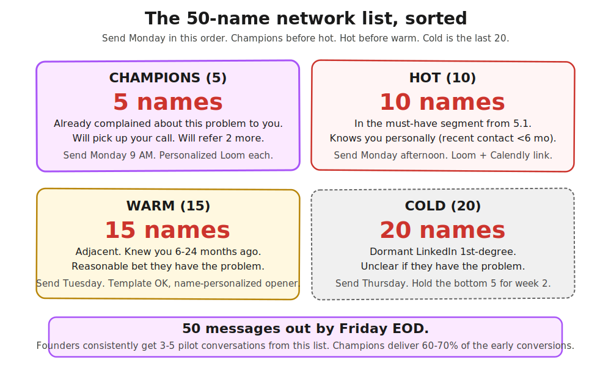

> **Module 5 · Lesson 5.3a · [CORE]** · [From Idea to First Paying Customer](/course/tech-for-non-technical-founders-2026/)
>
> **Input:** must-have-user persona + 1 named segment from [Chapter 5.1](/course/tech-for-non-technical-founders-2026/must-have-segment-pmf-test/)
>
> **Output:** 50 names sorted into 4 outreach buckets
>
> **Progress:** M5 · 3a of 7 · Results so far: must-have segment + channel commitment

---

Sixty percent of the fastest-growing B2B startups got their first 10 customers from people who already knew the founder. Most founders skip this because it feels like begging. It's not. It's the highest-probability first sale you'll ever make.

After this lesson you will be able to: **sort 50 names into 4 outreach buckets so you know exactly who to message first.**

---

In 2021, Lenny Rachitsky asked 21 of the fastest-growing B2B companies (Figma, Stripe, Slack, Notion) where their first 10 customers came from. [The answer](https://www.lennysnewsletter.com/p/how-todays-fastest-growing-b2b-businesses): ~60% from personal network, ~35% from cold outbound, only 5% from inbound or launch events.

You are not asking friends to buy. You are asking them to be first to try something that solves a problem they already have, at a steep discount, while you fix the rough edges they catch.

Open a Google Sheet. Six columns: Name, Company, Role, Bucket, Relationship strength, Last contact date. Fill 50 rows in one sitting before you send anything.

| Bucket | How many | Definition |
|---|---|---|
| Champions | 5 | Already complained to you about this exact problem. Will pick up your call. |
| Hot | 10 | In your must-have segment from [5.1](/course/tech-for-non-technical-founders-2026/must-have-segment-pmf-test/). Knows you personally. Last contact under 6 months. |
| Warm | 15 | Adjacent. Knew you 6-24 months ago. Reasonable bet they have the problem. |
| Cold | 20 | Dormant LinkedIn 1st-degree. Unclear if they have the problem. |

> **First, count your network.** Filter your 1st-degree LinkedIn connections by your must-have segment from Ch 5.1 (title + company size + industry).
>
> | Count | What this means | Your path |
> |---|---|---|
> | **30+** | Standard warm motion works. | Continue below. |
> | **15-29** | Reduced warm motion. Build smaller buckets: 2 champions + 5 hot + 8 warm + 5 cold. You'll need cold outbound ([Ch 5.5](/course/tech-for-non-technical-founders-2026/outbound-without-sales-team/)) in parallel. |
> | **Under 15** | Your network doesn't contain the ICP segment. | Skip to [Ch 5.5](/course/tech-for-non-technical-founders-2026/outbound-without-sales-team/) cold outbound. |

---

> **Build:**
>
> 1. Open LinkedIn. Filter 1st-degree connections by your must-have segment criteria.
> 2. Export the filtered list with [LinkedIn's data export](https://www.linkedin.com/help/linkedin/answer/a566336) (free, takes 24 hours; you can use yesterday's).
> 3. Cross-reference your phone contacts, email inbox, and last three jobs' Slack workspaces if you still have access.
> 4. Sort every name into one of the 4 buckets. Champions first. If you can't name 5 people who complained to you about this problem in the last 12 months, re-read your verbatim Q2-Q3 quotes from [5.1](/course/tech-for-non-technical-founders-2026/must-have-segment-pmf-test/).
> 5. **✅ Success check:** 50 names sorted across all 4 buckets, champions row fully filled.

---

**If this fails: your network is under 15 names after filtering.** **Why:** your must-have segment isn't represented in your professional network. **Fix:** skip to [Ch 5.5 cold outbound](/course/tech-for-non-technical-founders-2026/outbound-without-sales-team/). Use community fallbacks (Indie Hackers, sector Slack, Reddit) as warm-cold hybrid messages.

---

Count your champions out loud. That's the number of people who've already told you the problem is real, before you wrote a line of code.

---

> **Done:** 50 names sorted into 4 buckets, champions identified.
>
> **You have now:** must-have segment (5.1) + channel commitment (5.2) + sorted 50-name list (5.3a). The message is next.
>
> **Next:** [5.3b · Write the Outreach Message](/course/tech-for-non-technical-founders-2026/first-ten-customers-outreach-message/) - turns your bucket list into 4 message templates with a recorded Loom.
>
> **If blocked:** see "If this fails" above.

---

*Built by [JetThoughts](https://jetthoughts.com) as part of the [From Idea to First Paying Customer](/course/tech-for-non-technical-founders-2026/) free curriculum.*
