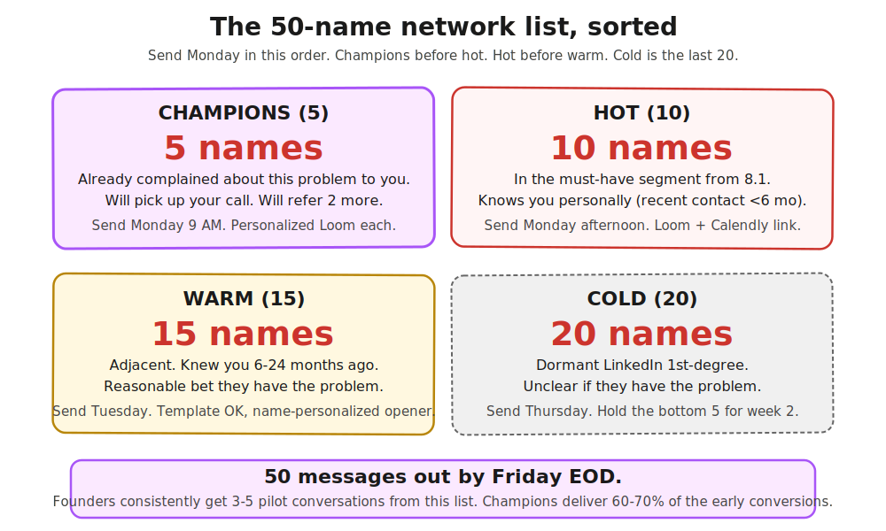

> **Module 5 · Step 3 of 5** · [From Idea to First Paying Customer](/course/tech-for-non-technical-founders-2026/)
>
> **Input:** must-have-user persona + 1 named segment from [Chapter 5.1](/course/tech-for-non-technical-founders-2026/must-have-segment-pmf-test/)
>
> **Output:** 50 personalized outreach messages sent, with replies tracked in a spreadsheet

> **TL;DR:** Sixty percent of the fastest-growing B2B startups got their first 10 customers from their personal network. Build a 50-name list, sort into four buckets, send personalized messages with a 90-second Loom.

In 2021, Lenny Rachitsky asked 21 of the fastest-growing B2B companies a simple question: where did your first 10 customers come from? The list was not modest - Figma, Stripe, Slack, Airtable, Shopify, Notion, Front, Loom, and thirteen others at similar scale.

He published the answers in [a piece](https://www.lennysnewsletter.com/p/how-todays-fastest-growing-b2b-businesses) every non-technical founder should read before the first ad runs. The headline number: roughly 60% of those first customers came from the founder's personal network, around 35% from filtered cold outbound, and only 5% from inbound, press, or launch events.

> **Important: Your warm network is for SALES, not for VALIDATION.**
>
> This chapter is about converting people who already know you into your first PAID PILOT. That is a sales motion, and the warm-network approach is the right move for it.
>
> This chapter is NOT a substitute for the Mom Test interviews in [Module 2](/course/tech-for-non-technical-founders-2026/mom-test-ask-about-past-not-future/). Friends, family, and other founders will tell you your idea is great because they are being polite - that is the founder-to-founder echo chamber, and it produces false confidence, not real signal. A true demand signal only arrives when a cold stranger describes the problem in their own words and pays money.
>
> If you have not yet run your 10 Mom Test interviews with people who do NOT know you, do that first ([Chapter 2.3a · Where to Look](/course/tech-for-non-technical-founders-2026/find-10-people-where-to-look/) builds the list, [2.3b · What to Say](/course/tech-for-non-technical-founders-2026/find-10-people-with-problem-outreach-2026/) sends the messages). Come back to this chapter when you are ready to SELL, not to validate.

The instinct of the founder out of a dev-shop burn is to skip the 60%. Asking friends to buy feels biased and asking former colleagues feels like cheating, so the voice in your head says real customers come from paid traffic to a clean landing page.

That voice is the same one that told you the MVP would convert at 0.4%. The first 10 customers come from existing trust, and the people most willing to act on that trust are the people who already know you well enough to take a call this week.

This chapter is how you build the list and send the messages.

## Why this is the right move, even if it feels wrong

The objection comes up in every founder call: "I do not want to ask friends. It feels like begging."

You are not asking them to buy. You are asking them to be first to try something that solves a problem they already have, at a steep discount, while you fix the rough edges they catch. That is a favor your network owes you about as much as you owe them when they ask for an intro.

The trade is your time and a refundable deposit against a tool that will save them hours from the first week. The people who have the problem take the trade; the people who do not have it were never your customer, so you cut bait fast and move to the next name.

Two founders we spoke with after stalled builds both closed their first three customers from this exact motion. The first - a recruitment-SaaS founder - had eight names in her phone she had not messaged in a year. Three of those names converted in the first two weeks.

The second - a B2B services founder - watched a former Y Combinator batchmate post about her tool's exact problem on LinkedIn and did not respond, because she was waiting on her landing-page redesign to be perfect. Both lost months of revenue they could have had if they had picked up the phone the day the lead surfaced.

> **First: count your actually-applicable names. Then pick a path.**
>
> Open LinkedIn. Filter your 1st-degree connections by your must-have segment from Ch 5.1 (title + company size + industry). Count what comes back.
>
> | Count | What this means | Your path |
> |---|---|---|
> | **30+** | Standard warm motion works. Build the 50-name list as described below. | Continue with the 4-bucket structure. |
> | **15-29** | Reduced warm motion. Build buckets at smaller sizes: 2 champions + 5 hot + 8 warm + 5 cold. Expected yield: 4-7 replies, 1-2 demos, 0-1 paid pilot. Warm motion alone will not close your first customer; you will need cold outbound (Ch 5.5) in parallel, not sequential. | Build the reduced list AND start the M5.5 cold prep on the same week. |
> | **Under 15** | Your professional network does not yet contain the ICP segment. Warm motion will not produce your first customer. | Skip the warm-bucket structure entirely. Go directly to Ch 5.5 cold outbound. Use the small-list community fallbacks below (YC batch, Indie Hackers, sector Slack) to seed initial warm-cold messages. |
>
> The 50-name structure below is the **best-case path**, not the universal path. An idea-stage founder with a generalist network typically lands in the 15-29 band; budget two months of cold outbound on top of the warm motion to land your first customer in that scenario.

## The 50-name list: 4 buckets

> **Honest calendar for the full send sequence.** The 50-name LIST is one sitting (60-90 min once your LinkedIn export arrives, which itself takes 24 hours). The full SEND sequence (Loom recording + champion + hot + warm + cold messages staggered across days) is 8-12 hours of active effort spread across 7-10 calendar days. Plan two evenings for the list-build and four-to-five evenings for the staggered sends. The chapter framing of "one sitting" applies to the list-building step, not the entire outreach round.

Open a Google Sheet. Six columns: Name, Company, Role, Bucket, Relationship strength, Last contact date. Fill 50 rows in one sitting before you send anything.

| Bucket | How many | Definition |
|---|---|---|
| Champions | 5 | Already complained to you about this exact problem. Will pick up your call. |
| Hot | 10 | In the must-have segment from [Chapter 5.1](/course/tech-for-non-technical-founders-2026/must-have-segment-pmf-test/). Knows you personally. Recent contact under 6 months. |
| Warm | 15 | Adjacent. Knew you 6-24 months ago. Reasonable bet they have the problem. |
| Cold | 20 | Dormant LinkedIn 1st-degree. Unclear if they have the problem. |

**Where to find the names.** Open LinkedIn. Filter your 1st-degree connections by the criteria that define your must-have segment from [Chapter 5.1](/course/tech-for-non-technical-founders-2026/must-have-segment-pmf-test/). For a B2B-marketer must-have segment, filter on title (Marketing, Growth, Demand Gen, RevOps), company size (50-500 employees), and industry (one vertical first, expand later).

Export the filtered list with [LinkedIn's data export](https://www.linkedin.com/help/linkedin/answer/a566336) - free for everyone, takes 24 hours but you can use yesterday's. Cross-reference your phone contacts, your email inbox, your last three jobs' Slack workspaces if you still have access, and your YC or accelerator batchmate list if you have one.

The 50 names will assemble faster than you expect once the segment filter is set.

**Champions deserve extra thought.** Five champions is a high bar. If you cannot name five people who have complained to you about this exact problem in the last twelve months, you may not have a must-have segment at all - go back and re-read your verbatim Q2-Q3 quotes from the [Chapter 5.1 survey](/course/tech-for-non-technical-founders-2026/must-have-segment-pmf-test/). The champions are the people who said those words to you in real life before the survey existed.

## The outreach template (Loom + Calendly + paid-pilot teaser)

Champions and hot get personalized messages with a recorded Loom. Warm and cold get a name-personalized template. The structure is the same for all four buckets - what changes is the opening line and how much you personalize from your shared history.

### The 4-part message

**Part 1: Earn the open with a specific reference.**

The opener changes by bucket. Pull the reference from whatever shared history is freshest:

| Bucket | Opener template |
|---|---|
| Champions | "Hey [name], you mentioned [the exact thing they said] back in [month]. Still happening?" |
| Hot | "Hey [name], just saw [a specific thing they posted, shipped, or said recently]. Have a question about [the problem]." |
| Warm | "Hey [name], have not caught up since [the last specific touchpoint]. Working on something I think you might have a take on." |
| Cold | "Hey [name], [a true one-line reference - 'we were both in the Acme batch,' 'you commented on my LinkedIn post about X']. If no real reference exists, move them out of network outreach and into [Chapter 5.5 cold outbound](/course/tech-for-non-technical-founders-2026/outbound-without-sales-team/), not here." |

**Part 2: One line on the problem, in their language.**

Use the verbatim Q3 answers from your [Chapter 5.1 survey](/course/tech-for-non-technical-founders-2026/must-have-segment-pmf-test/). "I am building a tool that lets B2B marketers run an end-to-end attribution model without an analyst." If the words are not theirs, swap until they are.

**Part 3: A Loom video, not a paragraph.**

Record one 90-second Loom before you send. A free Loom account gives you 25 free videos. The Loom shows your product in 60 seconds and you on camera in the other 30. Skip the Loom and write a paragraph instead and you get half the response rate, because the recipient needs to see both your face and the product working in the same 90 seconds.

> **Loom script source: your Ch 5.1 verbatims.** Lines 2-3 of your Loom should NOT be your own marketing voice - they should be the three Q2-Q3 verbatim quotes you exported from the [Ch 5.1 must-have segment test](/course/tech-for-non-technical-founders-2026/must-have-segment-pmf-test/) Google Doc. Read those quotes aloud, then point at the product feature that addresses the pain they describe. Recording in the founder's voice is the failure mode Ch 5.1 was designed to prevent; the Loom is the highest-leverage place to use the verbatims you already have.

**Part 4: A specific ask - 15 minutes, paid pilot teaser.**"15 minutes to walk you through it and see if it solves the [problem]? Open to a paid pilot if it does. Calendly: [link]."

The "paid pilot" hint is load-bearing. You are flagging that this is not a free favor and not a free trial. The full mechanic of the paid pilot is the subject of [Chapter 5.4](/course/tech-for-non-technical-founders-2026/paid-pilot-charge-before-ship/) - keep the teaser short here.

**Total length:** 5-7 sentences. Anything longer and the recipient skims and forgets.

## The send sequence

The sequence in one glance:

1. **Step 1** - List 50 names, sort into the 4 buckets.
2. **Step 2** - Record the 90-second Loom.
3. **Step 3** - Send the 5 champion messages and the 10 hot messages.
4. **Step 4** - Send the 15 warm messages a day or two later.
5. **Step 5** - Send the 20 cold messages once the first replies are in.
6. **Step 6** - Review replies, book demos for the following stretch.

You will hear back from 15-25 of the 50 messages once replies settle. That is a 30-50% response rate on a properly built personal-network list, and it is the highest response rate you will ever see again as a founder.

Use it well.

> **Slow-path variant for evenings-only founders** (day job + family time): the staggered cadence assumes daytime availability you do not have. One-evening alternative: in a single 2-hour block, spend the first 30 minutes sorting 50 names into the 4 buckets and recording the Loom (you can re-use the same Loom for all 50). Spend the next 90 minutes personalizing each message's first line (their name + the specific connection or shared interest) and sending all 50 in one batch using LinkedIn DM or Gmail with a templated body. You lose the response-rate uplift the staggered send produces (~30-50% becomes ~20-35%) but you complete the whole sequence in one evening instead of needing several separate workday windows. Book demos for evenings or weekend mornings - your respondents will work with your calendar if your first message was specific enough.

**Track replies in the same Sheet.** Add four columns to the right: Reply received (date), Reply sentiment (yes/maybe/no/silent), Demo booked (date), Pilot proposed (yes/no). When the demo books, paste the Calendly confirmation date. When the pilot conversation happens, advance the row to [Chapter 5.4](/course/tech-for-non-technical-founders-2026/paid-pilot-charge-before-ship/).

## What the "no" replies actually tell you

A "no" from a champion is the most expensive single piece of feedback you will get all year. Champions said the problem out loud, you built the thing, and they passed. Always reply with a single question: "Help me understand - what changed since [the original conversation]?"

| Pattern | Question to ask | Fix action |
|---|---|---|
| **The problem moved** | "Did you solve this another way?" | They built a workaround (spreadsheet, internal tool, hire). Your product was out-paced. Re-read your [Chapter 5.1 segment-isolation results](/course/tech-for-non-technical-founders-2026/must-have-segment-pmf-test/). Check if this generalizes to your segment. |
| **The buying motion is wrong** | "Who would make this decision?" | They have the problem, but it is not their call. The CFO, CTO, or VP buys it. Get the introduction. Your champion becomes a referrer. |
| **You missed the brief** | "What did I over-solve or under-solve?" | What you built does not match what they remembered complaining about. This is the most painful answer and the highest payoff: edit your product, verbatim quotes, and persona accordingly. |

A "no" from cold is a non-event. They were never the right name. Move on.

## The hot bucket is where the conversions live

> Most of your booked demos come from champions, but most of your eventual paid pilots come from hot.
> Champions get on the call out of relationship and curiosity. Hot names are still warm but have less context,
> which forces you to articulate the value cleanly. That clean articulation is what closes the rest of your pipeline.
> The hot calls are where you sharpen the pitch you will use for the next 90 customers.

If you have a champion on the call and they say "this would be perfect for [name in hot], do you want an intro," say yes immediately. Champion-routed warm intros convert at 3-4x the cold-warm conversion rate. The cost is one email back to your champion that day.

## When the personal network is genuinely small

Some founders read the bucket structure and panic because their LinkedIn is at 200 connections and their phone has 40 names. The math still works, but the source mix shifts.

| Adjacent source | How it works | Conversion note |
|---|---|---|
| **Your accelerator or YC batchmates** | A YC batchmate list is twice the size of your network and pre-warmed by the shared experience. Slack the batch about your launch. | Higher conversion than cold outbound. Shared experience = faster buy-in. |
| **The community you live in** | Indie Hackers, [r/SaaS](https://www.reddit.com/r/SaaS/), no-code-founders Slack, AI-founders Discord. These are not cold outbound-they are spaces where you have been showing up and building in public for months. | A B2B services founder closed her first paid pilot in 9 days from a single Indie Hackers post about her MVP. |

If neither source applies, skip ahead - your first ten will come from [Chapter 5.5 cold outbound](/course/tech-for-non-technical-founders-2026/outbound-without-sales-team/) and the network outreach in this chapter is a smaller share of the work. The default sequence (network first, cold second) holds when the network is big enough to feed 30+ names. Below that, the order is the same but cold outbound starts sooner.

## What to do next

| Step | Action | Output |
|---|---|---|
| **1** | Open Google Sheet. Six columns: Name, Company, Role, Bucket, Relationship strength, Last contact date. Fill 50 names across the four buckets. | Complete 50-name list sorted by bucket |
| **2** | Record one 90-second Loom showing the product and you on camera. | Single Loom link for all outreach messages |
| **3** | Send the 5 champion messages and the 10 hot messages. Personalized opening for each. Same Loom link for all 15. | 15 outreach messages sent |
| **4** | Send the 15 warm messages. Name-personalized opener, template-personalized body. | 15 additional messages sent |
| **5** | Send the 20 cold messages once early replies are in. Hold the bottom 5 for a later batch to soften the volume. | 20 cold messages sent (15 in this batch, 5 held) |
| **6** | Tally the responses. Book 3-5 demos. Annotate each row with response sentiment and date. | Demo calendar booked; ready for [Chapter 5.4](/course/tech-for-non-technical-founders-2026/paid-pilot-charge-before-ship/) |

The 50-name list template, the Loom outline, and the 4-message template variants (champion / hot / warm / cold) all ship in [the First-Paying-Customer Operating Kit](/course/tech-for-non-technical-founders-2026/first-paying-customer-operating-kit/).

> **When the warm list is "exhausted" and it's time to switch to cold outbound.** Move to [Chapter 5.5](/course/tech-for-non-technical-founders-2026/outbound-without-sales-team/) when ALL three of these are true:
> - All 50 names have been contacted (no "I'll get to the cold bucket later")
> - At least 10 replies received (so you've sampled the warm motion's signal)
> - Fewer than 3 demos booked AFTER at least half the responses are in, OR your reply rate on the last 10 messages has dropped below 10%
>
> Either of the last two triggers means the warm list is mined. If you only meet 2 of 3, hold; the warm motion is still working. If all 3 fire, the network has given what it can - switch.

## Advanced (optional)

> **Scaling the network motion to 100 customers:**
> After you close your first 10 paid pilots from the personal network above,
> layer on the [Y Combinator advice on early sales](https://www.ycombinator.com/library/6g-tactical-advice-for-the-first-sales-hire)
> and [Paul Graham's "Do Things That Don't Scale"](http://paulgraham.com/ds.html).
> The Stripe example in Graham's essay - where the Collison brothers installed the product in person for every early customer -
> matches the relationship logic of this chapter exactly.
> The main path gets you to 10 customers; the advanced version extends that relational rigor to 100.

Your network is not begging-territory. It is the cheapest customer-acquisition motion you will ever run, and the people in it have already told you they have the problem.

## Further reading

- Lenny Rachitsky, [How today's fastest growing B2B businesses found their first ten customers](https://www.lennysnewsletter.com/p/how-todays-fastest-growing-b2b-businesses) - the source for the 60/35/5 breakdown and the company-by-company first-10 source data.
- Lenny Rachitsky, [How to win your first 10 B2B customers](https://www.lennysnewsletter.com/p/how-to-win-your-first-10-b2b-customers) - the 7-step playbook from over a hundred B2B founders, including the must-have-user framing.
- Paul Graham, [Do Things That Don't Scale](http://paulgraham.com/ds.html) - the founding text on early-customer manual recruitment, including the Stripe Collison-brothers installation example.
- Steve Blank, [Customer Validation](https://steveblank.com/2010/04/12/why-startups-need-a-less-stupid-process/) - the academic frame underneath the practical playbook. Validation precedes scale.
- First Round Capital, [The First-Round Sales Library](https://review.firstround.com/from-the-first-edition-of-the-founders-handbook-finding-your-first-customers/) - essays from founders on the first-10 motion, useful for sector-specific context.
- Y Combinator Library, [Tactical advice for the first sales hire](https://www.ycombinator.com/library/6g-tactical-advice-for-the-first-sales-hire) - YC's collection on founder-led sales, including when the relationship motion has to give way to a structured pipeline.

> **Done when:** 50 names are sorted into 4 buckets, your 90-second Loom is recorded, and the first 15 messages (champions + hot) are sent.
>
> **Next click:** [5.4 · Charge Before You Ship: The Paid Pilot Contract](/course/tech-for-non-technical-founders-2026/paid-pilot-charge-before-ship/)
>
> **If blocked:** If your warm network is under 15 names after filtering by your must-have segment, skip to Ch 5.5 cold outbound - your personal network won't produce your first customer. Use community fallbacks (YC batch, Indie Hackers, sector Slack) as warm-cold hybrid messages.

> **Case Study: Tomas & Mia**
>
> **Tomas**: 50-name network list: 5 champions (ex-colleagues who complained about reconciliation for years), 10 hot (controllers from AICPA conferences), 15 warm, 20 cold. Sends Monday. Gets 8 pilot conversations. 5 say yes.
>
> **Mia**: 50-name network list: 5 champions (teacher friends with dyslexic kids), 10 hot (parents from Facebook groups who posted about tutoring), 15 warm, 20 cold. Sends Monday. Gets 12 pilot conversations. 7 say yes.

---

*Built by [JetThoughts](https://jetthoughts.com) as part of the [From Idea to First Paying Customer](/course/tech-for-non-technical-founders-2026/) curriculum.*
