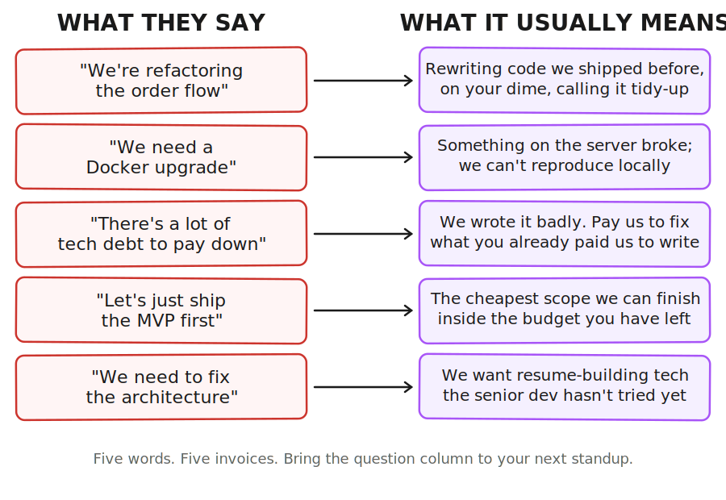
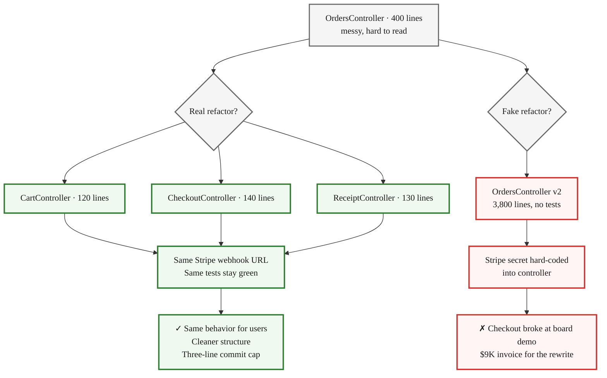
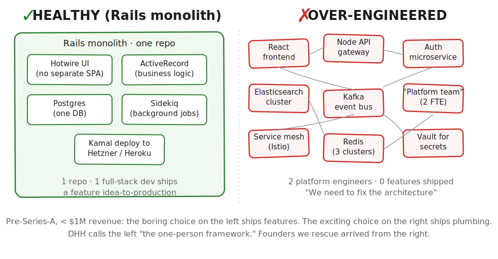

> **Course glossary** · [From Idea to First Paying Customer](/course/tech-for-non-technical-founders-2026/) course.
> Vocabulary the rest of the course assumes you have. Skim once; come back when you hit a word you nodded at.

One founder nodded at the same word for fourteen months. Every Friday her contractor's PM said "we're refactoring the order flow" and she wrote it down. When her new fractional CTO finally read the repo, he came back with one line: nothing new had shipped to production since month three. **"Refactoring" had cost her $51K and a year of runway.** She nodded because the word gave her nothing to push back on - which is exactly what the questions in this glossary hand you.

Non-technical founders often learn engineering vocabulary under pressure, mid-meeting, with a bill on the table. The agency throws a word, the founder nods, the meeting moves on. By the time the founder figures out what the word actually meant, the next sprint is already approved.

Below is the cheat sheet for the five words that hide the most invoices: refactoring, Docker, tech debt, MVP, architecture. For each you get a plain-English definition, the dishonest version your dev shop probably means when they say it, and one question you can ask in your next standup that the BS-version cannot answer.

## Why these five words now

The vibe-coding wave made jargon worse. Agencies now stack three vocabularies on top of each other - the old enterprise one (microservices, Docker, refactoring), the AI one (agents, prompts, RAG, MCP), and the no-code one (workflows, automations, integrations). Founders walk into status meetings and hear words from all three at once. The money is not lost on vocabulary - it is lost when a founder nods at a word the agency is using to mean something else. Veracode's 2025 study found 45% of LLM-generated code shipped at least one exploitable security flaw, and that kind of failure hides perfectly inside the word "refactoring" when nobody asks what was changed.

## The Five Words

### 🔧 1. Refactoring

Changing the structure of code without changing what it does for the user. Martin Fowler, who wrote the book on it, [defines refactoring as a behavior-preserving transformation](https://martinfowler.com/bliki/DefinitionOfRefactoring.html) - same behavior before and after, just in cleaner lines. Inside an agency status call, the word usually means "we are rewriting something we shipped earlier instead of admitting we got it wrong the first time."

> **🔍 BS-detection question:** *"Show me the user-facing thing that worked yesterday and still works today, but is now built on the new code."* A real refactor leaves at least one feature exactly as the user saw it. "We are still wiring it back up" means somebody is rewriting on your dime and calling it a tidy-up.

In Rails terms, a real refactor splits a 400-line `OrdersController` into three smaller controllers while the Stripe webhook still hits the same URL and the test suite stays green. JT caps each refactor commit at [three lines of production code](/blog/refactor-step-tdd-three-line-discipline-ruby/) for that reason. A SaaS founder we picked up in Q4 2025 was billed $9K for a "checkout refactor" that turned out to be one merge commit of 3,800 lines, no tests, and the Stripe webhook secret hard-coded into the controller. The checkout broke on stage at her board demo.

### 🐳 2. Docker

A way to package an app together with the operating-system pieces it needs, so it behaves the same on a developer's laptop, your staging server, and production. The official Docker docs call a container image [a lightweight, standalone, executable package](https://docs.docker.com/get-started/docker-concepts/the-basics/what-is-an-image/) of code, runtime, tools, and settings. Docker is plumbing - useful and invisible when it works, expensive when "Docker work" becomes the headline two weeks running.

Docker shows up in standup the same way every week, but the phrasing tells you whether it is real plumbing or a private cleanup project on your invoice.

> **🔍 BS-detection question:** *"Which feature ships sooner because of this Docker work?"* If the answer is a feature name with a date, it's plumbing doing its job. If the answer is "better infrastructure," ask again next week.

Listen for which side of this table your team lands on:

| Phrase you hear | What it usually means |
|---|---|
| "New developer ran `docker compose up` and shipped a feature day one" | Healthy plumbing - the container is doing its job invisibly |
| "Bumping the Postgres image so the staging migration unblocks" | A named, dated, founder-clickable outcome |
| "Doing Docker work" (week 2 in a row, no clickable thing) | Something on the server broke, they cannot reproduce locally, they are fighting their own setup |
| "We are containerizing the architecture" | Resume-driven plumbing - ask which feature ships sooner because of it |

An EdTech founder we picked up paid $7K for "a Docker upgrade" across six weeks; the git history showed one commit changing a single line in `Dockerfile`. The real work was a Postgres migration that had broken staging the day the upgrade ticket opened. They labelled the sprint "Docker work" because it sounded more like infrastructure than "we shipped a bug."

### 💸 3. Tech debt

Code you shipped fast knowing you would have to come back and fix it. Ward Cunningham, who [coined the metaphor in 1992](https://martinfowler.com/bliki/TechnicalDebt.html), called it "shipping first time code is like going into debt" - useful as long as you pay it back promptly, expensive in compounding interest if you ignore it. From an agency, the term usually means "we wrote the original code badly and now we want you to pay us to fix what you already paid us to write."

> **🔍 BS-detection question:** *"Which specific feature on next quarter's roadmap will be cheaper to ship after this debt is paid down, and by roughly how much?"* Real tech debt has a payoff number attached to a named feature. "It will help with everything" means nobody has measured anything yet.

In Rails terms, healthy tech debt sounds specific: "extracting a `Billing::PlanCalculator` class out of `User` unblocks metered billing in Q3." Unhealthy tech debt sounds like "there is a lot of legacy in this codebase" - a feeling the team is asking you to fund. [LitsLink reports developers spend 42% of their time on technical debt and maintenance](https://litslink.com/blog/cost-of-outsourcing-software-development); the founders we work with rarely see that line on an invoice. They see features taking twice as long as last quarter for no reason anyone can name. JT's [60-day playbook for slow engineering teams](/blog/fixing-slow-engineering-teams-an-extended/) starts by making that line visible.

### 🚀 4. MVP

Eric Ries, who popularised the term in The Lean Startup, defines MVP as [the version of a new product that lets a team collect the maximum amount of validated learning about customers with the least effort](https://leanstartup.co/resources/articles/what-is-an-mvp/). Validated learning is the point - an MVP that nobody uses taught you nothing. Coming from an agency, the term usually means "the cheapest scope we can finish inside the budget you have left, even if it does not test the business question you actually need answered."

The cleanest way to feel the difference is to look at two specs for the same MVP - the one a real product team writes and the one an agency writes when nobody asks Q4. A B2B HealthTech founder we shipped for in Q2 2025 had both on her desk:

**Real MVP spec (one engineer, six working days, $14K):**
- One Rails controller (`OnboardingsController`)
- One Postgres table (`onboardings`)
- One Stripe checkout link
- The business question: do paid design partners come back the second week? (Yes - three of fifteen did.)

**The agency version of the same MVP (six weeks, $58K quoted):**
- Custom admin panel with role-based permissions
- "White-labellable" theme system for future enterprise tenants
- Microservices split: signup service + billing service + notification service
- Two-week "foundations sprint" before any user-facing code
- The business question: never specified - JT covers this exact failure mode in [our Quality Tax post](/blog/quality-tax-ai-mvp-cost/) on AI-built MVPs costing 2-3x the promised savings

If the spec your team handed you reads like the second one:

> **🔍 BS-detection question:** *"What business question will this MVP answer in the first 30 days after we ship, and how will we know we got an answer?"*
>
> That question cannot survive a "white-labellable theme system" on day one.

### 🏗️ 5. Architecture

The big-picture decisions about how the pieces of your app fit together: one big codebase or many small services, what database, what hosting, how the parts talk. Architecture is expensive to change later, which is why agencies love it and founders should be skeptical when it shows up early. From an agency, this often means "we want to use the resume-building tech we have not tried yet, and we will call it a foundational decision so you do not push back" - microservices, Kubernetes, custom event buses, and rewrites in a trendier framework all hide here.

> **🔍 BS-detection question:** *"What are the three simplest architectures we could have picked, and why did we pick this one over them?"* A team that chose well can answer fast. A team that picked because the senior dev wanted to learn it cannot answer - the alternatives never made it into the conversation.

A healthy architecture for a pre-Series-A Rails SaaS is one Rails monolith on Heroku or Hetzner, Postgres, Sidekiq, Hotwire for the UI - one repo, one developer ships a feature end-to-end. DHH calls this the [one-person framework](https://world.hey.com/dhh/the-one-person-framework-711e6318); Basecamp has run on the same shape since 2003. The over-engineered version stacks three Node services, a separate React frontend, an Elasticsearch cluster, a Kafka stream, and a "platform team" of two engineers maintaining plumbing instead of shipping product.

## Idea-stage acronyms cheat sheet

The five words above are dev-shop jargon - vocabulary you'll hit in Modules 4-5 (build and ship). Modules 1-3 (hypothesis, validate, design) have their own acronym soup. Skim the list below once; come back when an unfamiliar acronym shows up in a chapter:

| Acronym | Plain English | Where it shows up |
|---|---|---|
| **ICP** | Ideal Customer Profile - the specific kind of person your hypothesis names | Ch 1.1, 2.3 |
| **PMF** | Product-Market Fit - the survey question "would you be very disappointed if you could no longer use this?" 40%+ "very disappointed" = signal | Ch 5.1 |
| **JTBD** | Jobs To Be Done - what a customer "hires" your product to do (instead of feature list) | Ch 3.1, 3.2 |
| **MRR** / **ARR** | Monthly / Annual Recurring Revenue - what one customer pays per month or year | Ch 1.1, 5.6 |
| **ACV** | Annual Contract Value - what one customer pays in year one (deposit math is 10-30% of ACV) | Ch 5.6 |
| **CAC** / **LTV** | Customer Acquisition Cost / Lifetime Value - what you spend to land one customer vs what they pay you over their lifetime | Ch 5.2, 5.6 |
| **DPA** | Design Partner Agreement - a one-page contract where a customer pays a deposit to test your product as a co-design partner | Ch 5.6 |
| **SOW** | Statement of Work - the contract that defines what an agency is paid to deliver | _index, rescue chapters |
| **PRD** / **Vibe PRD** | Product Requirements Document - the "Vibe" version is a one-pager an AI builder can act on, not a 30-page spec | Ch 3.1 |
| **TAM** / **SAM** / **SOM** | Total / Serviceable / Serviceable-Obtainable Market - investor-pitch math, not builder math | _index pitch sections only |
| **Pixel** | A small JavaScript tracking snippet from an ad platform (Meta/LinkedIn/Reddit) - paste it on your page and the platform learns who converted | Ch 1.3 |
| **NPS** | Net Promoter Score - "how likely are you to recommend us?" 0-10 scale; less useful at idea stage than PMF | Ch 5.1 sidebar |
| **Retention** | What % of users come back next week / next month - the only metric that proves the product solves a real problem | Ch 5.1 |
| **Unit economics** | Revenue per customer minus cost to serve per customer - whether the math works at scale | Ch 1.1 Money lens |
| **Runway** | Months of cash until you must show paying customers or close the company | Ch 4.1 Q3 |
| **SWOT / PESTEL / Porter's Five Forces** | Three classic strategy-school checklists - VenturusAI runs all three on your hypothesis | Ch 1.1 sidebar |
| **Wizard of Oz** | A no-code pattern - customer thinks software is running, but you do the work by hand behind the scenes to test demand before building | Ch 4.3 Concierge MVP |

## What to do tomorrow

Print the five BS-detection questions and bring one to your next standup - whichever word your team uses most. The texture of the answer (specific or evasive) tells you what you need to know in under thirty seconds. Forward this post to your fractional CTO or a developer-friend and ask: "Are these the right five words for me to be skeptical of, given my project?" Their list might swap one - either way, the conversation is the win.

If your team's vocabulary makes you nervous, the next layer of the diagnostic is the [eight red flags checklist](/blog/dev-shop-red-flags-checklist/) and the [vibe-coding signals review](/blog/vibe-coding-crisis-ai-code-debt/) - same diagnostic, sharper edges. Want the same five-question shape applied to your weekly status meeting? See the [SCIPAB six-question script](/blog/scipab-tell-better-business-stories-startup-management/).

## Further reading

- Martin Fowler, [Definition of Refactoring](https://martinfowler.com/bliki/DefinitionOfRefactoring.html) - the canonical source on what refactoring is and is not.
- Ward Cunningham via Martin Fowler, [Technical Debt](https://martinfowler.com/bliki/TechnicalDebt.html) - the original 1992 metaphor.
- Eric Ries via Lean Startup Co., [What Is an MVP?](https://leanstartup.co/resources/articles/what-is-an-mvp/) - the validated-learning framing.
- Docker, [What Is a Container Image?](https://docs.docker.com/get-started/docker-concepts/the-basics/what-is-an-image/) - the official docs definition.
- DHH, [The One Person Framework](https://world.hey.com/dhh/the-one-person-framework-711e6318) - the Rails case for keeping the architecture small.
- Veracode, [GenAI Code Security Report 2025](https://www.veracode.com/blog/genai-code-security-report/) - 45% of LLM-generated code shipped at least one exploitable flaw.
- LitsLink, [Cost of Outsourcing Software Development](https://litslink.com/blog/cost-of-outsourcing-software-development) - 42% of developer time goes to technical debt.

---

**Back to the course:** [From Idea to First Paying Customer](/course/tech-for-non-technical-founders-2026/) - or jump back into the module you came from.
