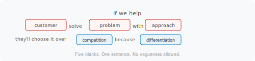

> **Module 1 · Lesson 1.1 · [CORE]** · [From Idea to First Paying Customer](/course/tech-for-non-technical-founders-2026/)
>
> **Input:** a rough idea, an instinct, or something half-built you've been tinkering with
>
> **Output:** your idea rewritten as a one-sentence bet - your strategic advantage stated plainly, your riskiest assumptions exposed as five blanks you'll test against cold strangers (1.2-1.5) and in Module 2's ten interviews
>
> **Progress:** M1 · 1 of 5 · Results so far: none yet - this is the start

---

You've told five people about your idea. They all said "that sounds great" - which told you nothing. This lesson replaces polite nods with a single sentence you can actually test.

After this lesson you will be able to: **write a single sentence about your idea that a stranger reads and either says "that's my problem" or "not me" - instead of "sounds great."**

---

A first-time founder usually treats their strategy as a fact ("parents need this") or as a guess they hope is right. This lesson treats it as a **hypothesis**: a bet written down so it can be proven wrong. Writing the bet as one sentence forces two things onto paper - why anyone would switch to you (your strategic advantage), and the assumptions hiding inside your idea. Each assumption becomes a blank you can test with a small, cheap experiment before you build anything.

A **Founding Hypothesis** is a fill-in-the-blanks sentence (Mad Libs style) from Jake Knapp and John Zeratsky's *Click* (2025):

> *"If we help [customer] solve [problem] with [approach], they'll choose it over [competition] because [differentiation]."*

Five blanks. One sentence - not a deck - because a sentence can't hide vague thinking, and because you'll reuse it everywhere: it feeds your landing-page headline in 1.2 (reshaped into a customer-plus-outcome one-liner) and tells Module 2 who to interview and which problem to ask about (you keep the sentence to yourself in interviews - pitching it contaminates the answers). The discipline is filling all five blanks with specifics, not categories.

Each blank is an assumption, and each assumption has a test waiting for it later in the course:

| Blank | Where it gets tested |
|---|---|
| [customer] + [problem] | Strangers recognize themselves in your headline (1.2), then ten Mom Test interviews confirm the pain (Module 2) |
| [approach] | A clickable prototype in front of 5 interviewees (Module 2) |
| [competition] + [differentiation] | 300 cold strangers convert on your page - or don't (1.4) |
| The whole bet: will they pay? | The Stripe price test (1.5) |

**Why this works:** when the sentence is vague, people nod politely because there's nothing to disagree with; when it's specific, they push back - and the pushback is what you're after:

- ❌ *"We help small businesses save time with automation."* - Nobody can argue with this. Nobody can validate it either.
- ✅ *"If we help solo chiropractors solve insurance-claim resubmission with a one-click resubmit, they pick it over billing services that take 14 days and charge 8% of recovered claims."* - A chiropractor either says "I dealt with this last Tuesday" or "that's not my problem." Both are useful.

**What makes a blank specific:**

- **[customer]**: the specific person - "solo chiropractors," not "small businesses"
- **[problem]**: what they tried and failed at in the last 30 days, in their words
- **[approach]**: the shape of your solution - "one-click resubmit," not "AI-powered workflow"
- **[competition]**: what they currently use (a spreadsheet, a billing service, "doing nothing")
- **[differentiation]**: why they'd switch - faster or cheaper, with numbers

---

## How to Score Your Hypothesis

Score each lens 1-5. Be honest - this is for you, not an investor deck.

| Lens | Question (score 1-5) |
|---|---|
| **Customer** | Would they pick this on a Friday afternoon between meetings? |
| **Pragmatic** | Can you ship something with what you have today? |
| **Growth** | How does the customer hear about you, and how many are there? |
| **Money** | Do the unit economics work? (Would one customer bring in more than they cost to serve? Leave blank if pre-revenue.) |

---

> **Write:**
>
> 1. Open a blank note. Write the Mad Libs frame at the top.
> 2. Fill each blank with the most specific noun you can. If a blank says "small businesses," rewrite it until it names one person in one industry.
> 3. Score your sentence using the four lenses above.
> 4. **✅ Success check:** total ≥14/20 (or ≥11/15 if Money is blank) AND no lens below 2.
> 5. Save the sentence to a Google Doc titled `Founding Hypothesis - [today's date]`, inside a new Google Drive folder called `Founder OS` - every module adds an artifact to that folder, and by the course's end it is your evidence pack. You'll paste it verbatim into Lessons 1.2, 1.4, and 1.5. Module 2 uses it too - to choose who you interview and what you ask about - but you never read it to an interviewee.

---

**If this fails: your sentence scores below 14 or has a lens at 1.** **Why:** a blank is still a category, not a specific noun. **Fix:** find a verbatim quote from a real person complaining about this problem ([Reddit](https://www.reddit.com/), [G2 reviews](https://www.g2.com/), or a conversation you had). Replace your [problem] blank with their exact words. If you don't have a quote yet, leave the [problem] blank as a placeholder and complete 1.2 - you'll fill it after Module 2 interviews.

**If this fails: every blank is specific but the sentence still sounds generic.** **Why:** you're writing in market-research language instead of customer language. **Fix:** read the sentence aloud to one stranger. If they say "wait, can you say that again," rewrite the blank they tripped on. Three reads is normal.

---

Read your sentence aloud to yourself. Which blank would you bet $100 is wrong? Write that blank's name at the bottom of your Google Doc - that's your riskiest assumption, and it's the one Module 1 tests first.

---

> **Done:** Founding Hypothesis written, scored ≥14/20 (or ≥11/15 if pre-revenue), no lens below 2, saved.
>
> **You have now:** a one-sentence Founding Hypothesis with your riskiest assumption flagged (1.1). This is the seed for everything else in Module 1.
>
> **Next:** [1.2 · Build Your Smoke-Test Page with an AI Page Builder](/course/tech-for-non-technical-founders-2026/smoke-test-build-page/) - turns your hypothesis into a landing page that explains your offer to potential customers.
>
> **If blocked:** see "If this fails" above. If you still can't fill the blanks, run the deep-research prompt on the [full sprint reference](/course/tech-for-non-technical-founders-2026/reference/hypothesis-sprint-full/) to find real customer complaints to anchor your blanks.

---

*See it in action: [Module 1 walkthrough: Mia builds TutorMatch](/course/tech-for-non-technical-founders-2026/module-1-walkthrough-mia/)*

*Built by [JetThoughts](https://jetthoughts.com) as part of the [From Idea to First Paying Customer](/course/tech-for-non-technical-founders-2026/) free curriculum.*
