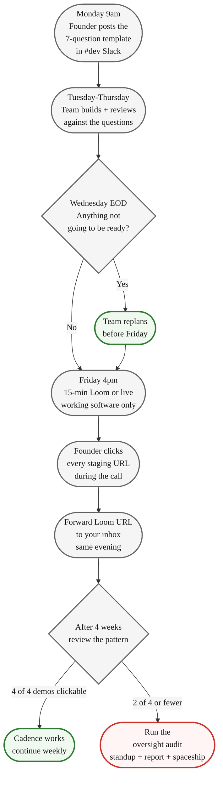

> **Going Further · Manage a Hired Team** · [From Idea to First Paying Customer](/course/tech-for-non-technical-founders-2026/)
>
> **Input:** a team in place + a signed SOW
>
> **Output:** a weekly Friday ritual that surfaces fake progress within 4 weeks
>
**Supplementary content.** This chapter assumes you have a hired team. If you're still on the [self-serve path](/course/tech-for-non-technical-founders-2026/self-serve-mvp-stack-lovable-supabase-stripe-2026/), bookmark this and return when you graduate to a hired team.

What were you actually shown on your last status call? A B2B founder we picked up in Q3 2026 sat with that question for ten minutes after a Tuesday call. Her notes from the call said: a burndown chart, a screenshot of a Jira board with eleven cards in "Done", a Figma frame her designer had updated overnight, and a verbal summary that started with "good progress this week." Nothing in her notes was a thing she could click. She had paid **$31K that month** for the team that ran the call, and the call had shown her zero working software.

She wrote one Slack message that night: *"From now on we run a 15-minute Friday demo. Loom or live, your choice. Working software only. I want to click everything you show me."* By Friday of week 3, two of her four developers had quietly left the project; the lead admitted the checkout flow she had been tracking for six weeks was three Postman requests in a Notion doc and a Stripe sandbox key in someone's `.env`. She found that out in 15 minutes, on a recorded call, with no fight.

## Why most weekly status calls fail

The standard weekly call is a slide deck and a Jira tour. The agency lead picks the artifacts, controls the screen, and narrates the week. You leave the call oriented but not informed. Whether anything shipped is a separate question, and the format does not force it. [Atlassian's own writeup on demo meetings](https://www.atlassian.com/agile/scrum/sprint-reviews) flags exactly this drift: status reviews collapse into status theatre when the agenda is "report progress" instead of "show working software." Make the format about clicking, not slides, and the failure modes get loud fast.

## The Friday Demo Rule

One meeting per week. 15 minutes. Friday at 4pm in your timezone. Loom (a recorded video) or live screenshare. Recorded if it is Loom. The rules are not negotiable, which is the whole point.

**Working software only.** Figma frames, Jira screenshots, burndown charts, and "here is what we are about to start" all stay out of the meeting. If the team cannot show you a thing you can click, the answer to "did anything ship this week?" is no - and you got that answer in 15 minutes instead of three sprints.

**You attend with one question in your head.** Can I click everything they show me? You open your laptop, paste each staging URL into your browser as the developer mentions it, and try to reach the screen they just described. If the URL throws a 500 or asks for a login you do not have, interrupt and ask why. Do not save the question for Monday. The point of the recording is so you have proof; the point of the live attendance is so you catch the lie in real time.

**Hard stop at 15 minutes.** When the demo drifts to 45 minutes, the discipline is gone within a month. The cap is what forces the team to pre-stage clickable URLs instead of debugging on the call. If the team needs longer than 15 minutes to show one week of work, something is wrong - and it is usually that nothing is on staging.

## The 7 questions the team answers

The full Monday-morning Slack template lives in the [Friday Demo Template](/course/tech-for-non-technical-founders-2026/friday-demo-template/) - copy and paste it into Slack on Monday so the team knows the questions before Friday. The seven questions, in the order you ask them on the call:

1. **What shipped this week?** Show the staging URL of one thing the founder can click.
2. **What did the user do?** Walk the feature as the user touches it - click the buttons, submit the form, show the success and failure screens.
3. **Where is it live for me?** Send the URL and the test login in one message; the founder repeats the demo on her own laptop within five minutes.
4. **What did we cut to ship that?** Name what was simplified, removed, or postponed. If nothing was cut, the scope was wrong or the work is not done.
5. **What is in review but not shipped?** Open pull request, named reviewer. If nobody reviewed it, say so.
6. **What is blocked, and on whom?** Named person, the answer the team needs from you, the deadline.
7. **What is the one thing I should worry about for next week?** Not a status update - the actual thing keeping the lead up at night.

The order matters. Question 1 sets the frame: working software, not process. Question 4 catches over-engineering and quiet descopes. Question 7 surfaces real risk before it shows up as a missed sprint. The full template page has the copy-paste Slack message, the hard rules, and the "what to do during the call" section - bookmark it.

## What good looks like vs what bad looks like

The texture of the answers is the signal. Every question has a pass shape and a fail shape, and after four Fridays you will know your team's pattern by sound. For the verbatim Good/Bad examples per question, see the [Friday Demo Template](/course/tech-for-non-technical-founders-2026/friday-demo-template/).

The two patterns worth knowing in your head, not on a template:

**Verb-only answers on Q1.** Bad answers describe completion as a feeling ("we finished the Stripe integration"). Good answers point at a URL and walk you to it. If your team gives you Q1 as a verb without a clickable thing, write it down - three weeks of verb-only Q1 answers is a stalled project wearing busy clothes.

**Same-name reviewer on Q5.** If the same name keeps appearing as the only reviewer for every pull request, you have a bus factor of one. [Will Larson on engineering anti-patterns](https://review.firstround.com/unexpected-anti-patterns-for-engineering-leaders-lessons-from-stripe-uber-carta/) treats the pull request funnel as the load-bearing signal for engineering health. The Friday demo is where you watch that funnel from outside the system. JT's [eight red flags checklist](/blog/dev-shop-red-flags-checklist/) describes the bus-factor failure mode in plain English.

A founder we worked with sat through six weeks of "I will send the URL after the call" before her fractional CTO clicked the link the team finally sent and got a 404. The CTO's first audit found the staging environment had been broken for two months and nobody had escalated it.

## What to do tomorrow

Three actions, in order:

1. **Block 15 minutes on your calendar this Friday at 4pm.** Title it "Friday Demo - Working Software Only." Add your team. No agenda doc - the agenda is the seven questions, and they are the same every week.
2. **Check your last four weekly status calls in your notes app.** Out of those four calls, how many produced a staging URL you actually clicked from your own laptop within 24 hours of the call? If the answer is zero or one, the problem is not your team's effort - it is that the format never asked them for working software. The Friday demo asks for it every week.
3. **Download the [Friday Demo Template](/course/tech-for-non-technical-founders-2026/friday-demo-template/) and send to your team Monday morning.** The template page has the copy-paste Slack message, the seven questions in order, the hard rules, and the "what good vs bad looks like" examples for each question. Do not paraphrase the rules - paste them. Teams respect the hard structure more than a polite request they can ignore.

By Friday of week 4, you will know whether your dev team is shipping or stalling, and you will not have read a line of code.

## Further reading

- Atlassian, [Sprint Reviews and Demos](https://www.atlassian.com/agile/scrum/sprint-reviews) - the canonical reference on demo meetings and how they drift into status theatre when nobody asks for working software.
- Eric Ries via Lean Startup Co., [What Is an MVP?](https://leanstartup.co/resources/articles/what-is-an-mvp/) - the validated-learning framing that makes "what did we cut?" a real product question.
- Will Larson (via First Round Review), [Engineering leadership anti-patterns from Stripe, Uber, Carta](https://review.firstround.com/unexpected-anti-patterns-for-engineering-leaders-lessons-from-stripe-uber-carta/) - on the pull request funnel as the load-bearing signal a Friday demo surfaces from outside the system.
- DHH, [The One Person Framework](https://world.hey.com/dhh/the-one-person-framework-711e6318) - the Rails case for full-stack developers shipping end-to-end and demoing in one Loom.
- Martin Fowler, [It's Not Just Standing Up: Patterns for Daily Standup Meetings](https://martinfowler.com/articles/itsNotJustStandingUp.html) - a deep practitioner reference on the pattern of meetings that produce visible working software vs the ones that produce status updates.
- Atlassian, [Definition of Done](https://www.atlassian.com/agile/project-management/definition-of-done) - the "is it actually done" reference that aligns with the Friday demo's working-software-only rule.

---

Built by JetThoughts as part of the [From Idea to First Paying Customer](/course/tech-for-non-technical-founders-2026/) curriculum. Authored by the JetThoughts team.
