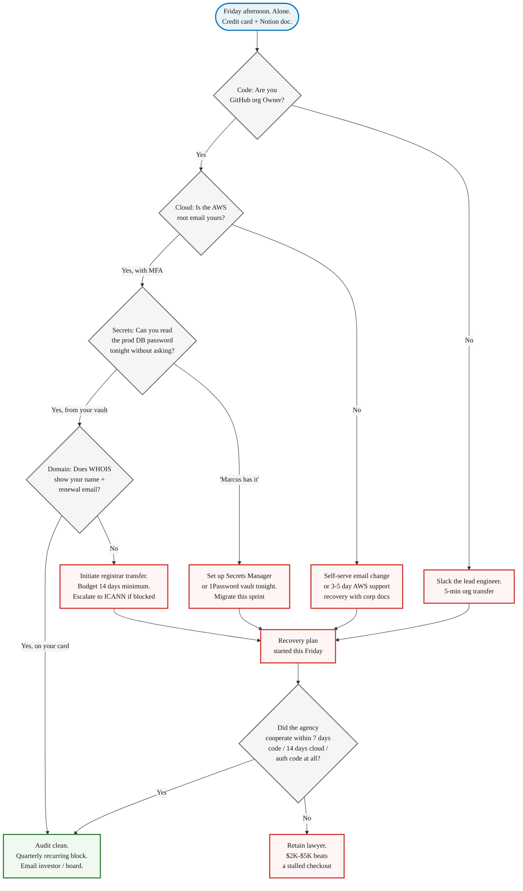

> **Module 4 · Step 2 of 4** · [Tech for Non-Technical Founders 2026](/course/tech-for-non-technical-founders-2026/) course.
> Input: a build-path decision from Chapter 4.1 (self-serve or hire). Output: a 45-minute Day-1 audit confirming you own your code, cloud, and domain before the build starts (or a recovery plan if you don't).

A health-tech founder we picked up in Q4 2025 had been billing **$23K a month** with the same agency for fourteen months. She had a Delaware C-corp, a Stripe account in her name, and 1,800 paying clinics on her platform. She did not have the AWS root password. The email on the root was the agency owner's personal Gmail. When that founder asked us to do an emergency rescue after a botched migration, our first hour was not technical. It was three back-and-forth emails to the agency owner asking him to please change the root account email and send the new password to a Notion doc he could not see. He took six days.

*Ownership*: who controls the GitHub org, the AWS root account, the domain registrar, and the prod database. A Day-1 audit means you can fire your team Tuesday without losing the codebase Wednesday.

Open the AWS console. Top-right corner. Click your account name. Read the email address on the root user. Whose inbox does that land in tonight?

## The 2026 hostage situation looks different

The agencies that hold founders hostage in 2026 are not the same shops that did it in 2020. AI-augmented contractors spin up your entire infrastructure during the Cursor or Claude Code session on Day 1: GitHub org, AWS account, Vercel project, Supabase database, Stripe integration, Sentry, PostHog. They use whatever email was already logged in. Usually their own. The senior dev who set everything up moves to another client in month four. The junior who inherits your project does not know which credentials live where. Six months later, you are paying for accounts that nobody on the current team can administer.

There is a second pattern, even more common: the **cloud-default-account problem**. A contractor opens a fresh AWS account using the company credit card you handed them, then sets the root email to a shared `dev@` mailbox that the agency owns. AWS treats whichever email is on the root as the legal account holder. Your incorporation paperwork is irrelevant if the root email belongs to someone else. [AWS's own root user documentation](https://docs.aws.amazon.com/IAM/latest/UserGuide/id_root-user.html) is blunt about this: the root user has unrestricted access, and recovering control without the root credentials means filing a support ticket with corporate documents and waiting days.

The financial damage is rarely the headline number on the agency invoice. It is the day production breaks at 9pm and you cannot push a fix because you cannot read the prod database password. The week lost to AWS support recovery while your customers see a maintenance page. An $11K legal retainer when the agency stops answering. None of that hits the budget line that says "engineering."

## The 12 items, in four zones

The full audit lives at the [GitHub / AWS / Database Ownership Checklist](/course/tech-for-non-technical-founders-2026/ownership-checklist/) - 12 items, the exact pass criterion for each, the recovery steps when one fails. Here is the one-line summary, grouped by the zone you check.

| Zone | Item | Pass Criterion |
|---|---|---|
| **Code** | GitHub org owner | Your company email, not the agency's |
| | Repo collaborators | Can be removed by you alone, without permission |
| | Branch protection on main | Enabled and you can override in an emergency |
| **Cloud** | AWS root account email | Sits on a domain you control |
| | Billing card | Yours and you can download every invoice yourself |
| | IAM admin user | In your name with MFA on, separate from root |
| **Secrets and database** | Production DB credentials | Readable by you tonight without paging an engineer |
| | Secrets store | (Secrets Manager, Vault, Doppler) administered by you |
| | Database backups | Running nightly with a restore runbook you can execute |
| **Domain and external services** | Domain registrar | WHOIS shows your name and your renewal email |
| | DNS provider | Logged in under your account with MFA, ready to add an A record now |
| | Third-party API keys | (Stripe, SendGrid, Twilio, OpenAI, Plaid) on your account, your card |

Two of those twelve are existential. AWS root email controls whether the agency can lock you out in ten minutes. Domain registrar turns into a 14-day ICANN-mandated wait if the agency will not release the auth code. The other ten matter; these two end the company if they go wrong.

## What good looks like vs what bad looks like

Every item rhymes the same way when it passes: an email on a domain you control, billing on a card you own, MFA on a phone in your pocket, and a password in a vault you can read. Failure rhymes too: somebody else's email, somebody else's card, and "let me ask Marcus" as the answer to "who can rotate this?"

Three pairs that come up most often in rescue audits.

**Item #4 - AWS root account email**

> Bad: Root email is `aws@bigdevshop.com`. The bill goes to their AmEx ending 4421. You have an IAM user but have never logged in as root.
> Good: Root email is `aws@mycompany.com`. The password is in your 1Password. MFA is on your phone with backup codes in your office safe. Bill goes to your company card.

If the agency controls the root email, AWS support will treat them as the account holder, not you. The incorporation paperwork in your filing cabinet does not matter to AWS until support has worked through their recovery process - which takes 3-5 business days after you have proven who you are.

![Side-by-side panel showing the AWS root account fields - account email, billing card, your access level, recovery time if the agency disappears - in the bad scenario where everything points at the agency, and the good scenario where everything points at the founder. The Bad column shows aws@bigdevshop.com, agency AmEx, IAM-only access, and a 3-5 day support recovery. The Good column shows aws@mycompany.com, founder AmEx, root password in 1Password with MFA, and same-day recovery by revoking the contractor.](bad-vs-good-email.svg)

**Item #7 - Production database password**

> Bad: "Marcus has it. Slack him and he can DM it to you."
> Good: "I opened AWS Secrets Manager just now and read it myself. I rotated it once in March when we offboarded the previous DBA."

The Marcus answer is the hostage answer. It does not matter whether Marcus is honest, kind, or available - one person holding the prod DB password is one person away from a production outage you cannot fix. Firing Marcus does not fix it. Putting the credential in a store you administer, with Marcus pulling read access from there, does.

**Item #10 - Domain registrar**

> Bad: Domain renewal notices arrive at `dev@theiragency.com`. You have never logged into Namecheap or GoDaddy in your life.
> Good: Logged into the registrar with your account. WHOIS shows your name. Auto-renew is on, charged to your card, and you have your phone scanned for MFA.

A domain transfer is the slowest recovery on the list. [ICANN's transfer policy](https://www.icann.org/resources/pages/transfers-2024-en) requires a five-day approval window after the auth code is released, and many registrars add a 60-day post-registration lockout window during which transfers cannot start at all. If the agency holds your domain and refuses to cooperate, your customers are looking at a static placeholder for two weeks while you escalate to ICANN's transfer dispute resolution.

## When the audit fails: a recovery plan that takes weeks, not months

Most audit failures are sloppy Day-1 setup, not malice. The agency was moving fast in the kickoff sprint, used whatever email was logged in, and nobody went back to clean it up. The fix follows three steps in this order, and the order matters.

| Step | What to do | Timeline |
|---|---|---|
| 1: Stop the bleeding | Get yourself an admin path into every system the agency controls. AWS root password reset to your email. Your name added as GitHub org owner alongside theirs. Your card added as the primary on Stripe, SendGrid, and OpenAI. Do this on a Friday so you have the weekend before anyone notices. | This Friday |
| 2: Extract the IP | Pull a fresh clone of every repo to a private GitHub org under your account. Export the database to an S3 bucket on an AWS account in your name. Document where every secret currently lives and where it will live after the migration. Two weeks of work on the existing setup is fine. | Two weeks |
| 3: Legal escalation, only if needed | A reasonable cooperation window looks like 7 days for GitHub org transfer, 14 days for AWS root, and the auth code released at all for the domain. If they stall, retain a lawyer for a one-time $2K-$5K letter referencing your contract's IP-assignment clause. | 7-14 days (or legal engagement) |

The artifact at [/course/tech-for-non-technical-founders-2026/ownership-checklist/](/course/tech-for-non-technical-founders-2026/ownership-checklist/) walks the exact recovery sequence per item, including the AWS support phone script and the registrar auth-code request template.

## What to do tomorrow

| Time | Action |
|---|---|
| **Friday 2 PM** | Block 45 minutes. Calendar invite to yourself titled "Ownership audit." Treat it like an investor meeting. No interruptions. Coffee on, phone on Do Not Disturb. |
| **Friday 2:00-2:05 PM** | Open the AWS console first. Top-right, click the account name, click Account. Read the root user email. If it is not on a domain you control, that one item is your audit's first failure. |
| **Friday 2:05-3:00 PM** | Download the [GitHub / AWS / Database Ownership Checklist](/course/tech-for-non-technical-founders-2026/ownership-checklist/) and run through the 45-minute audit. Record pass/fail for each of the 12 items. Create a one-page summary to forward to your investor or board. |
| **Friday 5 PM** | If three or more items fail, cross-reference [the eight dev-shop red flags](/blog/dev-shop-red-flags-checklist/) and consider [the 30-day exit guide](/blog/fire-dev-shop-guide/) next. |

## Advanced (optional)

| Topic | When to scope | When to skip |
|---|---|---|
| **Signed key infrastructure** | You have 50+ users AND you handle regulated data. Rotating to asymmetric signing keys (AWS KMS, HashiCorp Vault Transit engine) means revocation actually removes access. | You have <50 users. Defer to month three, not month eighteen. |
| **Security audit reference** | Before an enterprise prospect sends a SOC2 questionnaire. Run [AWS Trusted Advisor](https://aws.amazon.com/premiumsupport/technology/trusted-advisor/) (free for Business/Enterprise) or [Prowler](https://github.com/prowler-cloud/prowler) (open-source). Both produce reports answering 80% of infra questions. | You have no enterprise prospects yet. No need for SOC2 or formal audit. |

## Further reading

- AWS, [AWS Account Root User documentation](https://docs.aws.amazon.com/IAM/latest/UserGuide/id_root-user.html) - the official explanation of why the root email is the master credential and how account recovery works.
- ICANN, [Transfer Policy](https://www.icann.org/resources/pages/transfers-2024-en) - the rules every domain registrar must follow when transferring a domain between accounts, including the 60-day lockout and 5-day approval windows.
- GitGuardian, [The State of Secrets Sprawl 2024](https://www.gitguardian.com/state-of-secrets-sprawl-report-2024) - 12.8 million secrets exposed in public GitHub commits in 2023, with `.env` files as one of the most common leak vectors.
- Rails Guides, [Security: Custom Credentials](https://guides.rubyonrails.org/security.html#custom-credentials) - the canonical Rails answer to the "where do production secrets live?" question, replacing the old `database.yml` plaintext pattern.
- Will Larson (via First Round Review), [Engineering leadership anti-patterns from Stripe, Uber, Carta](https://review.firstround.com/unexpected-anti-patterns-for-engineering-leaders-lessons-from-stripe-uber-carta/) - on ownership and accountability in engineering teams, including who holds the keys to production.
- AWS, [Reset a lost or forgotten root user password](https://docs.aws.amazon.com/IAM/latest/UserGuide/id_credentials_passwords_change-root.html) - the support process and timeline if you need to recover a root account where someone else controls the email.

---

*Built by [JetThoughts](https://jetthoughts.com) as part of the [Tech for Non-Technical Founders 2026](/course/tech-for-non-technical-founders-2026/) curriculum.*
