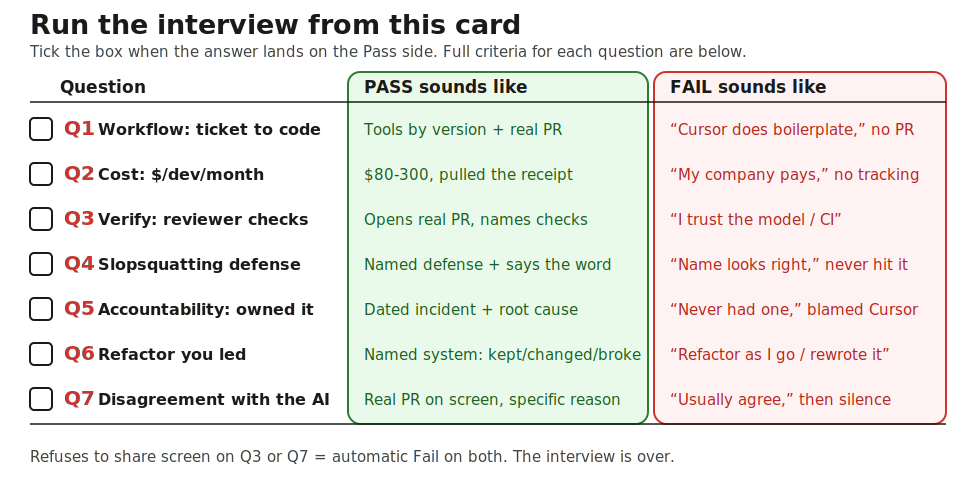

Template companion to the [Hire Track Supplementary Reference](/course/tech-for-non-technical-founders-2026/hire-track-supplementary-reference/#interviews-that-catch-ai-theater). Send to candidate 24 hours before the call. Score each answer Pass / Fail in real time.

> This template is the canonical source for the 7 hiring interview questions. The [Hire Track Supplementary Reference](/course/tech-for-non-technical-founders-2026/hire-track-supplementary-reference/) post links here for the full Q&A.

> **Copy-pasteable pre-interview email - send to candidate 24 hours before the call:**
>
> Subject: `[Date] interview prep - 7 questions`
>
> Hi [FIRST_NAME],
>
> Looking forward to our call [TOMORROW_OR_TUESDAY]. Here are the 7 questions we will work through together. Please come prepared to share your screen for Q3 and Q7.
>
> [Paste Q1-Q7 from below - the bold headers only, not the scoring criteria.]
>
> The call runs 30 minutes: 5 min intro, 20 min on the questions, 5 min for your questions. Talk soon.
>
> [Your name]

*Send Sunday night. Run Tuesday and Wednesday. Hire decision in your hand by Friday.*

## The 7 questions at a glance

Keep this card open during the call or print it: what to listen for (Pass) sits beside what to walk away from (Fail), question by question. The full criteria for each are in the sections below.



## Why this exists

A standard 60-minute behavioural interview clears the candidate who names the right tools, shows a Cursor seat, and has a tidy GitHub profile - and none of that tells you whether the code holds up. You find out three weeks in, once the hire has merged a few PRs and someone reads them: a `gem 'stripe_connect_v2_helper'` line that does not exist on Rubygems, a hardcoded JWT secret in `config/secrets.yml`, a third PR that is the first one copy-pasted with the variable names changed. Replacing the contractor takes ten days; the onboarding hours and the rollback are already spent. The 7-question version below catches that gap on the first 30-minute call, where Q3, Q4, and Q7 are the questions that surface it.

## How to use this

Send the seven questions in writing 24 hours before the call with one sentence: *"We will work through these together on Tuesday; please come prepared."* Do not soften it. Candidates who decline to prepare are telling you the answer to the interview before it starts.

Run the call on a 30-minute Zoom block. Five minutes for intro and role context, twenty for the seven questions (about three minutes each), five for their questions and a close. Score Pass / Fail in real time on the scorecard at the bottom of this page. Add the three sub-scores within five minutes of hanging up - not Friday, not next week. Specificity, system judgment, communication. Above 7 = book the reference call before you close the laptop. Below 5 = polite-no email by tomorrow morning.

If a candidate refuses to share their screen for Q3 or Q7, that is a Fail on both questions automatically. The interview is over. End on time anyway, send the polite-no, move on.

## The 7 questions - copy and paste

### Q1. The workflow question

> "Walk me through how you take a Jira ticket and end up with merged code, when AI is in the loop. Name the tools, the prompt patterns, and the human review gates. Use a real ticket you closed last week."

- **Pass:** tools named by version (Cursor + Claude 4.5 Sonnet, Claude Code, Aider, Copilot Enterprise) + a written sequence (failing test first → prompt → generate → review → PR with `Assisted-by:` tag → merge) + a real PR number from last week
- **Fail:** "I let Cursor handle the boilerplate" / "depends on the ticket" / no real PR / generic monologue about how AI helps them think

### Q2. The cost question

> "What does the average dev on your team spend on AI tokens per month, and who pays it? What does your Cursor seat plus your API usage cost you personally last month?"

- **Pass:** per-developer dollar range ($80-$300/month) + pulled the number off their last receipt before the call + budget alert on their personal API account
- **Fail:** "my company pays for it" / "I don't really track that" / "it's pretty cheap"

### Q3. The verification question

> "When AI generates a 200-line PR, what does the senior reviewer actually check? Walk me through one PR you reviewed last week and tell me what you looked for."

- **Pass:** opens an actual PR on screenshare + reads it line by line + names checks (diff matches spec, no hardcoded secrets, tests are real not after-the-fact, new packages exist on Rubygems / PyPI / npm)
- **Fail:** "I trust the model most of the time" / "Cursor catches the obvious stuff" / "we rely on CI"
- **Hard fail:** refuses to share screen

### Q4. The slopsquatting question

> "In March 2025 a security researcher published findings that AI assistants suggested over 200 package names across Rubygems, PyPI, and npm that did not exist. Attackers register those names and wait for developers to install the typo. How do you prevent installing a hallucinated package in your own work?"

- **Pass:** specific defense (allowlist, Socket / Snyk on every PR, manual verification step) + uses the word "slopsquatting" without prompting + cites the Infosecurity Magazine writeup
- **Fail:** "I check the package name looks right" / "Cursor only suggests real packages" / "I have not run into that"

### Q5. The accountability question

> "When AI-generated code causes a production incident, who is on the hook? Walk me through the last AI-generated-code incident you owned. What happened, when, what you changed afterwards."

- **Pass:** specific incident with date in last 6 months + one-paragraph root cause + named senior who reviewed the PR + workflow change made the week after
- **Fail:** "I have never had an AI-related incident" (lying or never shipped) / "AI code is the developer's responsibility" (translation: not mine) / "we blamed Cursor and moved on"

### Q6. The refactor question (NEW for individual hires)

> "Walk me through the last refactor you led. What stayed, what changed, what broke briefly, and how you knew it was safe to ship."

- **Pass:** specific refactor with named system + describes what they kept (public API contract, test suite as safety net), what they changed (data model, migration, service boundaries), what broke briefly (4pm staging deploy, flaky test) + names the safety net (green CI, feature flag, rollback, canary)
- **Fail:** "I refactor as I go" / "I rewrote the whole module" / "the product team did not let me refactor"

### Q7. The disagreement question (NEW for individual hires)

> "Show me a PR review you wrote in the last 30 days where you disagreed with the AI's suggestion. Tell me what the AI suggested, why you disagreed, and what you shipped instead."

- **Pass:** shares screen + opens GitHub or GitLab + scrolls to a real PR + reads the comment they left out loud + the disagreement is technical and specific (hallucinated gem swapped for stdlib, N+1 fix, security flag caught) + this is one of several they could have picked
- **Fail:** "I usually agree with the model" / "I cannot think of one off the top of my head" / 40 seconds of silence and a promise to email a link "when they find one"
- **Hard fail:** refuses to share screen

## What good looks like vs what bad looks like

The passing-candidate pattern: they pull up artifacts on screenshare without prompting. They read PRs out loud. They name dollar amounts to the dollar. They quote the date of the last incident from memory. They reference [the Assisted-by: kernel rule](/blog/ai-code-ownership-accountability/) on Q5 without you bringing it up. They have a laptop full of receipts.

The AI-theater pattern: they answer in the abstract. "We use AI to deliver faster value." "Cursor is a great accelerator." When you ask for a real PR or a real receipt, the answer is "I will follow up." That follow-up does not arrive.

One concrete contrast on Q7:

> Bad: "I usually agree with what Cursor suggests; it has a high standard."
> Good: "PR #1438 last Wednesday - Cursor wanted to add `gem 'jwt-decoder-v2'` for the token validation. That gem does not exist on Rubygems and the standard library `OpenSSL::JWT` already does the job. I left a comment asking the developer to use the stdlib. The merge was clean by Friday."

## The scorecard - score in real time

| # | Question (one-line) | Pass / Fail | Notes |
|---|---|---|---|
| Q1 | Workflow: Jira ticket to merged code, named tools | ☐ Pass ☐ Fail | |
| Q2 | Cost: $/dev/month on AI tokens, who pays it | ☐ Pass ☐ Fail | |
| Q3 | Verification: what reviewer checks on AI PRs | ☐ Pass ☐ Fail | |
| Q4 | Slopsquatting: how do you stop a hallucinated package | ☐ Pass ☐ Fail | |
| Q5 | Accountability: last AI-code incident you owned | ☐ Pass ☐ Fail | |
| Q6 | Refactor: last one you led, what stayed/changed/broke | ☐ Pass ☐ Fail | |
| Q7 | Disagreement: PR review where you said no to the AI | ☐ Pass ☐ Fail | |

Then add the three axis scores (each 0-10):

- **Specificity (0-10):** real PR numbers, real dollar amounts, real incident dates. Hand-waving = 2. Numbers and names = 8. Walkthrough on screenshare with the actual artifact = 10.
- **System judgment (0-10):** Q6 and Q7 test this directly. Real refactor + real PR-review disagreement = 8+. Deflects either = below 5.
- **Communication (0-10):** would they answer your founder questions in plain English? Would the [three-questions standup](/course/tech-for-non-technical-founders-2026/three-questions-turn-standup-into-proof/) format work with this person?

Total = sum of three. Convert to a 1-10 by dividing by three. See the [What to do after](#what-to-do-after) section below for the action per band.

## After the call: write the 3-sentence summary

Within 5 minutes of hanging up, while the answers are still fresh, write a 3-sentence summary in your candidate Notion doc. Use this template:

```
Candidate: [name] · Date: [YYYY-MM-DD] · Score: [N]/10

Sentence 1 (signal): The strongest signal from the call was [specific
moment - the PR they opened, the receipt they pulled, the disagreement
they read out loud, OR the hand-wave they gave when asked for one].

Sentence 2 (gap): The gap that gave me pause was [specific moment - the
question they could not answer, the artifact they could not produce,
the dollar number they did not know].

Sentence 3 (decision): I am [booking a reference call / sitting on this
overnight / sending a polite no] because [the signal/gap above clearly
puts them in the [hire / maybe / no-hire] band].
```

Three sentences. No more. The decision is in your gut by minute 28 of the call; the writing is just to lock it in before Friday's calendar fills with other meetings.

If you booked a reference call, the next step is the [SOW reading guide](/course/tech-for-non-technical-founders-2026/hire-track-supplementary-reference/#reading-the-sow). The interview is the people screen. The SOW is the money screen. Both clear before you sign.

## What to do after

- **Above 7:** book the 30-minute reference call with two of the candidate's prior clients or managers. Ask three questions: what AI-related incidents did they own, what was the OpenAI line on their monthly invoice, did they ever ship a PR with `Assisted-by:` in the commit log on request.
- **5 to 7:** schedule one 45-minute follow-up technical session, working through one of your real product flows on screenshare. If they cannot attend within seven days, that tells you their actual availability. Drop or proceed.
- **Below 5:** send the polite-no the same evening. One paragraph:

> **📧 Copy-pasteable polite-no email:**
>
> Subject: `[Date] interview - follow-up`
>
> Hi [FIRST_NAME],
>
> Thank you for the time today. We are pausing the search to refine our requirements. We will keep your details on file.
>
> Best,
> [Your name]

Do not negotiate.

The 30-minute interview is cheaper than the wrong hire it prevents. A bad three-month hire on a $90/hour LATAM contract costs $43K plus the onboarding hours and the rollback. The seven questions cost 30 minutes.

---

*Built by [JetThoughts](https://jetthoughts.com) as part of the [From Idea to First Paying Customer](/course/tech-for-non-technical-founders-2026/) curriculum.*
