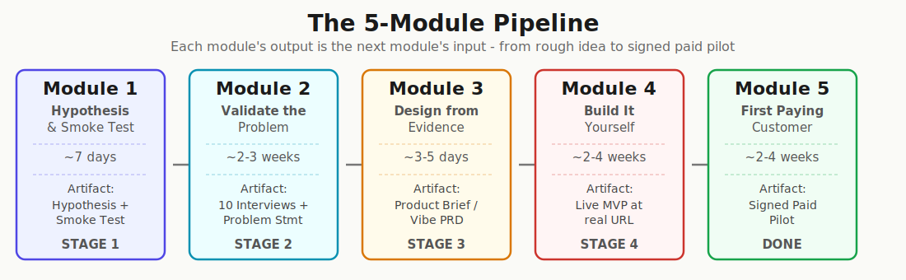

> **Chapter 0** · [From Idea to First Paying Customer](/course/tech-for-non-technical-founders-2026/)
>
> **What this is:** the map -  modules,  chapters,  artifacts, each module's output feeding the next module's input, from rough idea to signed paid pilot. Read it once before Module 1, come back when you need to see where you are.

This course takes a non-technical founder from a rough idea to a signed paid pilot - on evenings and weekends, with or without engineers. Each chapter names the tool it uses and what the tool costs at that step; most tools have a free tier. Below: the flow, the tools, the artifacts you'll compile, and how the stages connect.

> **Calendar reality - full-time vs evening-only.** The per-module wall times below assume a founder with daytime availability. An evening-only founder (2-4 hr/week, the pattern this course is built for) typically needs 1.5-3x the calendar at each module. Build your plan against the evening-only band; finishing early is a bonus.

---

## The Big Picture

 modules.  chapters.  artifacts you can hand to an investor or a co-founder. Each module's output is the next module's input.

---

## The 5 Modules at a Glance

### Module 1 - Hypothesis & Smoke Test
**You have:** a rough idea or instinct.
**You walk away with:** a one-sentence Founding Hypothesis + a live landing page with a Stripe price button.
**Time:** ~7 days full-time; 2-3 weeks at an evenings-and-weekends pace.

| Step | What You Do | Key Tool |
|---|---|---|
| 1.1 | Write your Founding Hypothesis | Notebook + kitchen timer |
| 1.2 | Build a smoke-test landing page | Mixo or Carrd (free to start; the 1.3 tracking step may need the builder's small paid tier) |
| 1.3 | Wire tracking before traffic starts | Microsoft Clarity + GA4 (free) |
| 1.4 | Run 300 cold visitors and read the signal | Ad platform of choice |
| 1.5 | Add a Stripe price button to measure payment intent | Stripe Payment Links (free) |

**Before you write the hypothesis:** spend 30 minutes with [Perplexity](https://www.perplexity.ai/) (an AI search engine that answers questions with cited sources). Ask it to find the top 5 user complaints about existing solutions in your niche, citing reviews from [G2](https://www.g2.com/) and [Capterra](https://www.capterra.com/) (the two big business-software review sites). Use the exact vocabulary from real complaints in your hypothesis blanks. If nobody is complaining about the problem anywhere online, the hypothesis is already in trouble.

> **AI research layer (pre-hypothesis):** Perplexity + Trend Seeker (both have free tiers). Purpose: confirm people are actually searching for or complaining about the problem BEFORE you write a hypothesis about it. Verbatim quotes from Reddit and G2 feed directly into your landing page headline.

---

### Module 2 - Validate the Problem
**You have:** a Founding Hypothesis.
**You walk away with:** 10 Mom Test interview transcripts + a validated problem statement + a clickable prototype tested with 5 people.
**Time:** ~3-5 weeks full-time - booking the 10 interviews is the long pole (Ch 2.3 plans 2-4 calendar weeks for that step alone).

| Step | What You Do | Key Tool |
|---|---|---|
| 2.1 | Learn the 5 Mom Test rules (ask about past, not future) | Mom Test Interview Script |
| 2.2 | Rehearse your questions with an AI persona (optional - skip if you've run customer interviews before) | Claude or ChatGPT (free) |
| 2.3-2.4 | Find and book 10 ICP interviews (ICP = Ideal Customer Profile - the specific kind of person your hypothesis names) | Reddit, LinkedIn, X |
| 2.5 | Score the transcripts and make the build / pivot / kill call | Mom Test Synthesis page |
| 2.6 | Build a throwaway 3-screen clickable prototype | Lovable (free tier) |

**The Mom Test is irreplaceable.** AI tools can tell you what people say online, but they cannot tell you whether a specific human will open their wallet. Without the interviews, you're building features for a problem nobody confirmed exists.

> **After interviews, before the brief:** run your refined hypothesis through IdeaProof (free tier to start). Its multi-model ensemble stress-tests your business logic and catches legal, economic, and competitive blind spots you haven't considered.

---

### Module 3 - Design from Evidence
**You have:** 10 interview transcripts + prototype feedback.
**You walk away with:** a one-page Product Brief written from real customer vocabulary.
**Time:** ~3-5 days on the calendar - about one evening of writing plus a lunch-break quality check, with a night's sleep between drafts.

| Step | What You Do | Key Tool |
|---|---|---|
| 3.1 | Write a one-page Product Brief - "Vibe PRD" (PRD = Product Requirements Document; the "Vibe" version is a one-pager an AI builder can act on, not a 30-page spec for a 6-person team) | Vibe PRD Template |
| 3.2 | Quality-check: rewrite features as outcome-shaped job stories | Claude or ChatGPT (free) |

The brief is the handoff document. It goes to Lovable, a hired developer, or a fractional CTO. It prevents over-engineering because it describes what the customer needs to accomplish, not what features to build. Every feature in the brief must trace back to a verbatim quote from a Module 2 interview.

---

### Module 4 - Build It Yourself
**You have:** a one-page Product Brief.
**You walk away with:** a build decision + a live MVP at a real URL, with you owning every account.
**Time:** ~2-4 weeks.

| Step | What You Do | Key Tool |
|---|---|---|
| 4.1 | Decide: self-serve, fractional CTO (a part-time senior engineer who owns architecture but doesn't write all the code), or hired team | Build Path Decision Worksheet |
| 4.2 | Lock ownership: GitHub, AWS, domain, database in your name | Ownership Checklist |
| 4.3 | Set up the stack and pre-flight rules: Lovable + Supabase + Stripe | Lovable + Supabase + Stripe (free tiers) |
| 4.4 | Walk the 4 build phases to a live MVP at a real URL | Same stack + a domain in your name |
| 4.5 (optional) | Spot the 5 ceiling signals that mean it's time to graduate beyond no-code | Monthly calendar block |

> **Before you write code: the $0 Concierge MVP.** If you're not ready to commit to a full Lovable build, use Tally + Zapier (or Make.com) + Airtable to simulate your product's backend. Collect customer requests through a Tally form, route them to Airtable via Zapier, and process them manually. The customer experiences a working product. You validate demand before writing a line of code. All three tools have free tiers.

---

### Module 5 - First Paying Customer
**You have:** a live MVP at a real URL.
**You walk away with:** one signed paid pilot ($500+ deposit) + a repeatable outbound channel.
**Time:** ~2-4 weeks.

| Step | What You Do | Key Tool |
|---|---|---|
| 5.1 | Run the Sean Ellis PMF test (PMF = Product-Market Fit; one survey question: "how would you feel if you could no longer use this product?" 40%+ "very disappointed" = signal) on your earliest users | PMF survey template |
| 5.2 (optional) | Pick one outreach channel and commit before scaling | Channel selection framework |
| 5.3 | Build the 50-name warm list, sorted into 4 outreach buckets | One spreadsheet |
| 5.4 | Write the 4 bucket messages + a 90-second Loom | Loom (free tier) |
| 5.5 | Send in sequence, track replies, book demos | The same spreadsheet |
| 5.6 | Sign a Design Partner Agreement - "DPA" (a short contract where a customer pays a deposit to test your product as a co-design partner; cheaper and faster than a full enterprise contract) - with a refundable deposit | DPA template + Stripe |
| 5.7 (optional) | Go cold outbound: 30 filtered messages, book 1-2 pilots | LinkedIn Sales Navigator or manual |

**Important distinction:** your warm network is the right place to sell your first paid pilot, and the wrong place to validate the problem. Friends and other founders will tell you your idea is great because they're being polite. Only cold strangers who describe the problem in their own words and pay money produce a real signal.

> **Going further:** After your first paid pilot, the course has continuation chapters for churn triage, pivot-or-persevere decisions, hiring, management (Friday Demo Rule, Weekly Dev Report), and AI-era topics (token bill auditing, slopsquatting, agency AI questions).

---

## The Tool Stack: When to Use What

These are the tools the course references - AI research tools, no-code builders, and infrastructure. Most have free tiers sufficient for the validation stage. Tool pricing and free-tier limits change often; the Cost column tells you which tier to look for, and the tool's own pricing page is the source of truth on the day you sign up.

Pre-Hypothesis Research (before Module 1) - 3 tools

| Tool | What It Does | When to Use | Cost |
|---|---|---|---|
| **Perplexity** | AI search engine that answers with cited sources, aggregates competitor complaints | Map the market, find what users hate about existing solutions | Free tier |
| **Trend Seeker** | Semantic search across Reddit/forums for demand signals | Confirm people are actually searching for solutions to your problem | Free tier |
| **Reddinbox** | Automated Reddit/Quora search for high-commercial-intent phrases | Find posts where people explicitly ask "how to automate X" or "sick of doing Y" | Setup required |

Hypothesis Stress-Testing (during Module 2) - 3 tools

| Tool | What It Does | When to Use | Cost |
|---|---|---|---|
| **ValidatorAI** | Dialog-based AI advisor, rates your idea and finds blind spots | Rapid "devil's advocate" feedback before interviews | Free tier |
| **IdeaProof** | Multi-model ensemble cross-validates business logic | After Mom Test interviews, before writing the Product Brief | Free tier |
| **Preuve AI** | Evidence-based idea scoring from live data sources, with citations | Before building, when you need a data-backed viability check | Free tier |

Build & Launch (Modules 1, 4, 5) - 6 tools

| Tool | What It Does | When to Use | Cost |
|---|---|---|---|
| **Mixo / Carrd** | One-page landing page builder | Smoke test (Module 1) | Free tier (subdomain) |
| **Stripe Payment Links** | Hosted checkout without writing code | Price hypothesis test (Module 1), paid pilot deposit (Module 5) | Pay-as-you-go (per-transaction fee) |
| **Lovable / Bolt.new** | AI app builder from text prompts | Clickable prototype (Module 2), MVP build (Module 4) | Free tier |
| **Supabase** | Hosted Postgres + auth + realtime | MVP backend (Module 4) | Free tier |
| **Tally + Zapier + Airtable** | "Wizard of Oz" no-code stack (a fake-it-till-you-make-it pattern: the customer thinks software is running, but you do the work by hand behind the scenes to test demand before you build the real thing) | Concierge MVP before committing to a code build (Module 4 alt path) | Free tiers |
| **WorthBuild** | Auto-parses social media for leads, generates personalized outreach messages | After validation, setting up first-customer pipeline (Module 5) | Free tier |

## The Course's Rule: Kill Bad Ideas Fast

Every module has a gate. If the data doesn't support your hypothesis, you stop and either pivot or kill the idea. The gate sends you back if the data doesn't support the hypothesis.

| Module | The Gate | Signal to Proceed |
|---|---|---|
| 1 | Landing page conversion | ≥6% of cold visitors submit the email form (the "Promising" band in the 1.4 decision table; 3-6% = iterate the message, under 3% = kill or pivot) |
| 2 | Mom Test interviews | ≥7 of 10 interviewees have spent time or money on the problem |
| 3 | Product Brief quality check | Every feature traces back to a verbatim interview quote |
| 4 | MVP at a real URL | You own every account; the app loads; one core flow works end-to-end |
| 5 | First paid pilot | Signed DPA + $500+ Stripe deposit received |

If you fail a gate, the system requires you to go back, not forward. Failing at the gate costs you a few weeks and a few hundred dollars of ad spend; failing after the build costs founders years and tens of thousands of dollars on something nobody wants.

---

## Start Here

Read the overview once. Then start at [Module 1, Chapter 1.1: Form Your Founding Hypothesis](/course/tech-for-non-technical-founders-2026/form-your-founding-hypothesis-90-minute-sprint/). Come back to this page when you need to see where you are in the full route.

If you're not at the idea stage - you're already building, or paying someone to build for you - see the [Already started building?](/course/tech-for-non-technical-founders-2026/#already-started-building) section on the course landing page.

> **Done when:** You have read the full route and know which module to start with.
> **Next click:** [1.1 · Form Your Founding Hypothesis](/course/tech-for-non-technical-founders-2026/form-your-founding-hypothesis-90-minute-sprint/)
> **If blocked:** If your idea is too vague to fill the hypothesis blanks, Lesson 1.1's "If this fails" section shows how to anchor the blanks with real customer complaints from Reddit and G2.

---

*Built by [JetThoughts](https://jetthoughts.com) as part of the [From Idea to First Paying Customer](/course/tech-for-non-technical-founders-2026/) curriculum. Research sources: June 2026 AI validation tools market analysis, 29 sources across Indie Hackers, Reddit, Product Hunt, and VC.ru.*
