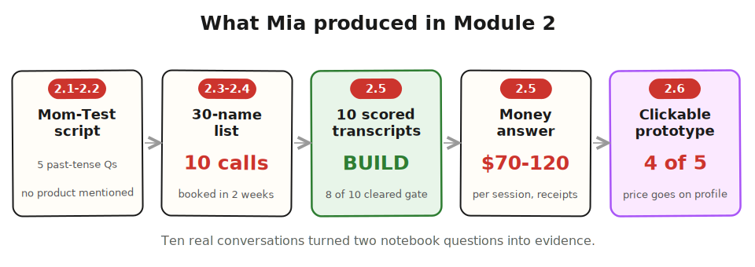

> **Module 2 walkthrough · Mia** · [From Idea to First Paying Customer](/course/tech-for-non-technical-founders-2026/)
>
> *Illustrative composite based on patterns from real founder builds, not a single client story. Mia's Module 1 run is in the [Module 1 walkthrough](/course/tech-for-non-technical-founders-2026/module-1-walkthrough-mia/).*

Mia came out of Module 1 with six paying customers and two open questions in her notebook. The first was the Money question: her $99 founding-member price had converted, but she still had no idea what parents actually paid for tutoring month to month. The second was the location question she had parked instead of ad-testing: did parents ever search "tutor near me" and settle, or did the specialty search she'd bet on describe most of them?

Module 2 was where those questions stopped being notebook entries and became interview questions.

---

## [Lesson 2.1: The Mom Test](/course/tech-for-non-technical-founders-2026/mom-test-ask-about-past-not-future/)

Her first draft question list took ten minutes and felt great: "Would you use a marketplace that matches you with a specialist tutor in 48 hours?" She read the lesson's table of tempting-but-broken questions and found hers in the first row - a hypothetical with the product baked in, engineered to produce a polite yes from any parent alive.

She rewrote the list in past tense, one question per notebook line. Tell me about the last time you looked for a tutor - walk me through what you did. What did that search cost you, in money or in evenings? What did you try that didn't work? Where does this sit against everything else on your plate? Who else weighs in before you'd hire someone for your kid?

Five questions, none of which mentioned TutorMatch. That was the part that felt wrong and was right: the interviews would be about the parents' last search, not her product.

---

## [Lesson 2.2: Rehearse with an AI Persona](/course/tech-for-non-technical-founders-2026/ai-persona-pre-validation-mom-test-prep/)

Mia had never run a customer interview, so she didn't skip the optional rehearsal. She gave Claude the persona - a working mother of a 10-year-old with dyslexia, two failed tutoring attempts behind her - and ran her five questions against it in character.

The rehearsal caught one bad question. "How important is finding the right tutor to you?" produced a beautiful, useless paragraph about how education is everything. Any parent would say that; none of it was evidence. Out of character, she asked Claude which question had produced the least concrete answer, and it named the same one. She replaced it with "What did you do the same week the last tutor didn't work out?" - a question with a date and an action in it.

Forty minutes, one interview slot saved.

---

## [Lessons 2.3 and 2.4: Find 10 People](/course/tech-for-non-technical-founders-2026/find-10-people-where-to-look/)

Her first instinct was the one the lesson warned about: post in her Facebook feed and message old colleagues. Instead she went back to where the Vermont mother's post had come from - r/Dyslexia, two ADHD parenting subreddits, and a 40,000-member Facebook group for parents of kids with learning differences - and read for half a day.

The [30-name list](/course/tech-for-non-technical-founders-2026/find-10-people-where-to-look/) filled slower than she expected: name, where they posted, the URL, and one quoted line each. A mother who had "called eleven places in March." A father asking whether $95 a session was normal because he had "no idea what anyone else pays." Reading the quotes back, she noticed her Money answer was already forming before a single call.

The [outreach](/course/tech-for-non-technical-founders-2026/find-10-people-with-problem-outreach-2026/) went out five messages a day, each one naming the specific post: "You wrote that three centers never called you back - I'm researching exactly that failure and would trade 20 minutes for everything you learned." No pitch, no product link. Six of the first twenty replied; by the end of the second week she had ten calls on the calendar, and a waitlist parent from her smoke-test page made eleven - one father no-showed twice, leaving ten who actually happened.

---

## Running the Interviews

The first interview she broke her own script - described TutorMatch in minute four, watched the answers turn agreeable, and scored the call a 3 out of 10 that evening. The other nine she kept to past tense.

---

## [Lesson 2.5: Mom Test Synthesis](/course/tech-for-non-technical-founders-2026/mom-test-synthesis-build-pivot-kill/)

The Sunday after her last call, she ran the 90-minute synthesis pass: one row per transcript, a score out of 10 for each, and a strong-signal count at the bottom of the sheet.

The scores told a cleaner story than she'd feared: eight of ten parents had spent real money or real evenings on the problem in the past year - specialist searches that ate three weekends, a $600 mistake with a generic center, one father who had built a spreadsheet of 14 tutors with a column for "actually called back." Two parents were sympathetic but had spent nothing, and she marked them as the polite-interest bucket the gate exists to catch.

Eight of ten cleared the gate of seven - a BUILD verdict on the synthesis page's 7+/4-6/under-4 scale - and she wrote the one-page validated problem statement while the transcripts were still fresh. And her Money question got its answer from receipts, not projections: the parents who had hired specialists paid $70-$120 a session, which made her $99-for-four-months founding rate look almost embarrassingly cheap - a pricing note she carried forward for Module 3.

The location question closed too, without an ad dollar: nine of ten described searching by their kid's need first. "Near me" came second, if at all.

---

## [Lesson 2.6: The Clickable Prototype](/course/tech-for-non-technical-founders-2026/clickable-prototype-validation-2-hour-lovable/)

She picked her five strongest-signal parents and built the prototype in one evening - three Lovable screens: search by specialty, a tutor profile with parent reviews, a "request match" confirmation. Nothing behind the buttons.

The sessions were silent-observation: share the link, say "find a dyslexia tutor for a 9-year-old," and watch. Four of five went straight through search to profile to request. The fifth stalled on the profile page, scrolling for something - asked afterward, she said "I was looking for the price." The prototype had reviews, credentials, and response time on the profile, and no rate.

Four passes, one fail, and the fail was the finding: price belonged on the profile, not behind the request. The closing question - "describe this in one sentence to another parent" - produced the vocabulary that would seed her Product Brief: three of five said some version of "it's like a vetted shortlist instead of Googling."

---

## What Mia Walked Away With at the End of Module 2

- **Ten scored interview transcripts**, eight clearing the real-past-spend bar - over the ≥7 of 10 gate.
- **A Money answer with receipts**: specialist parents already pay $70-$120 a session, so her price hypothesis had room, not risk.
- **The location question closed for $0**: parents search by the kid's need first - the Module 1 ad result now had interview confirmation behind it.
- **Prototype feedback from 5 real parents**: the flow works, and price must live on the tutor profile.
- **Customer vocabulary for Module 3**: "a vetted shortlist instead of Googling" - the sentence her Product Brief would be built from.

**Next: [Module 3, where Mia turns transcripts into a one-page Product Brief](/course/tech-for-non-technical-founders-2026/one-page-product-brief-vibe-prd/).** Every feature on that page will trace back to a line a parent actually said.

---

*Built by [JetThoughts](https://jetthoughts.com) as part of the [From Idea to First Paying Customer](/course/tech-for-non-technical-founders-2026/) free curriculum.*
