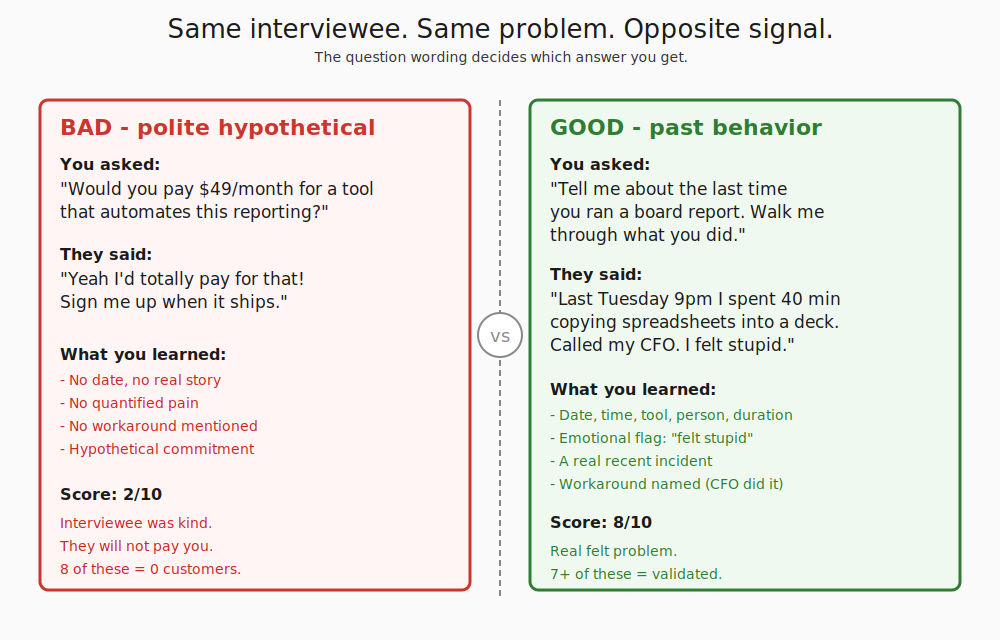
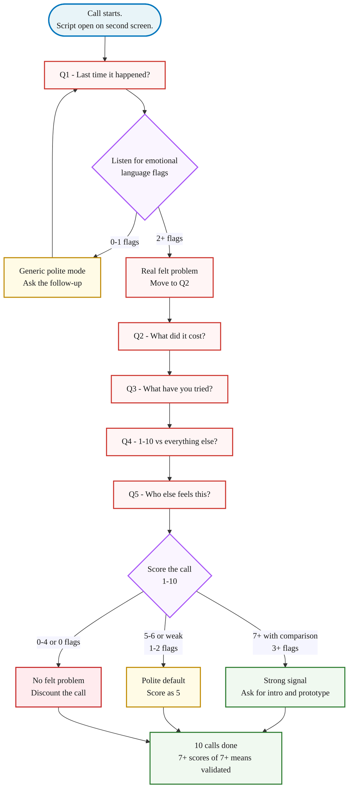

> **Module 2 · Lesson 2.1 · [CORE]** · [From Idea to First Paying Customer](/course/tech-for-non-technical-founders-2026/)
>
> **Input:** a Founding Hypothesis sentence (from Ch 1.1) + 3 ICP characteristics (ICP = Ideal Customer Profile - the specific kind of person your hypothesis names; introduced in Ch 1.1)
>
> **Output:** the 5-question Mom Test template + a draft question list (5-8 questions) ready to sharpen in Ch 2.2 and then run in real interviews after Ch 2.3-2.4 recruitment. The scoring rubric becomes your reference card once you have transcripts in hand.
>
> **Progress:** M2 · 1 of 6 · Results so far: all Module 1 artifacts - Module 2 starts here

> **TL;DR:** Five questions, all anchored in past behavior. Ask what they did last Tuesday, not what they'd do with a hypothetical product. Skip to: [The 5 questions ↓](#the-5-questions) · [The 3 emotional flags ↓](#the-3-emotional-language-flags) · [What to do tomorrow ↓](#what-to-do-tomorrow).

> **Where you are in the round:** If you do not have interview transcripts yet, read straight through. After your Ch 2.3-2.4 interviews, return to [Mom Test Synthesis](/course/tech-for-non-technical-founders-2026/mom-test-synthesis-build-pivot-kill/) to score your transcripts and decide build/pivot/kill.

Run eleven interviews where the only question is "would you pay for this?" and you'll close the week with nine yeses and an empty launch. The hypothetical question produces the polite shape - the answer says nothing about what the person actually did last Tuesday.

The technique below switches every question to the past tense. What did you do last time? What did it cost? Show me the spreadsheet. Past-tense questions force the answer back into reality; whoever pays in the past keeps paying in the future, and whoever did nothing in the past will do nothing in the future no matter what they tell you over coffee.

After this lesson you will be able to: **write interview questions that ask about past behavior - so the answers tell you what people actually did, not what they would politely promise.**

For the verbatim script + reference card, see [Mom Test Interview Script](/course/tech-for-non-technical-founders-2026/mom-test-interview-script/). This chapter teaches *why* those five questions work and how you'll score each call once interviews are done.

Next, sharpen your draft list with [AI personas in Ch 2.2](/course/tech-for-non-technical-founders-2026/ai-persona-pre-validation-mom-test-prep/), then recruit 10 interviewees in [Ch 2.3-2.4](/course/tech-for-non-technical-founders-2026/find-10-people-with-problem-outreach-2026/).

Rob Fitzpatrick's book [The Mom Test](https://www.momtestbook.com/) (2013) named the technique that prevents the polite-yes problem.

The core idea: ask interviewees to recount what they actually did the last time the problem happened, not what they think they'd do about a product you describe to them.

## The 5 questions you'll be tempted to ask (and why each one fails)

Before the working script, look at the questions a non-technical founder almost always writes on the first attempt. Each one feels like it's getting to the truth; each one is engineered to surface a polite lie.

| The question you'd write | Why it produces polite-yes | Fitzpatrick's past-behavior rewrite |
|---|---|---|
| "Do you find [problem] frustrating?" | Leading. The interviewee hears that you want a yes; their politeness reflex supplies one. | "Tell me about the last time [problem] happened." |
| "Would you use a tool that solved [problem]?" | Hypothetical-future. Their answer is a guess about a person who doesn't exist yet (their future self imagining a product that doesn't exist yet). | "Walk me through what you did the last time you tried to handle [problem]." |
| "How important is solving [problem] for you?" | Asks for a self-rating, which everyone inflates. People rate everything 7/10 to avoid sounding rude. | "What did the workaround cost you - in time, money, or sanity - the last time?" |
| "Would you pay $X for a solution?" | Pricing hypothetical. They have no skin in the game; saying yes costs them nothing. | "What have you already tried, paid, or built to deal with it?" |
| "Does this idea sound good to you?" | Compliment-fishing. The interviewee can't refuse without being mean to you. | "On a scale of 1-10, how would you rank fixing [problem] this year against the other 3 things on your list?" |

Every bad question above asks the interviewee to predict the future, rate something abstractly, or evaluate your idea - three different ways of asking them to imagine a future they have not lived yet. The rewrites all ask them to recount a specific past event instead, so the answer comes from memory and not from politeness.

## The 5 questions

The script runs in order. Each question funnels the interviewee deeper into a real memory of the problem. Read the questions as written - small wording changes ("would you" instead of "did you") flip the answer back into hypothetical polite, which is exactly the failure mode you are paying 30 minutes to avoid.

### Q1: "Tell me about the **last time** [problem] happened. Walk me through what you did."

- **What it catches**: whether the problem actually happens, how often, what mechanic the interviewee uses. A real story has a date and a tool.
- **Pass**: specific recent story. *"Last Tuesday at 9pm I spent 40 minutes copying numbers from three spreadsheets into a slide for the board."* Date, time, tool, duration, feeling.
- **Fail**: vague generality. *"Yeah I usually struggle with reporting."* No date, no mechanic - autopilot polite mode.
- **Follow-up**: *"Walk me through that specific Tuesday again. What did you do first?"*

### Q2: "What did that **cost** you - in time, money, or sanity?"

- **What it catches**: whether the pain is quantifiable. Separates "this is annoying" from "I'd pay $200/month to make this stop."
- **Pass**: a number with a unit. *"Two hours every Tuesday for six months."* / *"My CFO bills $200/hour and spent four hours on it last week."*
- **Fail**: *"It costs us time."* / *"It's frustrating."* Unquantified. Polite about a problem they don't actually feel.
- **Follow-up**: *"If you had to put a dollar figure on it - or hours, or 'I'd quit my job over this' - what's the number?"*

### Q3: "What have you **tried already** to fix this?"

- **What it catches**: existing workarounds. A hack, a paid tool, a hired VA, two spreadsheets duct-taped = real. Nothing tried = theoretical.
- **Pass**: a named tool, a hired person, a custom script. *"I pay $79/month for Zapier to copy QuickBooks to Google Sheets. It breaks every two weeks. My VA on Upwork fixes it."*
- **Fail**: *"Nothing yet."* / *"We just deal with it."* / *"I've been meaning to look into something."*
- **Follow-up**: *"What broke about the workaround? Why are you still talking to me about this?"* The crack is the gap your product would fill.

### Q4: "On a scale of **1-10**, how big a problem is this compared to everything else on your plate?"

- **What it catches**: urgency against the interviewee's whole problem stack. A 9 is a sales conversation. A 4 is a pat on the head and zero dollars.
- **Pass**: a 7 or higher **with a comparison**. *"This is an 8. The only thing higher is hiring my next engineer."*
- **Fail**: a 5-6 with soft justification, or a bare "probably a 7" with no comparison (the polite-default 7 - treat as a 5 until Q5 proves otherwise).
- **Follow-up**: *"What's at 10 for you right now? What would have to happen for this to climb to that 10 spot?"*

### Q5: "**Who else** on your team feels this? How do they handle it?"

- **What it catches**: the buying committee + workarounds other people in the company already built. In B2B, your interviewee is not the only nodder when the invoice arrives.
- **Pass**: a specific colleague named + their workaround. *"My ops manager Jess feels this worse than I do - she keeps a parallel Google Sheet because she doesn't trust the finance numbers from accounting."*
- **Fail**: *"I'm the only one who deals with this."* / *"Everyone else is fine."*
- **Follow-up**: *"Could you introduce me to Jess?"* An interviewee who won't make a 30-second intro probably won't pay you $49/month either.

## The 3 emotional-language flags

While the script runs, your job is to listen for three patterns. These flags do more work than the words "yes" and "no" the interviewee gives you.

| Flag | Example Phrases | What it signals |
|---|---|---|
| **Frustration language** | "I hate this." "It drives me crazy." "Every single week." "I can't believe we still do it this way." | If the interviewee uses words with feeling, the problem is felt. Polite interviewees suppress feeling - the opposite of what validation needs. |
| **Workaround language** | "I've been meaning to..." "We hacked together..." "I pay [tool] $X for this." "My VA does it manually." | Workarounds prove the problem is real because the interviewee already spent time or money on a solution that doesn't fully work. The workaround budget is the line item your product would replace. |
| **Urgency language** | "Last week." "This morning." "I missed my kid's birthday because of this." | A problem that happened today is felt more sharply than a problem that happens "sometimes." Time-anchored urgency is the strongest signal in the set. |

**Scoring the flags:** A passing call has 3 or more flags spread across the five answers. A failing call has 0 or 1 - the interviewee is being polite to you. Two flags is ambiguous; treat as a 5/10 default.

## The interview flow

Stick to the order. Improvise mid-call ("oh that reminds me of my product idea") and you contaminate the rest of the transcript - the interviewee starts answering the pitch instead of describing their own life. Read the questions as written, take notes by hand, score after.

## What to do tomorrow

Three actions. In order.

| Action | Why it matters | Gotcha to avoid |
|---|---|---|
| **Print [the Mom Test interview script artifact](#the-mom-test-interview-script-artifact) and open it on a second screen during the call.** Read the questions as written. | The wording does the work - if you paraphrase, you slip back into polite-yes mode and waste the call. | Don't improvise mid-call. Read as written. |
| **Take notes by hand, not by typing.** | Hand-writing slows you down enough that you stop transcribing and start listening for the three emotional flags. Typing during a call turns you into a court reporter. | Don't try to transcribe everything. Write the Q4 score and the flag count, not the full transcript. |
| **Score the call 1-10 within 5 minutes of hanging up.** Use Q4 plus your emotional-flag count. | If you score later, you will round up. By interview 10 you have a validation total, not 10 unsorted transcripts. | Don't defer scoring. Your gut scoring in the moment is more honest than the one after a week of wanting the number to be higher. |

Sometimes Q1 is wrong - the problem context is too narrow - and a broader framing wakes the interviewee up.

The [stop-looking-for-product-market-fit guide](/blog/stop-looking-for-product-market-fit-startup-tutorial/) covers what the validation signal does and doesn't tell you about whether you have product-market fit (spoiler: a validated problem is necessary, not sufficient).

## The Mom Test interview script artifact

The artifact at **[/course/tech-for-non-technical-founders-2026/mom-test-interview-script/](/course/tech-for-non-technical-founders-2026/mom-test-interview-script/)** carries the same 5 questions verbatim, the follow-ups, the pass/fail signals, the 3 emotional-language flags, and the scoring rubric.

**Save your draft list before moving on.** Open a new Google Doc titled `Mom Test draft - [date]` in the same `Founder OS` folder as your Founding Hypothesis. Copy the 5 verbatim questions from the artifact, then add 2-3 ICP-specific probes of your own (e.g., for a chiropractor ICP: "Walk me through your last insurance-claim resubmission. When did it happen?"). That 5-8 question list is the input Ch 2.2 expects you to sharpen against AI personas.

**How to use it:** Print the artifact. Keep it open on your second monitor during all 10 interviews. The artifact is the screen-side reference while this post is the explanation of why it works.

After 10 calls, you have either 10 scored transcripts that converge on a real problem (score them on [Chapter 2.5: Mom Test Synthesis](/course/tech-for-non-technical-founders-2026/mom-test-synthesis-build-pivot-kill/), then proceed to 2.6) or 10 transcripts that don't (re-frame the ICP and run another 10).

Fake the convergence to start building anyway, and you join the long line of post-mortem threads about wasted MVP spend. The [quality tax for AI MVPs](/blog/quality-tax-ai-mvp-cost/) is what happens when you ship against a hypothesis nobody confirmed.

> Customer interviews usually fail because the interviewees are polite. The questions do more work than interviewer charisma ever will.
>
> Anchor every question in a specific past moment - last Tuesday at 9pm, the last invoice, the last time the spreadsheet broke - and the polite-mode answers run out fast.

> **Optional: AI devil's advocate before your first interview.** [ValidatorAI](https://validatorai.com) (free tier) gives you an adversarial dialog: paste your draft question list, and it pushes back the way a skeptical interviewee would.
>
> It flags hypothetical questions, leading phrasing, and assumptions buried in your wording. Unlike Ch 2.2 persona rehearsal (which tests questions against simulated ICPs), ValidatorAI tests the questions themselves - are they built to surface real past behavior or polite agreement?
>
> Run it once before your first interview. It takes 5 minutes and catches the most common failure mode: a question list that produces coherent answers from anyone, regardless of whether they actually have the problem.

After all 10 interviews, return to [Mom Test Synthesis: Build, Pivot, or Kill](/course/tech-for-non-technical-founders-2026/mom-test-synthesis-build-pivot-kill/) to score your transcripts, count strong signals, and make the build / pivot / kill decision. That page has the 3-step synthesis, the decision flowchart, and the good-vs-bad problem statement examples.

## Further reading

- Rob Fitzpatrick, [The Mom Test (book site)](https://www.momtestbook.com/) - the canonical reference. The book runs 130 pages and explains why "would you pay for X?" is the most popular question and the worst.
- Y Combinator, [How to Talk to Users (Startup Library)](https://www.ycombinator.com/library) - YC's distilled rules for the same conversation, free and 20 minutes.
- Steve Blank, [The Four Steps to the Epiphany - Customer Discovery](https://steveblank.com/category/customer-development/) - the original customer-development methodology Fitzpatrick's script sits inside.
- Teresa Torres, [Continuous Discovery Habits](https://www.producttalk.org/continuous-discovery-habits/) - what these interviews become after the validation phase, when you run them weekly forever.

> **Done:** you understand the 5 Mom Test questions, can spot hypothetical phrasing, and have a draft question list (5-8 questions) anchored in past behavior.
>
> **You have now:** all Module 1 artifacts + a draft Mom Test question list (2.1). Sharpening and recruiting come next.
>
> **Next:** [2.2 · Sharpen Your Question List with AI Personas](/course/tech-for-non-technical-founders-2026/ai-persona-pre-validation-mom-test-prep/)
>
> **If blocked:** If the technique isn't clicking, open the [Mom Test Interview Script](/course/tech-for-non-technical-founders-2026/mom-test-interview-script/) artifact - it has the 5 questions verbatim. Print it, practice on a friend, then return.

---

*See it in action: [Module 2 walkthrough: Mia interviews ten parents](/course/tech-for-non-technical-founders-2026/module-2-walkthrough-mia/)*

*Built by [JetThoughts](https://jetthoughts.com) as part of the [From Idea to First Paying Customer](/course/tech-for-non-technical-founders-2026/) curriculum.*
