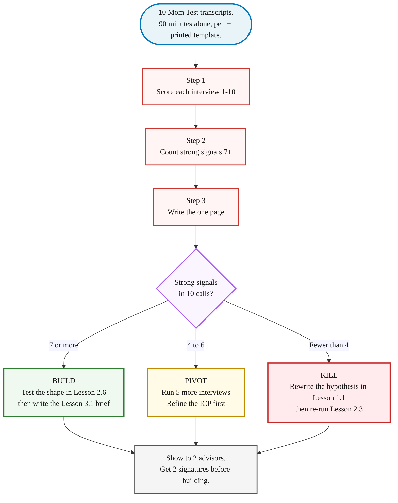

> **Module 2 · Lesson 2.5 · [CORE] - run after your 2.4 interviews** · [From Idea to First Paying Customer](/course/tech-for-non-technical-founders-2026/)
>
> **Input:** 10 scored Mom Test transcripts (from [Lesson 2.1](/course/tech-for-non-technical-founders-2026/mom-test-ask-about-past-not-future/)) + completed interviews (from [Lesson 2.3-2.4](/course/tech-for-non-technical-founders-2026/find-10-people-with-problem-outreach-2026/))
>
> **Output:** a build / pivot / kill decision + a one-page validated problem statement
>
> **Progress:** M2 · 5 of 6 · Results so far: question list + 30-name list + 10 scored interviews - this page turns the scores into a decision

> **TL;DR:** Score 10 transcripts, count strong signals, make one of three calls. 90 minutes. The decision you avoid here costs you a quarter of build time later.

> **You should be here AFTER your Lesson 2.3-2.4 interviews are done.** No 10 scored transcripts in hand? Return to [Lesson 2.1](/course/tech-for-non-technical-founders-2026/mom-test-ask-about-past-not-future/) for the technique, then [Lesson 2.3-2.4](/course/tech-for-non-technical-founders-2026/find-10-people-with-problem-outreach-2026/) for recruitment. This is the synthesis pass - you cannot complete it without real interview data.

After 10 interviews you have scored transcripts in a folder and a number. Synthesis is the 90-minute step that turns them into the one-page validated problem statement you carry into Module 3. Skip it and go straight to Lovable, and you have a folder and a hypothesis - not a validated problem.

## The 3-step synthesis

Ninety minutes alone with the 10 transcripts, a printed template, and the willingness to write down a number that might be a 3.

**Step 1 - Score each interview 1-10.** Combine your handwritten Q4 score and your emotional-flag count from the [Lesson 2.1 script](/course/tech-for-non-technical-founders-2026/mom-test-ask-about-past-not-future/) into one number. A **7+** means a Q4 of 7 or higher backed by a comparison (a polite-default 7 with no comparison rounds down to 5), plus at least 3 emotional-language flags across the five answers. A **4-6** is partial signal - a real story but a weak workaround. **Below 4** is polite-yes mode: vague answers, "nothing yet" on past attempts, a hedged Q4 under 7. Write the number on each transcript within 5 minutes of hanging up - it's more honest than the one you'd write after a week of wanting it higher.

**Step 2 - Count the strong signals.** List the 10 scores in a column and circle every 7 or higher. That circled count routes your decision. The pattern beats the average: eight 7+ and two 3s is a shared problem; three 9s and seven 4s is the dangerous one - you talked to your three best friends and seven strangers told you the truth.

**Step 3 - Write the one page.** Open the [Validated Problem Statement Template](/course/tech-for-non-technical-founders-2026/validated-problem-statement-template/) and fill five sections in 30 minutes: who has the problem, what it costs them, what they've tried, why now, and how big the pain is. One side of paper. Spill onto a second page and the persona is too broad. The template carries the field-by-field walkthrough and the good/bad worked examples.

## The decision: build / pivot / kill

Your strong-signal count from Step 2 routes you to one of three outcomes.

**7+ strong signals: build.** 70%+ of a stranger sample confirmed the problem with felt urgency. Before you write code, run the 3 pre-orders test: ask your 5 strongest-signal interviewees for a pre-order, a paid letter of intent, or a deposit. 3 of 5 yes is validation with money attached; 0 of 5 means the scores were politer than you thought. The statement then travels into [2.6 · Build a Clickable Prototype](/course/tech-for-non-technical-founders-2026/clickable-prototype-validation-2-hour-lovable/) to test the shape.

**4-6 strong signals: pivot.** Partial signal - usually an ICP problem, not a problem problem. Sharpen the ICP definition and run 5 more interviews against the narrower group. Those 5 interviews cost a week; a built MVP against a fuzzy ICP costs a quarter.

**Below 4 strong signals: kill.** Strangers were polite. Note what you learned about the wrong ICP, framing, or trigger, then return to [1.1 · Form Your Founding Hypothesis](/course/tech-for-non-technical-founders-2026/form-your-founding-hypothesis-90-minute-sprint/), rewrite the weakest blank from your dead transcripts, and rebuild your list in [2.3 · Find 10 People: Where to Look](/course/tech-for-non-technical-founders-2026/find-10-people-where-to-look/).

## What good looks like vs what bad looks like

**Bad problem statement (vague, unfilled):**
> **Bad** - Founders need a better way to validate their startup ideas. Many of them waste time and money.

**Good problem statement (specific, named, signed):**
> **Good** - Pre-seed B2B SaaS founders running their own discovery do customer interviews, but 9 of 10 (per our 10-call sample, Apr-May 2026) use hypothetical-future questions and get polite-yes answers. The average interviewee spends 6-12 hours running interviews and learns the problem wasn't real only after their first launch flops - typical sunk cost is 6 weeks of build time plus $15K-$30K of contractor spend. Workarounds tried: YC Library essays (too high-level), $1,500 SurveyMonkey panel (taught nothing in the survey style), free templates downloaded but not used. Why now: AI-built MVPs accelerated this failure mode - the prototype lands in 4 days instead of 12 weeks, so the validation gap surfaces faster. Pain average 7.6/10 across 10 calls, 8 strong signals.

The good statement has a named industry, a dated sample, named workarounds with named failure modes, a quantified cost, a why-now, and a strong-signal count. A peer can argue with it. If yours has the word "many" or "a lot," cross it out.

The [Validated Problem Statement Template](/course/tech-for-non-technical-founders-2026/validated-problem-statement-template/) is the artifact for this lesson. Print it, fill it in 30 minutes, get 2 signatures, and the problem-validation checkpoint is closed.

> **If this fails:** the numbers won't settle - a call feels like both a 7 and a 5. **Why:** you're scoring the Q4 number alone, without the comparison test and the flag count. **Fix:** re-read [Lesson 2.1's scoring rubric](/course/tech-for-non-technical-founders-2026/mom-test-ask-about-past-not-future/) - a 7 needs a comparison behind it plus 3+ emotional flags, or it rounds to 5.

---

> **Done:** you have a build / pivot / kill decision backed by your strong-signal count, and a one-page validated problem statement.
>
> **You have now:** question list (2.1-2.2) + 30-name list (2.3) + 10 scored interviews (2.4) + the build/pivot/kill decision. The orientation pages state this gate as "7 of 10 interviewees have spent time or money on the problem" - the same bar, because a transcript cannot score 7+ without real past spend surfacing in Q2/Q3.
>
> **Next:** If build - [2.6 · Build a Clickable Prototype](/course/tech-for-non-technical-founders-2026/clickable-prototype-validation-2-hour-lovable/) to test the shape with 5 of your strongest-signal interviewees, then [3.1 · The One-Page Product Brief](/course/tech-for-non-technical-founders-2026/one-page-product-brief-vibe-prd/). If pivot - sharpen the `[customer]` blank, then rebuild your list in [2.3 · Find 10 People: Where to Look](/course/tech-for-non-technical-founders-2026/find-10-people-where-to-look/). If kill - the hypothesis is wrong, not the list; return to [1.1 · Form Your Founding Hypothesis](/course/tech-for-non-technical-founders-2026/form-your-founding-hypothesis-90-minute-sprint/), rewrite the weakest blank, then re-run 2.3.
>
> **If blocked:** see "If this fails" above.
>
> **Deeper reference:** [Validated Problem Statement Template](/course/tech-for-non-technical-founders-2026/validated-problem-statement-template/) - the field-by-field synthesis walkthrough, good/bad worked examples for every section, and the advisor sign-off sheet.

---

*See it in action: [Module 2 walkthrough: Mia interviews ten parents](/course/tech-for-non-technical-founders-2026/module-2-walkthrough-mia/)*

*Built by [JetThoughts](https://jetthoughts.com) as part of the [From Idea to First Paying Customer](/course/tech-for-non-technical-founders-2026/) curriculum.*
