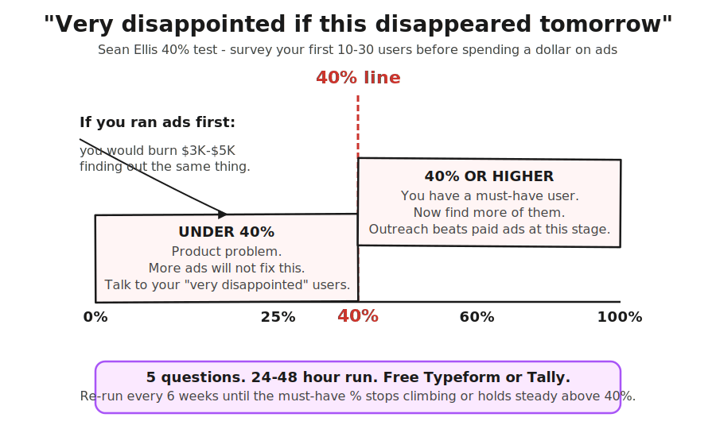

> **Module 5 · Lesson 5.1 · [CORE]** · [From Idea to First Paying Customer](/course/tech-for-non-technical-founders-2026/)
>
> **Input:** a live MVP + 10-30 users who touched it. **Don't have 10-30 yet?** Invite your Module 2 Mom Test interviewees + your [1.4 smoke-test email list](/course/tech-for-non-technical-founders-2026/smoke-test-landing-page-7-day-demand-test/) (typically 15-50 signups) to your staging URL as the warm seed. If under 10 users still touched it, run [Lesson 2.4 outreach](/course/tech-for-non-technical-founders-2026/find-10-people-with-problem-outreach-2026/) for 10 more before re-attempting this survey.
>
> **Output:** a written must-have-user persona with 3 verbatim quotes and one named segment to target
>
> **Progress:** M5 · 1 of 7 · Results so far: live MVP with your first users on it (4.4) - this page tests whether they'd miss it before you spend on ads

> **TL;DR:** Before you buy traffic, survey your earliest users. If fewer than 40% would be "very disappointed" if your product vanished, you have a product problem, not a marketing problem.

---

A founder's MVP goes live, 40 beta users poke at it, and the dashboard shows 0.4% conversion on $4,200 of Meta ads. That dashboard just told the founder what five phone calls would have said for free: most users never opened the app twice, and no ad budget turns that group into customers.

After this lesson you will be able to: **run the 5-question Sean Ellis survey against your earliest users and name the one segment worth selling to.**

---

## The 40% test, in one paragraph

Sean Ellis ran growth at Dropbox, LogMeIn, and Eventbrite, and kept seeing the same dividing line between products that ignited and products that needed life support. He surveyed each product's existing users with one load-bearing question: "How would you feel if you could no longer use [product]?" The answer is one of four: very disappointed, somewhat disappointed, not disappointed, no longer use it. If at least 40% said "very disappointed," the product could almost always grow on outbound and word of mouth alone. Under 40%, growth stalled until the product changed. Ellis explained the cutoff and wording on [Lenny Rachitsky's podcast](https://www.lennysnewsletter.com/p/the-original-growth-hacker-sean-ellis).

Use a free [Typeform](https://www.typeform.com) or [Tally](https://tally.so) form and a CSV export - no engineer needed. Survey people who used the product recently. Strip out anyone who signed up and never logged in twice (they can't answer), and the friends and family you onboarded as moral support (they'll all say very disappointed and tell you nothing).

## The 5 questions, verbatim

Open Typeform or Tally. Five questions, in this order. Wording matters - changing a word changes the answer.

> **Q1.** How would you feel if you could no longer use [product]?
> *(Multiple choice: Very disappointed / Somewhat disappointed / Not disappointed / No longer use [product])*
>
> **Q2.** What type of person do you think would most benefit from [product]?
> *(Short text - 1 sentence. Reveals who the must-have segment thinks the target is.)*
>
> **Q3.** What is the main benefit you get from [product]?
> *(Short text - 1 sentence. The verbatim language for your next ad copy if you do run paid later.)*
>
> **Q4.** How have you tried to solve this problem before? What did you switch from?
> *(Short text - 2 sentences. Tells you the competitive set the user actually compares against.)*
>
> **Q5.** What is your job title and company size?
> *(Two short text fields. Drives the segment slice.)*

Do not add a sixth question. Do not soften Q1 to "How disappointed would you be" - the original wording forces the user to pick a side.

## Score it

Export the CSV. Compute the "very disappointed" share, excluding "no longer use it" answers (they are churned users, not should-be-paying users). Pull three numbers: **overall must-have %**, **per-segment must-have %** (slice by job title and company size - one segment is almost always higher than the average, and that is your must-have segment), and **three verbatim Q2-Q3 quotes** from that segment. Those quotes are your persona, your ad copy, and your cold-email opener for Lesson 5.3.

Lay this segment beside the persona in your [Lesson 2.5 validated problem statement](/course/tech-for-non-technical-founders-2026/mom-test-synthesis-build-pivot-kill/). If real usage points at a different segment than the interviews did, that is a real correction - write the delta down; don't keep two personas.

## Read the result

The Sean Ellis test is directional at **≥ 10 respondents**, useful at **20+**, and segment-sliceable at **30+**. Under 10, read your count as a hypothesis, not a verdict, and use it to prioritize the next outreach batch. Then:

- **Under 25% overall:** product problem. Talk to 5 "very disappointed" users and find what you missed.
- **25-40%:** check whether any single segment clears 40%. If one does, target it and rebuild the persona on its quotes.
- **Over 40% in any segment:** you have a must-have user. [Lesson 5.3](/course/tech-for-non-technical-founders-2026/first-ten-customers-network-list/) outreach starts here.

---

> **Do this now:**
>
> 1. Export your users CSV. Strip the friends-and-family and the never-returned users. Annotate each row with job title and company size.
> 2. Open Typeform or Tally. Type the five questions above verbatim.
> 3. Send the email. Subject: *"Quick 90-second question about [product]"*. Re-send a few days later to non-openers.
> 4. Export the responses. Compute overall must-have % and per-segment must-have %.
> 5. Paste three Q2-Q3 verbatims from your top segment into a Google Doc.
> 6. **Success check:** you have a headline %, a top-segment %, and 3 verbatim quotes - and you know whether any segment cleared 40%.

---

**If this fails: under 10 users responded.**
- **Why:** your sample is too small to read, and segment-slice math does not work.
- **Fix:** book 5-10 more user sessions with the [Lesson 2.3](/course/tech-for-non-technical-founders-2026/find-10-people-where-to-look/)-[2.4](/course/tech-for-non-technical-founders-2026/find-10-people-with-problem-outreach-2026/) outreach playbook and re-run the survey. Treat looping back for more sessions as the default first-pass move, not a setback.

---

Treat the answer as a stop sign, not a market-research instrument. Under 40% means the next thing on your calendar is five user calls, not a Meta Ads brief.

The full survey template (Typeform-import format, the per-segment scoring spreadsheet, and the persona-writeup template) ships in [the First-Paying-Customer Operating Kit](/course/tech-for-non-technical-founders-2026/first-paying-customer-operating-kit/).

> **Deeper reference:** [The full must-have survey walkthrough](/course/tech-for-non-technical-founders-2026/reference/must-have-survey-full/) - who to survey and who to strip, the send email, the per-segment scoring math, the decision tree, the under-40% diagnostic table, and the read-by-count guide.

> **Done:** you have run the 5-question Sean Ellis survey, computed the overall and per-segment must-have %, and have 3 verbatim Q2-Q3 quotes from your top segment.
>
> **You have now:** a live MVP (4.4) + a written must-have-user persona with 3 verbatim quotes and one named segment (5.1). You know whether your earliest users would miss the product, and which segment to sell to - but you have not reached out to anyone yet.
>
> **Next:** the core path continues at [5.3 · Build Your 50-Name Network List](/course/tech-for-non-technical-founders-2026/first-ten-customers-network-list/) - it turns the named segment into the first 50 people you will message. If you are not sure where your buyers actually spend their time, read the optional [5.2 · channel selection](/course/tech-for-non-technical-founders-2026/channel-selection-before-outbound/) first.
>
> **If blocked:** if under 10 users responded, your sample is too small to read. Book 5-10 more user sessions using the Lesson 2.3-2.4 outreach playbook and re-run the survey.

---

*See it in action: [Module 5 walkthrough: Mia gets paid](/course/tech-for-non-technical-founders-2026/module-5-walkthrough-mia/)*

*Built by [JetThoughts](https://jetthoughts.com) as part of the [From Idea to First Paying Customer](/course/tech-for-non-technical-founders-2026/) curriculum.*
