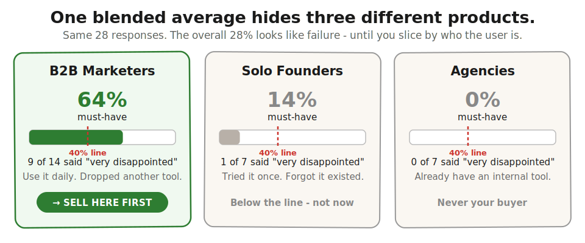
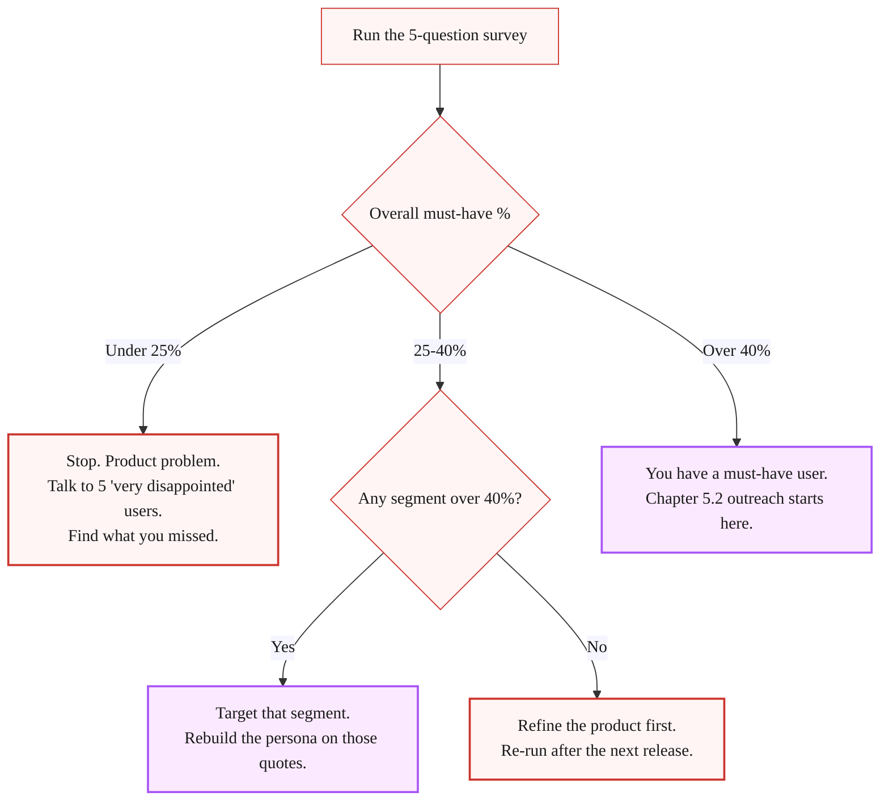

> **Module 5 · Step 1 of 5** · [From Idea to First Paying Customer](/course/tech-for-non-technical-founders-2026/)
>
> **Input:** a live MVP + 10-30 users who touched it. **Don't have 10-30 yet?** Invite your Module 2 Mom Test interviewees + your [1.2b smoke-test email list](/course/tech-for-non-technical-founders-2026/smoke-test-landing-page-7-day-demand-test/) (typically 15-50 signups) to your staging URL as the warm seed. If under 10 users still touched it, run [Ch 2.3b outreach](/course/tech-for-non-technical-founders-2026/find-10-people-with-problem-outreach-2026/) for 10 more before re-attempting this survey.
>
> **Output:** a written must-have-user persona with 3 verbatim quotes and one named segment to target

> **TL;DR:** Before spending a dollar on ads, survey your earliest users. If fewer than 40% would be "very disappointed" if your product vanished, you have a product problem, not a marketing problem.

Tuesday morning, 9:14 AM. A SaaS founder I spoke with last quarter opened her Meta Ads dashboard, saw a 0.4% conversion rate on $4,200 of spend, and refreshed it three times. Six weeks earlier she had taken her live MVP to forty users from a beta list, watched them poke around for two days, and decided the next move was "scale the top of funnel."

She wrote the ad copy on a Friday, launched Monday, and by Wednesday the dashboard told her the same thing it would have told her if she had simply called five of those forty users: nobody opened the app twice. The $4,200 bought her a number she could have gotten for free.

Her instinct was the one every non-technical founder has after the MVP ships: build the audience. The real question is whether the people who already touched the MVP would notice if it vanished tomorrow. If less than 40% would be very disappointed, no amount of ad spend will turn that group into customers. Paid traffic will not fix a product problem; it just routes more users into something they will not return to.

> **What your first-pass numbers will probably look like (and that is not a failure signal).** An idea-stage founder with 4-6 onramp users typically sees one of three patterns on the first survey run:
> - All "somewhat disappointed" or "not disappointed" → directional KILL. Run more interviews before re-attempting.
> - 2-3 "very disappointed" out of 6 → directional MAYBE. Almost certainly a sample-size problem, not a product problem; book 5-10 more users.
> - 4+ "very disappointed" out of 6 → directional YES. Advance to M5.2 with the caveat above.
>
> A 25-40% reading at small sample size is not a failure. It is the normal state of a brand-new product with a brand-new founder. The Sean Ellis test is calibrated for ≥ 20 respondents with months of usage; your first-pass run is a forecast, not a verdict. Treat looping back to M2.3 outreach for more user sessions as the default first-pass move, not a setback.

## The 40% test, in one paragraph

Sean Ellis ran growth at Dropbox, LogMeIn, and Eventbrite. While he was building the playbook for those three, he kept noticing the same dividing line between products that ignited and products that needed life support. He surveyed every product's existing users with a single load-bearing question: "How would you feel if you could no longer use [product]?" The answer is one of four: very disappointed, somewhat disappointed, not disappointed, no longer use it. If at least 40% of users said "very disappointed," the product was almost always able to grow on outbound and word of mouth alone. Under 40%, growth stalled until the product changed. Ellis explained the cutoff and the survey wording on Lenny Rachitsky's podcast in 2023 ([transcript and replay here](https://www.lennysnewsletter.com/p/the-sean-ellis-test-for-product-market)).


## Why you, the non-technical founder, get this wrong

You just shipped your first Lovable MVP and 40 people from your beta list poked at it. The natural urge is to start collecting traction numbers immediately - surveys feel like a delay, ads feel like progress. And because you cannot read the codebase, "the conversion rate is 0.4%" sounds like a UX problem (a thing you can act on) instead of a product problem (a thing you cannot diagnose). Ad spend feels safer than going back into the build.

The Twitter threads make it worse. On day 90 after launch, every thread is some growth marketer explaining that the founder of a now-public company spent $4M on Meta in the first six months. The threads do not mention that the founder ran the 40% test in week one and got 56% on a sample of 22.

This pattern repeats often enough across early-stage founders we have spoken with that we now ask the must-have rate before we ask anything else: founders who burned thousands on paid ads almost always had a must-have rate they had never measured. Some were under 25% overall - genuine "no must-have user" territory. Others had a high rate in one segment and a low rate in another, but their ad spend targeted the wrong half because the high-need segment was harder to reach. Knowing the number before the ad spend is the difference between an expensive lesson and a cheap one.

## How to run the test, end to end

The KISS path is a free Typeform or Tally form and a CSV export. No Rails webhook, no Postgres table, no engineer.

### Step 1 - Who you survey

You need enough responses from people who have used your product recently to spot a segment pattern; a few dozen is the floor. Pull the list from whatever you have:

- The MVP database (sign-up table). For a Lovable, Bubble, or Supabase build, export `users` as CSV.
- Your beta waitlist if it converted to active users.
- The trial list if you ran paid trials.

If you only have ten users, that is fine. Sean Ellis has written that even ten responses are directional. Ten of ten "very disappointed" is a louder signal than 40 of 100. You are not running a peer-reviewed study; you are looking for a dividing line.

Strip out two groups before you send:

- Anyone who signed up and never logged in twice. They never used the product, so the question is unanswerable.
- Friends and family who you onboarded as moral support. They will all say very disappointed and tell you nothing.

What is left is your sample. Annotate each row with the user's job title and company size before you send, so the CSV export later can be sliced by segment in one filter.

### Step 2 - The 5 questions, verbatim


Open Typeform or Tally. Five questions, in this order. Wording matters - changing a word changes the answer.

> **Q1.** How would you feel if you could no longer use [product]?
> *(Multiple choice: Very disappointed / Somewhat disappointed / Not disappointed / No longer use [product])*
>
> **Q2.** What type of person do you think would most benefit from [product]?
> *(Short text - 1 sentence. Reveals who the must-have segment thinks the target is.)*
>
> **Q3.** What is the main benefit you get from [product]?
> *(Short text - 1 sentence. The verbatim language for your next ad copy if you do run paid later.)*
>
> **Q4.** How have you tried to solve this problem before? What did you switch from?
> *(Short text - 2 sentences. Tells you the competitive set the user actually compares against.)*
>
> **Q5.** What is your job title and company size?
> *(Two short text fields. Drives the segment slice in step 4.)*

That is the survey. Do not add a sixth question. Do not change Q1 to "How disappointed would you be" - the original wording forces the user to pick a side. Tinker with the question and you consistently report softer numbers because you introduced a hedge.

### Step 3 - Send it

Email subject line that works in 2026: *"Quick 90-second question about [product]"*. Body, three lines:

> Hi [first name], building [product] and trying to figure out who really uses it. Would you spend 90 seconds on this? [link]
>
> No pitch. No follow-up. I read every response by hand.
>
> Thanks, [your name]

Send the first batch to your largest user cluster. Re-send a few days later to anyone who has not opened. You will hit a 30-50% response rate on a list under 100, which is enough.

### Step 4 - Score it

Export the CSV. Pivot on Q1 by segment from Q5. You are computing one number per segment:

```
must_have_pct = ("Very disappointed" count) / (total responses excluding "No longer use it")
```

The "no longer use it" answers come out of the denominator. They are churned users, not should-be-paying users.

Pull three numbers:

1. **Overall must-have %.** The headline figure.
2. **Per-segment must-have %.** Slice by job title and by company size. One segment will almost always be higher than the average. That is your must-have segment.
3. **Three verbatim Q2-Q3 quotes from your must-have segment.** Paste them into a Google Doc. Those quotes are your persona description, your ad copy, and your cold-email subject line for the next chapter.



### Step 5 - The decision tree



> *Re-run cadence: re-run while the must-have rate is climbing and after every major release once it holds above 40% for two consecutive runs. If a re-run drops, read the "somewhat disappointed" Q2-Q4 verbatims first - the diagnostic is in there.*

> **Sample-size honesty.** The Sean Ellis 40% threshold is statistically directional at **≥ 10 respondents**, useful at **20+**, and segment-sliceable at **30+**. Under 10 respondents your result is a hypothesis, not a verdict. If you have 6 users say "very disappointed" and 4 say "somewhat disappointed", the 40% threshold says PASS - but with a ±40 percentage-point confidence band around that number, you do not know whether real demand is 20% or 80%. Treat any reading under 10 respondents as **directional only**: use it to prioritize the next outreach batch, not to advance into Module 5.3 with confidence.

> **Sample under 10 respondents (special case):** segment-slice math does not work. Do NOT classify by 25-40% bands. Instead:
> - **0-2 "very disappointed"**: treat as directional NO. Book more user sessions before re-running.
> - **3-4 "very disappointed"**: directional MAYBE. Book 5-10 more users, re-run.
> - **5+ "very disappointed" out of 6**: directional STRONG YES. Advance to M5.2 but caveat your channel decisions - the segment language is hypothesis, not verified.

## What "under 40%" actually means

Under 40% means you have a product problem, not a marketing problem, and the Q2-Q4 verbatims tell you which one.

| Pattern | Diagnostic | Fix | Re-entry point |
|---|---|---|---|
| **You built for the wrong segment** | The product works, but the people you onboarded do not have the pain. Your Q5 slice shows: one segment is at 55%, the rest are at 5%. | Stop selling to the audience and start selling to the segment. | [Chapter 5.2](/course/tech-for-non-technical-founders-2026/first-ten-customers-personal-network/) personal-network outreach to the right segment. |
| **You built the right thing, but it is not finished** | The Q3 verbatims are hedged ("it is nice to have," "I would use it if it had X"). The main benefit answers lack conviction. | Go back into the build and finish the thing. | Schedule a [Friday demo](/course/tech-for-non-technical-founders-2026/friday-demo-rule-founder-progress/) with the next release. |
| **The pain is real, but your product is not the relief** | The Q4 verbatims name a workaround that is already 80% of the job (a spreadsheet, an existing tool, a person they pay). | Either niche into the 20% the workaround does not cover, or pivot. | [Chapter 2.1](/course/tech-for-non-technical-founders-2026/mom-test-ask-about-past-not-future/#synthesis-write-down-what-you-heard-decide-whats-next) validated-problem statement. |
| **The product solves the pain, but the workflow is too long** | Users say "very disappointed" but session logs show they bailed before the payoff. Funnel collapses between signup and the "30-minute save" moment. | UX cut, not a strategy pivot. Shorten the path to the first win. | Retest after shortening the funnel; re-run the 40% test after the next UX release. |

## When founders should skip the test

| Condition | What to do instead |
|---|---|
| **Under 10 users** | Run [Chapter 2.3b outreach](/course/tech-for-non-technical-founders-2026/find-10-people-with-problem-outreach-2026/) (with the list-building method from [2.3a](/course/tech-for-non-technical-founders-2026/find-10-people-where-to-look/) if you don't already have a 30-name list) and book 10 more user calls before re-attempting the test. The test requires 10-30 users who actually touched the MVP to be meaningful. |
| **Pre-launch** | Use the [Mom Test interview script](/course/tech-for-non-technical-founders-2026/mom-test-interview-script/) instead. The 40% test asks "if you could no longer use the product" - if the user never used it, the answer is meaningless. |

## Advanced (optional)

> **Layering on segment isolation for 100+ users:**
> After you run the 40% test once and close your first paid pilot,
> read Sean Ellis's original [*Hacking Growth*](https://hackinggrowth.org/)
> and the [Superhuman PMF Engine](https://review.firstround.com/how-superhuman-built-an-engine-to-find-product-market-fit/).
> Both combine the 40% test with structured segment-isolation workflows.
> The main path above is enough for the Module 5 decision;
> the advanced version becomes relevant after your first 10 customers ship.

## What to do next

| Step | Action | Output |
|---|---|---|
| **1** | Export your users CSV. Strip the friends-and-family and the never-returned users. Open Typeform or Tally. Type the five questions verbatim. | Typeform/Tally survey ready to send |
| **2** | Send the email to the list. Subject: *"Quick 90-second question about [product]"*. Re-send a few days later to non-openers. | 30-50% response rate expected |
| **3** | Export the responses CSV. Compute overall must-have % and per-segment must-have % (by job title and company size). | One-page scorekeeping: headline %, top segment %, three verbatim quotes |
| **4** | Paste three Q2-Q3 verbatims from your top segment into a Google Doc. Review which segment hit 40%+ (or if none did). | Persona writeup ready for Chapter 5.2 or decision on pivot |
| **5** | If above 40% in any segment, move to [Chapter 5.2 personal-network outreach](/course/tech-for-non-technical-founders-2026/first-ten-customers-personal-network/). If below 40% across all segments, book five "very disappointed" user calls and re-read [Chapter 2.1 Mom Test](/course/tech-for-non-technical-founders-2026/mom-test-ask-about-past-not-future/). | Decision made; next chapter unlocked OR product refinement scheduled |

The full survey template (the 5 questions in a Typeform-import-ready format, the per-segment scoring spreadsheet, and the persona-writeup template) ships in [the First-Paying-Customer Operating Kit](/course/tech-for-non-technical-founders-2026/first-paying-customer-operating-kit/).

Treat the answer as a stop sign rather than a market-research instrument. Under 40% means the next thing on your calendar should be five user calls, not a Meta Ads brief.

## Further reading

- Lenny Rachitsky, [The Sean Ellis test for product/market fit](https://www.lennysnewsletter.com/p/the-sean-ellis-test-for-product-market) - the original 40% framing, with Sean's own commentary on what the number means and does not mean.
- Sean Ellis and Morgan Brown, [*Hacking Growth*](https://hackinggrowth.org/) - the book that explains the survey-driven north-star approach Ellis built at Dropbox, LogMeIn, and Eventbrite.
- Lenny Rachitsky, [How to win your first 10 B2B customers](https://www.lennysnewsletter.com/p/how-to-win-your-first-10-b2b-customers) - companion piece that maps the must-have-user concept to the first-ten-customer playbook.
- Steve Blank, [The Customer Development Manifesto](https://steveblank.com/2010/01/25/the-customer-development-manifesto-reasons-for-the-revolution-part-1/) - the foundational framing for "get out of the building and validate before building." The Sean Ellis test is the post-build analog.
- Rahul Vohra, [How Superhuman built an engine to find product-market fit](https://review.firstround.com/how-superhuman-built-an-engine-to-find-product-market-fit/) - the segment-isolation playbook layered on top of the 40% test.
- Rob Fitzpatrick, [*The Mom Test*](https://www.momtestbook.com/) - the pre-launch validation companion. Once your 40% test is above the line, the Mom Test questions are the ones you ask the 10 must-have users on their next call.

> **Done when:** You have run the 5-question Sean Ellis survey, computed the overall and per-segment must-have %, and have 3 verbatim Q2-Q3 quotes from your top segment.
> **Next click:** [5.2 · Choose Your Channel Before You Send One Message](/course/tech-for-non-technical-founders-2026/channel-selection-before-outbound/)
> **If blocked:** If under 10 users responded, your sample is too small to read. Book 5-10 more user sessions using the Ch 2.3 (a + b) outreach playbook and re-run the survey.

> **Case Study: Tomas & Mia**
>
> **Tomas**: Runs the Sean Ellis survey on his 24 smoke-test signups. Segments by firm size: 50-150 employee firms score 45% "very disappointed" without it. 150-200 employee firms score 28% - they have in-house tools. Narrows to 50-150 employee firms.
>
> **Mia**: Runs the Sean Ellis survey on her 21 smoke-test signups. Segments by child age: parents of kids 8-14 with dyslexia score 52% "very disappointed." Parents of kids 14+ score 31% - they've found workarounds. Narrows to parents of kids 8-14 with dyslexia/ADHD.

---

*Built by [JetThoughts](https://jetthoughts.com) as part of the [From Idea to First Paying Customer](/course/tech-for-non-technical-founders-2026/) curriculum.*
