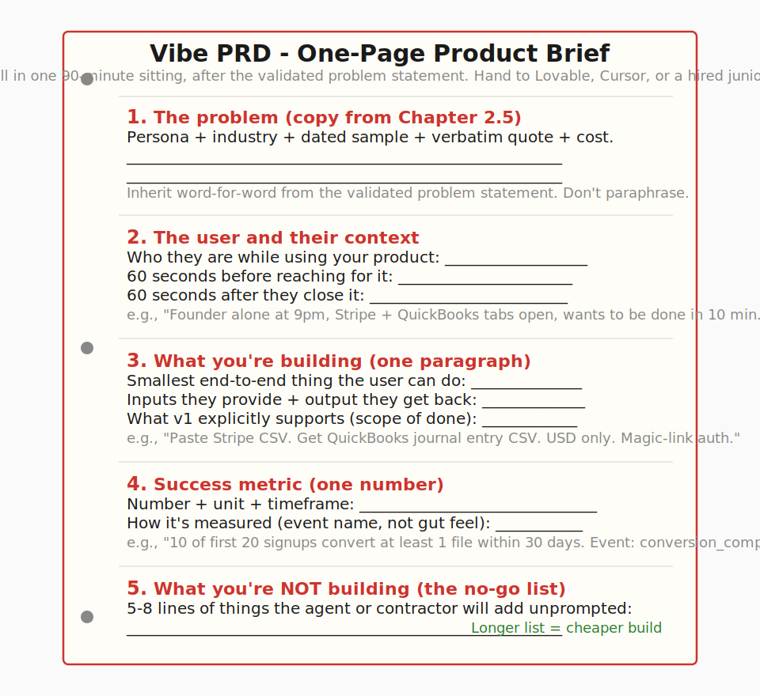
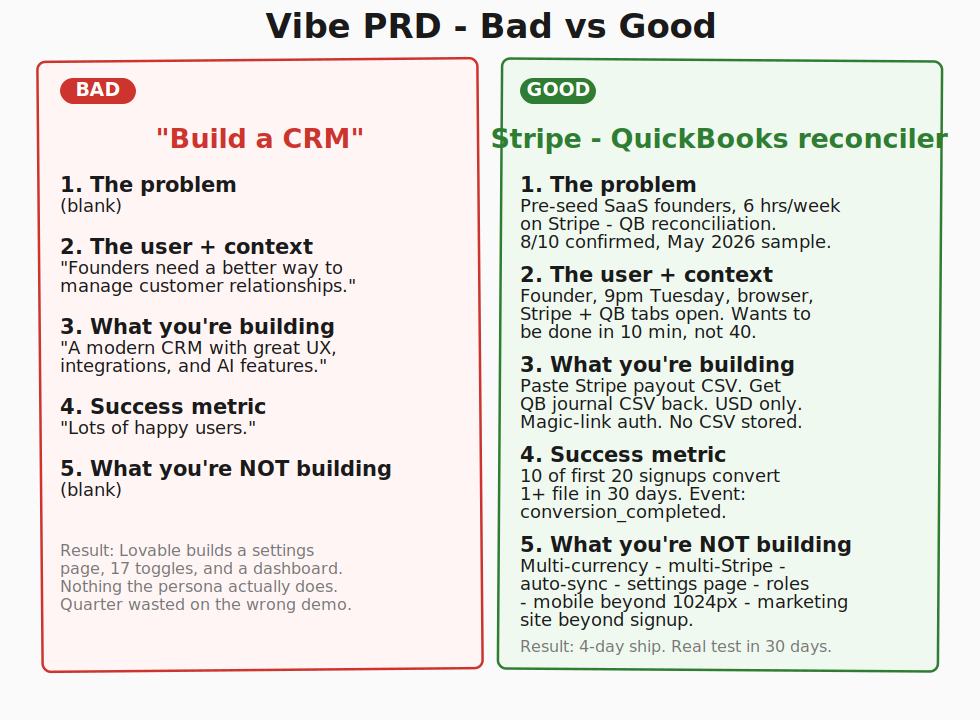
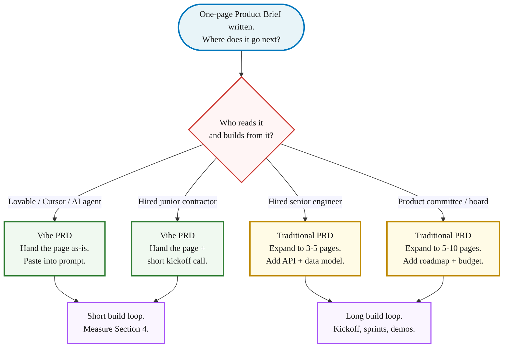

> **Module 3 · Step 1 of 2** · [From Idea to First Paying Customer](/course/tech-for-non-technical-founders-2026/)
>
> **Input:** a one-page validated problem statement (from the [Chapter 2.1 synthesis](/course/tech-for-non-technical-founders-2026/mom-test-ask-about-past-not-future/#synthesis-write-down-what-you-heard-decide-whats-next), after running interviews in Ch 2.3)
>
> **Output:** a one-page Product Brief (Vibe PRD) you can hand to Lovable or a hired team

> **TL;DR:** One page, five sections. The problem (verbatim from interviews), the user's 60-second context, the one workflow, the one metric, and what you're NOT building. Hand it to Lovable or a contractor tomorrow morning.

Sarah, an EdTech founder we audited in Q2 2026, had 17 settings toggles in her admin UI. In a one-day spec review we found 12 had no backend code and 2 crashed on toggle. The Vibe PRD she wrote next listed 5 settings she actually needed. Everything else came out. That is what a one-page brief does to a build that has drifted - it forces every line to earn its place tomorrow morning.

This chapter walks you through the **Product Brief** - some founders call it a **Vibe PRD** (PRD stands for Product Requirements Document). It is a single page that names the user, the problem, the one workflow you are building, the one metric you will measure, and what you are explicitly NOT building. The five sections below are the same ones Drew Falkman teaches in a 4-week Maven cohort for $1,000; this chapter walks you through the template so you can fill yours in tonight.

## Who reads it: an AI agent or a hired junior, not a 6-person team

| Audience | Read count | Iteration shape | Cost of a bad brief |
|---|---|---|---|
| **Traditional PRD** (6-person team) | 6 people read it + 1 kickoff call + refinement rounds | Long iteration loop, multiple reviewers | Team builds the wrong thing slowly; you learn in sprints |
| **Vibe PRD** (AI agent or junior) | 1 read, then building starts | Short iteration loop, one builder | Lovable ships you a wrong thing on Wednesday, and you spend the quarter discovering why it's hard to evolve |

[Veracode's 2025 GenAI report](https://www.veracode.com/blog/genai-code-security-report/) found 45% of AI-generated code ships with at least one exploitable security flaw. The brief is your only chance to constrain what the agent or the junior builds for you, and what they skip.

## The 5-section template

The Vibe PRD is one side of paper. Five sections, in this order. Each section is written so an AI agent or a junior contractor can act on it without a follow-up Slack thread.

The simplest reliable order is *problem → user → build → metric → no-go*. Every section has a job. Skip one and your prompt or your contractor fills it in for you, usually wrong.

> **How long is each section?** Each of the 5 sections is 2-4 sentences in plain English. Section 5 (no-go list) is 5-8 bullet lines. Total brief ≤ 250 words on one side of A4 at 11pt. If you spill past 250 words, the persona is too broad or the pain is too vague - revise the section that ran longest first.

### Section 1 - The problem (lifted from Chapter 2.1 synthesis)

What goes in it: one paragraph copied directly from your [validated problem statement](/course/tech-for-non-technical-founders-2026/mom-test-ask-about-past-not-future/#synthesis-write-down-what-you-heard-decide-whats-next). Named persona, named industry, dated 10-call sample, one verbatim quote, one quantified cost.

Example: *Pre-seed B2B SaaS founders doing their own Stripe-to-QuickBooks reconciliation lose 6 hours per week and £800 per month in CFO contractor time. 8 of 10 interviewees confirmed (May 2026 sample). One founder said: "Tuesday at 9pm I spent 40 minutes copying Stripe payouts into QuickBooks. I called my CFO. She did it in 90 seconds."*

Common mistake: rewriting the problem in your own voice for the brief because "this is a different document." The brief inherits the problem statement word-for-word. If you find yourself softening the language, you are about to brief a build for a problem you haven't actually validated.

### Section 2 - The user and their context

What goes in it: who the user is *while* they're using your product. Not the persona's life story. The 60 seconds before they reach for your thing and the 60 seconds after.

Example: *A pre-seed founder, alone in their browser at 9pm on a Tuesday, finishing the week's bookkeeping. They have a Stripe dashboard open in one tab and a QuickBooks ledger in another. They are tired, mildly annoyed, looking for a way to finish in 10 minutes instead of 40. They will open our app from a bookmark, paste one Stripe export, and close the tab when the numbers line up.*

Common mistake: writing the persona's company size, ARR (annual recurring revenue), and tech stack as if pitching to investors. The agent or contractor doesn't need their TAM. They need to know the user is tired, has two tabs open, and wants to be done. Specific context produces a usable interface; abstract persona data produces a dashboard with seventeen filters nobody uses.

### Section 3 - What you're building (one paragraph, plain English)

What goes in it: one paragraph that names the smallest end-to-end thing a user can do. Verb-led. Mentions the inputs the user provides and the output they get back. No feature list, no tech stack instructions, no mention of microservices or auth strategies.

Example: *A web app where the founder pastes a Stripe payout CSV and the app returns a QuickBooks-compatible journal entry CSV they can import in one click. The first version supports USD only, one Stripe account per user, and no multi-currency. The user authenticates with email + magic link. We never store the CSV after the conversion completes.*

Common mistake: writing this in feature-list form ("Stripe integration · QuickBooks export · user dashboard · settings page"). The agent reads the feature list and produces a settings page nobody asked for and an integration that breaks in the first edge case. One paragraph forces you to name the thing the user *does*, not the menu items the engineer might build.

### Section 4 - Success metric (one)

What goes in it: one number, with a unit, that tells you whether the build worked. Measurable inside the app, not from your gut. Named timeframe.

Example: *Of the first 20 users who land on the app, 10 successfully convert at least one Stripe export to a QuickBooks journal entry within 30 days of signup. Below that, the persona is wrong or the workflow is wrong. The metric is the conversion-completed event in our analytics, not signups.*

Common mistake: listing three metrics (signups, retention, NPS) instead of one. Three metrics let you cherry-pick whichever one looks best. One metric forces a build/no-build decision in 30 days. The [pre-PMF founder rule](/blog/sales-pre-pmf-should-be-done-by-founders/) applies: one number, measured by you, defended in front of one advisor.

### Section 5 - What you're NOT building (the no-go list)

What goes in it: 5 to 8 lines naming the things a competent agent or contractor might add unprompted, that you explicitly do not want in v1. The longer this list, the cheaper your build.

Example: *Not in v1: multi-currency support, multi-Stripe-account support, automatic recurring sync, a settings page, a billing dashboard, user roles and permissions, a marketing site beyond the signup page, mobile responsive design beyond "works on a 1024px screen." We will revisit each of these after metric in Section 4 is hit.*

Common mistake: leaving this section blank because "we'll just say what we want and skip what we don't." Lovable, [Cursor](https://cursor.com), and a hired junior all fill blanks with reasonable defaults, and reasonable defaults stack into a settings page nobody asked for. The same shape produced Sarah's 17 toggles (12 wired to nothing) at the top of this chapter.

## The 2 forks: Vibe PRD vs traditional PRD

Not every brief is a Vibe PRD. The audience tells you which to write.

**Vibe PRD if** the next stop is Lovable, Cursor, or a hired junior contractor. The one-page format is enough. The junior asks clarifying questions during the kickoff call; you answer in the same plain English you wrote the brief in. A senior would expect more context; a junior with an AI assistant ships faster from less.

**Traditional PRD if** the next stop is a senior engineering team, an in-house product committee, or a board that needs a budget number attached. Senior engineers read briefs to find load-bearing assumptions you haven't named, and they expect a data model, an API outline, and an integration list. Product committees expect a roadmap, a phasing plan, and a go-to-market section. Both audiences will write the missing parts themselves if you don't include them, which is rarely what you want.

The trap most founders fall into is writing a traditional PRD for a junior or an AI agent. The 5-page document buries the one paragraph the builder needed. By page 3, the agent has skimmed past the no-go list and started building a settings page.

## When the $1,000 Maven course is worth it

Drew Falkman runs ["Vibe Coding Data-Enabled AI Apps" on Maven](https://maven.com/), a 4-week cohort priced at $1,000. The course teaches the same five-section Vibe PRD template, plus the Lovable + Supabase + Stripe + GitHub stack, plus live community and 1:1 instructor feedback. The Maven [course reviews](https://maven.com/p/about) hover around 4.8/5.

| Scenario | Maven cohort is worth it | This template is enough to start |
|---|---|---|
| You wrote the page tonight and can't tell whether it is good. | Yes. Go for peer review + feedback. | Actually, post the draft in a founder Slack - free feedback in 2 hours. |
| Accountability is your blocker. (3 abandoned briefs in a drawer.) | Yes. The cohort structure + deadline forces you through. | No. You need external structure. The template alone won't help. |
| You want to go deeper on Lovable + Supabase + Stripe stack mechanics. | Yes. The cohort spends 2 of 4 weeks on this. | No. You'll need the stack tutorials anyway; the template is concept-only. |
| You can sit alone for 2 hours and finish the brief from the page above. | No. | Yes. The cohort buys peer review + deadline + deeper stack work, but you'll ship either way. |

**Rule of thumb:** If you can sit alone for two hours and finish the brief, start here. The cohort buys structure, deadline, and stack depth. If you can't sit alone, $1,000 buys the accountability that gets the brief out of you.

## What to do tomorrow

| Step | Action | Output |
|---|---|---|
| **1** | Block a focused session tomorrow morning. Open your [Validated Problem Statement](/course/tech-for-non-technical-founders-2026/validated-problem-statement-template/) + [Vibe PRD Template](/course/tech-for-non-technical-founders-2026/vibe-prd-template/) side by side. | Rough draft of all 5 sections. Copy Section 1 verbatim; fill Sections 2-5 from scratch. |
| **2** | Read the brief aloud to one peer over coffee or a short call. Ask: "If you had to build this in a week using Lovable, what would you build that isn't in my no-go list?" | First answer = your missing no-go item. Add it to Section 5. |
| **3** | Paste the brief into Lovable, Cursor, or your contractor's kickoff doc. Do NOT edit it for the audience. Same one page goes to everyone. | The agent or contractor starts building Tuesday morning. |

The [Vibe PRD Template](/course/tech-for-non-technical-founders-2026/vibe-prd-template/) is the artifact for this post. Print it, fill it in one focused sitting, hand it to your AI agent or contractor the next day, and Module 3's checkpoint moves one step closer.

Skipping the brief and going straight into prompting is the most common way a non-technical founder ends up deep into a working MVP they realise they did not actually want - and into the [salvage-or-rebuild question](/course/tech-for-non-technical-founders-2026/salvage-vs-rebuild-decision-tree/) that follows. One focused sitting on this page tonight is what spares you that detour.

## What comes next (Chapter 3.2, then Chapter 4.1)

You now have two validated artifacts: a one-page problem statement (from Chapter 2.1 synthesis) and a one-page Vibe PRD (from this chapter). Two more steps before Lovable touches your brief:

1. **[Chapter 3.2 - Quality-check your brief: features to outcomes](/course/tech-for-non-technical-founders-2026/stop-specifying-features-start-outcomes/)** - stress-test Section 3 ("what you're building") by rewriting feature nouns as outcome-shaped job stories. This is the quality gate on the brief you just wrote, not a separate writing exercise.
2. **[Chapter 4.1 - Should You Hire? The 2026 Decision Tree](/course/tech-for-non-technical-founders-2026/should-you-hire-2026-decision-tree/)** - a 5-question decision tree that routes you to one of 4 build paths (validate without code / self-serve / fractional CTO / hire). The default for a non-technical founder is self-serve (Chapter 4.3), but only after the decision gate confirms it's right for YOUR runway and YOUR problem. Chapter 4.1 explicitly requires the outcome-shaped brief from Chapter 3.2 as its input.

A Vibe PRD is what's left when you remove everything an AI agent or a hired junior cannot act on by tomorrow morning.

## Further reading

- Drew Falkman, [Vibe Coding Data-Enabled AI Apps on Maven](https://maven.com/) - the $1,000, 4-week cohort that teaches the Vibe PRD with live feedback. Recommended if accountability is your blocker.
- Marty Cagan, [Good Product Manager / Bad Product Manager](https://www.svpg.com/good-product-manager-bad-product-manager/) - the canonical essay on what a PRD is for. The Vibe PRD is the AI-era compression of the same shape.
- Marty Cagan, [Product vs Feature Teams](https://www.svpg.com/product-vs-feature-teams/) - why the brief shapes what gets built. The no-go list is the part feature teams ignore.
- Jake Knapp and John Zeratsky, [Foundation Sprint (Click, April 2025)](https://www.thesprintbook.com/foundation-sprint) - the 2-day version of the same artifact for teams that have 2 days. The Foundation Sprint workbook is freely sampled from the book site.
- Ben Horowitz, [Good Product Manager / Bad Product Manager (1996 memo)](https://a16z.com/2012/06/15/good-product-managerbad-product-manager/) - the original Horowitz memo on the "good vs bad PM" frame; pairs with Cagan.
- Veracode, [GenAI Code Security Report 2025](https://www.veracode.com/blog/genai-code-security-report/) - the 45% LLM-generated-code-flaw stat. Context for why the no-go list matters.
- Y Combinator, [How to Write a PRD (Startup Library)](https://www.ycombinator.com/library/) - YC's distilled version of the same compression.

> **Done when:** All 5 sections of your one-page brief are filled in, Section 1 is copied verbatim from your validated problem statement, and you have read the brief aloud to one peer.
> **Next click:** [3.2 · Quality-check your brief: features to outcomes](/course/tech-for-non-technical-founders-2026/stop-specifying-features-start-outcomes/)
> **If blocked:** If you can't fill Section 3 (what you're building) in one paragraph, your scope is too big. Pick the single smallest workflow one persona can complete end-to-end and cut everything else to the no-go list.

> **Case Study: Tomas & Mia**
>
> **Tomas**: Drafts a 1-page brief that passes the quality gate. Core 3 jobs: (1) auto-match Stripe to QuickBooks, (2) flag the 5% exceptions needing a human, (3) generate a reconciliation report. Out of scope: no ERP integrations, no multi-currency - just matching.
>
> **Mia**: Drafts a 1-page brief that passes the quality gate. Core 3 jobs: (1) search tutors by specialty + location, (2) read parent reviews before booking, (3) book + pay in one flow. Out of scope: no in-person coordination, no school district partnerships.

---

*Built by [JetThoughts](https://jetthoughts.com) as part of the [From Idea to First Paying Customer](/course/tech-for-non-technical-founders-2026/) curriculum.*
