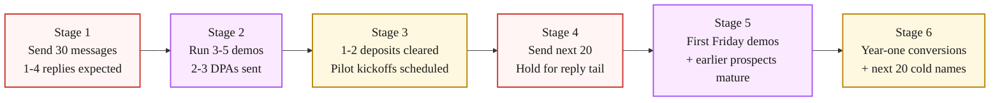

> **Module 5 · Lesson 5.7 · [OPTIONAL] - the systematic path when warm intros run out** · [From Idea to First Paying Customer](/course/tech-for-non-technical-founders-2026/)
>
> **Input:** network exhausted, ~10 customers in from [Chapter 5.5](/course/tech-for-non-technical-founders-2026/first-ten-customers-send-track/) and [Chapter 5.6](/course/tech-for-non-technical-founders-2026/paid-pilot-charge-before-ship/)
>
> **Output:** 30 cold messages sent, 3-5 demo calls booked, 1-2 paid pilots cleared once replies mature
>
> **Progress:** M5 · 7 of 7 · [OPTIONAL] - the systematic cold path; run it only after the warm-network pass in 5.3-5.5

> **TL;DR:** Once your network is exhausted, 30 filtered cold messages with a specific personalization per name put roughly one paid pilot in reach per batch - more as batches compound. Customers 11-20 come from cold outbound, not from launch events.

> **Stop here if you have not exhausted your personal network.** This chapter covers cold outbound to strangers - it assumes you have already converted the people who know you through [Ch 5.5](/course/tech-for-non-technical-founders-2026/first-ten-customers-send-track/).
>
> If you still have warm names in your network who fit your ICP (ideal customer profile - the specific buyer you're targeting), close them first. Cold outbound is harder, slower, and lower-converting than warm outreach.
>
> Reading this chapter before your network is dry is the most common sequencing mistake founders make in Module 5 - it feels like progress, but you are skipping the higher-converting path for the lower one. The chapter will still be here when your network is done.

This chapter is sales outbound asking buyers for money, which is a different motion from the interview-recruitment outreach in [Chapter 2.4](/course/tech-for-non-technical-founders-2026/find-10-people-with-problem-outreach-2026/) where you were asking for 30 minutes of their time.

The 10 people you interviewed in Module 2 may or may not become customers, and outreach to them goes through the sales sequence below rather than the recruitment script.

The one difference is that those Module 2 interviewees are warm targets - they already spoke with you about their pain, so your first line can reference that conversation directly instead of finding an external hook.

Product Hunt converted at 3.1% per launch event across 387 launches OpenHunts studied in 2024. Indie Hackers - posts written as engagement rather than launch announcements - converted at 23.1% per engaged post over the same period.

89% of the Product Hunt founders OpenHunts surveyed said they would not launch on the platform again ([OpenHunts launch statistics](https://openhunts.com/blog/tech-product-launch-statistics-insights)). The data has been public since the OpenHunts study released in mid-2024, yet every "first 10 customers" article still leads with Product Hunt.

Product Hunt is not bad; it is a one-day event in a job that needs sustained motion over a quarter.

Picture the situation. Four paid pilots have closed from your personal network and LinkedIn audience over six weeks. The warm names are gone at customer five. The default move is to book a launch coach or sign an ad-agency contract. Either decision costs the same six weeks and a few thousand dollars - and neither one was designed for your B2B vertical.

The four-line cold-email sequence below is what customer five answers in week three for under $40 of tooling.

This is the closing chapter of Module 5 (First Paying Customer). Once your personal network is exhausted, the next 10 customers come from filtered cold outbound, not from launch events.

Figma's first customer 11-20 cohort reportedly came from cold DMs to influential designers; Retool reportedly filtered Crunchbase by funding recency. Your Rails MVP customer 11-20 cohort will come from LinkedIn Sales Navigator (LinkedIn's paid search tool for filtering buyers by job title, company size, and industry) or Apollo, or both, feeding the four-line script below.

## Why Product Hunt is the wrong lever for a B2B SaaS product

> **Product Hunt is one day. Cold outbound is sustained. Sustained motions are what put paying customers on the calendar.**
> 
> Product Hunt converts at 3.1% (387 launches, OpenHunts 2024). Indie Hackers converts at 23.1% per engaged post. 89% of Product Hunt founders said they'd never launch again. Product Hunt suits developer tools / AI productivity / indie SaaS where buyers read it daily. Your B2B buyer at a 50-500 person company in a specific vertical doesn't. The 5,000 upvotes are from the wrong people.
> 
> The calendar shapes the outcome: Product Hunt is one day, Indie Hackers is sustained engagement, filtered cold outbound is recurring 30-message batches until you have a funnel. Founders shortcutting to one-day launches keep being surprised leads don't show up the next morning. The question is not "which big launch." It is "which 50 named buyers should hear from me first."

## The pipeline: Filter -> Personalize -> Loom -> Calendly -> Stripe

You run the whole pipeline in six stages with off-the-shelf tools - no engineer, no $1,200/month sales stack, no Salesforce.

The tooling is a volume choice, and both versions ship the same 30-message batch. The $0 stack - Apollo's free tier (Apollo is a B2B contact database that finds prospects' names and work emails; its free tier is credit-based - check the current allowance), a Google Sheet, a Gmail mail-merge add-on (sends the same email to many recipients at once, free), Loom, and Calendly - covers every stage; you enrich the list by hand in the sheet, which costs your time. The paid version swaps the manual enrichment for automation through Smartlead or Apollo's paid tiers, which costs money and pays off once you're sending 100+ messages a week and the hand-enrichment is the bottleneck. At this chapter's 30-message volume, either works - pick by whether your scarcer resource is hours or dollars.

The cold-outbound pipeline in one glance:

1. **Filter** - LinkedIn Sales Navigator or Apollo.io. Pull 100-150 raw rows, strip to 30 clean names.
2. **Personalize** - 60-90 seconds per name. Read the profile and the last post, find one specific reference.
3. **Loom** - Same product Loom from [Chapter 5.4](/course/tech-for-non-technical-founders-2026/first-ten-customers-outreach-message/). No re-record per prospect.
4. **Send** - LinkedIn DM or 4-line email. One personalized opener + the same body for everyone.
5. **Calendly** - 15-min demo slot, auto-confirm. No back-and-forth scheduling.
6. **Stripe** - DPA + deposit from [Chapter 5.6](/course/tech-for-non-technical-founders-2026/paid-pilot-charge-before-ship/). Money on the table before you start work.

The five tools and their 2026 pricing:

| Tool | Role | Price |
|---|---|---|
| LinkedIn Sales Navigator | Filter buyers by title, company size, funding signal, role tenure | Paid single-user plans - check LinkedIn pricing |
| Apollo.io (Starter / free tier) | Cheaper alternative to Sales Nav for B2B email + filters | Free tier available; paid plans for scale |
| Loom | 90s product walkthrough + you on camera | Free tier available |
| Calendly | 15-min demo booking, auto-confirm | Free tier supports one event type |
| Stripe Invoice | Pilot deposit, no monthly fee | 2.9% + 30c per transaction |

You can ship the entire pipeline for under $100/month if you use Apollo's free tier and skip Sales Navigator.

The trade-off: Sales Navigator's filters are richer for enterprise buyer profiles (especially for filtering on "joined company in last 90 days" or "recent leadership change"), and Apollo's free tier has limited credits.

If your buyer is a 50-200 person company contact in a specific industry, Apollo free tier is enough. If your buyer is a recent VP hire at a 500-2,000 person company, Sales Navigator pays for itself in week 1.

> **Pre-flight: warm your sending domain BEFORE batch 1.** A brand-new sending domain (e.g., `yourcompany.com` registered last week, no email history) will land in spam on batch 1 even with a perfect ICP list and a sharp script. The fix is either:
>
> 1. **Use LinkedIn DM for batch 1.** No domain warmup required. Sales Navigator + 30 personalized DMs gets the same reach as cold email for a B2B founder, and the messages reliably deliver.
> 2. **OR warm the domain for 2-3 weeks first.** Use a tool like [Mailwarm](https://mailwarm.com) or [Smartlead's warmup](https://smartlead.ai) (the same Smartlead from the tooling choice above) to send 5-10 low-volume reply-conversation emails per day to seed positive sender reputation. After 2-3 weeks of warmup, send batch 1 from the same domain.
>
> Skip this step and the &lt;5% reply-rate diagnostic below tells you "domain rep is dead" - because the domain never had reputation in the first place. The mechanical cause of your 0 replies is the domain, not the ICP filter or the script.

### Volume targets and what to expect

Running outbound long enough to read the funnel, 100-200 outreach contacts produces 5-10 paying customers. The funnel at each stage:

| Stage | Target |
|---|---|
| Raw list pulled | 100-200 names |
| Sent (after filter) | 30-message minimum per batch, several batches |
| Reply rate | ≥5% (below 5% = stop and diagnose) |
| Demo-to-paid | ≥20% of demos taken |
| Paid pilots landed | 5-10 from 100-200 outreach |

A 10% reply rate on 30 messages is 3 replies. At 20% demo-to-paid, 3 demos lands 0-1 pilots per batch - consistent with the multi-batch model above. The numbers are not impressive individually; they compound across batches.

### Filter: getting to 30 high-fit names

Apollo or Sales Navigator. Filter on the six dimensions you defined in [Chapter 2.3 · Where to Look](/course/tech-for-non-technical-founders-2026/find-10-people-where-to-look/) (the same filter you saved as the `Module 5 cold seed` tab in your outreach spreadsheet): job title (the buyer or the user, pick one), company size (start one tight band), industry (one vertical first), geography (one timezone for callable demos), technology used (filter for tools your product replaces or integrates with), recent funding or hiring signal (companies with momentum reply faster).

Pull 100-150 raw rows. Strip three categories before sending:

- Anyone whose company size or title is one band off your ICP. The 80% match is not the 100% match.
- Anyone whose LinkedIn shows no posting activity in the last 12 months. They will not see your DM.
- Anyone whose company you have a competing product alignment with (you sell to their competitor). A B2B services founder who came to us in March 2026 lost a great lead this way and had to wait two quarters for the lead's company to pivot before reaching out again.

You should be left with 30-50 clean names. Hold the bottom 20 for a later batch and send the top 30 in the first batch.

> **Apollo free-tier reality.** Apollo's free tier is credit-based (a small monthly allowance of email and export credits). The "pull 100-150 raw rows" instruction usually exceeds one month of free credits, so either spread it over time OR use LinkedIn DM for batch 1 and reserve Apollo exports for batch 2+. Recommended sequence for free-tier founders: (1) build batch 1 from your existing LinkedIn 1st-degree connections + Sales Navigator trial (free for 1 month, no Apollo needed); (2) start Apollo on month 2 with the credits dripping in over time; (3) upgrade to a paid Apollo tier only when you have a working reply-rate signal that justifies the spend.

### Personalize: 60-90 seconds per name, not 10 minutes

The mistake founders make on the first batch is over-personalizing. Twenty minutes of LinkedIn research per prospect turns into a 400-word email with five quoted lines from their feed, and response rates fall off a cliff above the four-line threshold.

The right level of personalization is one specific reference per message: scan the last three posts and the recent role, find one specific thing (a post, a comment, a hiring milestone, a recent promotion). One sentence. Then the same four-line script for everyone.

The 60-90 second rule keeps the volume tractable. 30 prospects × 90 seconds = 45 minutes of personalization per send. A founder can do that in one focused sitting.

> **Advanced: Loom video audit (higher conversion, higher effort).** Instead of a text-based cold message, record a 10-minute Loom video showing the prospect's specific pain point on THEIR website or in THEIR public product, then demonstrate how your MVP solves it. Send directly to the decision-maker via LinkedIn DM or email. Conversion is significantly higher than cold text because the video proves you did the work rather than claiming you did. The trade-off: each video takes 10-15 minutes to record and upload vs 60-90 seconds for a text personalization. Use this for your 5 highest-value prospects per batch, not all 30. The same product Loom from stage 3 of the pipeline works for the demo portion; only the first 2-3 minutes (showing their specific pain point) is custom per prospect.

## The 4-line cold-email script (3 variants)

### Variant 1: B2B SaaS, shipped-MVP context

> Subject: shipped MVP last month - your post on [topic]
>
> Hi [first name],
>
> Saw your post on [topic, paraphrased in their words] last [Tuesday]. I shipped my MVP for [the same problem] last month using [Lovable + Supabase + Stripe] after 12 interviews with people who flagged the exact issue you described. I built [a tool that does X for Y].
>
> Worth 15 minutes to walk through? Paid design partner spots, [$ deposit] credited toward year one. Calendly: [link]
>
> [Your name]

### Variant 2: B2B services

> Subject: noticed your hiring for [role]
>
> Hi [first name],
>
> Saw [Company] is hiring a [role] - guessing [the problem the role solves] is on your roadmap. I run a [services category] practice and we have helped [a comparable company size] handle [the same problem] in [the same vertical] in the last six months.
>
> Open to a 15-minute walk-through? Paid pilot model, [$ deposit] credited toward year-one engagement. Calendly: [link]
>
> [Your name]

### Variant 3: B2C app

> Subject: re: your [Reddit post / TikTok video] on [topic]
>
> Hi [first name],
>
> Your [Reddit post / TikTok video] on [topic] hit. I built an app that handles [the painful task you described] - the link below is a 90-second Loom showing it work end-to-end on my phone.
>
> Loom: [link]. App: [link]. If it looks useful, I am opening 20 paid beta spots at $9/month for the first month. Reply to claim one.
>
> [Your name]

All three variants follow the same shape: a specific reference earns the open, one sentence on what you built, one specific ask with friction removed (Calendly or Loom + claim link), one currency anchor (deposit, beta price). Total length: 4-6 lines including subject. Anything longer reduces response rate.

## Stage-by-stage cadence

Expect 3-8% replies on a realistic first batch - 1-2 replies per 30 messages - and treat 10-15% as what a tightly filtered, heavily personalized batch can reach: 3-4 replies, of which 1-2 agree to a 15-minute demo, of which one becomes a paid-pilot conversation. Of the pilots, the [Chapter 5.6](/course/tech-for-non-technical-founders-2026/paid-pilot-charge-before-ship/) deposit-to-year-one conversion math holds.

The 30-message batch is not a one-time event. Run fresh 30-message batches until you have 20 customers. The second and third batches will outperform the first by 30-50% because you will have learned which reference patterns earn replies and which do not.

### What "no reply" actually means

> **First-batch reality before the diagnostic.** If your first 30-message batch returns 0-1 replies, your first reaction will be "the product is bad" or "my message is generic." Both of those CAN be true, but the more common cause for a brand-new founder with a new sending domain is mechanical: the messages did not deliver, or the domain has no warmup history yet, or the personalization felt fake despite being real.
>
> **A 0-1 reply rate on batch 1 is the median outcome for first-time cold senders, not a failure signal.** Walk the 3-item diagnostic below before you change the message, the price, or the product.

A 30-message batch with zero replies is rare and almost always indicates a filter problem, not a script problem. Check three things:

1. **Did the messages deliver?** If you are using cold email (vs LinkedIn DM), check your sending tool's bounce rate. Above 10% bounce means your list is dirty and your domain reputation is suffering. Pause sending and re-warm the inbox before continuing.

2. **Is the filter right?** Re-read three random LinkedIn profiles from your sent list. If you cannot imagine the person reading the message and finding it relevant, your ICP filter is off. The fix is upstream of the script.

3. **Is the reference real?** Look at the first paragraph of your last 10 sent messages. If the "specific reference" sentence sounds generic ("noticed you work at [Company] in [role]"), it was not specific enough. Real specificity means the prospect can verify the claim - a date, a post title, a name, an event.

3-8% replies is the realistic first-batch band; 10-15% is the ceiling a well-filtered, well-personalized batch can reach.

> **Stop / continue / accelerate, by reply rate band.**
> - **<5% reply rate** → STOP after batch 1. Diagnose before batch 2: filter is wrong, domain reputation is dead, or script reads generic. Sending batch 2 over a broken upstream stage wastes the next 30 best-fit names on the same broken funnel.
> - **5-10% reply rate** → CONTINUE but rotate one element of the script for batch 2 (subject line, opening reference, or CTA). One variable per batch so you can read which change moved the rate.
> - **>10% reply rate** → ACCELERATE. You have a hot channel. Run batch 2 same-shape and same-cadence. Resist the temptation to "scale" the batch size past 30 - the personalization budget per message is the load-bearing input, and 30 is the practical ceiling for one founder doing it by hand.

## Compounding past customer 20

> **Ask your first 20 for one introduction each. That feeds enough warm leads to stop scaling cold outbound past the current batch size.**
>
> Customers 11-20 come from filtered cold outbound. Customers 21-50 come from referrals out of customers 1-20. If your first 20 were chosen carefully (must-have segment, personal network + filtered outbound), each knows two more in the same segment.
>
> The motion is asking for one introduction each. Script at the end of every Friday demo once the cadence is established: *"If this is useful for you, do you know one or two others I should be talking to?"*
>
> Half say yes. Half of those actually send the intro. A steady drip of warm leads from a 20-customer base is enough to keep cold outbound steady rather than scaling the batch size.

## What to do next

| Step | Action | Output |
|---|---|---|
| **1** | Open your `Module 5 cold seed` tab from Ch 2.3-2.4 - the Apollo filter is already saved and 8-12 contacts may already be exported. Top up to 30-50 high-fit names using the same filter. Drop bottom 20 into a "later batch" tab in your Sheet. Pick one of three message variants and customize deposit + product description. | 30-50 target list built. Message template ready. |
| **2** | Spend 60-90 minutes personalizing the first 30 messages. One specific reference per prospect (recent post, hire milestone, role change). Send via LinkedIn DM or cold email tool ([Smartlead](https://smartlead.ai), [Instantly](https://instantly.ai)). | 30 messages sent. 1-4 replies expected. |
| **3** | Tally replies once they settle. Book demos. Follow up with non-responders once only. | 2-4 demo calls booked. Next batch ready. |

The full cold-email scripts (3 variants: B2B SaaS shipped-MVP, B2B services, B2C app), the filter checklist, and the Apollo + Sales Navigator setup guide all ship in [the First-Paying-Customer Operating Kit](/course/tech-for-non-technical-founders-2026/first-paying-customer-operating-kit/).

## Advanced (optional sidebar)

Once you have closed 5-10 paid pilots from cold outbound and want to layer on sales-system rigor, read First Round Review's [sales article collection](https://review.firstround.com/articles/sales/), Sahil Bloom's [Curiosity Chronicle newsletter](https://www.sahilbloom.com/newsletter), and the [Y Combinator library on founder-led sales](https://www.ycombinator.com/library/Mo-the-sales-playbook-for-founders). Once you cross customer 30, the sales playbooks designed for solo founders give way to operator manuals: Mark Roberge's *The Sales Acceleration Formula* for hiring your first AE (account executive - a dedicated salesperson), Mike Weinberg's *New Sales. Simplified.* for the manager handbook. The main path above gets you from customer 11 to customer 20. The advanced versions matter after that.

> **Module 5 closes here.** → Download the [First-Paying-Customer Operating Kit](/course/tech-for-non-technical-founders-2026/first-paying-customer-operating-kit/) (the full 6-piece template bundle). Now you have a paying pilot, the rest of the course is about keeping the build honest while you ship more: the [oversight rhythm](/course/tech-for-non-technical-founders-2026/engineering-org-chart-non-technical-founder/) sets up the weekly Friday demo + standup + report cadence. Or revisit the [course landing page](/course/tech-for-non-technical-founders-2026/) to pick the next chapter.

## Going further (after your first paying customer)

You've completed the core 5-module course - hypothesis, smoke test + price, problem validation + prototype, brief + build, first paid pilot. Continuation chapters apply once you've signed your first paid pilot:

| Symptom | Continuation chapter |
|---|---|
| **Customers leaving in week 2-4** | [Churn Triage Before Acquisition](/course/tech-for-non-technical-founders-2026/customers-leaving-churn-triage-not-acquisition/) - fix retention before spending on more outbound |
| **Key metric flat for 2+ months** | [Pivot or Persevere](/course/tech-for-non-technical-founders-2026/pivot-or-persevere-decision-framework/) - decision framework for the next move |
| **Hit the self-serve ceiling** | [Hire Track Supplementary Reference](/course/tech-for-non-technical-founders-2026/hire-track-supplementary-reference/) - when to hire and what to look for |
| **Product touches AI in production** | [Agency AI Questions](/course/tech-for-non-technical-founders-2026/agency-uses-ai-follow-up-questions/), [AI Token Bill](/course/tech-for-non-technical-founders-2026/ai-token-bill-dev-shop-pass-through-cost/), [Slopsquatting](/course/tech-for-non-technical-founders-2026/slopsquatting-ai-supply-chain-attack/) - AI-era hygiene |

The course graduates here. Return to the [course landing page](/course/tech-for-non-technical-founders-2026/) when you're ready to retake it for a new project.

Module 5 closes with a deposit in your Stripe account. Everything from here is keeping the build honest while you ship to customer 11.

## Further reading

- OpenHunts, [Product Launch Statistics: Success Rates & Data](https://openhunts.com/blog/tech-product-launch-statistics-insights) - the primary source for the Product Hunt 3.1% vs Indie Hackers 23.1% per-engaged-post conversion data (387-launch 2024 study, 156 founders surveyed).
- Lenny Rachitsky, [How to win your first 10 B2B customers](https://www.lennysnewsletter.com/p/how-to-win-your-first-10-b2b-customers) - the 7-step playbook from 100+ B2B founders, including the cold-outbound section.
- Lenny Rachitsky, [How the biggest consumer apps got their first 1,000 users](https://www.lennysnewsletter.com/p/how-the-biggest-consumer-apps-got) - first-users tactics from Airbnb, Tinder, Etsy, Reddit and more.
- Paul Graham, [Do Things That Don't Scale](http://paulgraham.com/ds.html) - the foundational text on manual customer recruitment, including the Stripe Collison-brothers cold-DM-and-install motion.
- Y Combinator Library, [The Sales Playbook for Founders](https://www.ycombinator.com/library/Mo-the-sales-playbook-for-founders) - YC's playbook on founder-led sales, from first pilots to closed recurring revenue.
- Sahil Bloom, [The Curiosity Chronicle](https://www.sahilbloom.com/newsletter) - his newsletter on early traction and the relationship-to-cold transition that closes the personal-network gap.

> **Done:** 30 cold messages are sent, replies are tracked in your spreadsheet, and 1-2 paid pilots are booked from the replies.
>
> **You have now:** the full arc in hand - a validated hypothesis, a signed problem statement, a one-page brief, a live MVP, and at least one paying customer, plus a repeatable cold-outbound motion for customers 11-20. That is the whole course: idea → validated problem → brief → live MVP → paying customer. Keep the [First-Paying-Customer Operating Kit](/course/tech-for-non-technical-founders-2026/first-paying-customer-operating-kit/) open to keep the build honest as you ship past customer 10.
>
> **Next:** [Course landing page](/course/tech-for-non-technical-founders-2026/) - the core course is complete. When a problem shows up, the continuation chapters cover [churn triage](/course/tech-for-non-technical-founders-2026/customers-leaving-churn-triage-not-acquisition/), [pivot decisions](/course/tech-for-non-technical-founders-2026/pivot-or-persevere-decision-framework/), and [hiring](/course/tech-for-non-technical-founders-2026/hire-track-supplementary-reference/).
>
> **If blocked:** If reply rate is under 5% after batch 1, diagnose before batch 2: is the filter wrong (wrong ICP), is your domain reputation dead (cold email deliverability), or is the personalization too generic? Fix the root cause before sending the next batch.

---

*See it in action: [Module 5 walkthrough: Mia gets paid](/course/tech-for-non-technical-founders-2026/module-5-walkthrough-mia/)*

*Built by [JetThoughts](https://jetthoughts.com) as part of the [From Idea to First Paying Customer](/course/tech-for-non-technical-founders-2026/) curriculum.*
