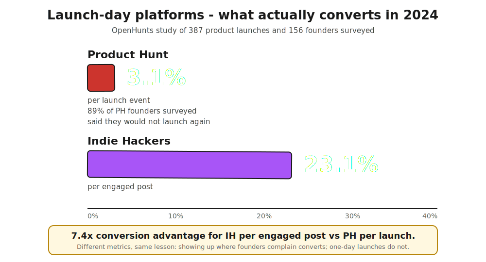
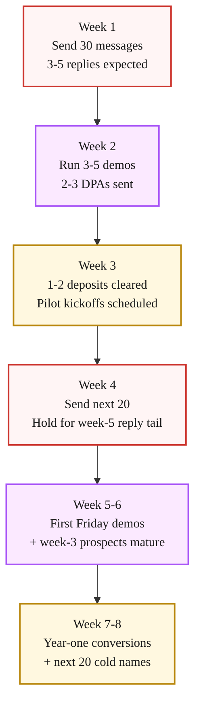

> **Module 5 · Step 5 of 5** · [Tech for Non-Technical Founders 2026](/course/tech-for-non-technical-founders-2026/) course.
> Input: network exhausted, ~10 customers in from [Chapter 5.3](/course/tech-for-non-technical-founders-2026/first-ten-customers-personal-network/) and [Chapter 5.4](/course/tech-for-non-technical-founders-2026/paid-pilot-charge-before-ship/). Output: 30 cold messages sent, 3-5 demo calls booked, 1-2 paid pilots cleared in weeks 3-4.

> **$0 outbound stack.** Apollo's free tier (50 credits/mo) + a Google Sheet + Gmail mail-merge add-on (free) + Loom free + Calendly free covers the entire pipeline at zero monthly cost. You ship the same 30-message batch, you just enrich the list manually in a sheet instead of automating it through Smartlead. Upgrade to Apollo Pro ($49) or Smartlead ($37) only when you're sending 100+ messages a week and the manual enrichment is the bottleneck.

This chapter is sales outbound asking buyers for money, which is a different motion from the interview-recruitment outreach in [Chapter 2.2](/course/tech-for-non-technical-founders-2026/find-10-people-with-problem-outreach-2026/) where you were asking for 30 minutes of their time. The 10 people you interviewed in Module 2 may or may not become customers, and outreach to them goes through the sales sequence below rather than the recruitment script. The one difference is that those Module 2 interviewees are warm targets - they already spoke with you about their pain, so your first line can reference that conversation directly instead of finding an external hook.

Product Hunt converted at 3.1% per launch event across 387 launches OpenHunts studied in 2024. Indie Hackers - posts written as engagement rather than launch announcements - converted at 23.1% per engaged post over the same period. 89% of the Product Hunt founders OpenHunts surveyed said they would not launch on the platform again ([source](https://awesome-directories.com/blog/indie-hackers-launch-strategy-guide-2025/)). The data has been public since the OpenHunts study released in mid-2024, yet every "first 10 customers" article still leads with Product Hunt. Product Hunt is not bad; it is a one-day event in a job that needs sustained motion over a quarter.

A B2B SaaS rescue we joined in April 2026 had cleared four paid pilots from the founder's personal network and LinkedIn audience over six weeks, then ran out of warm names at customer five. She had already booked a launch coach and signed an ad-agency contract, then cancelled both after seeing the OpenHunts numbers. Customer five signed a $4,200 pilot in week 3 from the four-line cold-email sequence below.

This is the closing chapter of Module 5 (First Paying Customer). Once your personal network is exhausted, the next 10 customers come from filtered cold outbound, not from launch events. Figma's first customer 11-20 cohort came from cold DMs to influential designers identified via Twitter data. Retool filtered Crunchbase by funding recency. Your rescue-Rails MVP customer 11-20 cohort will come from LinkedIn Sales Navigator (or Apollo, or both) feeding the four-line script below.

## Why Product Hunt is the wrong lever for an ICP-E product

> **Product Hunt is one day. Cold outbound is sustained. Sustained motions are what put paying customers on the calendar.**
> 
> Product Hunt converts at 3.1% (387 launches, OpenHunts 2024). Indie Hackers converts at 23.1% per engaged post. 89% of Product Hunt founders said they'd never launch again. Product Hunt suits developer tools / AI productivity / indie SaaS where buyers read it daily. Your ICP-E customer at a 50-500 person company in a vertical doesn't. The 5,000 upvotes are from the wrong people.
> 
> The calendar shapes the outcome: Product Hunt is one day, Indie Hackers is six months, filtered cold outbound is 30 messages every two weeks for a quarter. Founders shortcutting to one-day launches keep being surprised leads don't show up the next morning. The question is not "which big launch." It is "which 50 named buyers should hear from me first."

## The pipeline: Filter -> Personalize -> Loom -> Calendly -> Stripe

A solo founder runs the whole pipeline in six stages with off-the-shelf tools, with no engineer, no $1,200/month sales stack, and no Salesforce required.

The cold-outbound pipeline in one glance:

1. **Filter** - LinkedIn Sales Navigator or Apollo.io. Pull 100-150 raw rows, strip to 30 clean names.
2. **Personalize** - 60-90 seconds per name. Read the profile and the last post, find one specific reference.
3. **Loom** - Same product Loom from [Chapter 5.3](/course/tech-for-non-technical-founders-2026/first-ten-customers-personal-network/). No re-record per prospect.
4. **Send** - LinkedIn DM or 4-line email. One personalized opener + the same body for everyone.
5. **Calendly** - 15-min demo slot, auto-confirm. No back-and-forth scheduling.
6. **Stripe** - DPA + deposit from [Chapter 5.4](/course/tech-for-non-technical-founders-2026/paid-pilot-charge-before-ship/). Money on the table before you start work.

The five tools and their 2026 pricing:

| Tool | Role | Price |
|---|---|---|
| LinkedIn Sales Navigator | Filter buyers by title, company size, funding signal, role tenure | $99/month single-user (Core tier) |
| Apollo.io (Starter / free tier) | Cheaper alternative to Sales Nav for B2B email + filters | Free tier available; paid Apollo Pro starts ~$49/mo |
| Loom | 90s product walkthrough + you on camera | Free tier: 25 videos |
| Calendly | 15-min demo booking, auto-confirm | Free tier supports one event type |
| Stripe Invoice | Pilot deposit, no monthly fee | 2.9% + 30c per transaction |

You can ship the entire pipeline for under $100/month if you use Apollo's free tier and skip Sales Navigator. The trade-off: Sales Navigator's filters are richer for enterprise buyer profiles (especially for filtering on "joined company in last 90 days" or "recent leadership change"), and Apollo's free tier has limited credits. If your buyer is a 50-200 person company contact in a specific industry, Apollo free tier is enough. If your buyer is a recent VP hire at a 500-2,000 person company, Sales Navigator pays for itself in week 1.

### Volume targets and what to expect

Over a full quarter of cold outbound, 100-200 outreach contacts produces 5-10 paying customers. The funnel at each stage:

| Stage | Target |
|---|---|
| Raw list pulled | 100-200 names per quarter |
| Sent (after filter) | 30 per batch, 3-4 batches per quarter |
| Reply rate | ≥5% (below 5% = stop and diagnose) |
| Demo-to-paid | ≥20% of demos taken |
| Paid pilots landed | 5-10 from 100-200 outreach |

A 10% reply rate on 30 messages is 3 replies. At 20% demo-to-paid, 3 demos lands 0-1 pilots per batch - consistent with the 4-batch-per-quarter model above. The numbers are not impressive individually; they compound over 12 weeks.

### Filter: getting to 30 high-fit names

Apollo or Sales Navigator. Filter on the six dimensions from [Chapter 5.3](/course/tech-for-non-technical-founders-2026/first-ten-customers-personal-network/) - job title (the buyer or the user, pick one), company size (start one tight band), industry (one vertical first), geography (one timezone for callable demos), technology used (filter for tools your product replaces or integrates with), recent funding or hiring signal (companies with momentum reply faster).

Pull 100-150 raw rows. Strip three categories before sending:

- Anyone whose company size or title is one band off your ICP. The 80% match is not the 100% match.
- Anyone whose LinkedIn shows no posting activity in the last 12 months. They will not see your DM.
- Anyone whose company you have a competing product alignment with (you sell to their competitor). A B2B services founder who came to us in March 2026 lost a great lead this way and had to wait two quarters for the lead's company to pivot before reaching out again.

You should be left with 30-50 clean names. Hold the bottom 20 for week 4 and send the top 30 in week 1.

### Personalize: 60-90 seconds per name, not 10 minutes

The mistake founders make in week 1 is over-personalizing. Twenty minutes of LinkedIn research per prospect turns into a 400-word email with five quoted lines from their feed, and response rates fall off a cliff above the four-line threshold.

The right level of personalization is one specific reference per message. Open the prospect's LinkedIn, scan the last three posts and the recent role. Find one specific thing - a recent post they wrote, a comment they left, the company hit a hiring milestone, they joined a year ago and just got promoted. One sentence. Then the same four-line script for everyone.

The 60-90 second rule keeps the volume tractable. 30 prospects × 90 seconds = 45 minutes of personalization per send. A founder can do that in one Monday morning.

## The 4-line cold-email script (3 variants)

### Variant 1: B2B SaaS rescued-Rails context

> Subject: rescued from agency in [month] - your post on [topic]
>
> Hi [first name],
>
> Saw your post on [topic, paraphrased in their words] last [Tuesday]. I just rescued my own Rails MVP from an agency burn and the same issue you flagged was at the top of my list. I built [a tool that does X for Y].
>
> Worth 15 minutes to walk through? Paid design partner spots, [$ deposit] credited toward year one. Calendly: [link]
>
> [Your name]

### Variant 2: B2B services

> Subject: noticed your hiring for [role]
>
> Hi [first name],
>
> Saw [Company] is hiring a [role] - guessing [the problem the role solves] is on your roadmap. I run a [services category] practice and we have helped [a comparable company size] handle [the same problem] in [the same vertical] in the last six months.
>
> Open to a 15-minute walk-through? Paid pilot model, [$ deposit] credited toward year-one engagement. Calendly: [link]
>
> [Your name]

### Variant 3: B2C app

> Subject: re: your [Reddit post / TikTok video] on [topic]
>
> Hi [first name],
>
> Your [Reddit post / TikTok video] on [topic] hit. I built an app that handles [the painful task you described] - the link below is a 90-second Loom showing it work end-to-end on my phone.
>
> Loom: [link]. App: [link]. If it looks useful, I am opening 20 paid beta spots at $9/month for the first month. Reply to claim one.
>
> [Your name]

All three variants follow the same shape: a specific reference earns the open, one sentence on what you built, one specific ask with friction removed (Calendly or Loom + claim link), one currency anchor (deposit, beta price). Total length: 4-6 lines including subject. Anything longer reduces response rate.

## Week-by-week cadence

Expect a 10-20% reply rate on a properly filtered, properly personalized 30-message batch. That is 3-6 replies, of which 2-4 will agree to a 15-minute demo. Of the demos, 1-2 will agree to a paid pilot. Of the pilots, the [Chapter 5.4](/course/tech-for-non-technical-founders-2026/paid-pilot-charge-before-ship/) deposit-to-year-one conversion math holds - around 60% of paid pilots convert to year-one customers.

The 30-message batch is not a one-time event. Run a fresh 30-message batch every other Monday until you have 20 customers. The second and third batches will outperform the first by 30-50% because you will have learned which reference patterns earn replies and which do not.

### What "no reply" actually means

A 30-message batch with zero replies is rare and almost always indicates a filter problem, not a script problem. Check three things:

1. **Did the messages deliver?** If you are using cold email (vs LinkedIn DM), check your sending tool's bounce rate. Above 10% bounce means your list is dirty and your domain reputation is suffering. Pause sending for two weeks and re-warm the inbox.

2. **Is the filter right?** Re-read three random LinkedIn profiles from your sent list. If you cannot imagine the person reading the message and finding it relevant, your ICP filter is off. The fix is upstream of the script.

3. **Is the reference real?** Look at the first paragraph of your last 10 sent messages. If the "specific reference" sentence sounds generic ("noticed you work at [Company] in [role]"), it was not specific enough. Real specificity means the prospect can verify the claim - a date, a post title, a name, an event.

10-15% reply rate is the baseline for a well-filtered, well-personalized batch in 2026. Below 5% means stop sending and diagnose.

## Compounding past customer 20

> **Ask your first 20 for one introduction each. That is 5 warm leads per quarter, enough to stop scaling cold outbound past 30 messages/month.**
>
> Customers 11-20 come from filtered cold outbound. Customers 21-50 come from referrals out of customers 1-20. If your first 20 were chosen carefully (must-have segment, personal network + filtered outbound), each knows two more in the same segment. The motion is asking for one introduction each.
>
> Script at the end of every Friday demo from week 4 onward: *"If this is useful for you, do you know one or two others I should be talking to?"* Half say yes. Half of those actually send the intro. Five warm leads per quarter from a 20-customer base is enough to keep cold outbound at 20-30 messages/month rather than scaling to 60.

## What to do this week

| Day | Action | Output |
|---|---|---|
| **Monday morning** | Set up Apollo free tier or Sales Navigator. Build the filter for your must-have segment. Export 30-50 high-fit names. Drop bottom 20 into "week 4" tab in your Sheet. Pick one of three message variants and customize deposit + product description. | 30-50 target list built. Message template ready. |
| **Tuesday morning** | Spend 60-90 minutes personalizing first 30 messages. One specific reference per prospect (recent post, hire milestone, role change). Send via LinkedIn DM or cold email tool (Smartlead, Instantly). | 30 messages sent. 3-6 replies expected. |
| **Friday afternoon** | Tally replies. Book demos for week 2. Follow up with non-responders once only on Friday. | 2-4 demo calls booked. Week 2 ready. |

The full cold-email scripts (3 variants: B2B SaaS rescued-Rails, B2B services, B2C app), the filter checklist, and the Apollo + Sales Navigator setup guide all ship in [the First-Paying-Customer Operating Kit](/course/tech-for-non-technical-founders-2026/first-paying-customer-operating-kit/).

## Advanced (optional sidebar)

Founders who have closed 5-10 paid pilots from cold outbound and want to layer on sales-system rigor can read the [First Round Capital sales scripts collection](https://review.firstround.com/category/sales/), Sahil Bloom's ["The First 10 Customers"](https://www.sahilbloom.com/newsletter/the-first-10-customers) playbook, and the [Y Combinator library on early sales](https://www.ycombinator.com/library/4f-startup-sales-the-fastest-way-to-find-your-first-customers). Once you cross customer 30, the sales playbooks designed for solo founders give way to operator manuals: Mark Roberge's *The Sales Acceleration Formula* for hiring your first AE, Mike Weinberg's *New Sales. Simplified.* for the manager handbook. The main path above gets you from customer 11 to customer 20. The advanced versions matter after that.

> **Module 5 closes here.** → Download the [First-Paying-Customer Operating Kit](/course/tech-for-non-technical-founders-2026/first-paying-customer-operating-kit/) (the full 6-piece template bundle). Now you have a paying pilot, the rest of the course is about keeping the build honest while you ship more: the [oversight rhythm](/course/tech-for-non-technical-founders-2026/engineering-org-chart-non-technical-founder/) sets up the weekly Friday demo + standup + report cadence. Or revisit the [course landing page](/course/tech-for-non-technical-founders-2026/) to pick the next chapter.

## Going further (after your first paying customer)

You've completed the core 6-module course. Continuation chapters apply once you've signed your first paid pilot:

| Symptom | Continuation chapter |
|---|---|
| **Customers leaving in week 2-4** | [Churn Triage Before Acquisition](/course/tech-for-non-technical-founders-2026/customers-leaving-churn-triage-not-acquisition/) - fix retention before spending on more outbound |
| **Key metric flat for 2+ months** | [Pivot or Persevere](/course/tech-for-non-technical-founders-2026/pivot-or-persevere-decision-framework/) - decision framework for the next move |
| **Hit the self-serve ceiling** | [Hire Track Supplementary Reference](/course/tech-for-non-technical-founders-2026/hire-track-supplementary-reference/) - when to hire and what to look for |
| **Product touches AI in production** | [Agency AI Questions](/course/tech-for-non-technical-founders-2026/agency-uses-ai-follow-up-questions/), [AI Token Bill](/course/tech-for-non-technical-founders-2026/ai-token-bill-dev-shop-pass-through-cost/), [Slopsquatting](/course/tech-for-non-technical-founders-2026/slopsquatting-ai-supply-chain-attack/) - AI-era hygiene |

The course graduates here. Return to the [course landing page](/course/tech-for-non-technical-founders-2026/) when you're ready to retake it for a new project.

## Further reading

- OpenHunts (via Awesome Directories), [Indie Hackers Launch Strategy Guide 2025](https://awesome-directories.com/blog/indie-hackers-launch-strategy-guide-2025/) - source for the Product Hunt 3.1% vs Indie Hackers 23.1% per-engaged-post conversion data from the 387-launch 2024 study.
- Lenny Rachitsky, [How to win your first 10 B2B customers](https://www.lennysnewsletter.com/p/how-to-win-your-first-10-b2b-customers) - the 7-step playbook from 100+ B2B founders, including the cold-outbound section.
- First Round Capital, [Cold Outreach That Works: A Founder Playbook](https://review.firstround.com/from-1-to-1000-users-tactics-from-airbnb-tinder-etsy-reddit-and-more/) - tactical cold-outreach scripts from Airbnb, Tinder, Etsy, Reddit founder interviews.
- Paul Graham, [Do Things That Don't Scale](http://paulgraham.com/ds.html) - the foundational text on manual customer recruitment, including the Stripe Collison-brothers cold-DM-and-install motion.
- Y Combinator Library, [Startup Sales: The Fastest Way to Find Your First Customers](https://www.ycombinator.com/library/4f-startup-sales-the-fastest-way-to-find-your-first-customers) - YC's collection on founder-led sales including the filter-and-personalize cold-outreach motion.
- Sahil Bloom, [The First 10 Customers](https://www.sahilbloom.com/newsletter/the-first-10-customers) - playbook framing the relationship-to-cold transition that closes the personal-network gap.

---

*Built by [JetThoughts](https://jetthoughts.com) as part of the [Tech for Non-Technical Founders 2026](/course/tech-for-non-technical-founders-2026/) curriculum.*
