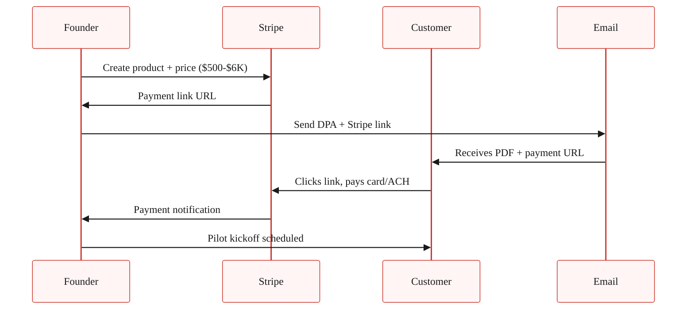

> **Module 5 · Step 4 of 5** · [From Idea to First Paying Customer](/course/tech-for-non-technical-founders-2026/)
>
> **Input:** 3-5 warm leads from [Chapter 5.3](/course/tech-for-non-technical-founders-2026/first-ten-customers-personal-network/)
>
> **Output:** 1 signed paid pilot before any new code ships

> **TL;DR:** A verbal yes is not a paid pilot. A signed DPA (Design Partner Agreement - a one-page co-design pilot contract) with a refundable Stripe deposit is. Charge 10-30% of year-one ACV (annual contract value - what one customer pays in year one) before kickoff - it puts the CFO question on Week 0 instead of Week 8.

Two pilots, same product, same buyer profile, different deposit timing:

| Variant | Setup | Result at Week 8 |
|---|---|---|
| **Free pilot** | Six weeks of free build, customer "loves it," 47 enthusiastic Slack messages, year-one contract sent on day pilot ended | "We're going to revisit at the next budget cycle." There is no next budget cycle. |
| **Paid pilot** | One-page Design Partner Agreement, $1,200 refundable deposit collected before any code ships | Year-one contract closes day one. |

The playbook below is the second variant: a one-page Design Partner Agreement, a 15-minute Stripe Checkout setup, and the pricing math that puts you in the conversation instead of stuck waiting for a CFO who never approved the pilot.

## Why free pilots almost never convert

Free pilots feel collaborative because the customer says yes, you build for six weeks, and the team shows up to the Friday demo each week and says "this is great."

Week 8 lands and you send the proposal for the year-one contract. The customer says "this is great, let me circle back to my CFO" - and that CFO has never heard of you, did not approve the pilot, and has no internal justification for the line item. The conversation dies in a forwarded email thread.

That's the recurring mechanic. A 20% deposit at kickoff puts the CFO question on Week 0, when there's no project yet for the customer to defend. Conversion in Week 7 becomes paperwork, not negotiation. Skip the deposit and you're back at the Week 8 wall: "this is great" emails Friday, ghost on conversion Monday.

First-time founders often default to "let the customer try it free and they'll pay once they see the value" - that instinct produces six months of free pilots and zero signed contracts. Charging first is what flips a curious user into a customer with skin in the game.

You are not asking for money. You are asking the customer to defend the spend internally. The defense is the test of whether the pilot is real.


> **Course terminology: "first paying customer" = signed DPA + cleared deposit.** Year-one contract conversion is a downstream milestone covered in the "Going further" callouts after Module 5 closes. When the course says "first paying customer," it means the customer has signed the one-page DPA AND the Stripe deposit has cleared - real money in your account. A year-one-converted customer is a separate event that happens 6-10 weeks later, after the pilot success criteria are met or missed.

## The Design Partner Agreement, in one page

The Design Partner Agreement (DPA) is a one-page LOI (letter of intent - a short agreement that comes before a full contract) that names the customer as a design partner, defines the pilot scope, sets the deposit, and converts to year-one on success. It is mutual-edit, in plain English, and v1 does not need a lawyer. The reason it stays short: every line in the document is a load-bearing clause, and every line that would not load-bear is removed.

The structure has six sections plus signatures.

| # | Section | What goes in it |
|---|---------|-----------------|
| 1 | Scope of pilot | 3 outcomes the customer wants. 2 specific use cases. Anything outside is out of scope. |
| 2 | Duration + dates | 6-8 weeks. Start date. End date. Weekly Friday demo at a named time. |
| 3 | **Pilot fee + deposit** (load-bearing) | 10-30% of year-one ACV (annual contract value - what one customer pays in a year). Paid via Stripe before kickoff. Credited toward year-one on conversion. |
| 4 | Success criteria | 3 measurable outcomes - hours saved, errors avoided, revenue produced. Friday-demo verified. |
| 5 | Conversion terms | Year-one price. Annual or monthly. Auto-conversion or opt-in. Notice period. |
| 6 | Data, IP, termination | Customer keeps their data. You keep the product IP. 30-day written notice to exit. |
|  | Signature block | DocuSign, HelloSign, or PDF + email confirmation - whichever the customer prefers. |

Total document: one page, around 400 words. v1 needs no lawyer review.A few clauses deserve more detail than the table can hold.

The **scope of pilot** section is where new founders over-spec. Keep it to three outcomes the customer wants and two specific use cases; anything outside that list stays out of scope until conversion. The list also anchors the Friday demos - if a demo does not advance one of the three outcomes, the demo is off-scope and you say so. Friday cadence comes from the [Friday demo chapter](/course/tech-for-non-technical-founders-2026/friday-demo-rule-founder-progress/).

The **pilot fee and deposit** clause is what makes everything else work. The deposit lands at 10-30% of projected year-one annual contract value (ACV), paid via Stripe before pilot kickoff and credited dollar-for-dollar against the year-one invoice on conversion. If the customer cancels before week 4, they forfeit the deposit (their commitment). If the founder cancels for any reason, the founder refunds 100% (your commitment). Pricing math is below.

The **success criteria** clause is what makes the DPA a real contract instead of a handshake. Pick three measurable outcomes the pilot is supposed to produce (for example, hours saved per week, errors avoided per month, or revenue lifted per quarter), worded in the customer's verbatim language from the [Chapter 5.3 outreach](/course/tech-for-non-technical-founders-2026/first-ten-customers-personal-network/).

If two of three are hit by week 6, the year-one contract auto-converts unless the customer opts out in writing. If fewer than two are hit, both parties walk and the founder retains the deposit as paid consideration for the pilot work.

The **conversion terms** clause is what the CFO actually approves in week 0. State the year-one price in dollars (never "TBD"), billing cadence (annual or monthly), auto-conversion versus opt-in (auto-conversion recommended), and a 30-day notice period after year one. These numbers are why the deposit can be defended internally before kickoff.

**Data, IP, and termination** is the shortest section: customer keeps their data, founder keeps the product IP, either party can exit at 30 days written notice during the pilot, and the customer's data stays exportable for 90 days after termination. v1 needs no further detail.

Signature block at the bottom - DocuSign, HelloSign, or PDF-and-email-confirmation, whichever the customer prefers.

### Copy-paste DPA template (verbatim - fill the brackets, send)

Open a Google Doc. Paste the block below. Replace every `[BRACKETED]` value with your numbers. Total document: one page, ~400 words. No lawyer review needed for v1.

```text
DESIGN PARTNER AGREEMENT

Between: [Your Company Name] ("Company") and [Customer Company Name] ("Design Partner")
Date: [YYYY-MM-DD]

1. SCOPE OF PILOT
The Company will deliver the following outcomes during the pilot period:
  1. [Outcome 1 - measurable, e.g. "Reduce weekly report prep from 3 hours to 30 minutes"]
  2. [Outcome 2]
  3. [Outcome 3]
Specific use cases covered: [Use case 1], [Use case 2].
Anything outside this list is out of scope until year-one conversion.

2. DURATION + DATES
Start date: [YYYY-MM-DD]
End date: [YYYY-MM-DD] (6-8 weeks)
Weekly Friday demo at [time] [timezone]. 15 minutes. Loom or live screenshare.

3. PILOT FEE + DEPOSIT
One-time deposit: $[500-6,000] (10-30% of year-one ACV).
Paid via Stripe before pilot kickoff. Credited dollar-for-dollar toward year-one invoice on conversion.
If Design Partner cancels before week 4: deposit forfeited.
If Company cancels for any reason: 100% refund within 14 days.

4. SUCCESS CRITERIA
The pilot is successful if 2 of 3 criteria are met by [end date]:
  1. [Measurable criterion 1 - e.g. "Report prep time reduced to <=30 min/week, verified in Friday demo"]
  2. [Measurable criterion 2]
  3. [Measurable criterion 3]
If 2+ criteria met: year-one contract auto-converts unless Design Partner opts out in writing within 7 days.
If <2 criteria met: both parties walk. Company retains deposit as paid consideration for pilot work.

5. CONVERSION TERMS
Year-one price: $[amount] / [month or year]
Billing: [monthly / annual]
Conversion: auto-convert at pilot end unless Design Partner opts out in writing.
Post year-one: 30-day written notice to cancel.

6. DATA, IP, TERMINATION
Design Partner keeps their data. Company keeps the product IP.
Either party may exit at 30 days written notice during pilot.
Design Partner's data remains exportable for 90 days after termination.

SIGNED:

_________________________  Date: __________
[Your Name], [Your Company]

_________________________  Date: __________
[Champion Name], [Customer Company]
```

Two annotated worked examples (a $1,500 B2B SaaS pilot and a $5,000 B2B services pilot) plus DocuSign-importable + PDF formats are in [The First-Paying-Customer Operating Kit](/course/tech-for-non-technical-founders-2026/first-paying-customer-operating-kit/) - email-gated reference for the same template with sector-specific fills.

> **What happens AFTER the deposit clears (the pilot is not the contract).** The signed DPA + cleared deposit kicks off a 6-8 week working relationship. Three things happen each Friday:
>
> 1. **Demo the one workflow** from the DPA Section 1 scope - the customer watches you click through it, no slides.
> 2. **Read the success criteria aloud** (DPA Section 4) and ask "are we on track for X by week 6?" - the customer either says yes, says no, or names a blocker.
> 3. **Write down what is NOT working** in shared Slack or email by Friday 5pm - if you skip this, week-3 frustrations turn into week-6 surprises.
>
> Two failure modes to watch: the customer goes quiet by week 4 (re-engage with a written status email naming all 3 success criteria), or the success criteria turn out to be wrong (rewrite them with the customer in week 3, do not wait for week 6). The full Friday-demo discipline is in [The Friday Demo Rule chapter](/course/tech-for-non-technical-founders-2026/friday-demo-rule-founder-progress/) - read that BEFORE the first Friday call.

## The pricing math

> **From Ch 1.3 smoke-test price to year-one ACV.** Take the monthly price you tested in [Chapter 1.3](/course/tech-for-non-technical-founders-2026/price-hypothesis-on-smoke-test-page/) and multiply by 12 (or your actual billing period). Example: a $97/month hypothesis → $1,164 year-one ACV. Take 10-30% of that as your deposit floor; the band table below tells you which percentage to pick by sector. If your number lands between two bands or you are unsure which to pick, **pick the midpoint of the smallest applicable band** until your customer's CFO pushes back. The deposit is a commitment device; below the floor it stops working as one. Above the band the customer needs procurement, which lengthens the timeline.

The deposit number is not arbitrary. It is anchored to projected year-one ACV and to what a typical CFO will sign without a procurement review. The bands by sector:

> For Sam's first pilot, the per-seat / 5-10 seats row applies. Skip the mid-market row until you have 5+ customers.

| Sector | Year-1 ACV | Pilot fee (10-30%) | Pilot fee notes |
|---|---|---|---|
| B2B SaaS (per-seat, 5-10 seats) | $5K-$12K | $500-$3K | The CFO approves the deposit on email. No procurement involved. |
| B2B SaaS (mid-market, 50-200 seats) | $20K-$80K | $2K-$24K | Above $10K, expect a 1-week procurement review. Plan for it. |
| B2B Services / consultancy | $10K-$40K | $1K-$6K | Service deposit is normal in the sector. Customer expects to pay. |
| Rescue-rebuild engagement (founder inherited a broken codebase from a prior agency) | $15K-$60K | $1.5K-$6K | Founders in this band are rebuilding rather than greenfield - the deposit anchors what they are buying back, not what they are exploring. |

### The minimum: $500

Below $500, the deposit does not work as a commitment device - the customer can write it off as a Friday-impulse purchase and ghost the same way they would on a free pilot. The point of the deposit is that it lives in next month's accounting cycle, which means it gets justified.

> **When 10% of year-one ACV is below $300:** the $500 floor stops working as a commitment device for low-ACV B2B SaaS. In that case, charge the **first month's revenue upfront as the deposit** instead. Example: a $97/mo hypothesis → $97 month-1 upfront, credited toward the year-one contract on conversion. For a $29/mo hypothesis the upfront is the first quarter ($87) for the same reason. The structural rule (deposit must be enough to require a CFO check, not a personal credit card) only works when the absolute number triggers internal-approval friction; for low-ACV B2B that threshold is the first month or quarter, not a multiple of monthly price.

### The maximum without procurement review: typically $10K

Above $10K, even at small companies, finance starts asking questions. If your pilot fee is $10K+, expect a 1-2 week procurement window between handshake and signature, and price the timeline into the conversation - the deposit clears in week 2, not week 0.

### Always credit toward year-one

The pilot fee is not separate revenue. It is "year-one ACV, pre-paid." The customer's CFO is approving year-one revenue brought forward, not a discretionary line item. Naming it correctly changes the conversation entirely.

## The Stripe Checkout setup (15 minutes, no engineer)

You will spend more time renaming the Stripe product than building the payment page. Stripe Checkout is hosted - you do not build a payment form, you just generate a checkout URL and email it to your customer.

The five-minute path:

1. Create or sign in to your Stripe account. [stripe.com/login](https://dashboard.stripe.com/login)
2. Go to Products. Create a new product called "[Your Product Name] - Design Partner Pilot".
3. Add a one-time price for the deposit amount ($500, $2K, $6K, whatever your math).
4. Hit "Payment link" on the product detail page. Stripe generates a hosted checkout URL.
5. Paste the URL into your DPA email. Customer clicks, pays card or ACH, you get the Stripe notification.

That is the entire setup. No webhook, no Rails controller, no Django view, no Laravel route. If you want to log paid pilots into your existing app, you can - but you do not have to. The CSV export from Stripe is enough for a Module 5 first-pilot motion.



If you do want to wire the payment into a Rails app for record-keeping later, the Stripe Ruby gem (`gem 'stripe'`) takes a `Stripe::Checkout::Session.create` call to generate the same URL programmatically. Django uses `stripe.checkout.Session.create` via the `stripe-python` package. Laravel uses `Stripe\Checkout\Session::create()` from `stripe/stripe-php`. All three produce the same hosted URL. Do not build this until after your first paid pilot ships.

## The conversation script

You have a warm lead from [Chapter 5.3](/course/tech-for-non-technical-founders-2026/first-ten-customers-personal-network/) who booked a 20-minute demo, the demo went well, and they said something close to "yes, I would love to try this with my team." The default first-time-founder move is to soften here. The 15-second script that does not soften:

> "Glad it resonates. Quick word on how I am setting up pilots - I am running them as paid design partnerships, so the customer has skin in the game and I have a real signal. The deposit is [$500-$6K], credited toward year one on conversion. Refunded in full if I cannot deliver on the success criteria. Want me to send the one-pager?"

| Customer response | What it means | Next action |
|---|---|---|
| **"Send the one-pager"** | Close to a paid pilot. Window is open today. | Send inside the hour. DPA + payment link. |
| **"Can we start free and convert later?"** | Still hedging. Deposit scares them but they're interested. | Reframe: deposit is *year-one ACV prepaid*, not added cost. Clarify: $500 sits in this month's accounting, gains CFO approval. Free pilots lose approval in week 8. |
| **"Let me think about it"** | Not ready this week. Warm lead turning cold. | Check back once. If no callback, move to next prospect. Hedge → delay → ghost is the pattern. |
| **"We do not do paid pilots"** | Not in your must-have segment. Wrong buyer profile. | Thank them. Move on. They're not disqualified; they're not your customer yet. |

### Advanced objections (after customer #5)

The five responses below show up once you start talking to enterprise buyers or repeat prospects. For the first 4-5 pilots, the basic-objection table above covers what you will hear. These render as expandable rows so each long answer doesn't overflow on mobile.

**"Can we do it at $300 instead of $1,200?"**

*Means:* Interested but anchoring price down. The deposit IS the commitment device; lowering it kills the function.

*Say back:* "The $1,200 number is what makes this a year-one commitment, not a trial. If we drop to $300 I am back to charging you a one-time consult fee, which is not what either of us wants. Same price, but I can move the kickoff later or split into two tranches if that helps internal approval." Hold the price. Offer flexibility on timing, not amount.

**"Can you do net-30 instead of upfront?"**

*Means:* Common ask from enterprise buyers; the deposit-before-kickoff rule loses its commitment function on net-30.

*Say back:* "The deposit is structured upfront on purpose - it is the signal that this is a real pilot, not a sales call. I can offer net-15 from invoice date, but the kickoff timer starts when the deposit clears. If net-30 is a hard requirement on your end, the alternative is a paid PoC with a smaller scope I can deliver before invoicing for the full pilot."

**"My legal team needs to review any contract."**

*Means:* Standard B2B response; the one-page DPA is usually under their threshold.

*Say back:* "The DPA is a one-page mutual document, not a long contract. Send it to your legal contact today; if they want changes I will turn them within 48 hours. Most legal teams approve a one-page DPA in 2-3 business days. While we wait I can send you the kickoff prep doc so we can start immediately when legal clears."

**"What if you cannot deliver by week 6?"**

*Means:* Testing your refund promise without saying so directly.

*Say back:* "If I do not hit two of the three success criteria you and I write into the DPA, you get a 100% refund within 14 days and we walk - no negotiation. The DPA names this in section 5. Want me to walk you through how the success criteria get written so you are comfortable they are measurable?"

**"Can I get exclusivity in my vertical?"**

*Means:* Their commitment is real but they want defensible value.

*Say back:* "I cannot offer category exclusivity at the pilot stage - I do not have enough signal yet to know what the right exclusivity term looks like. What I can do: write into the DPA that you are my first paying customer in [vertical], and that we will revisit category exclusivity at year-one renewal once we both know whether this is working. That gives you the chronology advantage without locking me in before I have learned what to lock to."

## When founders should not insist on a paid pilot

The paid pilot is the default, but it has three honest exceptions.

| Exception | When it applies | Substitute approach |
|---|---|---|
| **Champion conversion** | A champion from Chapter 5.3 offers free pilot + co-marketing case study + Loom testimonial. Trade: your work now for their case study + testimonial (your conversion assets for the next 10 customers). | Limit to 1-2 champions out of first 10 pilots. Only when case study is contractually committed. Case study must ship within 60 days. |
| **True early-MVP (30% built)** | Your MVP is genuinely unfinished. Paid pilot misrepresents what you can deliver in 6-8 weeks. | Run free pilot honestly, ship to the agreed scope, turn second customer into the paid pilot. The honesty signal is commitment of a different kind. |
| **Pre-investment-grade product** | Your product is 12 months from differentiability. Customer is buying relationship, not product. | Follow the Paul Graham ["Do Things That Don't Scale"](http://paulgraham.com/ds.html) Stripe Collison playbook. Paid pilot returns once product is actually doing the job. |

## What to do next

| Step | Action | Output |
|---|---|---|
| **1** | Copy the [DPA template above](#copy-paste-dpa-template-verbatim---fill-the-brackets-send) into a Google Doc, fill the 6 bracketed sections, pick deposit number from the sector table above, set up Stripe product + payment link. Optional: the [First-Paying-Customer Operating Kit](/course/tech-for-non-technical-founders-2026/first-paying-customer-operating-kit/) has annotated worked examples + DocuSign-importable format. | Stripe link ready. DPA drafted. Deposit amount locked. |
| **2** | Send the DPA + Stripe link to 1-2 warm leads from Chapter 5.3 who booked demos recently. | 1-2 DPA emails sent. Expect 1 procurement question + 1 ready-to-sign. |
| **3** | Bank your first deposit. Schedule pilot kickoff and the first Friday demo cadence. | Deposit cleared. Kickoff scheduled. Pilot officially started. |

**If you do not have warm demos yet**, your work is still in [Chapter 5.3](/course/tech-for-non-technical-founders-2026/first-ten-customers-personal-network/). The DPA is the wrong sprint for an empty pipeline.

## Advanced (optional sidebar)

Once you have closed 2-3 paid pilots and want to layer on contract rigor, read the [Common Paper Design Partner Agreement template](https://commonpaper.com/standards/design-partner-agreement/) (a vetted v2 LOI used by hundreds of YC companies), [SaaStr's "Should we charge for pilots"](https://www.saastr.com/should-you-charge-for-a-pilot/) (Jason Lemkin's thirty-second answer is yes, always), and Ash Rust's ["Startup Sales: How to Get Pilot Customers to Pay"](https://medium.com/sharp-spear/startup-sales-how-to-get-pilot-customers-to-pay-7a9b7a48eedf) for the conversation tactics. The one-page DPA in this chapter is enough through your first 10 pilots. The advanced versions matter once you start hearing the words "procurement" and "MSA" in pilot conversations.

A 20% deposit at kickoff puts the CFO question on Week 0. Conversion in Week 7 becomes paperwork, not negotiation.

---

## Further reading

- Common Paper, [Design Partner Agreement template](https://commonpaper.com/standards/design-partner-agreement/) - a vetted, modern LOI used by hundreds of YC companies. The companion to your one-pager when conversations move toward MSAs.
- SaaStr, [Should you charge for a pilot?](https://www.saastr.com/should-you-charge-for-a-pilot/) - Jason Lemkin's case for charging and the conversion-rate data behind the recommendation.
- Ash Rust, [Startup Sales: How to Get Pilot Customers to Pay](https://medium.com/sharp-spear/startup-sales-how-to-get-pilot-customers-to-pay-7a9b7a48eedf) - tactical conversation script and pricing-band data from a former Sequoia-backed founder.
- Steve Blank, [The Four Steps to the Epiphany](https://steveblank.com/2010/01/06/the-four-steps-to-the-epiphany/) - the foundational text on Customer Validation; Blank argues paid pilots are how you separate real demand from polite enthusiasm.
- Stripe, [Payment Links documentation](https://stripe.com/docs/payment-links) - the official Stripe Checkout setup. 15-minute integration with no engineering work required.
- Lenny Rachitsky, [How to win your first 10 B2B customers](https://www.lennysnewsletter.com/p/how-to-win-your-first-10-b2b-customers) - the 7-step playbook including the design-partner pricing model from B2B founders.

> **Done when:** One DPA is signed and the Stripe deposit has cleared in your account.
> **Founder OS · Artifact #6 of 6:** A signed Design Partner Agreement + cleared deposit. Save the executed PDF + Stripe receipt in your `Founder OS` folder. This is the artifact investors fund; you can now point to it and say "someone who doesn't know me paid real money for this."
>
> **Next click:** [5.5 · Going Outbound Without a Sales Team](/course/tech-for-non-technical-founders-2026/outbound-without-sales-team/)
>
> **If blocked:** If the customer says "can we start free and convert later," reframe: the deposit is year-one ACV prepaid, not added cost. If they still say no, they are not in your must-have segment - move to the next lead.

> **Case Study: Tomas & Mia**
>
> **Tomas**: Signs a Design Partner Agreement with 3 accounting firms. Deposit: $2,500 each (refundable if product doesn't ship within 90 days). 2 of 3 sign and pay within 48 hours. Revenue: $5,000 in committed deposits.
>
> **Mia**: Signs a Design Partner Agreement with 4 parents. Deposit: $50 each (refundable). Writes a simplified DPA. 4 of 4 sign and pay. Revenue: $200. Lower deposit, higher volume - consumer math.

---

*Built by [JetThoughts](https://jetthoughts.com) as part of the [From Idea to First Paying Customer](/course/tech-for-non-technical-founders-2026/) curriculum.*
