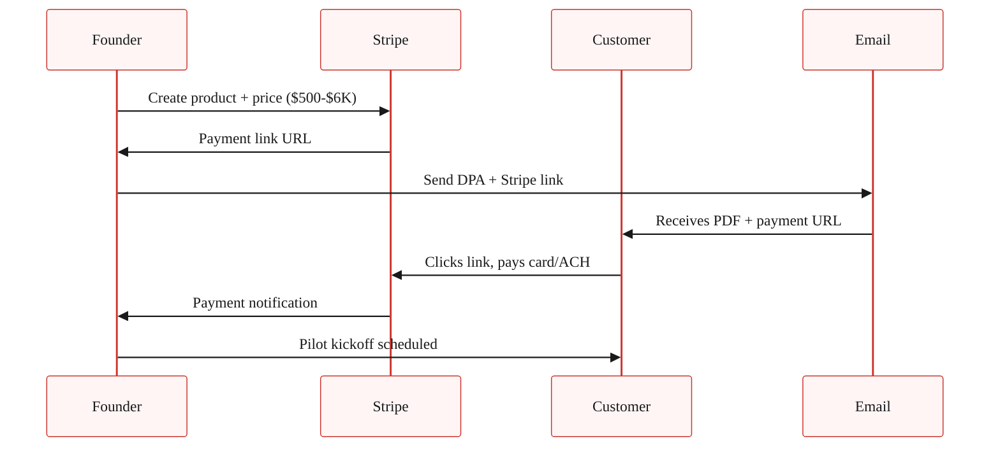

> **Module 5 · Step 4 of 5** · [Tech for Non-Technical Founders 2026](/course/tech-for-non-technical-founders-2026/) course.
> Input: 3-5 warm leads from [Chapter 5.3](/course/tech-for-non-technical-founders-2026/first-ten-customers-personal-network/). Output: 1 signed paid pilot before any new code ships.

In late 2025 a HealthTech founder ran a six-week free pilot with a 40-bed clinic she had met at a conference. The clinic loved it, the shared Slack channel had 47 messages of enthusiasm before week 4, and the day the pilot ended she sent the year-one contract. The reply came back three weeks later: "We're going to revisit at the next budget cycle." There was no next budget cycle - the clinic moved on. In March 2026 she shipped the same product to a different customer who paid a $1,200 deposit at the start of the pilot, and that customer closed the year-one contract on day one. Same product, same buyer profile, different deposit timing.

Below is the playbook the second founder followed: a one-page Design Partner Agreement, a 15-minute Stripe Checkout setup, and the pricing math that puts the founder in the conversation instead of the agency.

## Why free pilots almost never convert

Free pilots feel collaborative because the customer says yes, you build for six weeks, and the team shows up to the Friday demo each week and says "this is great." Week 8 lands and you send the proposal for the year-one contract. The customer says "this is great, let me circle back to my CFO" - and that CFO has never heard of you, did not approve the pilot, and has no internal justification for the line item. The conversation dies in a forwarded email thread.

That is the recurring mechanic. Four 2026 B2B founders ran pilots through the JetThoughts rescue queue in the last six months. The three who ran free pilots all hit the same wall - "this is great" emails on Friday, ghost on conversion in week 8. The one who insisted on a 20% deposit before kickoff cleared the conversion in week 7 without negotiation. Her customer's CFO had already approved the spend in week 0; the conversion was paperwork, not a new decision.

The non-technical founder out of a dev-shop burn has a specific reason to find this hard. After six months of paying an agency, the muscle memory is "everyone keeps asking me for money." Asking your customer for money first feels like joining the side that hurt you. The instinct is wrong but understandable. Reframe: you are not asking for money. You are asking the customer to defend the spend internally. The defense is the test of whether the pilot is real.

## The Design Partner Agreement, in one page

The Design Partner Agreement (DPA) is a one-page LOI that names the customer as a design partner, defines the pilot scope, sets the deposit, and converts to year-one on success. It is mutual-edit, in plain English, and v1 does not need a lawyer. The reason it stays short: every line in the document is a load-bearing clause, and every line that would not load-bear is removed.

The structure has six sections plus signatures.

| # | Section | What goes in it |
|---|---------|-----------------|
| 1 | Scope of pilot | 3 outcomes the customer wants. 2 specific use cases. Anything outside is out of scope. |
| 2 | Duration + dates | 6-8 weeks. Start date. End date. Weekly Friday demo at a named time. |
| 3 | **Pilot fee + deposit** (load-bearing) | 10-30% of year-one ACV. Paid via Stripe before kickoff. Credited toward year-one on conversion. |
| 4 | Success criteria | 3 measurable outcomes - hours saved, errors avoided, revenue produced. Friday-demo verified. |
| 5 | Conversion terms | Year-one price. Annual or monthly. Auto-conversion or opt-in. Notice period. |
| 6 | Data, IP, termination | Customer keeps their data. You keep the product IP. 30-day written notice to exit. |
|  | Signature block | DocuSign, HelloSign, or PDF + email confirmation - whichever the customer prefers. |

Total document: one page, around 400 words. v1 needs no lawyer review.

A few clauses deserve more detail than the table can hold.

The **scope of pilot** section is where new founders over-spec. Keep it to three outcomes the customer wants and two specific use cases; anything outside that list stays out of scope until conversion. The list also anchors the Friday demos - if a demo does not advance one of the three outcomes, the demo is off-scope and you say so. Friday cadence comes from the [Friday demo chapter](/course/tech-for-non-technical-founders-2026/friday-demo-rule-founder-progress/).

The **pilot fee and deposit** clause is what makes everything else work. The deposit lands at 10-30% of projected year-one annual contract value (ACV), paid via Stripe before pilot kickoff and credited dollar-for-dollar against the year-one invoice on conversion. If the customer cancels before week 4, they forfeit the deposit (their commitment). If the founder cancels for any reason, the founder refunds 100% (your commitment). Pricing math is below.

The **success criteria** clause is what makes the DPA a real contract instead of a handshake. Pick three measurable outcomes the pilot is supposed to produce (for example, hours saved per week, errors avoided per month, or revenue lifted per quarter), worded in the customer's verbatim language from the [Chapter 5.3 outreach](/course/tech-for-non-technical-founders-2026/first-ten-customers-personal-network/). If two of three are hit by week 6, the year-one contract auto-converts unless the customer opts out in writing. If fewer than two are hit, both parties walk and the founder retains the deposit as paid consideration for the pilot work.

The **conversion terms** clause is what the CFO actually approves in week 0. State the year-one price in dollars (never "TBD"), billing cadence (annual or monthly), auto-conversion versus opt-in (auto-conversion recommended), and a 30-day notice period after year one. These numbers are why the deposit can be defended internally before kickoff.

**Data, IP, and termination** is the shortest section: customer keeps their data, founder keeps the product IP, either party can exit at 30 days written notice during the pilot, and the customer's data stays exportable for 90 days after termination. v1 needs no further detail.

Signature block at the bottom - DocuSign, HelloSign, or PDF-and-email-confirmation, whichever the customer prefers.

## The pricing math

The deposit number is not arbitrary. It is anchored to projected year-one ACV and to what a typical CFO will sign without a procurement review. The bands by sector:

| Sector | Year-1 ACV | Pilot fee (10-30%) | Pilot fee notes |
|---|---|---|---|
| B2B SaaS (per-seat, 5-10 seats) | $5K-$12K | $500-$3K | The CFO approves the deposit on email. No procurement involved. |
| B2B SaaS (mid-market, 50-200 seats) | $20K-$80K | $2K-$24K | Above $10K, expect a 1-week procurement review. Plan for it. |
| B2B Services / consultancy | $10K-$40K | $1K-$6K | Service deposit is normal in the sector. Customer expects to pay. |
| Rails MVP-as-a-service | $15K-$60K | $1.5K-$6K | This is the JT-rescue band. Founder is buying back control. |

### The minimum: $500

Below $500, the deposit does not work as a commitment device - the customer can write it off as a Friday-impulse purchase and ghost the same way they would on a free pilot. The point of the deposit is that it lives in next month's accounting cycle, which means it gets justified.

### The maximum without procurement review: typically $10K

Above $10K, even at small companies, finance starts asking questions. If your pilot fee is $10K+, expect a 1-2 week procurement window between handshake and signature, and price the timeline into the conversation - the deposit clears in week 2, not week 0.

### Always credit toward year-one

The pilot fee is not separate revenue. It is "year-one ACV, pre-paid." The customer's CFO is approving year-one revenue brought forward, not a discretionary line item. Naming it correctly changes the conversation entirely.

## The Stripe Checkout setup (15 minutes, no engineer)

You will spend more time renaming the Stripe product than building the payment page. Stripe Checkout is hosted - you do not build a payment form, you just generate a checkout URL and email it to your customer.

The five-minute path:

1. Create or sign in to your Stripe account. [stripe.com/login](https://dashboard.stripe.com/login)
2. Go to Products. Create a new product called "[Your Product Name] - Design Partner Pilot".
3. Add a one-time price for the deposit amount ($500, $2K, $6K, whatever your math).
4. Hit "Payment link" on the product detail page. Stripe generates a hosted checkout URL.
5. Paste the URL into your DPA email. Customer clicks, pays card or ACH, you get the Stripe notification.

That is the entire setup. No webhook, no Rails controller, no Django view, no Laravel route. If you want to log paid pilots into your existing app, you can - but you do not have to. The CSV export from Stripe is enough for a Module 5 first-pilot motion.

If you do want to wire the payment into a Rails app for record-keeping later, the Stripe Ruby gem (`gem 'stripe'`) takes a `Stripe::Checkout::Session.create` call to generate the same URL programmatically. Django uses `stripe.checkout.Session.create` via the `stripe-python` package. Laravel uses `Stripe\Checkout\Session::create()` from `stripe/stripe-php`. All three produce the same hosted URL. Do not build this until after your first paid pilot ships.

## The conversation script

You have a warm lead from [Chapter 5.3](/course/tech-for-non-technical-founders-2026/first-ten-customers-personal-network/) who booked a 20-minute demo, the demo went well, and they said something close to "yes, I would love to try this with my team." Most founders soften here. The 15-second script that does not soften:

> "Glad it resonates. Quick word on how I am setting up pilots - I am running them as paid design partnerships, so the customer has skin in the game and I have a real signal. The deposit is [$500-$6K], credited toward year one on conversion. Refunded in full if I cannot deliver on the success criteria. Want me to send the one-pager?"

| Customer response | What it means | Next action |
|---|---|---|
| **"Send the one-pager"** | Close to a paid pilot. Window is open today. | Send inside the hour. DPA + payment link. |
| **"Can we start free and convert later?"** | Still hedging. Deposit scares them but they're interested. | Reframe: deposit is *year-one ACV prepaid*, not added cost. Clarify: $500 sits in this month's accounting, gains CFO approval. Free pilots lose approval in week 8. |
| **"Let me think about it"** | Not ready this week. Warm lead turning cold. | Check back in 7 days. If no callback, move to next prospect. Hedge → delay → ghost is the pattern. |
| **"We do not do paid pilots"** | Not in your must-have segment. Wrong buyer profile. | Thank them. Move on. They're not disqualified; they're not your customer yet. |

## When founders should not insist on a paid pilot

The paid pilot is the default, but it has three honest exceptions.

| Exception | When it applies | Substitute approach |
|---|---|---|
| **Champion conversion** | A champion from Chapter 5.3 offers free pilot + co-marketing case study + Loom testimonial. Trade: your work now for their case study + testimonial (your conversion assets for the next 10 customers). | Limit to 1-2 champions out of first 10 pilots. Only when case study is contractually committed. Case study must ship within 60 days. |
| **True early-MVP (30% built)** | Your MVP is genuinely unfinished. Paid pilot misrepresents what you can deliver in 6-8 weeks. | Run free pilot honestly, ship to the agreed scope, turn second customer into the paid pilot. The honesty signal is commitment of a different kind. |
| **Pre-investment-grade product** | Your product is 12 months from differentiability. Customer is buying relationship, not product. | Follow the Paul Graham ["Do Things That Don't Scale"](http://paulgraham.com/ds.html) Stripe Collison playbook. Paid pilot returns once product is actually doing the job. |

## What to do this week

| Day | Action | Output |
|---|---|---|
| **Monday morning** | Write your one-page DPA in Google Doc. Use the template in [First-Paying-Customer Operating Kit](/course/tech-for-non-technical-founders-2026/first-paying-customer-operating-kit/). Set up Stripe product + payment link (15 min). Pick deposit number from the sector table above. | Stripe link ready. DPA drafted. Deposit amount locked. |
| **By Wednesday** | Send the DPA + Stripe link to 1-2 warm leads from Chapter 5.3 who booked demos last week. | 1-2 DPA emails sent. Expect 1 procurement question + 1 ready-to-sign. |
| **By Friday** | Bank your first deposit. Schedule pilot kickoff for Monday. Schedule first Friday demo for the Friday after. | Deposit cleared. Both demos scheduled. Pilot officially started. |

**If you do not have warm demos this week**, your work is still in [Chapter 5.3](/course/tech-for-non-technical-founders-2026/first-ten-customers-personal-network/). The DPA is the wrong sprint for an empty pipeline.

## Advanced (optional sidebar)

Founders who have closed 2-3 paid pilots and want to layer on contract rigor can read the [Common Paper Design Partner Agreement template](https://commonpaper.com/standards/design-partner-agreement/) (a vetted v2 LOI used by hundreds of YC companies), [SaaStr's "Should we charge for pilots"](https://www.saastr.com/should-you-charge-for-a-pilot/) (Jason Lemkin's thirty-second answer is yes, always), and Ash Rust's ["Startup Sales: How to Get Pilot Customers to Pay"](https://medium.com/sharp-spear/startup-sales-how-to-get-pilot-customers-to-pay-7a9b7a48eedf) for the conversation tactics. The one-page DPA in this chapter is enough through your first 10 pilots. The advanced versions matter once you start hearing the words "procurement" and "MSA" in pilot conversations.

---

## Further reading

- Common Paper, [Design Partner Agreement template](https://commonpaper.com/standards/design-partner-agreement/) - a vetted, modern LOI used by hundreds of YC companies. The companion to your one-pager when conversations move toward MSAs.
- SaaStr, [Should you charge for a pilot?](https://www.saastr.com/should-you-charge-for-a-pilot/) - Jason Lemkin's case for charging and the conversion-rate data behind the recommendation.
- Ash Rust, [Startup Sales: How to Get Pilot Customers to Pay](https://medium.com/sharp-spear/startup-sales-how-to-get-pilot-customers-to-pay-7a9b7a48eedf) - tactical conversation script and pricing-band data from a former Sequoia-backed founder.
- Steve Blank, [The Four Steps to the Epiphany](https://steveblank.com/2010/01/06/the-four-steps-to-the-epiphany/) - the foundational text on Customer Validation; Blank argues paid pilots are how you separate real demand from polite enthusiasm.
- Stripe, [Payment Links documentation](https://stripe.com/docs/payment-links) - the official Stripe Checkout setup. 15-minute integration with no engineering work required.
- Lenny Rachitsky, [How to win your first 10 B2B customers](https://www.lennysnewsletter.com/p/how-to-win-your-first-10-b2b-customers) - the 7-step playbook including the design-partner pricing model from B2B founders.

---

*Built by [JetThoughts](https://jetthoughts.com) as part of the [Tech for Non-Technical Founders 2026](/course/tech-for-non-technical-founders-2026/) curriculum.*
