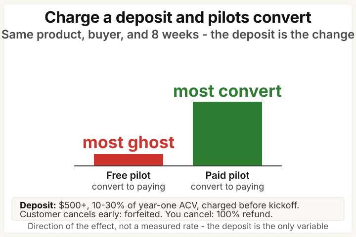

> **Module 5 · Lesson 5.6 · [CORE]** · [From Idea to First Paying Customer](/course/tech-for-non-technical-founders-2026/)
>
> **Input:** 3-5 warm leads from [Lesson 5.5](/course/tech-for-non-technical-founders-2026/first-ten-customers-send-track/)
>
> **Output:** 1 signed paid pilot before any new code ships
>
> **Progress:** M5 · 6 of 7

"Let me circle back to my CFO" - from a CFO who never heard of you and never approved the pilot - is how six weeks of enthusiastic free-pilot demos end. Nobody inside the customer's company ever had to approve a free pilot. A Stripe deposit signed before kickoff is what turns that dead end into a formality.

> → **Mia sent her DPA** to a parent from her Module 2 interviews - someone who'd described paying $400/month for a tutor who didn't specialize. The $1,200 deposit cleared before she built anything new. [Full walkthrough →](/course/tech-for-non-technical-founders-2026/module-5-walkthrough-mia/)

---

Same product, same buyer, one difference - when the money lands:

| Variant | Setup | Result at Week 8 |
|---|---|---|
| **Free pilot** | Six weeks of free build, customer "loves it," a wall of enthusiastic Slack messages, year-one contract sent on day pilot ended | "We're going to revisit at the next budget cycle." There is no next budget cycle. |
| **Paid pilot** | One-page Design Partner Agreement, $1,200 deposit collected before any code ships | Year-one contract closes day one. |

Real money on the table before kickoff forces the internal budget conversation while nothing is riding on it yet. You are not asking for money - you are asking the customer to defend the spend internally. That defense is the test of whether the pilot is real.



When the course says "first paying customer," it means a signed DPA (Design Partner Agreement) AND a cleared Stripe deposit - real money in your account. Converting the pilot into a year-one contract is a separate event 6-10 weeks later, after the success criteria are met.

The DPA is a one-page letter of intent that names the customer as a design partner, defines the pilot scope, sets the deposit, and converts to year-one on success. It is mutual-edit, plain English, and v1 needs no lawyer. Six sections plus signatures:

| # | Section | What goes in it |
|---|---------|-----------------|
| 1 | Scope of pilot | 3 outcomes the customer wants. 2 specific use cases. Anything outside is out of scope. |
| 2 | Duration + dates | 6-8 weeks. Start date. End date. Weekly Friday demo at a named time. |
| 3 | **Pilot fee + deposit** (load-bearing) | 10-30% of year-one ACV. Paid via Stripe before kickoff. Credited toward year-one on conversion. |
| 4 | Success criteria | 3 measurable outcomes - hours saved, errors avoided, revenue produced. Friday-demo verified. |
| 5 | Conversion terms | Year-one price. Annual or monthly. Auto-conversion or opt-in. Notice period. |
| 6 | Data, IP, termination | Customer keeps their data. You keep the product IP. 30-day written notice to exit. |
|  | Signature block | DocuSign, HelloSign, or PDF + email confirmation - whichever the customer prefers. |

The clause-by-clause detail - what each section is really doing, and what happens each Friday after the deposit clears - is in the [full reference](/course/tech-for-non-technical-founders-2026/reference/paid-pilot-full/).

### Copy-paste DPA template {#dpa-template}

Verbatim - fill the brackets, send.

Open a Google Doc. Paste the block below. Replace every `[BRACKETED]` value with your numbers. Total document: one page, ~400 words. No lawyer review needed for v1.

```text
DESIGN PARTNER AGREEMENT

Between: [Your Company Name] ("Company") and [Customer Company Name] ("Design Partner")
Date: [YYYY-MM-DD]

1. SCOPE OF PILOT
The Company will deliver the following outcomes during the pilot period:
  1. [Outcome 1 - measurable, e.g. "Reduce weekly report prep from 3 hours to 30 minutes"]
  2. [Outcome 2]
  3. [Outcome 3]
Specific use cases covered: [Use case 1], [Use case 2].
Anything outside this list is out of scope until year-one conversion.

2. DURATION + DATES
Start date: [YYYY-MM-DD]
End date: [YYYY-MM-DD] (6-8 weeks)
Weekly Friday demo at [time] [timezone]. 15 minutes. Loom or live screenshare.

3. PILOT FEE + DEPOSIT
One-time deposit: $[500-6,000] (10-30% of year-one ACV).
Paid via Stripe before pilot kickoff. Credited dollar-for-dollar toward year-one invoice on conversion.
If Design Partner cancels before week 4: deposit forfeited.
If Company cancels for any reason: 100% refund within 14 days.

4. SUCCESS CRITERIA
The pilot is successful if 2 of 3 criteria are met by [end date]:
  1. [Measurable criterion 1 - e.g. "Report prep time reduced to <=30 min/week, verified in Friday demo"]
  2. [Measurable criterion 2]
  3. [Measurable criterion 3]
If 2+ criteria met: year-one contract auto-converts unless Design Partner opts out in writing within 7 days.
If <2 criteria met: both parties walk. Company retains deposit as paid consideration for pilot work.

5. CONVERSION TERMS
Year-one price: $[amount] / [month or year]
Billing: [monthly / annual]
Conversion: auto-convert at pilot end unless Design Partner opts out in writing.
Post year-one: 30-day written notice to cancel.

6. DATA, IP, TERMINATION
Design Partner keeps their data. Company keeps the product IP.
Either party may exit at 30 days written notice during pilot.
Design Partner's data remains exportable for 90 days after termination.

SIGNED:

_________________________  Date: __________
[Your Name], [Your Company]

_________________________  Date: __________
[Champion Name], [Customer Company]
```

Two annotated worked examples (a $1,500 B2B SaaS pilot and a $5,000 B2B services pilot) plus DocuSign-importable + PDF formats are in [The First-Paying-Customer Operating Kit](/course/tech-for-non-technical-founders-2026/first-paying-customer-operating-kit/) - a free reference for the same template with sector-specific fills.

**The deposit number:** take the monthly price you tested in [Lesson 1.5](/course/tech-for-non-technical-founders-2026/price-hypothesis-on-smoke-test-page/) and multiply by 12 for year-one ACV. A $97/month hypothesis → $1,164 ACV. Your deposit is 10-30% of that, with a **$500 floor** - below $500 it stops working as a commitment device. (Very low ACV? The [full pricing bands](/course/tech-for-non-technical-founders-2026/reference/paid-pilot-full/#the-pricing-math-in-full) have the first-month-upfront variant.)

---

> **Do this now:**
>
> 1. Copy the [DPA template above](#dpa-template) into a Google Doc. Fill the 6 bracketed sections.
> 2. Take your smoke-test price × 12 for ACV. Set the deposit at 10-30%, never below $500.
> 3. In [Stripe](https://dashboard.stripe.com/login): Products → create "[Product] - Design Partner Pilot" → add a one-time price for the deposit → hit "Payment link". Stripe generates a hosted checkout URL. No webhook, no code.
> 4. Send the DPA + Stripe link to 1-2 warm leads who booked demos recently.
> 5. **Success check:** one lead replies "send the one-pager" or signs, and your first deposit clears in your Stripe account. That is the first paying customer.

---

**If this fails: the customer says "can we start free and convert later?"**
- **Why:** the deposit scares them, but they're still interested - this is hedging, not a no.
- **Fix:** reframe the deposit as *year-one ACV prepaid*, not added cost.

**If this fails: the customer says "we do not do paid pilots."**
- **Why:** they're not in your must-have segment - wrong buyer profile.
- **Fix:** thank them and move to the next warm lead.

**If this fails: they go quiet after you send it.**
- **Why:** "let me think about it" turning into silence is the most common outcome - a warm lead going cold.
- **Fix:** check back once; no reply after that means move to the next lead. The [objection scripts](/course/tech-for-non-technical-founders-2026/reference/paid-pilot-full/#the-conversation-script) cover the spoken versions.

---

Send the DPA to your warmest lead first. Asking someone you know for a deposit is the stall point - the deposit tests whether the problem is real. The second ask is easier.

---

> **Done:** one DPA is signed and the Stripe deposit has cleared in your account.
>
> **You have now:** a signed Design Partner Agreement + a cleared deposit, sitting alongside your validated problem statement, Product Brief, and live MVP in the `Founder OS` folder. That completes the folder - the artifact investors fund. Converting this pilot into a year-one contract is the next test, 6-8 weeks out.
>
> **Next:** the fork here is persevere or pivot.
>
> - **Deposit cleared:** the core course is complete - from a one-sentence hypothesis to a stranger's money in your account. Keep selling with [5.7 · Going Outbound Without a Sales Team](/course/tech-for-non-technical-founders-2026/outbound-without-sales-team/) when your warm list runs dry; the [First-Paying-Customer Operating Kit](/course/tech-for-non-technical-founders-2026/first-paying-customer-operating-kit/) keeps the build honest through the pilot.
> - **No one will put money down** after the warm list and the 5.7 outbound pass: the signal is the segment, not the pitch - work [Pivot or Persevere](/course/tech-for-non-technical-founders-2026/pivot-or-persevere-decision-framework/) before you build more.
>
> **If blocked:** see "If this fails" above. If you do not have warm demos yet, your work is still in [Lesson 5.3](/course/tech-for-non-technical-founders-2026/first-ten-customers-network-list/) - the DPA is the wrong sprint for an empty pipeline.
>
> **Deeper reference:** [The full paid-pilot playbook](/course/tech-for-non-technical-founders-2026/reference/paid-pilot-full/)

---

*See it in action: [Module 5 walkthrough: Mia gets paid](/course/tech-for-non-technical-founders-2026/module-5-walkthrough-mia/)*

*Built by [JetThoughts](https://jetthoughts.com) as part of the [From Idea to First Paying Customer](/course/tech-for-non-technical-founders-2026/) curriculum.*
