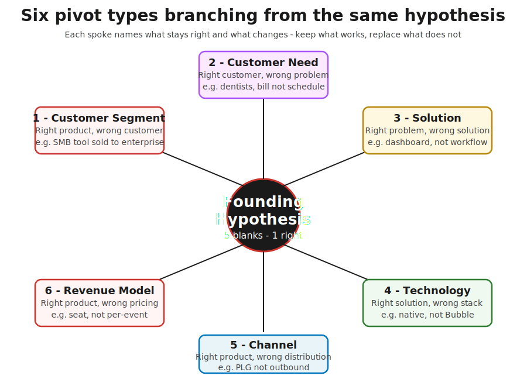
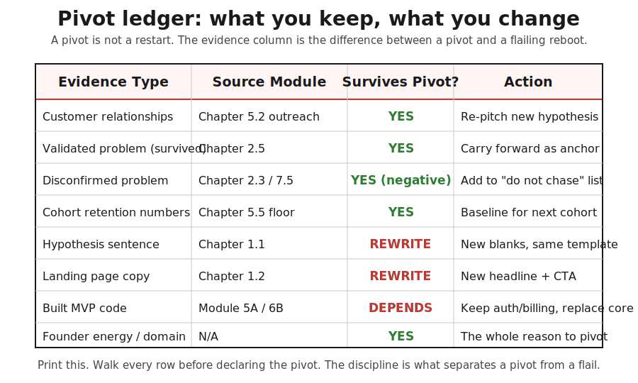

> **Going further · Continuation chapter** · [From Idea to First Paying Customer](/course/tech-for-non-technical-founders-2026/)
>
> **Input:** a decision from the [churn-triage chapter](/course/tech-for-non-technical-founders-2026/customers-leaving-churn-triage-not-acquisition/) OR a Sean Ellis 40% test result ([Chapter 5.1](/course/tech-for-non-technical-founders-2026/must-have-segment-pmf-test/))
>
> **Output:** a pivot decision with the 6-type framework + a written list of what you keep vs what you change

## The Course Is a Loop, Not an Escalator

A founder I rode shotgun with last quarter - a fintech founder named D. - hit the cold-outbound stage (Chapter 5.7) with a conversion rate of 0.6%. He had sent 287 personal emails to CFOs of 50-200-person companies over 14 days, with 11 replies and 0 paid pilots. His instinct, the same instinct every founder gets here, was to push forward into salvage-or-rebuild territory and start managing the build harder.

That was the wrong move. The right move was backwards. The 0.6% conversion rate was telling him the messaging he had built off his [Founding Hypothesis](/course/tech-for-non-technical-founders-2026/form-your-founding-hypothesis-90-minute-sprint/) sentence was not landing on the segment he had picked. Three things could be wrong: the customer (segment), the need (problem), or the channel (outbound vs PLG - product-led growth, where users find and buy the product self-serve). Pushing forward into rebuild mode would have made him a better operator of a misaligned hypothesis. Going back to [Form Your Founding Hypothesis](/course/tech-for-non-technical-founders-2026/form-your-founding-hypothesis-90-minute-sprint/) with a pivot decision made him a better founder.

The course you have been reading was structured as a numbered sequence because that is the cleanest way to learn the moves. But the actual job is a loop. A founder writes a hypothesis, smoke-tests it, talks to customers, builds an MVP, lands paying customers, and at any point can hit a signal that sends them back to [Form Your Founding Hypothesis](/course/tech-for-non-technical-founders-2026/form-your-founding-hypothesis-90-minute-sprint/) with a new hypothesis. The courses that pretend the journey is one-way escalator produce founders who think pivoting is failure. It is not. Pivoting is the discovery loop working correctly.

This chapter teaches you when to go back vs when to push forward. It is the chapter that turns the rest of the course from a checklist into a system.

## The Six Pivot Types

Eric Ries catalogued ten pivot types in *The Lean Startup*; Steve Blank built on them with the customer-development variants. Six of those ten cover 90% of what a non-technical founder will face in 2026. The other four are scope and platform pivots that show up later, when you are managing a product team. Below are the six in plain English, with one trigger sentence and one example each.

### 1. Customer Segment pivot

*Right product, wrong customer.* You shipped a tool that works, but the audience you targeted is not the audience that gets value from it. The signal usually comes from a churn-triage cohort slice (see the [churn-triage chapter](/course/tech-for-non-technical-founders-2026/customers-leaving-churn-triage-not-acquisition/)) where one segment retains at 50%+ and others languish under 20%. Example: R. from the churn-triage chapter shipped a workflow tool to solo founders that turned out to be a 3-person-team tool. Same product, different audience.

### 2. Customer Need pivot

*Right customer, wrong problem.* The audience you targeted is correct, but the job you built for is not their highest-priority job. The signal usually comes from [customer interviews](/course/tech-for-non-technical-founders-2026/mom-test-ask-about-past-not-future/) where multiple customers describe a different pain than the one your product solves. Example: a HealthTech founder targeting solo dental practices initially built around appointment scheduling; six interviews in, every dentist named insurance-claim resubmission as the bigger pain. The audience was right; the need was not.

### 3. Solution pivot

*Right problem, wrong solution.* You picked a real problem for the right customer, but the product you built does not actually relieve it. The signal comes from the [Sean Ellis 40% test](/course/tech-for-non-technical-founders-2026/must-have-segment-pmf-test/) returning under 25% across all segments uniformly. Example: a productivity founder built a Slack integration to manage standup notes; users came for the right reason (hated standup overhead) but the integration created more notification noise than it removed. Same problem; different solution shape (a quiet email digest at 9 AM, not a real-time bot).

### 4. Technology pivot

*Right solution, wrong tech stack.* The shape of the solution is right but the platform you built it on cannot reach the price or performance the customer needs. Less common for non-technical founders because most ship on Lovable, Bubble, or with a hired team and the tech is opaque. Becomes relevant when you outgrow a no-code ceiling. Example: a B2C founder hit 4,000 MAU (monthly active users) on Bubble and discovered the per-row pricing model would cost $11K/month at 20K MAU; the rebuild on a native stack made the unit economics work.

### 5. Channel pivot

*Right product, wrong distribution.* The product is right, the audience is right, but the way you reach them does not work. The signal usually comes from cold-outbound under 1% conversion or paid ads producing zero qualified pilots. Example: the fintech founder D. above. The product was right (CFO-grade close-the-books tool), the segment was right (50-200-person companies), but cold email could not break through to a CFO's inbox. Channel pivot was to a partner-led motion through fractional CFO networks; conversion went to 4.2% in 30 days.

### 6. Revenue Model pivot

*Right product, wrong pricing.* The product works and the audience pays, but the pricing shape (per seat, per event, flat tier, freemium) does not match how customers value or budget for the product. The signal comes from active customers churning at the renewal date with feedback that points at price, not the product. Example: a B2B SaaS priced at $200/seat/month for 10-seat teams; customers loved it but balked at the renewal because they only needed 3 power users. Pivot was to $400/month flat for unlimited seats with feature gates by usage tier. ARPU (average revenue per user) dropped 20% per customer; net revenue retention (the revenue you keep plus expansion from existing customers) jumped to 118%.

The skill is not memorizing the six types. The skill is asking which of the five Mad Libs blanks (customer, problem, approach, competition, differentiation) is wrong, and matching it to the pivot type that addresses that blank.

## Trigger Conditions: What Tells You to Pivot

The common pattern is not pivoting too early. It's pivoting too late - watching the cohort numbers, the conversion rates, the ad spend, and the CAC numbers all degrade for two quarters before admitting the signal is real. The trigger conditions below are the numerical thresholds that should override the "let me try one more thing" instinct.

Work the five checks in order - the first row whose trigger matches names your pivot type; if none match, you persevere:

| Check, in order | Trigger threshold | Verdict |
|---|---|---|
| 1. Sean Ellis 40% must-have test | Under 25% in ALL segments | Solution or Customer Need pivot |
| | Under 40% overall, but one segment 50%+ | Customer Segment pivot |
| 2. 30-day cohort retention | All segments under 25% | Solution pivot |
| 3. CAC vs LTV ratio | CAC over 3x LTV while customers love the product | Revenue Model pivot |
| 4. Outbound conversion | Under 1% after 60 personal messages | Channel pivot |
| 5. Tech ceiling | Stack cost or performance ceiling hit | Technology pivot |
| All five clear | - | **Persevere - you have signal** |

**Sean Ellis 40% under 25% across all segments** triggers a Solution pivot or a Customer Need pivot. Founders typically react by trying harder on the same product - more features, better onboarding, more polish. The right move is to ask whether the solution shape itself is wrong, or whether you targeted the wrong job.

**Cohort retention under 30% with churn-triage Decision 3** triggers a Solution pivot. The churn-triage cohort floor already told you no segment retains. The pivot framework tells you the most likely culprit is solution shape, not audience.

**CAC > 3x LTV with paying customers who love the product** triggers a Revenue Model pivot. Founders typically react by trying to push CAC down (better ads, better landing pages). When the customers who do convert love the product, the issue is almost always pricing model, not acquisition cost.

**Outbound conversion under 1% after 60 personal messages** triggers a Channel pivot. Founders typically react by writing better email copy. After 60 messages with thoughtful copy, the channel itself is the bottleneck. Most B2B products that fail outbound do well via partnerships, communities, or content; most B2C products that fail Meta Ads do well via influencers or organic social.

**Tech-stack cost or performance ceiling** triggers a Technology pivot. Founders typically react by ignoring the ceiling for too long because rebuilding feels expensive. The cost of a 6-week rebuild is almost always less than the cost of running on a stack that triples every quarter at scale.

The right rule is simple: when two consecutive months show the same trigger condition, the next decision is a pivot type, not a "try harder." The flail response is to try harder for two more quarters; the pivot response is to ship a new hypothesis test in two weeks.

## What You Keep When You Pivot

A pivot is not a restart. The founders who treat pivots as restarts are the ones who burn the most runway because they throw away the evidence they already paid to collect. The discipline that distinguishes a real pivot from a flailing reboot is the pivot ledger - a written list of every artifact you have built so far and whether it survives the pivot.

The ledger above is the template. Print it (or copy it to a Notion doc) before you declare the pivot. Walk every row. The evidence you keep includes: the validated problem statements that survived the interviews (or the disconfirmed ones - both are evidence), the customer relationships from your [Build Your 50-Name Network List](/course/tech-for-non-technical-founders-2026/first-ten-customers-network-list/) outreach (50 names with verified contact details and one conversation each is the most valuable B2B asset you own at this stage), the cohort retention numbers you collected for the churn triage, and your domain expertise as the founder. The hypothesis sentence, the landing page copy, and the ad creative get rewritten. The MVP code depends - the auth and billing layers usually survive; the core workflow gets rebuilt around the new hypothesis.

A second founder we rode shotgun with - Anika, running a vertical SaaS for clinical-trial coordinators - ran the ledger move on a Monday afternoon. She kept her 287-person coordinator contact list (Customer Need pivot meant the segment was still right). She kept four of her eleven validated problem statements from her [Mom Test interviews](/course/tech-for-non-technical-founders-2026/mom-test-ask-about-past-not-future/) (the ones about consent-form reconciliation, not the ones about scheduling). She kept her Stripe integration and her auth flow from the Lovable build. She rewrote her hypothesis sentence around consent-form reconciliation. She rewrote her landing page headline. She kept her pricing model intact ($240/month per seat). Two weeks later she had a smoke-test landing page live, an outreach script aimed at the same 287 contacts with the new pitch, and four warm meetings booked. The pivot took 14 days because she kept everything that survived.

The trade-off worth naming: keeping too much makes a pivot feel like a renaming. The discipline is to be honest about which artifacts genuinely transfer and which ones are sunk cost. If your ledger says everything survives, you have not actually pivoted - you have rebranded. A real pivot rewrites at least the hypothesis sentence, the landing page, and the messaging across all customer touchpoints. If those three are the same after the "pivot," the trigger condition will fire again in 60 days and you will be back here.

The ledger also serves a second purpose. When you go back to investors, advisors, or your fractional CTO with the pivot decision, the ledger is the artifact that proves you are pivoting on evidence and not on whim. Investors fund founders who can show their work. The pivot ledger is the work.

## When to PERSEVERE

Not every dip is a pivot signal. The harder skill in 2026 is knowing when to push through a slow signal rather than chase a new hypothesis. Most pivots that fail were premature; the founder mistook a bad month for a bad hypothesis and reset the discovery loop just as the original one was starting to work.

The persevere signals are quieter than the pivot signals because they are about trajectory, not about absolute numbers. The three signals to look for are: cohort 3-month retention is climbing (even slowly - 12% to 14% to 17% across three monthly cohorts is a persevere signal even if the absolute number is low), one segment is producing referrals without you asking for them (referrals mean the product is creating word-of-mouth value, which is the strongest possible PMF signal), and your own founder energy is genuinely renewing as you ship (not stubbornly continuing despite exhaustion - the difference matters).

The Eric Ries persistence threshold is 6-12 months of consistent signal in the same direction. Most consumer products that became hits hit their first usable PMF signal in months 7-9; most B2B products in months 9-14. Pivoting at month 4 because the signal was not loud enough is the most common pre-PMF mistake. The right move at month 4 is usually to run a tighter experiment within the current hypothesis - sharpen the segment, refine the messaging, ship one more workflow improvement - and re-measure at month 6.

Tomás, a B2B procurement-tools founder, came back to me eleven weeks after his Channel pivot with a different question. The new hypothesis was working: 4.2% outbound conversion, 3 paid pilots signed, MRR around $2,400. He was wondering whether to pivot again because growth had stalled at $2,400 for three weeks. The cohort numbers were good (78% week-4 retention on the 3 pilots), the segment was right, the new pivots from the trigger conditions were not firing. The persevere call was obvious. He had run his pivot 11 weeks earlier; the signal was new, the trajectory was up, and three weeks of flat MRR after a 0-to-$2,400 ramp is noise, not pattern. He stayed put. By week 16 MRR was at $4,100 with no new pivots.

The honest trade-off: persevere is the harder discipline because it looks like inaction from outside. Investors ask why you are not pivoting; advisors offer new hypotheses; the [Twitter timeline](https://twitter.com) keeps surfacing founders who pivoted into a unicorn. Persevere works only when you have a written list of trigger conditions and the latest measurements show none of them firing. Without that list, persevere collapses into "stubborn." With the list, persevere is a deliberate operational choice backed by evidence.

The KISS rule for the pivot/persevere call: write the trigger conditions down. Re-measure monthly. Pivot when two consecutive months hit a trigger; persevere when none do. Do not pivot every quarter; do not push through every signal. The framework runs on a steady cadence, not on emotion.

## Hand This to the Next Loop

You walk out of this chapter holding a pivot decision (one of six types, or persevere) and a pivot ledger that names what you keep and what you change. The next chapter for you depends on the pivot type.

A Customer Segment pivot or Customer Need pivot routes you back to [Form Your Founding Hypothesis](/course/tech-for-non-technical-founders-2026/form-your-founding-hypothesis-90-minute-sprint/) - rewrite the customer or problem blanks, keep the rest of the sentence template. Then [Find 10 People With the Problem](/course/tech-for-non-technical-founders-2026/find-10-people-with-problem-outreach-2026/) to validate the new hypothesis with the new segment.

A Solution pivot routes you back to [Decide What's Next](/course/tech-for-non-technical-founders-2026/mom-test-synthesis-build-pivot-kill/) - the validated problem statement is still good (you confirmed the right customer has the right pain); the solution shape needs to change. Then back into the self-serve or hire path for the rebuild.

A Channel pivot or Revenue Model pivot routes you back to [Build Your 50-Name Network List](/course/tech-for-non-technical-founders-2026/first-ten-customers-network-list/) with the new channel or pricing model. The hypothesis stays intact; the go-to-market motion changes.

A Technology pivot routes you to the [hire-track supplementary reference](/course/tech-for-non-technical-founders-2026/hire-track-supplementary-reference/#the-fractional-cto-bridge) for the salvage-vs-rebuild decision. The customer-facing hypothesis is the same; the implementation needs to be re-platformed.

A persevere decision keeps you on whatever module you were on. Re-measure trigger conditions in 30 days.

The course was always a loop. The reason it reads as a numbered sequence is that the discovery moves work the same regardless of whether you are running them for the first time or the fifth. The founders who graduate the course - the ones holding all six Founder OS artifacts at the end - are not the founders who never pivoted. They are the founders who ran the loop three or four times and got better at each pass.

D. is on his third pivot now. He ran the original hypothesis once (audit prep), pivoted to month-end close (Customer Need), then 7 weeks later pivoted the channel from outbound to partnerships (Channel). The two pivots cost him 5 weeks of build time combined and saved him at least two quarters of running each wrong hypothesis to its conclusion. The pivot framework is what made each loop a deliberate decision instead of a flail.

## Further reading

- Eric Ries, [*The Lean Startup*](https://theleanstartup.com/) - the canonical text on pivots, including all ten pivot types and the discovery-loop framing this chapter compresses.
- Steve Blank, [The Customer Development Manifesto](https://steveblank.com/2009/08/31/the-customer-development-manifesto-reasons-for-the-revolution-part-1/) - the customer-development counterpart to Ries's pivot framework.
- Patrick Vlaskovits and Brant Cooper, [*The Lean Entrepreneur*](https://leanentrepreneur.co/) - field-tested patterns for running discovery loops with limited resources.
- Lenny Rachitsky, [The art of the pivot: how, why, and when to pivot](https://www.lennysnewsletter.com/p/the-art-of-the-pivot-part-2-how-why) - decision-criteria interviews with founders who pivoted and survived (and some who pivoted and did not).
- Marty Cagan, [Continuous Discovery vs Continuous Pivots](https://www.svpg.com/continuous-discovery-vs-continuous-pivots/) - the senior product perspective on when persevere beats pivot.
- Y Combinator, [All about pivoting](https://www.ycombinator.com/library/6p-all-about-pivoting) - the YC partner perspective on trigger conditions and signal strength.

---

*Built by [JetThoughts](https://jetthoughts.com) as part of the [From Idea to First Paying Customer](/course/tech-for-non-technical-founders-2026/) curriculum.*
