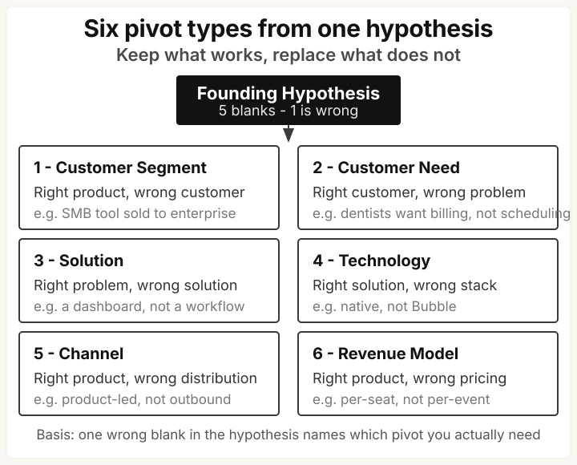
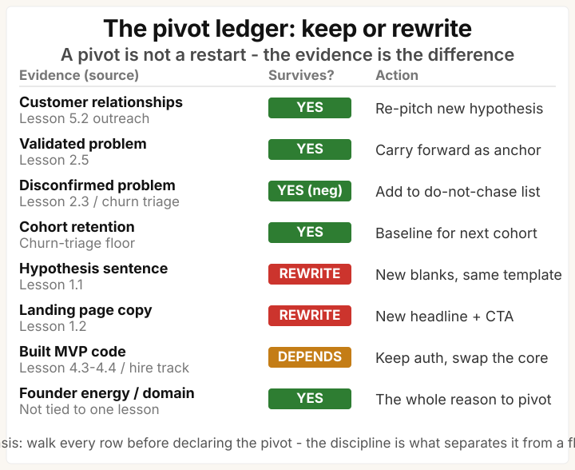

> **Going further · Continuation chapter** · [From Idea to First Paying Customer](/course/tech-for-non-technical-founders-2026/)
>
> **Input:** a decision from the [churn-triage chapter](/course/tech-for-non-technical-founders-2026/customers-leaving-churn-triage-not-acquisition/) OR a Sean Ellis 40% test result ([Lesson 5.1](/course/tech-for-non-technical-founders-2026/must-have-segment-pmf-test/))
>
> **Output:** a pivot decision with the 6-type framework + a written list of what you keep vs what you change

## The Course Is a Loop, Not an Escalator

A fintech founder I worked with last quarter - call him D. - hit the cold-outbound stage (Lesson 5.7) with a conversion rate of 0.6%. He had sent 287 personal emails to CFOs of 50-200-person companies over 14 days, with 11 replies and 0 paid pilots. His instinct, the same instinct every founder gets here, was to push forward into salvage-or-rebuild territory and start managing the build harder.

*Illustrative composite based on patterns from real founder builds, not a single client story.*

The right move was backwards. His 0.6% conversion was telling him the messaging he built off his [Founding Hypothesis](/course/tech-for-non-technical-founders-2026/form-your-founding-hypothesis-90-minute-sprint/) sentence was not landing on the segment he picked. Three things could be wrong: the customer (segment), the need (problem), or the channel (outbound vs PLG - product-led growth, where users find and buy the product self-serve). Pushing into rebuild mode would have made him a better operator of a misaligned hypothesis; going back with a pivot decision made him a better founder.

The course reads as a numbered sequence because that is the cleanest way to learn the moves. But the actual job is a loop. A founder writes a hypothesis, smoke-tests it, talks to customers, builds an MVP, lands paying customers, and at any point can hit a signal that sends them back to [Form Your Founding Hypothesis](/course/tech-for-non-technical-founders-2026/form-your-founding-hypothesis-90-minute-sprint/) with a new hypothesis. The courses that pretend the journey is one-way escalator produce founders who think pivoting is failure. It is not. Pivoting is the discovery loop working correctly.

This chapter teaches you when to go back vs when to push forward - the move that turns the rest of the course from a checklist into a system.

## The Six Pivot Types

Eric Ries catalogued ten pivot types in *The Lean Startup*; Steve Blank added customer-development variants. Six cover 90% of what a non-technical founder faces in 2026; the other four are scope and platform pivots that show up later, when you manage a product team. Here are the six in plain English, one trigger and one example each.

### 1. Customer Segment pivot

*Right product, wrong customer.* You shipped a tool that works, but the audience you targeted is not the audience that gets value from it. The signal usually comes from a churn-triage cohort slice (see the [churn-triage chapter](/course/tech-for-non-technical-founders-2026/customers-leaving-churn-triage-not-acquisition/)) where one segment retains at 50%+ and others languish under 20%. Example: R. shipped a workflow tool to solo founders that turned out to be a 3-person-team tool. Same product, different audience.

### 2. Customer Need pivot

*Right customer, wrong problem.* The audience you targeted is correct, but the job you built for is not their highest-priority job. The signal usually comes from [customer interviews](/course/tech-for-non-technical-founders-2026/mom-test-ask-about-past-not-future/) where multiple customers describe a different pain than the one your product solves. Example: a HealthTech founder targeting solo dental practices initially built around appointment scheduling; six interviews in, every dentist named insurance-claim resubmission as the bigger pain. The audience was right; the need was not.

### 3. Solution pivot

*Right problem, wrong solution.* You picked a real problem for the right customer, but the product you built does not actually relieve it. The signal comes from the [Sean Ellis 40% test](/course/tech-for-non-technical-founders-2026/must-have-segment-pmf-test/) returning under 25% across all segments uniformly. Example: a productivity founder built a Slack integration to manage standup notes; users came for the right reason (hated standup overhead) but the integration created more notification noise than it removed. Same problem; different solution shape (a quiet email digest at 9 AM, not a real-time bot).

### 4. Technology pivot

*Right solution, wrong tech stack.* The shape of the solution is right but the platform you built it on cannot reach the price or performance the customer needs. Less common for non-technical founders - most ship on Lovable, Bubble, or with a hired team, so the tech is opaque until you outgrow a no-code ceiling. Example: a B2C founder hit 4,000 MAU (monthly active users) on Bubble and discovered the per-row pricing model would cost $11K/month at 20K MAU; the rebuild on a native stack made the unit economics work.

### 5. Channel pivot

*Right product, wrong distribution.* The product is right, the audience is right, but the way you reach them does not work. The signal usually comes from cold-outbound under 1% conversion or paid ads producing zero qualified pilots. Example: D. above - product right (CFO-grade close-the-books tool), segment right (50-200-person companies), but cold email could not break through to a CFO's inbox. The channel pivot to a partner-led motion through fractional CFO networks took conversion to 4.2% in 30 days.

### 6. Revenue Model pivot

*Right product, wrong pricing.* The product works and the audience pays, but the pricing shape (per seat, per event, flat tier, freemium) does not match how customers value or budget for the product. The signal comes from active customers churning at the renewal date with feedback that points at price, not the product. Example: a B2B SaaS priced at $200/seat/month for 10-seat teams; customers loved it but balked at the renewal because they only needed 3 power users. Pivot was to $400/month flat for unlimited seats with feature gates by usage tier. ARPU (average revenue per user) dropped 20% per customer; net revenue retention (the revenue you keep plus expansion from existing customers) jumped to 118%.

The skill is not memorizing the six types but asking which of the five Mad Libs blanks (customer, problem, approach, competition, differentiation) is wrong, then matching it to the pivot type that addresses that blank.

## Trigger Conditions: What Tells You to Pivot

The common failure is not pivoting too early - it's pivoting too late, watching cohort numbers, conversion rates, ad spend, and CAC all degrade for two quarters before admitting the signal is real. The trigger conditions below are the thresholds that override the "let me try one more thing" instinct.

Work the five checks in order - the first row whose trigger matches names your pivot type; if none match, you persevere:

| Check, in order | Trigger threshold | Verdict |
|---|---|---|
| 1. Sean Ellis 40% must-have test | Under 25% in ALL segments | Solution or Customer Need pivot |
| | Under 40% overall, but one segment 50%+ | Customer Segment pivot |
| 2. 30-day cohort retention | All segments under 25% | Solution pivot |
| 3. CAC vs LTV ratio | CAC over 3x LTV while customers love the product | Revenue Model pivot |
| 4. Outbound conversion | Under 1% after 60 personal messages | Channel pivot |
| 5. Tech ceiling | Stack cost or performance ceiling hit | Technology pivot |
| All five clear | - | **Persevere - you have signal** |

Each trigger has a flail response that feels productive and buys the wrong hypothesis another quarter:

- **Sean Ellis under 25% everywhere** (Solution or Customer Need pivot): the flail is more features and polish; the real question is whether the solution shape or the target job is wrong. A churn-triage Decision 3 (no segment retains) points the same way - solution shape, not audience.
- **CAC over 3x LTV with customers who love the product** (Revenue Model pivot): the flail is cheaper ads; when the converters love it, the problem is the pricing model, not acquisition cost.
- **Outbound under 1% after 60 personal messages** (Channel pivot): the flail is better email copy; after 60 thoughtful messages the channel itself is the bottleneck. Most B2B products that die on outbound do well via partnerships or communities; most B2C products that die on Meta Ads do well via influencers or organic social.
- **Tech-stack cost or performance ceiling** (Technology pivot): the flail is ignoring it because rebuilding feels expensive; a 6-week rebuild almost always costs less than a stack that triples every quarter at scale.

The right rule is simple: when two consecutive months show the same trigger condition, the next decision is a pivot type, not a "try harder." The flail response is to try harder for two more quarters; the pivot response is to ship a new hypothesis test in two weeks.

## What You Keep When You Pivot

A pivot is not a restart. Treat it as one and you burn the most runway, because you throw away the evidence you already paid to collect. The discipline that distinguishes a real pivot from a flailing reboot is the pivot ledger - a written list of every artifact you have built so far and whether it survives the pivot.

The ledger above is the template. Print it before you declare the pivot and walk every row. The evidence you keep:

- The validated problem statements that survived the interviews (or the disconfirmed ones - both are evidence)
- The customer relationships from your [Build Your 50-Name Network List](/course/tech-for-non-technical-founders-2026/first-ten-customers-network-list/) outreach (your most valuable B2B asset at this stage)
- The cohort retention numbers from the churn triage
- Your domain expertise

The hypothesis sentence, landing page copy, and ad creative get rewritten. The MVP code depends - auth and billing usually survive; the core workflow gets rebuilt around the new hypothesis.

A second founder we rode shotgun with - Anika, running a vertical SaaS for clinical-trial coordinators - ran the ledger move on a Customer Need pivot (segment still right). She kept her 287-person coordinator contact list, her Stripe integration and auth flow from the Lovable build, her pricing model ($240/month per seat), and four of her eleven validated problem statements from her [Mom Test interviews](/course/tech-for-non-technical-founders-2026/mom-test-ask-about-past-not-future/) - the ones about consent-form reconciliation, not scheduling. She rewrote the hypothesis sentence and the landing page headline around consent-form reconciliation. Two weeks later she had a smoke-test page live, an outreach script aimed at the same 287 contacts with the new pitch, and four warm meetings booked. The pivot took 14 days because she kept everything that survived.

The trade-off: keep too much and the pivot is just a renaming. Be honest about which artifacts genuinely transfer and which are sunk cost. If your ledger says everything survives, you have not pivoted - you have rebranded. A real pivot rewrites at least the hypothesis sentence, the landing page, and the messaging; if those are the same after the "pivot," the trigger fires again in 60 days and you are back here.

The ledger serves a second purpose: when you take the pivot decision to investors, advisors, or your fractional CTO, it proves you are pivoting on evidence, not whim. Investors fund founders who can show their work - the pivot ledger is the work.

## When to PERSEVERE

Not every dip is a pivot signal. The harder skill is knowing when to push through a slow signal rather than chase a new hypothesis. Most failed pivots were premature - the founder mistook a bad month for a bad hypothesis and reset the loop just as the original was starting to work.

The persevere signals are quieter than the pivot signals because they are about trajectory, not absolute numbers. The three to look for: cohort 3-month retention climbing, even slowly (12% to 14% to 17% across three cohorts counts, even at a low absolute number); one segment producing referrals without you asking - the strongest possible PMF signal; and your own founder energy genuinely renewing as you ship, not stubbornly continuing despite exhaustion.

The Eric Ries persistence threshold is 6-12 months of consistent signal in the same direction. Consumer hits usually see their first usable PMF signal in months 7-9; B2B in months 9-14. Pivoting at month 4 because the signal was not loud enough is the most common pre-PMF mistake. The right move at month 4 is usually to run a tighter experiment within the current hypothesis - sharpen the segment, refine the messaging, ship one more workflow improvement - and re-measure at month 6.

Tomás, a B2B procurement-tools founder, came back eleven weeks after his Channel pivot wondering whether to pivot again because growth had stalled at $2,400 MRR for three weeks. But the new hypothesis was working: 4.2% outbound conversion, 3 paid pilots, 78% week-4 retention, and none of the trigger conditions firing. The persevere call was obvious - the signal was new, the trajectory was up, and three weeks of flat MRR after a 0-to-$2,400 ramp is noise, not pattern. He stayed put. By week 16 MRR was at $4,100 with no new pivots.

The honest trade-off: persevere is the harder discipline because it looks like inaction from outside. Investors ask why you are not pivoting; advisors offer new hypotheses; the [Twitter timeline](https://twitter.com) keeps surfacing founders who pivoted into a unicorn. Persevere works only when you have a written list of trigger conditions and the latest measurements show none firing. Without that list, persevere collapses into "stubborn"; with it, persevere is a deliberate choice backed by evidence.

The KISS rule for the pivot/persevere call: write the trigger conditions down. Re-measure monthly. Pivot when two consecutive months hit a trigger; persevere when none do. The framework runs on a steady cadence, not on emotion.

## Hand This to the Next Loop

You walk out holding a pivot decision (one of six types, or persevere) and a pivot ledger naming what you keep and what you change. Your next chapter depends on the pivot type.

A Customer Segment pivot or Customer Need pivot routes you back to [Form Your Founding Hypothesis](/course/tech-for-non-technical-founders-2026/form-your-founding-hypothesis-90-minute-sprint/) - rewrite the customer or problem blanks, keep the rest of the sentence template. Then [Find 10 People With the Problem](/course/tech-for-non-technical-founders-2026/find-10-people-with-problem-outreach-2026/) to validate the new hypothesis with the new segment.

A Solution pivot routes you back to [Decide What's Next](/course/tech-for-non-technical-founders-2026/mom-test-synthesis-build-pivot-kill/) - the validated problem statement is still good (you confirmed the right customer has the right pain); the solution shape needs to change. Then back into the self-serve or hire path for the rebuild.

A Channel pivot or Revenue Model pivot routes you back to [Build Your 50-Name Network List](/course/tech-for-non-technical-founders-2026/first-ten-customers-network-list/) with the new channel or pricing model. The hypothesis stays intact; the go-to-market motion changes.

A Technology pivot routes you to the [Fractional CTO bridge reference](/course/tech-for-non-technical-founders-2026/fractional-cto-sow-reference/#the-fractional-cto-bridge) for the salvage-vs-rebuild decision. The customer-facing hypothesis is the same; the implementation needs to be re-platformed.

A persevere decision keeps you on whatever module you were on. Re-measure trigger conditions in 30 days.

The course was always a loop; it reads as a numbered sequence because the discovery moves work the same whether you run them for the first time or the fifth. The founders who graduate holding all six Founder OS artifacts got there by running the loop three or four times and getting better at each pass, not by avoiding pivots.

D. is on his third pivot now: the original hypothesis (audit prep), then month-end close (Customer Need), then 7 weeks later outbound to partnerships (Channel). The two pivots cost 5 weeks of build time combined and saved him at least two quarters of running each wrong hypothesis to its conclusion - each loop a deliberate decision instead of a flail.

## Further reading

- Eric Ries, [*The Lean Startup*](https://theleanstartup.com/) - the canonical text on pivots, including all ten pivot types and the discovery-loop framing this chapter compresses.
- Lenny Rachitsky, [The art of the pivot: how, why, and when to pivot](https://www.lennysnewsletter.com/p/the-art-of-the-pivot-part-2-how-why) - decision-criteria interviews with founders who pivoted and survived (and some who pivoted and did not).
- Marty Cagan, [Continuous Discovery vs Continuous Pivots](https://www.svpg.com/continuous-discovery-vs-continuous-pivots/) - the senior product perspective on when persevere beats pivot.
- Y Combinator, [All about pivoting](https://www.ycombinator.com/library/6p-all-about-pivoting) - the YC partner perspective on trigger conditions and signal strength.

---

*Built by [JetThoughts](https://jetthoughts.com) as part of the [From Idea to First Paying Customer](/course/tech-for-non-technical-founders-2026/) curriculum.*
