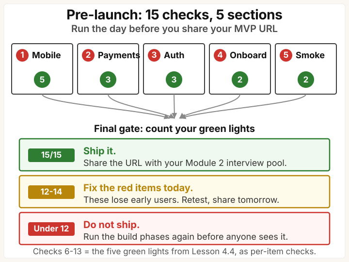

> **Template companion to [Module 4 - Build It Yourself](/course/tech-for-non-technical-founders-2026/self-serve-mvp-stack-lovable-supabase-stripe-2026/)** · [From Idea to First Paying Customer](/course/tech-for-non-technical-founders-2026/)
>
> **Run this:** the day before you share your MVP URL with anyone outside your own computer. 20 minutes. 15 items.

You validated the problem, wrote the brief, set up the stack, and shipped four build phases. One thing stands between your staging URL and a user you do not know touching it: a pre-launch check that catches the pain points real users hit in the first 60 seconds - before they bounce and never come back.

Run these 15 checks in order. Each takes under 2 minutes. All 15 green means you can send the URL with confidence. Any red means fix it before you share - a single broken checkout flow at launch can lose 3 out of 5 early signups, and you may never know which ones they were.

---

## Section 1: Mobile (5 checks)

| # | Check | How to verify |
|---|---|---|
| 1 | **Mobile homepage loads** | Open URL on phone. No horizontal scroll? ☐ Pass ☐ Fail |
| 2 | **CTA button tappable** | Tap with thumb. Responds? No overlap? ☐ Pass ☐ Fail |
| 3 | **Form fields work** | Tap each input. Right keyboard type? ☐ Pass ☐ Fail |
| 4 | **Text readable without zoom** | Arm's length. Readable without pinching? ☐ Pass ☐ Fail |
| 5 | **Sign-up flow on mobile** | Full sign-up fits screen? No cut-off buttons? ☐ Pass ☐ Fail |

---

## Section 2: Payments (3 checks)

| # | Check | How to verify |
|---|---|---|
| 6 | **Stripe in LIVE mode** | Dashboard toggle on "Live" not "Test"? ☐ Pass ☐ Fail |
| 7 | **Real card clears paywall** | $1 purchase. Webhook fires? Row flips to "paid"? ☐ Pass ☐ Fail |
| 8 | **Receipt email arrives** | Check inbox. Correct product name and price? ☐ Pass ☐ Fail |

---

## Section 3: Auth & Access (3 checks)

| # | Check | How to verify |
|---|---|---|
| 9 | **New user can sign up** | Fresh email, incognito. Logged in without errors? ☐ Pass ☐ Fail |
| 10 | **User can sign back in** | Close incognito, re-open, log in. App remembers them? ☐ Pass ☐ Fail |
| 11 | **Password reset works** | Email within 2 min? Link works? ☐ Pass ☐ Fail |

---

## Section 4: Onboarding (2 checks)

| # | Check | How to verify |
|---|---|---|
| 12 | **First-run experience** | New email. First screen: blank page or prompt? ☐ Pass ☐ Fail |
| 13 | **Core workflow end-to-end** | Core job done without help? ☐ Pass ☐ Fail |

---

## Section 5: The one-human smoke test (2 checks)

| # | Check | How to verify |
|---|---|---|
| 14 | **One stranger navigates core flow** | Send URL to someone new. No instructions. Note stalls. ☐ Pass ☐ Fail |
| 15 | **They can name product in 3 sec** | "What does this do?" Clear answer? ☐ Pass ☐ Fail |

---

## Final gate

| Count | Verdict |
|---|---|
| **15/15 green** | Ship it. Share the URL with your Module 2 interview pool (see [Lesson 4.4 handoff](/course/tech-for-non-technical-founders-2026/self-serve-mvp-stack-build-phases/#module-5-handoff-invite-your-interviewees-by-name)). |
| **12-14 green** | Fix the red items today. They are the ones that will lose you early users. |
| **Under 12 green** | Do not ship yet. Run the build phases again (back to [Lesson 4.4](/course/tech-for-non-technical-founders-2026/self-serve-mvp-stack-build-phases/)) and fix the core flow before anyone else sees it. |

Merge the last 8 items (payments, auth, onboarding) into the [five green lights](/course/tech-for-non-technical-founders-2026/self-serve-mvp-stack-build-phases/#the-five-green-lights) from Lesson 4.4 - they are the same gate, framed as a pre-launch checklist.

---

> **Done:** all 15 checks passed (or a fix list for every red item). Your MVP URL is ready for real users.
>
> **You have now:** a live MVP at a real URL (Lesson 4.4) + a clean pre-launch audit (this page) + all 5 green lights from Lesson 4.4 confirmed. The launch is ready.
>
> **Next:** [5.1 - Your First Customer Is Not a Marketing Problem](/course/tech-for-non-technical-founders-2026/must-have-segment-pmf-test/) - runs the Sean Ellis 40% test on the users this MVP collects.
>
> **If blocked:** see the per-check notes above. For deeper troubleshooting, open the [full build guide](/course/tech-for-non-technical-founders-2026/reference/mvp-build-phases-full/).

---

*Built by [JetThoughts](https://jetthoughts.com) as part of the [From Idea to First Paying Customer](/course/tech-for-non-technical-founders-2026/) free curriculum.*
