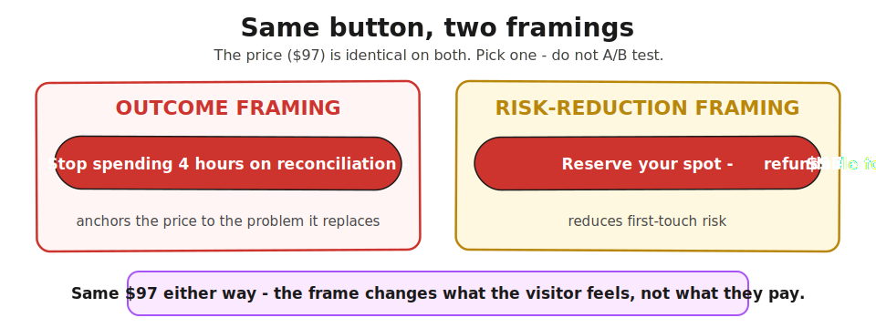

> **Module 1 · Lesson 1.5 · [CORE]** · [From Idea to First Paying Customer](/course/tech-for-non-technical-founders-2026/)
>
> **Input:** a live smoke-test landing page from [Lesson 1.4](/course/tech-for-non-technical-founders-2026/smoke-test-landing-page-7-day-demand-test/)
>
> **Output:** a price hypothesis with a measured click-to-payment signal
>
> **Progress:** M1 · 5 of 5 · Results so far: hypothesis sentence + live landing page + tracking installed + conversion data

---

Your smoke test collected emails, and an email signup only tells you a stranger found the idea interesting. Whether they'd pay for it is a separate question - a person typing card details is making a different decision than a person typing an email address. This lesson adds a Stripe button so you can measure that second decision.

After this lesson you will be able to: **find out whether strangers will pay for your offer - not just leave an email.**

---

A **Stripe Payment Link** is a hosted checkout URL you generate from your Stripe dashboard - no code, no integration. You paste the link on your landing page. Stripe hosts the checkout. Strangers who click through and enter card details produce a payment intent - the strongest demand signal a pre-product page can generate.

Your price hypothesis needs three parts:

| Part | What it is | Example |
|---|---|---|
| **Number** | A specific dollar amount, not "affordable" | $49, not "premium" |
| **Unit** | Per month, per user, or one-time | $49/month, not $49 |
| **Framing** | Early-access or founding-member rate | "Founding member - $49/month for life" |

**Default price anchor:** if your product replaces manual work, price it against the time it saves - a tool that saves someone 4 hours a month is worth a meaningful fraction of what those hours cost them. Not sure? Spend 10 minutes finding what 2-3 existing tools in your category charge, and start at their middle tier. The number is a hypothesis like everything else here - you'll refine it after Module 2 interviews.

**Button copy matters more than the price number.** Two framings we keep reaching for on pre-product pages:

- **Outcome framing:** "Stop spending 4 hours on reconciliation - $97" (anchors price to the problem it replaces)
- **Risk-reduction framing:** "Reserve your spot - $97 refundable for 30 days" (reduces first-touch risk)

Pick one pattern. Do not A/B test - 150 visits each on a $300 budget can't distinguish 4% from 5%. Ship one button copy.

---

> **Price:**
>
> 1. **Start Stripe verification tonight.** Sign up at [stripe.com](https://stripe.com). Stripe needs your bank account + tax ID before accepting live payments - usually 1-3 business days. Start the weekend before launch.
> 2. Create a Payment Link. Dashboard → Payments → Payment Links → New link. Add a one-time product at your hypothesis price. Use one-time (not subscription) - "founding member" converts better on a pre-product page.
> 3. Set the after-payment redirect. **Skip it** if you're in a hurry (Stripe shows its own confirmation). **Set it** if you want GA4 to count payment completions as page views: **Mixo** - redirect to your main page URL (GA4 counts the revisit; rougher but works). **Carrd** - create a hidden section at the bottom, redirect to its anchor URL (`yourpage.carrd.co/#thanks`). Other builders: redirect to any page or anchor on your site that GA4 can register.
> 4. Add a refund line in your page footer (not the Stripe checkout footer): "Full refund within 30 days if we don't ship." Standard pre-order disclosure - it keeps the offer honest and lowers click friction. (US readers: this is the FTC-friendly pattern; selling elsewhere, check your local pre-order rules.)
> 5. Paste the Payment Link URL on your CTA button. Below it, smaller text: "Not ready? Join the waitlist instead."
> 6. **✅ Success check:** your Stripe dashboard shows live-mode (not test-mode) and the button opens a real checkout page.

---

**If this fails: Stripe verification takes more than 3 days.** **Why:** Stripe sometimes requests an ID upload for first-time accounts. **Fix:** build the page without the button. Run the email-only smoke test from 1.4 while Stripe processes. The demand signal doesn't depend on the price button being live today.

**If this fails: visitors click the button but nobody completes payment.** **Why:** the checkout page is killing intent - price felt different in context, or the checkout page itself adds friction. **Fix:** track both click (page → Stripe) and completion (Stripe → thank-you). 60 clicks with 3 completions = the checkout is killing intent. 6 clicks with 3 completions = 50% of clickers bought - strong signal. Same outcome, opposite diagnosis. The [full price test guide](/course/tech-for-non-technical-founders-2026/reference/stripe-price-test-full/) has the detailed threshold table.

---

Open your Stripe dashboard. Write down the number of clicks vs. completed payments. Which number is lower than you expected? That gap is your pricing research question for Module 2 interviews.

---

> **Done:** Stripe Payment Link is live on your smoke-test page and you have a measured click-to-payment rate.
>
> **You have now:** all M1 artifacts - Founding Hypothesis (1.1), clear landing page (1.2), tracking (1.3), cold-traffic data (1.4), price signal (1.5). Module 1 closes here.
>
> **Next:** [2.1 · The Mom Test: Ask About the Past, Not the Future](/course/tech-for-non-technical-founders-2026/mom-test-ask-about-past-not-future/) - takes your price signal into customer interviews to find out WHY strangers paid (or didn't).
>
> **If blocked:** see "If this fails" above. Missing any M1 artifact? Go back to that lesson before starting Module 2.
>
> **What M1 cost you:** mostly your ad spend - $250-700 on Meta for the 1.4 demand test, plus whatever you spent keeping ads running during this price test. Reddit runs higher per the [channel guide](/course/tech-for-non-technical-founders-2026/reference/smoke-test-channel-guide/); LinkedIn B2B runs $1,650-6,600. If you used the guide's $0 organic path, your cost was $0.
>
> **Deeper reference:** [Full Stripe setup walkthrough + pricing revisit moments + threshold bands](/course/tech-for-non-technical-founders-2026/reference/stripe-price-test-full/)
>
> **Variant:** [Fake-Stripe Pre-Sale (Pieter Levels style)](/course/tech-for-non-technical-founders-2026/fake-stripe-pre-sale-pieter-levels/) - a $1 refundable charge instead of a waitlist button, when you want the strongest pre-product demand signal. Includes refund and FTC compliance notes.

---

*See it in action: [Module 1 walkthrough: Mia builds TutorMatch](/course/tech-for-non-technical-founders-2026/module-1-walkthrough-mia/)*

*Built by [JetThoughts](https://jetthoughts.com) as part of the [From Idea to First Paying Customer](/course/tech-for-non-technical-founders-2026/) free curriculum.*
