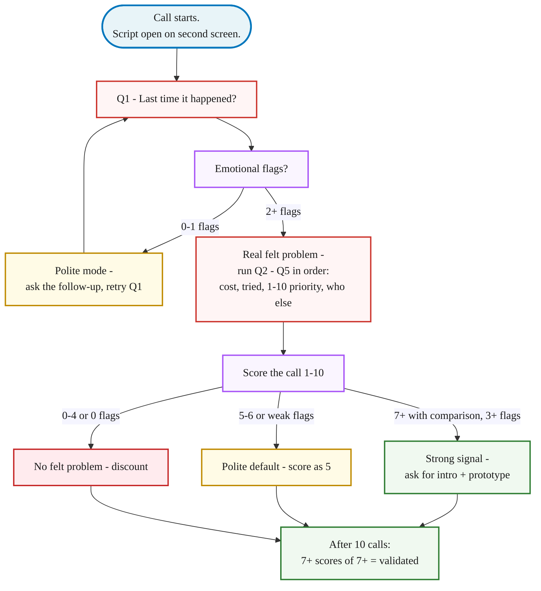

> **Reference companion to [Lesson 2.1 · The Mom Test](/course/tech-for-non-technical-founders-2026/mom-test-ask-about-past-not-future/)** - the full pass/fail walkthrough for each of the five questions, the interview flow, the score-and-recover routine, and the complete further-reading set. Read the micro-lesson first for the minimum effective path; return here when you want the deep reference.

---

## The 5 questions in full

The script runs in order. Each question funnels the interviewee deeper into a real memory of the problem. Read the questions as written - small wording changes ("would you" instead of "did you") flip the answer back into hypothetical polite, which is exactly the failure mode you are paying 30 minutes to avoid.

### Q1: "Tell me about the **last time** `[problem]` happened. Walk me through what you did."

- **What it catches**: whether the problem actually happens, how often, what mechanic the interviewee uses. A real story has a date and a tool.
- **Pass**: specific recent story. *"Last Tuesday at 9pm I spent 40 minutes copying numbers from three spreadsheets into a slide for the board."* Date, time, tool, duration, feeling.
- **Fail**: vague generality. *"Yeah I usually struggle with reporting."* No date, no mechanic - autopilot polite mode.
- **Follow-up**: *"Walk me through that specific Tuesday again. What did you do first?"*

### Q2: "What did that **cost** you - in time, money, or sanity?"

- **What it catches**: whether the pain is quantifiable. Separates "this is annoying" from "I'd pay $200/month to make this stop."
- **Pass**: a number with a unit. *"Two hours every Tuesday for six months."* / *"My CFO bills $200/hour and spent four hours on it last week."*
- **Fail**: *"It costs us time."* / *"It's frustrating."* Unquantified. Polite about a problem they don't actually feel.
- **Follow-up**: *"If you had to put a dollar figure on it - or hours, or 'I'd quit my job over this' - what's the number?"*

### Q3: "What have you **tried already** to fix this?"

- **What it catches**: existing workarounds. A hack, a paid tool, a hired VA (virtual assistant), two spreadsheets duct-taped = real. Nothing tried = theoretical.
- **Pass**: a named tool, a hired person, a custom script. *"I pay $79/month for Zapier to copy QuickBooks to Google Sheets. It breaks every two weeks. My VA on Upwork fixes it."*
- **Fail**: *"Nothing yet."* / *"We just deal with it."* / *"I've been meaning to look into something."*
- **Follow-up**: *"What broke about the workaround? Why are you still talking to me about this?"* The crack is the gap your product would fill.

### Q4: "On a scale of **1-10**, how big a problem is this compared to everything else on your plate?"

- **What it catches**: urgency against the interviewee's whole problem stack. A 9 is a sales conversation. A 4 is a pat on the head and zero dollars.
- **Pass**: a 7 or higher **with a comparison**. *"This is an 8. The only thing higher is hiring my next engineer."*
- **Fail**: a 5-6 with soft justification, or a bare "probably a 7" with no comparison (the polite-default 7 - treat as a 5 until Q5 proves otherwise).
- **Follow-up**: *"What's at 10 for you right now? What would have to happen for this to climb to that 10 spot?"*

### Q5: "**Who else** on your team feels this? How do they handle it?"

- **What it catches**: the buying committee + workarounds other people in the company already built. In B2B, your interviewee is not the only nodder when the invoice arrives.
- **Pass**: a specific colleague named + their workaround. *"My ops manager Jess feels this worse than I do - she keeps a parallel Google Sheet because she doesn't trust the finance numbers from accounting."*
- **Fail**: *"I'm the only one who deals with this."* / *"Everyone else is fine."*
- **Follow-up**: *"Could you introduce me to Jess?"* An interviewee who won't make a 30-second intro probably won't pay you $49/month either.

## The interview flow

Stick to the order. Improvise mid-call ("oh that reminds me of my product idea") and you contaminate the rest of the transcript - the interviewee starts answering the pitch instead of describing their own life. Read the questions as written, take notes by hand, score after.

Expect your first two or three interviews to feel awkward - you will catch yourself pitching at least once. That's normal, not failure: score the contaminated call honestly (in the [Module 2 walkthrough](/course/tech-for-non-technical-founders-2026/module-2-walkthrough-mia/), Mia breaks her own script in interview one, scores it 3/10, and keeps the other nine clean). The skill is in the recovery, not in being perfect on call one.

One more failure mode worth naming: an interviewee with no story. If Q1 produces genuine blankness - not evasion, just no last time to walk through - they don't have the problem. End the call politely at the 10-minute mark and count it: a person who was supposed to be your customer and has no story IS data about your `[customer]` blank.

## What to do tomorrow

Three actions. In order.

| Action | Why it matters | Gotcha to avoid |
|---|---|---|
| **Print [the Mom Test interview script](/course/tech-for-non-technical-founders-2026/mom-test-interview-script/) and open it on a second screen during the call.** Read the questions as written. | The wording does the work - if you paraphrase, you slip back into polite-yes mode and waste the call. | Don't improvise mid-call. Read as written. |
| **Take notes by hand, not by typing.** | Hand-writing slows you down enough that you stop transcribing and start listening for the three emotional flags. Typing during a call turns you into a court reporter. | Don't try to transcribe everything. Write the Q4 score and the flag count, not the full transcript. |
| **Score the call 1-10 within 5 minutes of hanging up.** Use Q4 plus your emotional-flag count. | If you score later, you will round up. By interview 10 you have a validation total, not 10 unsorted transcripts. | Don't defer scoring. Your gut scoring in the moment is more honest than the one after a week of wanting the number to be higher. |

The [stop-looking-for-product-market-fit guide](/blog/stop-looking-for-product-market-fit-startup-tutorial/) covers what the validation signal does and doesn't tell you about whether you have product-market fit (spoiler: a validated problem is necessary, not sufficient).

## The Mom Test interview script artifact

The **[Mom Test interview script](/course/tech-for-non-technical-founders-2026/mom-test-interview-script/)** carries the same 5 questions verbatim, the follow-ups, the pass/fail signals, the 3 emotional-language flags, and the scoring rubric.

**How to use it:** Print the artifact. Keep it open on your second monitor during all 10 interviews. The artifact is the screen-side reference while Lesson 2.1 is the explanation of why it works.

After 10 calls, you have either 10 scored transcripts that converge on a real problem (score them on [Lesson 2.5: Mom Test Synthesis](/course/tech-for-non-technical-founders-2026/mom-test-synthesis-build-pivot-kill/), then proceed to 2.6) or 10 transcripts that don't (follow Lesson 2.5's pivot path: sharpen the ICP and run 5 more interviews against the narrower group).

Fake the convergence to start building anyway, and you join the long line of post-mortem threads about wasted MVP spend. The [quality tax for AI MVPs](/blog/quality-tax-ai-mvp-cost/) is what happens when you ship against a hypothesis nobody confirmed.

> Customer interviews usually fail because the interviewees are polite. The questions do more work than interviewer charisma ever will.
>
> Anchor every question in a specific past moment - last Tuesday at 9pm, the last invoice, the last time the spreadsheet broke - and the polite-mode answers run out fast.

> **Optional: AI devil's advocate before your first interview.** [ValidatorAI](https://validatorai.com) (free tier) gives you an adversarial dialog: paste your draft question list, and it pushes back the way a skeptical interviewee would.
>
> It flags hypothetical questions, leading phrasing, and assumptions buried in your wording. Unlike Lesson 2.2 persona rehearsal (which tests questions against simulated ICPs), ValidatorAI tests the questions themselves - are they built to surface real past behavior or polite agreement?
>
> Run it once before your first interview. It takes 5 minutes and catches the most common failure mode: a question list that produces coherent answers from anyone, regardless of whether they actually have the problem.

## Further reading

- Rob Fitzpatrick, [The Mom Test (book site)](https://www.momtestbook.com/) - the canonical reference. The book runs 130 pages and explains why "would you pay for X?" is the most popular question and the worst.
- Y Combinator, [How to Talk to Users (Startup Library)](https://www.ycombinator.com/library) - YC's distilled rules for the same conversation, free and 20 minutes.
- Steve Blank, [The Four Steps to the Epiphany - Customer Discovery](https://steveblank.com/category/customer-development/) - the original customer-development methodology Fitzpatrick's script sits inside.
- Teresa Torres, [Continuous Discovery Habits](https://www.producttalk.org/continuous-discovery-habits/) - what these interviews become after the validation phase, when you run them weekly forever.
- Teresa Torres, [Customer Interviews (Product Talk)](https://www.producttalk.org/customer-interviews/) - the story-based method behind Q1: collect specific past stories and excavate them, because people overestimate what they typically do.
- Teresa Torres, [Learning to Interview Continuously (Product Talk)](https://www.producttalk.org/learning-to-interview-continuously/) - how interviewers actually get good: anchor to specific moments, redirect general claims to concrete activities, and leave space for silence.

---

*Built by [JetThoughts](https://jetthoughts.com) as a companion reference to the [From Idea to First Paying Customer](/course/tech-for-non-technical-founders-2026/) free curriculum.*
