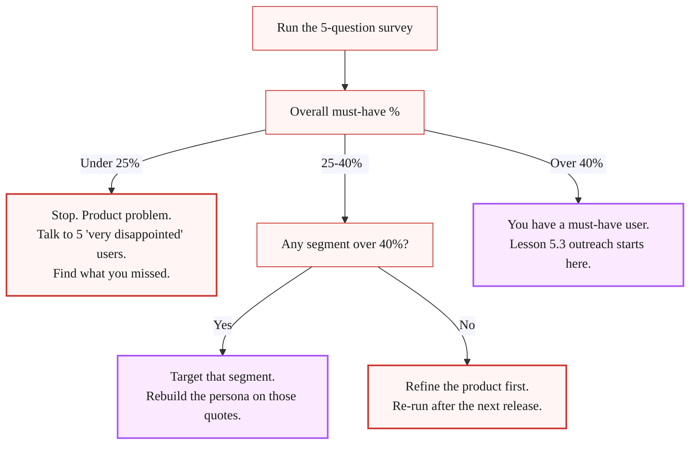

> **Reference companion to [Lesson 5.1 · Your First Customer Is Not a Marketing Problem](/course/tech-for-non-technical-founders-2026/must-have-segment-pmf-test/)** - who to survey and who to strip, the send email, the per-segment scoring math, the decision tree, the under-40% diagnostic table, the read-by-count guide, and the complete further-reading set. Read the micro-lesson first for the five questions and the score-it steps; return here when your result lands under 40% and you need the diagnostic table.

---

## Who you survey, in full

You need enough responses from people who have used your product recently to spot a segment pattern; a few dozen is the floor. Pull the list from whatever you have:

- The MVP database (sign-up table). For a Lovable, Bubble, or Supabase build, export `users` as CSV.
- Your beta waitlist if it converted to active users.
- The trial list if you ran paid trials.

If you only have ten users, that is fine. Treat anything under ten responses as directional only. Ten of ten "very disappointed" is a louder signal than 40 of 100. You are not running a peer-reviewed study; you are looking for a dividing line.

Strip out two groups before you send:

- Anyone who signed up and never logged in twice. They never used the product, so the question is unanswerable.
- Friends and family who you onboarded as moral support. They will all say very disappointed and tell you nothing.

What is left is your sample. Annotate each row with the user's job title and company size before you send, so the CSV export later can be sliced by segment in one filter.

## Send it

Email subject line that works in 2026: *"Quick 90-second question about [product]"*. Body, three lines:

> Hi [first name], building [product] and trying to figure out who really uses it. Would you spend 90 seconds on this? [link]
>
> No pitch. No follow-up. I read every response by hand.
>
> Thanks, [your name]

Send the first batch to your largest user cluster. Re-send a few days later to anyone who has not opened. You will hit a 30-50% response rate on a list under 100, which is enough.

## Score it, in full

Export the CSV. Pivot on Q1 by segment from Q5. You are computing one number per segment:

```text
must_have_pct = ("Very disappointed" count) / (total responses excluding "No longer use it")
```

The "no longer use it" answers come out of the denominator. They are churned users, not should-be-paying users.

Pull three numbers:

1. **Overall must-have %.** The headline figure.
2. **Per-segment must-have %.** Slice by job title and by company size. One segment will almost always be higher than the average. That is your must-have segment.
3. **Three verbatim Q2-Q3 quotes from your must-have segment.** Paste them into a Google Doc. Those quotes are your persona description, your ad copy, and your cold-email subject line for the next lesson.


## The decision tree



Re-run cadence: re-run while the must-have rate is climbing, and after every major release once it holds above 40% for two consecutive runs. If a re-run drops, read the "somewhat disappointed" Q2-Q4 verbatims first - the diagnostic is in there.

## Reading a small sample honestly

The Sean Ellis 40% threshold is statistically directional at **≥ 10 respondents**, useful at **20+**, and segment-sliceable at **30+**. Under 10 respondents your result is a hypothesis, not a verdict - with 6 "very disappointed" out of 10 the threshold says PASS, but the confidence band is wide enough that real demand could be 20% or 80%. Under 10, segment-slice math does not work and the 25-40% bands do not apply. Read your first-pass count directionally instead, out of your 4-6 onramp users:

- **0-2 "very disappointed"**: directional NO. Book more user sessions before re-running.
- **3-4 "very disappointed"**: directional MAYBE. Book 5-10 more users, re-run.
- **5+ "very disappointed"**: directional STRONG YES. Advance to Lesson 5.3 but caveat your outreach decisions - the segment language is hypothesis, not verified.

Use an under-10 reading to prioritize the next outreach batch, not to advance into Lesson 5.3 with confidence.

## What "under 40%" actually means

Under 40% means you have a product problem, not a marketing problem, and the Q2-Q4 verbatims tell you which one.

| Pattern | Diagnostic | Fix | Re-entry point |
|---|---|---|---|
| **You built for the wrong segment** | The product works, but the people you onboarded do not have the pain. Your Q5 slice shows: one segment is at 55%, the rest are at 5%. | Stop selling to the audience and start selling to the segment. | [Lesson 5.3](/course/tech-for-non-technical-founders-2026/first-ten-customers-network-list/) personal-network outreach to the right segment. |
| **You built the right thing, but it is not finished** | The Q3 verbatims are hedged ("it is nice to have," "I would use it if it had X"). The main benefit answers lack conviction. | Go back into the build and finish the thing. | Schedule a [Friday demo](/course/tech-for-non-technical-founders-2026/friday-demo-rule-founder-progress/) with the next release. |
| **The pain is real, but your product is not the relief** | The Q4 verbatims name a workaround that is already 80% of the job (a spreadsheet, an existing tool, a person they pay). | Either niche into the 20% the workaround does not cover, or pivot. | [Lesson 2.5](/course/tech-for-non-technical-founders-2026/mom-test-synthesis-build-pivot-kill/) validated-problem statement. |
| **The product solves the pain, but the workflow is too long** | Users say "very disappointed" but session logs show they bailed before the payoff. Funnel collapses between signup and the "30-minute save" moment. | UX cut, not a strategy pivot. Shorten the path to the first win. | Retest after shortening the funnel; re-run the 40% test after the next UX release. |

## When founders should skip the test

| Condition | What to do instead |
|---|---|
| **Under 10 users** | Run [Lesson 2.4 outreach](/course/tech-for-non-technical-founders-2026/find-10-people-with-problem-outreach-2026/) (with the list-building method from [2.3](/course/tech-for-non-technical-founders-2026/find-10-people-where-to-look/) if you don't already have a 30-name list) and book 10 more user calls before re-attempting the test. The test requires 10-30 users who actually touched the MVP to be meaningful. |
| **Pre-launch** | Use the [Mom Test interview script](/course/tech-for-non-technical-founders-2026/mom-test-interview-script/) instead. The 40% test asks "if you could no longer use the product" - if the user never used it, the answer is meaningless. |

## Advanced (optional)

> **Layering on segment isolation for 100+ users:**
> After you run the 40% test once and close your first paid pilot,
> read Sean Ellis's original [*Hacking Growth*](https://hackinggrowth.org/)
> and the [Superhuman PMF Engine](https://review.firstround.com/how-superhuman-built-an-engine-to-find-product-market-fit/).
> Both combine the 40% test with structured segment-isolation workflows.
> The main path in the lesson is enough for the Module 5 decision;
> the advanced version becomes relevant after your first 10 customers ship.

## Further reading

- Lenny Rachitsky, [The original growth hacker, Sean Ellis, on the 40% test](https://www.lennysnewsletter.com/p/the-original-growth-hacker-sean-ellis) - the original 40% framing, with Sean's own commentary on what the number means and does not mean.
- Sean Ellis and Morgan Brown, [*Hacking Growth*](https://hackinggrowth.org/) - the book that explains the survey-driven north-star approach Ellis built at Dropbox, LogMeIn, and Eventbrite.
- Lenny Rachitsky, [How to win your first 10 B2B customers](https://www.lennysnewsletter.com/p/how-to-win-your-first-10-b2b-customers) - companion piece that maps the must-have-user concept to the first-ten-customer playbook.
- Steve Blank, [The Customer Development Manifesto](https://steveblank.com/2009/08/31/the-customer-development-manifesto-reasons-for-the-revolution-part-1/) - the foundational framing for "get out of the building and validate before building." The Sean Ellis test is the post-build analog.
- Rahul Vohra, [How Superhuman built an engine to find product-market fit](https://review.firstround.com/how-superhuman-built-an-engine-to-find-product-market-fit/) - the segment-isolation playbook layered on top of the 40% test.
- Rob Fitzpatrick, [*The Mom Test*](https://www.momtestbook.com/) - the pre-launch validation companion. Once your 40% test is above the line, the Mom Test questions are the ones you ask the 10 must-have users on their next call.

---

*Built by [JetThoughts](https://jetthoughts.com) as a companion reference to the [From Idea to First Paying Customer](/course/tech-for-non-technical-founders-2026/) free curriculum.*
