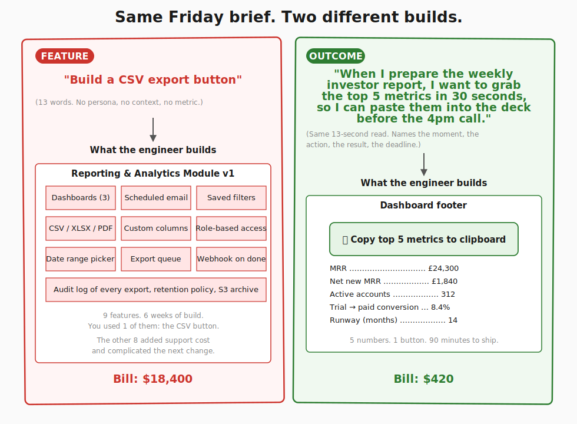

> **Reference companion to [Lesson 3.2 · Quality-check your brief: features to outcomes](/course/tech-for-non-technical-founders-2026/stop-specifying-features-start-outcomes/)** - the two fully worked feature-vs-outcome pairs, the priced-out comparison, the complete AI-reviewer test protocol, and the optional stack-ranking step. Read the micro-lesson first for the minimum effective path; return here when you want the deep reference.

---

## Two briefs, two shapes each

Same job, two ways to write it. Read each pair out loud. Notice how much the engineer or the agent has to invent under the feature shape, and how little they have to invent under the outcome shape.



### Pair 1 - The CSV button

**Feature shape**: *"Build a CSV export button on the dashboard."*

**Outcome shape**: *"When I prepare the weekly investor report, I want to grab the top 5 metrics in 30 seconds, so I can paste them into the deck before the 4pm call."*

What the engineer builds from the feature shape: a reporting module with three dashboards, scheduled email exports, role-based access on who can export, a date-range picker, custom column selectors, and an audit log of every download. Six weeks of work. You used the CSV button once a week for the investor email and ignored the other eight features.

What the engineer builds from the outcome shape: one button at the bottom of the existing dashboard that says *"Copy top 5 metrics to clipboard,"* hard-coded to MRR (monthly recurring revenue - what subscribers pay you each month), net new MRR, active accounts, trial-to-paid conversion, and runway. Ninety minutes of work in a Rails controller, one line per metric. The next investor email goes out before the deck even opens.

### Pair 2 - The CRM module

**Feature shape**: *"Build a CRM module."* (A CRM - customer relationship management tool - is the contact list and deal tracker a sales team works out of.)

**Outcome shape**: *"When a new customer signs up, the founder needs to see which 3 of our existing customers most resemble them, so we can pattern-match the onboarding playbook that worked for those three."*

What the engineer builds from the feature shape: companies, contacts, deals, pipelines, activities, tasks, notes, custom fields, email integration, calendar integration, and a Kanban board nobody opens. Three months. You used the contacts list and the notes field.

What the engineer builds from the outcome shape: a 30-line script that runs nightly, scores existing customers against the new signup on three attributes (industry, employee count, plan tier), and posts a Slack message every morning: *"New customer Acme Co looks most like Beta Inc, Gamma Ltd, and Delta GmbH - here are their onboarding notes."* Two days. The script is throwaway. When Salesforce is finally worth the bill, you import the script's three matches into the proper CRM record.

## The same request, priced out

| | <strong style="color:#cc342d">Feature brief</strong> | <strong style="color:#2e7d32">Outcome brief</strong> |
|---|---|---|
| **What you write** | "Build a CRM module" | "Match new signups to 3 similar customers" |
| **What the team builds** | Companies + contacts, deals + pipelines, email + calendar integration, custom fields + Kanban | A nightly scoring script + a Slack message each morning |
| **What it costs** | 3 months. $40K. | 2 days. $600. |
| **What you actually use** | Contacts + notes | The onboarding playbook, ready Monday |

The lineage of the *When / I want / So I can* shape has a name in product-management literature - "Job Stories." See *Further reading* below if you want to chase it.

## Test your brief with an AI reviewer

**No peer available? Use [Claude](https://claude.ai) or [ChatGPT](https://chatgpt.com) as the peer.** Paste your full Section 3 + Section 5 (no-go list), then paste this prompt:

```text
Imagine you are a contractor reading this brief to build the product. Based ONLY on Section 3, name 5 things you would build that are NOT in Section 5's no-go list. Be specific - feature names, not categories.
```

If the AI names 2+ items outside your no-go list, the brief failed quality-check the same as a peer flagging them. Revise Section 3 and re-run. This is the same failure signal a peer would surface, with no calendar coordination needed.

**No peer and no AI account?** The manual pass works too: read each Section 3 line and ask, "is this a thing the user does, or a thing the software has?" A line that names software parts (a dashboard, user roles, a settings page) is feature-shaped - rewrite it in the *When / I want / So I can* shape until it names a moment and a result instead.

**What AI cannot prove or substitute:**
- Whether your scope solves the validated problem (only the Module 4 build + real users can)
- Whether a real contractor would interpret the brief the same way (AI is a proxy, not a substitute)

The real gate is a clean peer QA (human or AI) where the answer stays inside your scope AND no-go list.

## Optional: stack-rank features with real users

After you have rewritten Section 3 as outcome-shaped job stories, you still have a list. If you need to know which outcome to build first, [OpinionX](https://opinionx.co) (free tier available) uses forced-ranking pairwise voting - users pick A or B, not rate everything "very important." Paste your 5-7 outcome statements, send the link to your [Lesson 2.3-2.4](/course/tech-for-non-technical-founders-2026/find-10-people-where-to-look/) interviewees, and the forced-choice format surfaces real priorities that a 1-10 rating scale hides. The output is a ranked list backed by pairwise win rates, not averaged scores. Use this before handing the brief to Lovable or a contractor - it prevents the "build everything because everything scored 8/10" trap.

## Further reading

- Alan Klement, [*When Coffee and Kale Compete*](https://web.archive.org/web/20230319130354/https://www.whencoffeeandkalecompete.com/) - the book that introduced the *When / I want / So I can* shape under the name "Job Stories" in 2013. The framework is worth chasing once your team is bigger than two; the shape is worth using tomorrow.
- Marty Cagan, [Product vs Feature Teams](https://www.svpg.com/product-vs-feature-teams/) - the canonical essay on why product teams (chartered with outcomes) ship better than feature teams (chartered with feature lists).
- Veracode, [GenAI Code Security Report 2025](https://www.veracode.com/blog/genai-code-security-report/) - 45% of LLM-generated code shipped at least one exploitable security flaw. Vague briefs amplify the rate.
- DHH, [The One Person Framework](https://world.hey.com/dhh/the-one-person-framework-711e6318) - the Rails case for keeping the architecture small enough that one developer can ship outcomes end-to-end.
- Basecamp / Ryan Singer, [Shape Up - Appetite vs Estimate](https://basecamp.com/shapeup/1.2-chapter-03) - the chapter on writing pitches that fix the appetite first, so the build collapses to fit.
- Tom Kerwin, [JTBD Job Stories vs User Stories](https://web.archive.org/web/20240819160036/https://jtbd.info/replacing-the-user-story-with-the-job-story-af7cdee10c27) - the 2013 Klement piece on Medium that popularised the shape, for readers who want the original 1,500 words.
- Y Combinator, [Startup School: How to Write a Product Spec](https://www.ycombinator.com/library/) - YC's distilled take on specs that ship versus specs that sit.

---

*Built by [JetThoughts](https://jetthoughts.com) as a companion reference to the [From Idea to First Paying Customer](/course/tech-for-non-technical-founders-2026/) free curriculum.*
