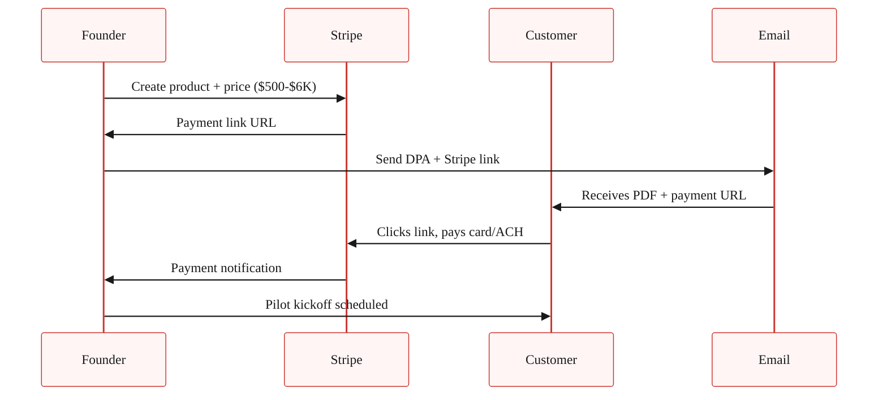

> **Reference companion to [Lesson 5.6 · Charge Before You Ship](/course/tech-for-non-technical-founders-2026/paid-pilot-charge-before-ship/)** - the clause-by-clause DPA walkthrough, the full pricing-band math by sector, the Stripe Checkout flow, the conversation script with objection handling, and the honest exceptions. Read the micro-lesson first for the DPA template and the deposit math; return here when a prospect pushes back and you need the objection scripts.

---

## The six DPA clauses in detail

A few clauses deserve more detail than the table in Lesson 5.6 can hold.

The **scope of pilot** section is where new founders over-spec. Keep it to three outcomes the customer wants and two specific use cases; anything outside that list stays out of scope until conversion. The list also anchors the Friday demos - if a demo does not advance one of the three outcomes, the demo is off-scope and you say so. Friday cadence comes from the [Friday demo lesson](/course/tech-for-non-technical-founders-2026/friday-demo-rule-founder-progress/).

The **pilot fee and deposit** clause is what makes everything else work. The deposit lands at 10-30% of projected year-one annual contract value (ACV), paid via Stripe before pilot kickoff and credited dollar-for-dollar against the year-one invoice on conversion. If the customer cancels before week 4, they forfeit the deposit (their commitment). If the founder cancels for any reason, the founder refunds 100% (your commitment). Pricing math is below.

The **success criteria** clause is what makes the DPA a real contract instead of a handshake. Pick three measurable outcomes the pilot is supposed to produce (for example, hours saved per week, errors avoided per month, or revenue lifted per quarter), worded in the customer's verbatim language from the [Lesson 5.5 replies](/course/tech-for-non-technical-founders-2026/first-ten-customers-send-track/).

If two of three are hit by week 6, the year-one contract auto-converts unless the customer opts out in writing. If fewer than two are hit, both parties walk and the founder retains the deposit as paid consideration for the pilot work.

The **conversion terms** clause is what the CFO actually approves in week 0. State the year-one price in dollars (never "TBD"), billing cadence (annual or monthly), auto-conversion versus opt-in (auto-conversion recommended), and a 30-day notice period after year one. These numbers are why the deposit can be defended internally before kickoff.

**Data, IP, and termination** is the shortest section: customer keeps their data, founder keeps the product IP, either party can exit at 30 days written notice during the pilot, and the customer's data stays exportable for 90 days after termination. v1 needs no further detail.

Signature block at the bottom - DocuSign, HelloSign, or PDF-and-email-confirmation, whichever the customer prefers.

> **What happens AFTER the deposit clears (the pilot is not the contract).** The signed DPA + cleared deposit kicks off a 6-8 week working relationship. Three things happen each Friday:
>
> 1. **Demo the one workflow** from the DPA Section 1 scope - the customer watches you click through it, no slides.
> 2. **Read the success criteria aloud** (DPA Section 4) and ask "are we on track for X by week 6?" - the customer either says yes, says no, or names a blocker.
> 3. **Write down what is NOT working** in shared Slack or email by Friday 5pm - if you skip this, week-3 frustrations turn into week-6 surprises.
>
> Two failure modes to watch: the customer goes quiet by week 4 (re-engage with a written status email naming all 3 success criteria), or the success criteria turn out to be wrong (rewrite them with the customer in week 3, do not wait for week 6). The full Friday-demo discipline is in [The Friday Demo Rule lesson](/course/tech-for-non-technical-founders-2026/friday-demo-rule-founder-progress/) - read that BEFORE the first Friday call.

## The pricing math in full

The deposit number is not arbitrary. It is anchored to projected year-one ACV and to what a typical CFO will sign without a procurement review. The bands by sector:

> For your first pilot, the per-seat / 5-10 seats row applies. Skip the mid-market row until you have 5+ customers.

| Sector | Year-1 ACV | Pilot fee (10-30%) | Pilot fee notes |
|---|---|---|---|
| B2B SaaS (per-seat, 5-10 seats) | $5K-$12K | $500-$3K (capped under the procurement line) | The CFO approves the deposit on email. No procurement involved. |
| B2B SaaS (mid-market, 50-200 seats) | $20K-$80K | $2K-$24K | Above $10K, expect a 1-week procurement review. Plan for it. |
| B2B Services / consultancy | $10K-$40K | $1K-$6K (capped under the procurement line) | Service deposit is normal in the sector. Customer expects to pay. |

### The minimum: $500

Below $500, the deposit does not work as a commitment device - the customer can write it off as a Friday-impulse purchase and ghost the same way they would on a free pilot. The point of the deposit is that it lives in next month's accounting cycle, which means it gets justified.

> **When 10% of year-one ACV is below $300:** the $500 floor stops working as a commitment device for low-ACV B2B SaaS. In that case, charge the **first month's revenue upfront as the deposit** instead. Example: a $97/mo hypothesis → $97 month-1 upfront, credited toward the year-one contract on conversion. For a $29/mo hypothesis the upfront is the first quarter ($87) for the same reason. The structural rule (deposit must be enough to require a CFO check, not a personal credit card) only works when the absolute number triggers internal-approval friction; for low-ACV B2B that threshold is the first month or quarter, not a multiple of monthly price.

### The maximum without procurement review: typically $10K

Above $10K, even at small companies, finance starts asking questions. If your pilot fee is $10K+, expect a 1-2 week procurement window between handshake and signature, and price the timeline into the conversation - the deposit clears in week 2, not week 0.

### Always credit toward year-one

The pilot fee is not separate revenue. It is "year-one ACV, pre-paid." The customer's CFO is approving year-one revenue brought forward, not a discretionary line item. Naming it correctly changes the conversation entirely.

## The Stripe Checkout flow

The five-minute Stripe path is in [the lesson](/course/tech-for-non-technical-founders-2026/paid-pilot-charge-before-ship/). Here is the full flow, and the record-keeping option for later.

If you do want to wire the payment into a Rails app for record-keeping later, the Stripe Ruby gem (`gem 'stripe'`) takes a `Stripe::Checkout::Session.create` call to generate the same URL programmatically. Django uses `stripe.checkout.Session.create` via the `stripe-python` package. Laravel uses `Stripe\Checkout\Session::create()` from `stripe/stripe-php`. All three produce the same hosted URL. Do not build this until after your first paid pilot ships.

## The conversation script

You have a warm lead from [Lesson 5.5](/course/tech-for-non-technical-founders-2026/first-ten-customers-send-track/) who booked a 20-minute demo, the demo went well, and they said something close to "yes, I would love to try this with my team." The default first-time-founder move is to soften here. The 15-second script that does not soften:

> "Glad it resonates. Quick word on how I am setting up pilots - I am running them as paid design partnerships, so the customer has skin in the game and I have a real signal. The deposit is [$500-$6K], credited toward year one on conversion. Refunded in full if I cannot deliver on the success criteria. Want me to send the one-pager?"

| Customer response | What it means | Next action |
|---|---|---|
| **"Send the one-pager"** | Close to a paid pilot. Window is open today. | Send inside the hour. DPA + payment link. |
| **"Can we start free and convert later?"** | Still hedging. Deposit scares them but they're interested. | Reframe: deposit is *year-one ACV prepaid*, not added cost. Clarify: $500 sits in this month's accounting, gains CFO approval. Free pilots lose approval in week 8. |
| **"Let me think about it"** | Not ready this week. Warm lead turning cold. | Check back once. If no callback, move to next prospect. Hedge → delay → ghost is the pattern. |
| **"We do not do paid pilots"** | Not in your must-have segment. Wrong buyer profile. | Thank them. Move on. They're not disqualified; they're not your customer yet. |

### Advanced objections (after customer #5)

The five responses below show up once you start talking to enterprise buyers or repeat prospects. For the first 4-5 pilots, the basic-objection table above covers what you will hear.

**"Can we do it at $300 instead of $1,200?"**

*Means:* Interested but anchoring price down. The deposit IS the commitment device; lowering it kills the function.

*Say back:* "The $1,200 number is what makes this a year-one commitment, not a trial. If we drop to $300 I am back to charging you a one-time consult fee, which is not what either of us wants. Same price, but I can move the kickoff later or split into two tranches if that helps internal approval." Hold the price. Offer flexibility on timing, not amount.

**"Can you do net-30 instead of upfront?"**

*Means:* Common ask from enterprise buyers; the deposit-before-kickoff rule loses its commitment function on net-30 (paying 30 days after the invoice instead of upfront).

*Say back:* "The deposit is structured upfront on purpose - it is the signal that this is a real pilot, not a sales call. I can offer net-15 from invoice date, but the kickoff timer starts when the deposit clears. If net-30 is a hard requirement on your end, the alternative is a paid PoC (proof of concept - a small paid trial) with a smaller scope I can deliver before invoicing for the full pilot."

**"My legal team needs to review any contract."**

*Means:* Standard B2B response; the one-page DPA is usually under their threshold.

*Say back:* "The DPA is a one-page mutual document, not a long contract. Send it to your legal contact today; if they want changes I will turn them within 48 hours. Most legal teams approve a one-page DPA in 2-3 business days. While we wait I can send you the kickoff prep doc so we can start immediately when legal clears."

**"What if you cannot deliver by week 6?"**

*Means:* Testing your refund promise without saying so directly.

*Say back:* "If I do not hit two of the three success criteria you and I write into the DPA, you get a 100% refund within 14 days and we walk - no negotiation. The DPA names this in section 5. Want me to walk you through how the success criteria get written so you are comfortable they are measurable?"

**"Can I get exclusivity in my vertical?"**

*Means:* Their commitment is real but they want defensible value.

*Say back:* "I cannot offer category exclusivity at the pilot stage - I do not have enough signal yet to know what the right exclusivity term looks like. What I can do: write into the DPA that you are my first paying customer in [VERTICAL], and that we will revisit category exclusivity at year-one renewal once we both know whether this is working. That gives you the chronology advantage without locking me in before I have learned what to lock to."

## When founders should not insist on a paid pilot

The paid pilot is the default, but it has three honest exceptions.

| Exception | When it applies | Substitute approach |
|---|---|---|
| **Champion conversion** | A champion from Lesson 5.3 offers free pilot + co-marketing case study + Loom testimonial. Trade: your work now for their case study + testimonial (your conversion assets for the next 10 customers). | Limit to 1-2 champions out of first 10 pilots. Only when case study is contractually committed. Case study must ship within 60 days. |
| **True early-MVP (30% built)** | Your MVP is genuinely unfinished. Paid pilot misrepresents what you can deliver in 6-8 weeks. | Run free pilot honestly, ship to the agreed scope, turn second customer into the paid pilot. The honesty signal is commitment of a different kind. |
| **Pre-investment-grade product** | Your product is 12 months from differentiability. Customer is buying relationship, not product. | Follow the Paul Graham ["Do Things That Don't Scale"](http://paulgraham.com/ds.html) Stripe Collison playbook. Paid pilot returns once product is actually doing the job. |

## Advanced (optional sidebar)

Once you have closed 2-3 paid pilots and want to layer on contract rigor, read the [Common Paper Design Partner Agreement template](https://commonpaper.com/standards/design-partner-agreement/) (a vetted v2 LOI widely used by YC companies), [SaaStr's "Should we charge for pilots"](https://www.saastr.com/we-are-a-b2b-saas-startup-and-want-to-develop-our-product-in-pilots-with-customers-should-we-charge-for-the-pilots-and-how-much/) (Jason Lemkin's thirty-second answer is yes, always), and Ash Rust's ["Startup Sales: How to Get Pilot Customers to Pay"](https://medium.com/sharp-spear/startup-sales-how-to-get-pilot-customers-to-pay-7a9b7a48eedf) for the conversation tactics. The one-page DPA in the lesson is enough through your first 10 pilots. The advanced versions matter once you start hearing the words "procurement" and "MSA" (master service agreement - a long formal contract) in pilot conversations.

## Further reading

- Common Paper, [Design Partner Agreement template](https://commonpaper.com/standards/design-partner-agreement/) - a vetted, modern LOI widely used by YC companies. The companion to your one-pager when conversations move toward MSAs.
- SaaStr, [Should you charge for a pilot?](https://www.saastr.com/we-are-a-b2b-saas-startup-and-want-to-develop-our-product-in-pilots-with-customers-should-we-charge-for-the-pilots-and-how-much/) - Jason Lemkin's case for charging and the conversion-rate data behind the recommendation.
- Ash Rust, [Startup Sales: How to Get Pilot Customers to Pay](https://medium.com/sharp-spear/startup-sales-how-to-get-pilot-customers-to-pay-7a9b7a48eedf) - tactical conversation script and pricing-band data from investor Ash Rust.
- Steve Blank, [The Four Steps to the Epiphany](https://steveblank.com/four-steps-35/) - the foundational text on Customer Validation; Blank argues paid pilots are how you separate real demand from polite enthusiasm.
- Stripe, [Payment Links documentation](https://stripe.com/docs/payment-links) - the official Stripe Checkout setup. 15-minute integration with no engineering work required.
- Lenny Rachitsky, [How to win your first 10 B2B customers](https://www.lennysnewsletter.com/p/how-to-win-your-first-10-b2b-customers) - the 7-step playbook including the design-partner pricing model from B2B founders.

---

*Built by [JetThoughts](https://jetthoughts.com) as a companion reference to the [From Idea to First Paying Customer](/course/tech-for-non-technical-founders-2026/) free curriculum.*
