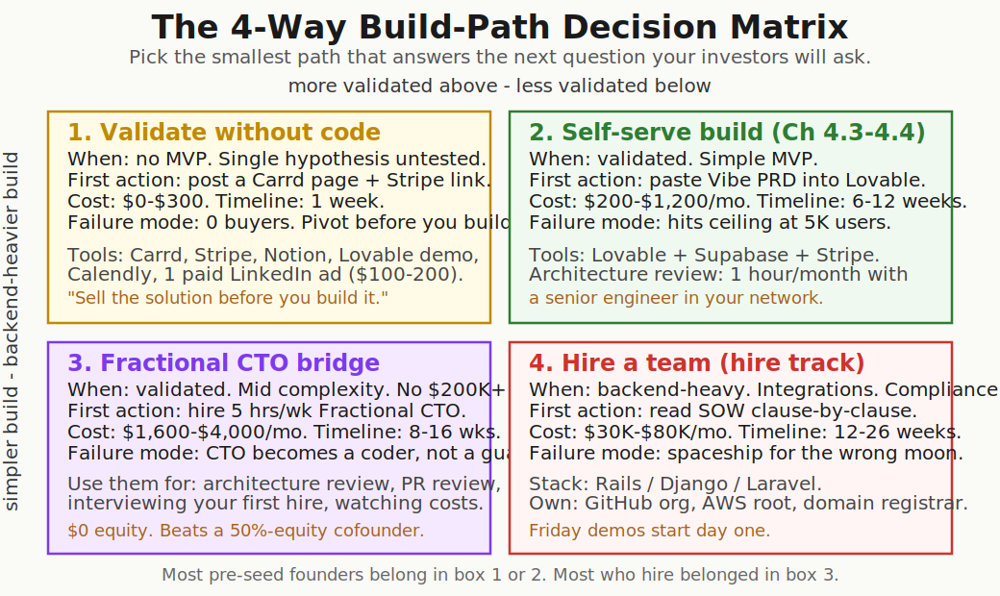
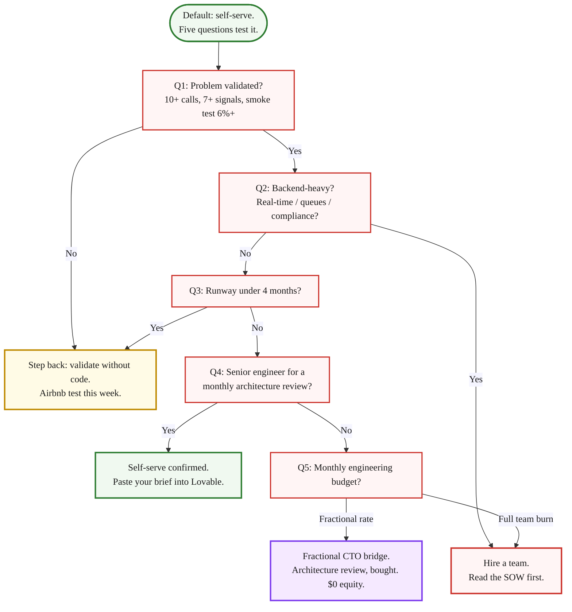

> **Module 4 · Lesson 4.1 · [CORE]** · [From Idea to First Paying Customer](/course/tech-for-non-technical-founders-2026/)
>
> **Input:** a one-page brief + outcome-shaped feature spec (from Module 3)
>
> **Output:** a 4-way build-path decision (validate / self-serve / fractional-CTO / hire) + the [Build Path Decision Worksheet](/course/tech-for-non-technical-founders-2026/build-path-decision-worksheet/)
>
> **Progress:** M4 · 1 of 5 · Results so far: a quality-checked one-page brief (3.2) - this page decides who builds from it

> **TL;DR:** Default: self-serve with Lovable + Supabase + Stripe. Hiring is a ceiling-signal trigger, not the first decision. Five questions route you to one of four build paths.

Self-serve with Lovable (an AI app builder that turns a plain-English prompt into a working web app), Supabase (the database that stores what the app records), and Stripe (the service that takes the payments) is the default for a non-technical founder in 2026. Hiring (whether a full team or a Fractional CTO - a part-time senior engineer who owns architecture but doesn't write the code) is what you do when you hit a specific ceiling signal, not the first decision after the Brief. This chapter is the decision tree: when does the default end, and what triggers the switch?

Pre-seed founders hiring engineering before a single paying customer is confirmed is the most common build-decision mistake at the idea stage. The brief was right - we taught the brief in [The One-Page Product Brief](/course/tech-for-non-technical-founders-2026/one-page-product-brief-vibe-prd/) and quality-checked it as outcomes in [Ch 3.2](/course/tech-for-non-technical-founders-2026/stop-specifying-features-start-outcomes/).

The hire is the move that breaks the runway. The skipped step is the cheaper experiment - a smoke test, a clickable prototype, a Concierge MVP - that would have told you whether you need to build at all.

## Your real question: do you need to build at all

> **The decision is not "code or no-code." It is "what evidence do I have that I need to build at all?"**
>
> Y Combinator's current position: tools and business models now let solo founders turn ideas into production products in weeks without giving 50% equity to a technical co-founder. The argument is *prove the concept without code first*, not "hire later." Skip this and you burn 6-9 months learning the problem was never real.
>
> If you cannot answer with a list of buyers who have already paid you, the answer is: not yet. Stay one box left of where you were about to start.

By the time you reach this chapter, you have already run three validation signals: the smoke test (Module 1) proved that strangers click. The Mom Test interviews (Chapter 2.1 technique applied in Ch 2.3-2.4 recruitment + interview round) proved the problem is real and felt. The clickable prototype shape test (Chapter 2.6) proved that users can navigate the proposed solution without coaching.

All three are research signals, not builds. The one-page brief (Chapter 3.1) documents what to build. This chapter decides HOW to build it - self-serve, fractional CTO, or hired team.

## The Airbnb test

Brian Chesky and Joe Gebbia did not write code first. They blew up an air mattress in their living room, took photos with a digital camera, posted three nights at $80 on a simple hand-built page, and waited. Three guests showed up. They made $240.

The product was a website with a payment link. The validation was three strangers paying real money. Paul Graham later wrote about the same instinct in [*Do things that don't scale*](https://paulgraham.com/ds.html): the founders who win are the ones who do the unscalable, manual experiment that proves demand before they industrialize it.

The 2026 version of the Airbnb test takes one afternoon: a Carrd page with a Stripe checkout for an annual plan, a Notion FAQ that explains exactly what the buyer gets, and the link sent to the 30 people from your [Find 10 People With the Problem](/course/tech-for-non-technical-founders-2026/find-10-people-with-problem-outreach-2026/) outreach list. The result you are watching for is in the next paragraph.

The signal you are looking for is small. Two paying buyers from 30 cold outreach hits is enough to flip the build switch.

We know a B2B SaaS founder who sold five annual contracts at $1,800 each via a Stripe link and a Notion doc before she wrote a line of code. By the time her contractor delivered the v1 web app eight weeks later, she had $9,000 in pre-revenue and a customer-feedback loop already running. The build was constrained by what she had already promised the five buyers, which is the cheapest scope-control mechanism that exists.

Zero clicks from 30 prospects is brutal in the other direction. The problem might be real (you validated it in [Decide What's Next](/course/tech-for-non-technical-founders-2026/mom-test-synthesis-build-pivot-kill/)) but your pitch is wrong, your price is wrong, or the timing is wrong. Find out for $200 instead of $30,000.

## Pick the right building before you commit to build

The decision matrix in this post is the structural-engineer step. Before you commit to building, you decide which building you are putting up - a shed has a different cost ceiling, talent profile, and exit strategy than a commercial building. The mistake is treating them as the same.

> **[Vibe Coding Ceiling Signals](/course/tech-for-non-technical-founders-2026/vibe-coding-ceiling-signals/)** - the full shed → house → skyscraper diagnostic, read this after you pick your path to know when to revisit the hire decision.

## The 4-way decision matrix

Most build-vs-hire posts give you one answer. The honest answer is four answers, and the right one depends on five inputs the post cannot know about you. Pick the smallest box that answers the next question your investors will ask.

| Path | Cost shape | When to pick / Failure mode |
|---|---|---|
| **1. Validate without code** | Per-vendor pricing (Carrd, Stripe, Notion). Optional ad spend. | **Pick when** no MVP, untested hypothesis, no paying buyers. **Fails when** zero clicks from 30 prospects - pitch/price/timing is wrong. |
| **2. Self-serve build** | Per-tool monthly pricing (Lovable + Supabase + Stripe + Resend). | **Pick when** validated problem, one workflow, one persona, simple backend. **Fails when** architectural ceiling hits at ~5K users or second integration. |
| **3. Fractional CTO bridge** | Fractional hourly rate, $0 equity. | **Pick when** validated, real data model, no runway for a full hire. **Fails when** fractional CTO drifts from oversight into coding features. |
| **4. Hire a team** | Material monthly burn before revenue (team salaries + tooling). | **Pick when** backend-heavy, integration-rich, compliance scope, multi-month runway secured. **Fails when** team builds a spaceship for the wrong moon. |

### 1. Validate without code

Use this path when you have no MVP yet, a single untested hypothesis, and no confirmation that anyone will pay. This week: ship a Carrd page + Stripe checkout + Notion FAQ, add a Lovable demo screen recording if you have one, and send the link to 30 ICP prospects from your [Find 10 People With the Problem](/course/tech-for-non-technical-founders-2026/find-10-people-with-problem-outreach-2026/) outreach list. Tooling is per-vendor (Carrd annual domain + page, Stripe free until transactions, Notion free, Lovable trial), with optional LinkedIn or Google ad spend on top. If zero buyers click, you found that out before you spent real runway - rewrite the pitch or pivot the problem.

### 2. Self-serve build ([The Self-Serve MVP Stack](/course/tech-for-non-technical-founders-2026/self-serve-mvp-stack-lovable-supabase-stripe-2026/))

Pick this path when the problem is validated (10+ Mom Test interviews with ≥7 strong-signal scores per the Ch 2.5 synthesis rubric + a Ch 1.4 smoke test that cleared the 6%+ "Promising" band - pre-orders and paid pilots are produced LATER in Module 5, do not require them as the gate), the scope is one workflow for one persona, and the backend requirements are simple - no real-time collaboration, no complex refund flows, no compliance scope.

This week: paste your [one-page brief](/course/tech-for-non-technical-founders-2026/vibe-prd-template/) into [Lovable](https://lovable.dev) (free trial available), ship the smallest end-to-end thing it generates, and connect [Supabase](https://supabase.com) (free tier) + Stripe + Resend (the service that sends your app's emails) on top. Tooling is per-vendor pricing across the stack. Watch one failure mode: hitting the architectural ceiling when the app crosses ~5,000 users or your second integration. [5 Ceiling Signals](/course/tech-for-non-technical-founders-2026/vibe-coding-ceiling-signals/) tells you when to move up.

### 3. Fractional CTO bridge ([The Fractional CTO Bridge](/course/tech-for-non-technical-founders-2026/hire-track-supplementary-reference/#the-fractional-cto-bridge))

Use this when the problem is validated, the build has a queue, an integration, or a data model that needs real thinking, and you don't have the runway to sustain a full engineering hire. This week: hire a Fractional CTO for 5 hours per week and point them at architecture review on the Lovable build, PR review on contractor commits, and watching the AWS and OpenAI bills. You pay their fractional hourly rate with $0 equity. Watch for the Fractional CTO drifting from structural engineer into coder. Set a quarterly review. If their hours go to shipping features instead of oversight, architecture, and hiring, you hired the wrong profile.

### 4. Hire a team ([Who You're Hiring in 2026](/course/tech-for-non-technical-founders-2026/hire-track-supplementary-reference/#where-to-find-developers-in-2026))

Choose this when the build is backend-heavy (real-time, queues, AI inference at scale, multi-tenant data), integration-rich (5+ third-party APIs), or compliance-scoped (HIPAA, SOC 2, PCI), and you have the runway to sustain engineering salaries before revenue lands. This week: read your draft SOW [clause by clause](/course/tech-for-non-technical-founders-2026/hire-track-supplementary-reference/#reading-the-sow) and confirm that GitHub org, AWS root, domain registrar, and database all sit under your company email before kickoff. A team of 3-5 is material monthly burn before revenue, on top of tooling. Biggest risk: the team builds you a [spaceship for the wrong moon](/course/tech-for-non-technical-founders-2026/stop-specifying-features-start-outcomes/). The weekly demo discipline and the [Org Chart audit](/course/tech-for-non-technical-founders-2026/engineering-org-chart-non-technical-founder/) are how you catch this early instead of late.

## The 5 questions that route you

Five questions feed the matrix. Answer them alone with a printed worksheet, write the result at the top of your Notion doc, and the matrix picks for you.

The Mermaid above is the worksheet. The five questions live in the diagram. The table below adds what each routed-to outcome means in practice and which chapter you read next:

| Route | What it means | Next chapter to read |
|---|---|---|
| **Validate (Q1=No or Q3 tight)** | The Module 1-3 evidence chain isn't done. Pre-orders and paid pilots come in Module 5 - do NOT skip ahead. LinkedIn likes don't count; "they said they would buy" doesn't count. | Back to [the Module 1 smoke test (Lessons 1.2-1.5)](/course/tech-for-non-technical-founders-2026/smoke-test-build-page/) or [Ch 2.3 recruitment](/course/tech-for-non-technical-founders-2026/find-10-people-where-to-look/) |
| **Self-serve (Q2=No, Q4=Yes)** | Default for non-technical founders. Lovable renders the screens, Supabase stores the data, Stripe charges the card. The senior engineer in your network is the cheap monthly insurance. | [Ch 4.3 · Stack](/course/tech-for-non-technical-founders-2026/self-serve-mvp-stack-lovable-supabase-stripe-2026/) + [4.4 · Build Phases](/course/tech-for-non-technical-founders-2026/self-serve-mvp-stack-build-phases/) |
| **Fractional CTO (Q4=No, Q5=fractional)** | Same self-serve build, but the architecture review is bought commercially instead of borrowed from your network. 0% equity. | [hire-track supplementary reference](/course/tech-for-non-technical-founders-2026/hire-track-supplementary-reference/) |
| **Hire a team (Q2=Yes OR Q5=full team)** | Backend-heavy OR runway gives you 12+ months. Material monthly burn. Read the SOW first. | [SOW reading guide](/course/tech-for-non-technical-founders-2026/sow-reading-guide/) before signing anything |

**Q1 ("problem validated?")** counts as yes only if you have 10+ Mom Test interviews showing strong past-behavior signal, a smoke test that cleared the 6%+ "Promising" band (or a 5%+ Stripe-click), and a Ch 2.6 prototype run with 4 of 5 testers reaching the right screen.

**Q2 ("backend-heavy?")** translates to plain English: does your app need users to see each other typing in real time (Google Docs / Slack behavior), OR does it touch healthcare data, payment-card numbers stored on your servers, or enterprise SOC 2 audits? If neither, the answer is almost certainly **no** - simple apps, dashboards, forms, and single-user tools are not heavy.

**Q3 ("runway?")** is months of cash until you must show paying customers. Under 4 months: route to Validate regardless of Q1. 4-12 months: self-serve or fractional are both viable. 12+ months: hire a team becomes safe to consider.

**Q5 ("engineering budget?")**: fractional rate fits the Fractional CTO route (an $80-$120/hour market band for a competent Fractional CTO, per Bolster and Toptal marketplace data, which lands around $400-$600/week for 5 hours); full team salaries fit the Hire route. Skip the path you cannot fund through the runway window.

A printable [worksheet](/course/tech-for-non-technical-founders-2026/build-path-decision-worksheet/) lays out these five questions in checkbox form and writes your verdict at the top of the page. Print it. Fill it in alone. Take the result to one peer or advisor for a sanity check.

### The Series-A off-ramp: when the model itself changes

> All four paths above (validate without code / self-serve / fractional CTO / hire a team) assume the same operating model: you hand a one-page brief to engineers (whether AI or human) and they build it. That is the feature-factory pattern Marty Cagan has spent 20 years criticizing. It is the right model for a non-technical founder running a half-built MVP on the burn shapes above. It is the wrong model the moment you can afford a real product team.
>
> Around Series A (~$2-5M raised, 6-15 person team), the off-ramp activates. Stop handing specs, start handing problems. The product team owns discovery and delivery. You own outcomes and strategy. If you crossed that line and you are still writing one-page briefs week to week, you are paying senior engineering rates for junior product-manager work.
>
> When you reach the off-ramp, read Cagan's [Inspired](https://www.svpg.com/inspired-how-to-create-products-customers-love/) for the model, [Empowered](https://www.svpg.com/empowered/) for the team-charter shift, and Teresa Torres's [Continuous Discovery Habits](https://www.producttalk.org/continuous-discovery-habits/) for the weekly customer cadence the empowered team needs to keep running. None of this is in scope for the rest of this course; you have graduated past it.

## What to do tomorrow

| Action | By when | Output |
|---|---|---|
| **Print the worksheet** - [Build Path Decision Worksheet](/course/tech-for-non-technical-founders-2026/build-path-decision-worksheet/) (one side of paper). Bring it with your [one-page brief](/course/tech-for-non-technical-founders-2026/vibe-prd-template/) + [Validated Problem Statement](/course/tech-for-non-technical-founders-2026/validated-problem-statement-template/). | Tonight | Worksheet ready for morning |
| **Answer the 5 questions.** Number of interviews, pre-orders, runway months, monthly budget, senior engineer available. Alone, pen on paper. No negotiating with yourself. | Tomorrow morning | Verdict written at top |
| **Pick your next chapter by path.** Path 1 (Validate): [Airbnb test](/course/tech-for-non-technical-founders-2026/should-you-hire-2026-decision-tree/#the-airbnb-test), ship Carrd + Stripe + Notion this week. Path 2 (Self-serve): [The Self-Serve MVP Stack](/course/tech-for-non-technical-founders-2026/self-serve-mvp-stack-lovable-supabase-stripe-2026/). Path 3 (Fractional CTO): [The Fractional CTO Bridge](/course/tech-for-non-technical-founders-2026/hire-track-supplementary-reference/#the-fractional-cto-bridge). Path 4 (Hire): [Hiring Interview](/course/tech-for-non-technical-founders-2026/hire-track-supplementary-reference/#interviews-that-catch-ai-theater) + [SOW guide](/course/tech-for-non-technical-founders-2026/hire-track-supplementary-reference/#reading-the-sow). | Tomorrow afternoon | Next chapter decided |

**Default verdict: self-serve.** Continue to [Module 4: Build It Yourself](/course/tech-for-non-technical-founders-2026/self-serve-mvp-stack-lovable-supabase-stripe-2026/). The [ceiling-signal monitoring chapter](/course/tech-for-non-technical-founders-2026/vibe-coding-ceiling-signals/) tells you when to revisit the hire decision. If a ceiling signal has already fired before you start building, the [hire-track supplementary reference](/course/tech-for-non-technical-founders-2026/hire-track-supplementary-reference/) covers where to find developers, the Fractional CTO bridge, interviews, and SOW reading.

Two refundable deposits beat 200 LinkedIn likes.

## Further reading

- Paul Graham, [*Do Things That Don't Scale*](https://paulgraham.com/ds.html) - the YC essay that named the Airbnb-style validation pattern. The first section is the Airbnb story; the rest is the manual that founders skip.
- Paul Graham, [*The Airbnbs*](https://www.paulgraham.com/airbnbs.html) - PG's own short note on the Airbnb founders' early experiments. 6-minute read.
- Sophia Matveeva, [*The Non-Technical Founder's Guide to Hiring*](https://www.amazon.com/Non-Technical-Founders-Guide-Hiring-Product-ebook/dp/B0B7WRLBZF) - the long-form companion to this post. Heavy on hiring, light on the validate-without-code path that comes first.
- Drew Falkman, *Vibe Coding Data-Enabled AI Apps* on Maven - the paid live cohort that teaches the self-serve stack (Path 2). Recommended if accountability is your blocker.
- Y Combinator, [Startup School: Customer Discovery](https://www.ycombinator.com/library/) - YC's distilled take on validating before building. The path-1 reading list.
- DHH, [The One Person Framework](https://world.hey.com/dhh/the-one-person-framework-711e6318) - the Rails case for keeping the architecture small enough that one developer can ship outcomes end-to-end. Reading for Path 2 and Path 3 founders.
- Veracode, [GenAI Code Security Report 2025](https://www.veracode.com/blog/genai-code-security-report/) - 45% of LLM-generated code shipped at least one exploitable security flaw. Context for why Path 2 needs the 1-hour-a-month architecture review.

> **Done:** You have answered the 5 questions on the worksheet and your build path is written at the top.
>
> **You have now:** a quality-checked one-page brief (3.2) + a build-path decision (validate / self-serve / fractional CTO / hire), saved in your `Founder OS` folder.
>
> **Next:** [4.2 · Who Owns Your GitHub, AWS, and Database?](/course/tech-for-non-technical-founders-2026/github-aws-database-ownership-checklist/) - lock ownership before anything gets built on the path you just chose.
>
> **If blocked:** If your answer routes you to "hire a team" but your runway is under 4 months, you are reading the wrong path. Default to self-serve (Ch 4.3-4.4) and revisit hiring when a ceiling signal fires in Ch 4.5.

---

*See it in action: [Module 4 walkthrough: Mia ships TutorMatch](/course/tech-for-non-technical-founders-2026/module-4-walkthrough-mia/)*

*Built by [JetThoughts](https://jetthoughts.com) as part of the [From Idea to First Paying Customer](/course/tech-for-non-technical-founders-2026/) curriculum.*
