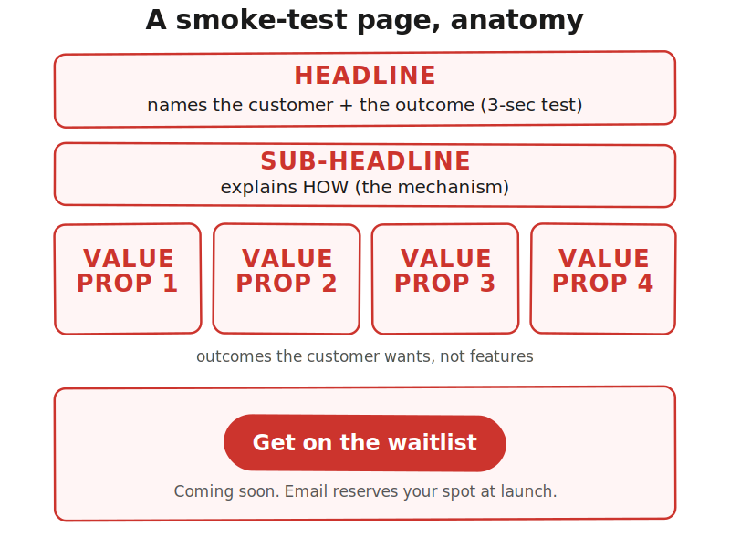

> **Module 1 · Lesson 1.2a · [CORE]** · [From Idea to First Paying Customer](/course/tech-for-non-technical-founders-2026/)
>
> **Input:** your Founding Hypothesis sentence from [Lesson 1.1](/course/tech-for-non-technical-founders-2026/form-your-founding-hypothesis-90-minute-sprint/) (the one-sentence `if [customer] solves [problem] with [approach]...` you wrote)
>
> **Output:** a live landing page URL that names your customer and their outcome
>
> **Progress:** M1 · 2 of 5 · Results so far: hypothesis sentence

---

You are busy and probably tired of hearing "just validate it" without being shown how. This lesson gives you the how  --  one URL, one stranger, three seconds. Lesson 1.1 ended with your one-sentence hypothesis. To find out if anyone wants it, get it live as a URL where strangers can sign up.

After this lesson you will be able to: **publish a smoke-test page that names your customer and their outcome in 3 seconds, then run a one-stranger clarity test on it.**

---

A **smoke-test page** is one URL that describes your unbuilt product and asks visitors for an email if they want it. You are testing demand, not feasibility - "would strangers sign up?" not "would my friends use it?"

Any **AI page builder** drafts a working page from your hypothesis in ~60 seconds. Popular free options: **[Mixo](https://www.mixo.io/)** (fastest setup), **[Manus AI](https://manus.im/)** (more layout control), **[Durable](https://durable.co/)** (polished templates). This lesson walks through Mixo; the workflow is identical on the others.

The page has four copy blocks that decide whether it converts:

- The **headline** names the customer and the outcome in one line. "Solo chiropractors: resubmit denied claims in 30 seconds" works because a visitor knows in 3 seconds whether the page is for them. "Smart Solutions for Modern Businesses" tells them nothing.
- The **sub-headline** explains how, in one line. The mechanism. "One click submits to your insurance portal" beats "AI-powered automation."
- The **3-4 value props** describe what the visitor gets, in their words. "Stop calling 8 tutoring centers" is an outcome a parent wants; "Calendar integration" is a feature they read as noise.
- The **CTA + footer** is "Get on the waitlist" plus a "Coming soon" line in the footer. (**CTA** = call to action, the button you want the visitor to click.) Never use "Buy now." You cannot legally sell something that does not exist yet.



---

> **Build (45 minutes):**
>
> 1. Sign up at [mixo.io](https://www.mixo.io/) (free, email only). Paste your hypothesis, click **Generate**. ~60 seconds.
> 2. Tighten the 4 copy blocks above: headline names customer + outcome, value props rewrite as outcomes ("Stop calling 8 centers" not "Calendar integration"), CTA → "Get on the waitlist." Add "Coming soon. Email reserves your spot at launch." to the footer (AI builders don't add this). Strip the extras the builder added (Pricing, FAQ, Testimonials).
> 3. If the draft reads generic, prompt ChatGPT or Claude: *"Turn this hypothesis into 3 outcome-focused value props, max 6 words each: [PASTE HYPOTHESIS]"* and paste the output.
> 4. Swap the hero image. Prompt ChatGPT, Claude, or Gemini: *"Photorealistic image: [pain scenario in one sentence]. Candid, natural lighting, no text or logos."* Save and upload. Or delete it  --  the headline carries the page. **Never** use a product mockup of something you have not built.
> 5. Click **Publish**. Mixo gives a free URL like `yourname.mixo.io`. Open it in an incognito window (`Cmd/Ctrl+Shift+N` in Chrome/Safari/Edge, `Cmd/Ctrl+Shift+P` in Firefox). Confirm the page loads.

Send the URL to **ONE real person** who has not seen your work. Any stranger works (they don't need to be your target customer  --  this tests headline clarity, not buying interest). Ask: "In 3 seconds, who is this page for and what does it do?"

> **✅ Success check:** they can name both. If they cannot, the headline is almost always the fix  --  rewrite it and retest.

---

**If strangers cannot name who the page is for or what it does, even after 2 headline rewrites.** Your hypothesis `[customer]` or `[differentiation]` blank is still too vague. Back to [Lesson 1.1](/course/tech-for-non-technical-founders-2026/form-your-founding-hypothesis-90-minute-sprint/) and tighten ("solo chiropractors," not "small businesses").

**If the builder's draft reads generic after 2 regenerations.** Your hypothesis `[problem]` blank is too vague. Same fix - back to [Lesson 1.1](/course/tech-for-non-technical-founders-2026/form-your-founding-hypothesis-90-minute-sprint/).

**If no AI builder fits your idea, or you want template control over AI generation.** Drop to manual mode with **[Carrd](https://carrd.co/)** (no-code drag-drop, free for 3 sites). Use the same workflow but write each copy block yourself first. Prompt Claude or ChatGPT and paste the output into Carrd:

```text
Translate this hypothesis into 6 landing-page elements
(headline, sub-headline, 3 value props, CTA copy, footer disclaimer):
[PASTE HYPOTHESIS]
```

---

Read your published page out loud as if you were the visitor. The sentence where your tongue trips is the next one to rewrite before Lesson 1.2b.

---

> **Done when:** URL is live and one stranger answered "who is this for, what does it do" in under 3 seconds.
>
> **Next click:** [1.2b · Wire Tracking Before You Spend a Dollar](/course/tech-for-non-technical-founders-2026/smoke-test-wire-tracking/)
>
> **If blocked:** see "If this fails" above.

---

*Built by [JetThoughts](https://jetthoughts.com) as part of the [From Idea to First Paying Customer](/course/tech-for-non-technical-founders-2026/) free curriculum.*
