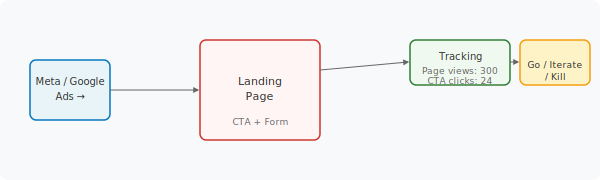

> **Module 1 · Lesson 1.2c · [CORE]** · [From Idea to First Paying Customer](/course/tech-for-non-technical-founders-2026/)
>
> **Input:** a live landing page with tracking installed (from [Lesson 1.2b](/course/tech-for-non-technical-founders-2026/smoke-test-wire-tracking/))
>
> **Output:** a go / iterate / kill decision on your hypothesis, backed by real demand signal
>
> **Progress:** M1 · 4 of 5 · Results so far: hypothesis sentence + live landing page + tracking installed

---

You have a live page and tracking installed. Now you need strangers to see it  --  not friends, not your LinkedIn network, not people who want to be polite to you. Three hundred cold visitors with a tracked CTA (call-to-action  --  the button you want visitors to click) tells you more about your hypothesis than 14 interviews with people who want to be nice.

After this lesson you will be able to: **run a cold-traffic smoke test on your landing page, read the conversion rate against the go/iterate/kill threshold, and decide whether to advance, rewrite, or kill your hypothesis.**

---

**Pick your ad channel** based on who your hypothesis names in the [customer] blank:

- **B2C consumer** → [Meta Ads](https://business.facebook.com/) ($0.50-$2 CPC). Best when the product is visual and the audience is broad.
- **B2B / job-title-sold** → [Google Search](https://ads.google.com/) ($3-$8 CPC) if your customer Googles the problem; [LinkedIn](https://www.linkedin.com/campaignmanager/) ($5.50-$22 CPC) if they don't.
- **Developer tools** → [Reddit Ads](https://ads.reddit.com/) ($1-$3 CPC) in r/programming, r/webdev, r/SaaS.
- **Niche vertical** → Google Search long-tail ($1-$5 CPC)  --  real estate, dentists, contractors Googling pain.

**Budget:** depends on your channel's CPC (cost-per-click  --  what one ad click costs). 300 visits on Meta costs $300-$600; on LinkedIn, $1,800-$6,600. If budget is tight, see the $0 organic path on the [full channel guide](/course/tech-for-non-technical-founders-2026/reference/smoke-test-channel-guide/).

**Start ad-account setup the weekend BEFORE launch.** First-time ad accounts can take 24-72 hours to approve. Meta is the slowest; Reddit clears same-day.

---

1. Verify your ad account is approved and payment method attached. If not, set it up tonight.
2. Launch the campaign on your chosen channel. Set a daily budget that gets you to 300 visits within 5-7 days.
3. **Do not touch the page.** No headline rewrites, no bid adjustments, no hourly dashboard refreshes. You want raw demand against the original hypothesis  --  not an optimized funnel.
4. After 300 visits, read your conversion rate (form submits ÷ page views) against this table:

| Conversion rate from cold traffic | Decision | What to do |
|---|---|---|
| <3% | Kill or pivot | Hypothesis is wrong. Rewrite the weakest blank and re-test. |
| 3-5% | Iterate the message | Rewrite headline or try a different audience. Same hypothesis, different framing. |
| 6-10% | Promising | Move to [Module 2 interviews](/course/tech-for-non-technical-founders-2026/find-10-people-where-to-look/). Talk to the people who signed up. |
| 10-20% | Strong signal | Run interviews + [Product Brief](/course/tech-for-non-technical-founders-2026/one-page-product-brief-vibe-prd/) in parallel. |
| >20% | Suspicious | Either hot market OR broken targeting. Verify with a second channel. |

**✅ Success check:** you have a conversion rate from ≥300 cold visits AND a go/iterate/kill decision written down.

---

**If conversion is below 3%.** **Why:** your [customer] or [differentiation] blank is too vague  --  strangers don't recognize themselves in the headline. **Fix:** go back to [Lesson 1.1](/course/tech-for-non-technical-founders-2026/form-your-founding-hypothesis-90-minute-sprint/) and tighten the blank that scored lowest on your 4-lens test.

**If conversion is above 20%.** **Why:** either you have a hot market (rare) or your ad targeting is too narrow (common). **Fix:** run a second channel briefly. LinkedIn 22% + Reddit 3% = your LinkedIn targeting is the variable, not the hypothesis. Both channels near the rate = the signal is real.

---

Open your tracking dashboard. Write down the number that surprised you most  --  the gap between what you expected and what the data says. That gap is the hypothesis blank worth testing first in Module 2.

---

> **Done when:** ≥300 cold visitors have seen your page and you have a conversion rate read against the go/iterate/kill table. Decision written down.
>
> **Next click:** [1.3 · Price Your Hypothesis on the Smoke-Test Page](/course/tech-for-non-technical-founders-2026/price-hypothesis-on-smoke-test-page/)
>
> **If blocked:** see "If this fails" above. If the ad budget is out of reach, use the $0 organic path on the [full channel guide](/course/tech-for-non-technical-founders-2026/reference/smoke-test-channel-guide/)  --  slower but real.
>
> **Deeper reference:** [Full channel budgets + ad account setup timing + B2B budget alternatives](/course/tech-for-non-technical-founders-2026/reference/smoke-test-channel-guide/)

---

*Built by [JetThoughts](https://jetthoughts.com) as part of the [From Idea to First Paying Customer](/course/tech-for-non-technical-founders-2026/) free curriculum.*
