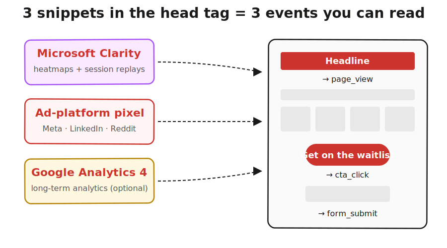

> **Module 1 · Lesson 1.2b · [CORE]** · [From Idea to First Paying Customer](/course/tech-for-non-technical-founders-2026/)
>
> **Input:** the live landing page URL you published in [Lesson 1.2a](/course/tech-for-non-technical-founders-2026/smoke-test-build-page/)
>
> **Output:** Clarity + GA4 installed on your landing page  --  ready for channel selection and pixel install in Lesson 1.2c
>
> **Progress:** M1 · 3 of 5 · Results so far: hypothesis sentence + live landing page

---

Without tracking, the typical smoke-test result is unreadable. Hundreds of ad clicks, a handful of signups  --  and no way to tell whether the offer is wrong or the form is broken. A session replay would have caught the broken form on visitor one. The fix is free tracking installed before you spend a cent on ads  --  most of the work is creating accounts (Microsoft, Google).

After this lesson you will be able to: **install Clarity and GA4 on your landing page so you can see who visits and what they click  --  before you spend a dollar on ads.**

---

A **tracking snippet** is a small block of code (HTML or JavaScript) that you copy from one site and paste into a field on your page builder. You do not write or edit it. Once installed, each snippet records visitor activity to a dashboard you read later.

You need two things regardless of which ad channel you pick in [Lesson 1.2c](/course/tech-for-non-technical-founders-2026/smoke-test-landing-page-7-day-demand-test/):

- **[Microsoft Clarity](https://clarity.microsoft.com/)** (free)  --  session recordings and heatmaps. Not needed to read conversion numbers, but essential when conversion is low and you need to see *why*. Watch ten replays after 300 visits; the pattern usually appears within the first three. Diagnose a <3% rate here before you rewrite your hypothesis.
- **[Google Analytics 4](https://analytics.google.com/)** (free)  --  your analytics foundation. Tracks page views, clicks, and form submits. If you later pick Google Ads in 1.2c, GA4 links directly to it  --  no separate pixel needed.

**Your channel-specific pixel** (Meta Pixel, LinkedIn Insight Tag, or Reddit Pixel) gets installed in Lesson 1.2c after you pick your channel  --  same process (copy snippet, paste in head-tag), under one minute.

All snippets paste into the **head-tag field**  --  the hidden block at the top of every webpage. Page builders label this "head," "custom code," or "tracking scripts" (Mixo: Settings → Custom Code → Header).

The 3 numbers you will read in Lesson 1.2c:

| Event | What it measures |
|---|---|
| Page view | Total visitors who reached the page |
| CTA (call-to-action) click | Visitor clicked the email-form button - measures headline + value-prop strength |
| Form submit | Email address actually submitted - measures friction |

Conversion rate = form submits ÷ page views. That is the number your Founding Hypothesis is judged against.

---

> **Install:**
>
> **Before you start:** you'll need a Microsoft account (Clarity) and a Google account (GA4). Create both now.
>
> 1. Install [Microsoft Clarity](https://clarity.microsoft.com/) (free, 60 seconds  --  copy snippet, paste in head-tag).
> 2. Install [GA4](https://analytics.google.com/) (free, Measurement ID in head-tag). If you plan to use Google Ads, you'll link GA4 in Google Ads Settings during Lesson 1.2c.
> 3. Open your page in an incognito window. Wait 60s. **✅ Clarity:** your visit appears as a session recording. **✅ GA4:** test visit registers in your dashboard.
>
> (One "custom code" field? That field IS the head-tag  --  paste all snippets there.)

---

**If Clarity shows "No data yet" after 5 minutes.** **Why:** the snippet is in the wrong field - usually pasted in the page body instead of the head tag, or your builder's preview mode is blocking scripts. **Fix:** double-check the field name; most builders separate "head code" from "body code," and the snippet must go in head. If your builder only has one "custom code" field, that field is usually the right one. Still nothing after the fix? Wait one hour and re-check. Clarity sometimes lags on the first install.

**If GA4 shows no test visit after 5 minutes.** **Why:** same cause as Clarity  --  Measurement ID pasted in the wrong field, or the builder's preview mode is blocking it. **Fix:** move the Measurement ID to the head-tag field, publish the page, then refresh the GA4 Realtime report. GA4 needs a real page load (not preview) to register the first hit.

---

Open Clarity, find your own session recording, and watch it. Then open GA4's Realtime report and confirm your test visit registered. Write down one thing you did not notice while building the page that you noticed watching yourself as a visitor. That gap between what you intended and what a visitor experiences is what tracking exists to surface.

---

> **Done when:** Clarity shows your recording AND GA4 shows your test visit.
>
> **Next click:** [1.2c · Run the Smoke Test and Read the Signal](/course/tech-for-non-technical-founders-2026/smoke-test-landing-page-7-day-demand-test/)
>
> **If blocked:** see "If this fails" above.

---

> **See it in action:** [Module 1 walkthrough: Mia builds TutorMatch](/course/tech-for-non-technical-founders-2026/module-1-walkthrough-mia/)

*Built by [JetThoughts](https://jetthoughts.com) as part of the [From Idea to First Paying Customer](/course/tech-for-non-technical-founders-2026/) free curriculum.*
