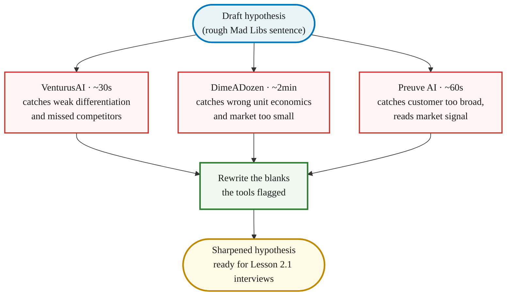

> **Course reference** · [From Idea to First Paying Customer](/course/tech-for-non-technical-founders-2026/) course.
> Companion to [Lesson 1.1: Form Your Founding Hypothesis](/course/tech-for-non-technical-founders-2026/form-your-founding-hypothesis-90-minute-sprint/). Read this when you are filling in the five blanks of the Mad Libs sentence and want a structured second opinion before you book the first interview.

You are about to write a one-sentence hypothesis that names your customer, problem, approach, competition, and differentiation. The sentence will anchor every interview, every landing-page headline, and every build decision for the next three months. Before you commit it to your `Founding Hypothesis` Google Doc, push it through one or two validation tools.

This guide covers three tools - VenturusAI, DimeADozen, and Preuve AI - with enough detail to use each one productively in under ten minutes. All three are pre-interview research aids. They do not replace Lesson 2.1's ten Mom Test interviews.

---

## Why use validation tools

Write the Mad Libs sentence in five minutes and you'll fall in love with it. Run it through one validation tool first and you'll find the blank you were vague about before it costs you ten interviews.

The tools catch different things:

| Blind spot | Which tool catches it |
|---|---|
| You named a competitor nobody has heard of (or missed the one everyone uses) | VenturusAI (Porter's Five Forces) |
| Your `[CUSTOMER]` blank is "small businesses" - a category, not a person | Preuve AI (niche-segment scan) |
| Your unit economics assume $50/mo pricing when the market pays $15 | DimeADozen (retention-curve section) |
| Your problem is real but the market is too small to support a business | DimeADozen (market-sizing section) |
| Your `[DIFFERENTIATION]` is "easier to use" - the vaguest claim in SaaS | VenturusAI (SWOT strengths section flags it) |

None of these tools costs more than a month of Perplexity Pro. Two are free. Run at least one before you fill the five blanks.

---

## Quick comparison

| Tool | What it does | Price | Best for |
|---|---|---|---|
| **VenturusAI** | SWOT, PESTEL, Porter's Five Forces strategic frameworks (~30s) | Free tier (1,000 chars) / Pro from $10/mo | Spotting structural blind spots in your business model |
| **DimeADozen** | 7-section validation brief with kill-risks and market sizing (~2 min) | $9 Starter / $129 Entrepreneur | A brutal second opinion on whether the idea has legs |
| **Preuve AI** | Evidence-based scoring from 50+ live data sources with source links (~60s) | Free scan / $29 Founder Report | Data-backed market signal check (not LLM hallucination) |

---

## VenturusAI

### What it does

VenturusAI runs your business idea through three classic strategic frameworks - SWOT (Strengths, Weaknesses, Opportunities, Threats), PESTEL (Political, Economic, Social, Technological, Environmental, Legal forces), and Porter's Five Forces (Buyer Power, Supplier Power, Threat of Substitution, Competitive Rivalry, Threat of New Entrants). It also produces sections on target audience, marketing strategy, and financial estimates.

Think of it as a free MBA student who reads your one-paragraph description and produces a structured critique in 30 seconds. The frameworks are academic, but the output is surprisingly practical when your input is specific.

### What to prepare before you open it

Write a 2-4 sentence paragraph covering four things. Do not open the tool until this paragraph is written:

1. **What you are building** - one sentence, plain English. "A mobile app for solo chiropractors that reduces insurance-claim resubmission time."
2. **Who it is for** - the specific person, not a category. "Solo chiropractors with 1-3 staff who handle their own billing."
3. **The specific problem** - a verb-noun pair. "Resubmitting denied insurance claims takes 14 days and 8% of recovered revenue."
4. **Your business model** - even if rough. "Subscription at $200/mo per clinic."

Example input that produces good results:

> *"I'm building a mobile app for solo chiropractors that reduces insurance-claim resubmission time from 14 days to one click. Subscription model at $200/mo."*

Example input that produces useless results:

> *"An app for small businesses to be more productive."*

Every blank in the Mad Libs sentence is a blank in your VenturusAI input. Specific in = specific out.

### How to read the report

The report has 7-8 sections. You do not need to read all of them. Focus on three:

**Porter's Five Forces - Competitive Rivalry section.** If it names a competitor you had not thought of, add that competitor to the Competition column in the [full hypothesis sprint](/course/tech-for-non-technical-founders-2026/reference/hypothesis-sprint-full/). If it names one you already knew about but describes their advantage in a way you had not considered, rewrite your `[DIFFERENTIATION]` blank.

**SWOT - Weaknesses.** This is the section that hurts. If the AI flags a weakness you already knew about (e.g., "founder has no engineering background"), that is expected. If it flags one you had not considered (e.g., "customer acquisition depends on insurance-industry partnerships that take 6-12 months to close"), pay attention. That is a structural blank in your hypothesis.

**PESTEL - Legal/Regulatory.** Many founders skip this. If your product touches healthcare, finance, education, or anything involving personal data, read this section carefully. A regulatory blocker you discover now costs zero dollars. One you discover after building costs your runway.

The Marketing Strategy and Financial Estimates sections are AI-generated first drafts. Skim them for ideas; do not treat the numbers as real.

### Common mistakes

- **Vague input.** "An app for food delivery" produces generic SWOT that is useless. Write the four-part paragraph above.
- **Trusting it blindly.** The AI generates insights from general logic, not from your specific market. It cannot access your local competitors or proprietary market data.
- **Stopping at one report.** If the first report is too generic, take the most interesting section, expand on it, and re-feed it as a new input. Iterate.

### Pro tips

- Use the export-to-Google-Docs feature. Keep the AI-generated framework and manually update it as you gather real interview data. By Module 2, you will have a side-by-side comparison of what the AI predicted vs. what real humans said.
- Ask the tool explicitly about failure modes. Refine your input to include: "What could cause this to fail?" The Weaknesses and Threats sections will be sharper.
- The free tier has a ~1,000 character limit. If your input exceeds it, cut adjectives before you cut specifics. "Very innovative" costs characters and adds zero signal.

---

## DimeADozen

### What it does

DimeADozen produces a multi-section validation report: Executive Summary, Market Sizing, Competitive Landscape, Customer Profiling, Risk Assessment (kill risks), Unit Economics, and Go-To-Market Strategy. The Starter report ($9) is 5-7 pages. The Entrepreneur report ($129) is 40+ pages with sourced data and full metrics.

The tool was bootstrapped by a solo founder who sold it - it is designed for exactly the person reading this guide: someone who wants a brutal second opinion before committing time and money.

### What to prepare before you open it

Same 2-4 sentence paragraph as VenturusAI. Plus: name 1-2 competitors you are aware of. The tool uses competitor names to calibrate its market-sizing and competitive-landscape sections. If you name zero competitors, it assumes the market is empty - which makes the report less useful.

### How to read the report

The Starter report is 5-7 pages. You only need to read two sections on the first pass:

**Kill Risks.** This is the section that justifies the $9. It flags existential threats: market saturation (too many entrenched players), low barriers to entry (competitors can clone you in a weekend), CAC-to-LTV problems (acquiring a customer costs more than they will ever pay you), and regulatory hurdles. If any kill risk is specific - names a competitor, a regulation, or a cost number - take it seriously. If it is generic ("the market is competitive"), treat it as a yellow flag, not a red one.

**Retention-Curve / Unit Economics.** This section estimates whether the numbers work. If it says your target market is too small at your price point, revisit the `[CUSTOMER]` blank in Lesson 1.1. If it says your CAC is too high relative to LTV, revisit your channel assumption.

Skip the Executive Summary and Go-To-Market sections on first read. They are AI-generated strategy and rarely say anything you could not have guessed. Come back to them after you have real interview data.

### Starter ($9) vs. Entrepreneur ($129)

| | Starter | Entrepreneur |
|---|---|---|
| Length | 5-7 pages | 40+ pages |
| Data sourcing | AI-generated estimates | Sourced data with citations |
| Kill risks | High-level flags | Specific, with competitor names and cost numbers |
| Unit economics | Rough ranges | Detailed modeling |
| When to use | Pre-interview sanity check | Due diligence before committing capital |

At the pre-interview stage, the $9 Starter is enough. You are looking for red flags, not investment-grade due diligence. If the Starter report flags a kill risk, you decide whether to investigate further or pivot. If it comes back clean, you proceed to interviews.

### Common mistakes

- **Paying $129 before you know what a $9 report looks like.** Run the Starter first. If it flags something specific that needs deeper investigation, upgrade.
- **Treating it as a go/no-go decision.** The tool validates the *logic* of a business model, not the *demand*. A clean report means your idea is not obviously broken. It does not mean customers will pay. That requires Lesson 1.2-1.4's smoke test and Lesson 2.1's interviews.
- **Ignoring the competitors it names.** The tool often surfaces competitors you did not know existed. Use these as starting points for your own manual research.

### Pro tips

- Run the report, read the kill risks, adjust your hypothesis, and run it again. Two $9 reports on different versions of your hypothesis are cheaper than one week of building the wrong thing.
- If the report flags a competitor you have never heard of, spend 20 minutes on their website before you dismiss them. Read their pricing page, their testimonials, and their most recent blog post. You will learn more from a live competitor's marketing than from a generic competitive-landscape summary.

---

## Preuve AI

### What it does

Preuve AI scans 50+ live data sources - Crunchbase, Google Trends, Reddit, G2, Capterra, Product Hunt, news aggregators, and industry publications - and produces an evidence-based viability score (0-100). Every claim in the report links to its underlying source. Unlike general-purpose LLMs that hallucinate market facts, Preuve shows you where the data came from.

The key product is the **Founder Report** ($29 one-time): a 13-section analysis with competitor mapping (up to 15 competitors with pricing and weak spots), TAM/SAM/SOM estimates, customer persona identification, and AI Coach pivot suggestions.

### What to prepare before you open it

One sentence, as specific as possible. The narrower your niche segment, the more relevant the market signals Preuve finds.

Bad: "Helping small businesses."

Good: "Accounts-payable teams at 50-200 person companies."

Better: "Solo-practice chiropractors who file their own insurance claims and spend Mondays on resubmissions."

The tool matches your description against live data sources. A broad description matches everything and tells you nothing. A narrow description matches specific signals.

### How to read the report

**Start with the Viability Score (0-100).** A score above 70 means the tool found positive market signals. A score below 40 means it found more problems than opportunities. A score between 40-70 means the data is mixed - drill into the specific sections that pulled the score down.

**Competitor Mapping.** Preuve identifies up to 15 competitors with pricing and "weak spots." The weak spots are the most actionable part of the report - they tell you where existing solutions fall short. If three competitors share the same weak spot, your `[DIFFERENTIATION]` blank should target it.

**Source links.** Every claim is linked to its source. If a score looks off - too high or too low - drill into the cited source before dismissing it. Sometimes the AI misinterprets a data point (e.g., a Reddit post from 2018 gets weighted too heavily). You are the human in the loop.

### The AI Coach

After your first report, the AI Coach suggests pivots based on what the data actually shows. It compares your idea against competitor weaknesses and market demand signals and identifies blind spots. Common pivot suggestions:

- Target a micro-niche where existing solutions are too broad
- Change the business model (e.g., B2C → B2B)
- Add a feature that competitors are missing

Treat the pivot suggestions as hypotheses to test in Lesson 2.1 interviews, not as instructions. The AI Coach can tell you what the data suggests; it cannot tell you whether a real customer agrees.

### Pricing

| Tier | Price | What you get |
|---|---|---|
| Free Scan | $0 | High-level viability verdict |
| Founder Report | $29 one-time | Full 13-section analysis with competitor mapping and source links |
| Radar | $9/mo | Ongoing market monitoring |
| Investor-Ready | $499 | Manual review, custom pitch deck, 18-month financial model, 4-page investment memo |

For pre-interview validation, the Free Scan + Founder Report is the sweet spot. Skip the Investor-Ready package until you have a signed paid pilot and a deck to raise on.

### Common mistakes

- **Vague input.** As with VenturusAI, "an app for fitness" produces a generic report. Use the specific-niche format above.
- **Treating the viability score as binary.** A score of 55 does not mean "kill the idea." It means "the data is mixed - investigate the low-scoring sections before proceeding."
- **Ignoring the pivot suggestions.** Run the report, read the pivots, adjust your description, and scan again. Watch how the score changes. The delta between scans tells you which blank in your hypothesis is weakest.

### Pro tips

- Run the free scan first. If the viability score is above 50 and the competitor mapping names companies you recognize, the $29 Founder Report is worth it. If the free scan comes back below 30 with vague competitors, save your $29 and revisit your hypothesis first.
- Preuve scans Reddit and niche forums. If real people are discussing the problem you want to solve, Preuve will find those discussions and link to them. Read the threads. The verbatim language from real users is worth more than any AI-generated summary.

---

## Recommended workflow

The three tools work best in sequence, not all at once. Here is the order that produces the most signal for the least time:

### 1. VenturusAI (first - free)

Run your hypothesis paragraph through VenturusAI. Read the Porter's Five Forces Competitive Rivalry section and the SWOT Weaknesses section. If it flags a competitor you missed or a structural weakness you had not considered, fix those blanks in your hypothesis before moving to the next tool.

**Time:** 10 minutes (5 to write input, 5 to read key sections).

### 2. Preuve AI free scan (second - free)

Run your refined hypothesis through Preuve's free scan. Check if the viability score is above 50 and whether the competitor mapping names companies in your space. If the score is low, revisit your `[CUSTOMER]` or `[PROBLEM]` blank. If the score is solid, you have a data-backed signal that the market exists.

**Time:** 5 minutes.

### 3. DimeADozen Starter (third - $9, optional)

If VenturusAI and Preuve both gave green or yellow signals, spend $9 on a DimeADozen Starter report. Read only the Kill Risks and Retention-Curve sections. If the report flags specific kill risks, address them before booking interviews. If it comes back clean, you have three independent tools saying your hypothesis is structurally sound.

**Time:** 10 minutes + $9.

### After the tools: Lesson 2.1 interviews

No tool validates your hypothesis. Only ten strangers describing the problem in their own words can do that. The tools tell you whether the sentence is well-constructed. The interviews tell you whether the sentence describes something real.

---

## What none of these tools can do

These tools sharpen your hypothesis. They do not validate it. Specifically:

**They cannot prove a real customer will pay.** A clean DimeADozen report and a Preuve score of 80 do not equal a signed Stripe checkout. That signal comes from Lesson 1.2-1.4's smoke-test landing page and Lesson 5.6's Design Partner Agreement with a real deposit.

**They cannot tell you whether the problem is real.** AI tools summarize what people have already said online. They cannot surface a problem that nobody has articulated publicly. The Mom Test interviews in Lesson 2.1 surface what specific named humans actually did last Friday - a signal no AI tool can produce.

**They cannot substitute for the Pragmatic-lens gut-check.** VenturusAI can flag that you have no engineering background, but only you know whether you can ship the thing with Lovable on evenings and weekends. The Pragmatic lens in Lesson 1.1 is still yours to score.

**They do not replace talking to humans.** If you spend three hours across these tools and zero hours on interviews, you have three AI reports and zero validation. The tools exist to sharpen the sentence you test in interviews. Skip the interviews and you have sharpened a sentence that might describe nothing.

---

## Further reading

- [Lesson 1.1: Form Your Founding Hypothesis](/course/tech-for-non-technical-founders-2026/form-your-founding-hypothesis-90-minute-sprint/) - write the Mad Libs sentence these tools stress-test.
- [Lesson 2.1: The Mom Test - Ask About the Past, Not the Future](/course/tech-for-non-technical-founders-2026/mom-test-ask-about-past-not-future/) - validate the sharpened hypothesis with ten real interviews.
- [Lesson 1.4 · Smoke Test: Run It and Read the Signal](/course/tech-for-non-technical-founders-2026/smoke-test-landing-page-7-day-demand-test/) - the next step after these tools confirm your sentence is well-constructed.

---

*Built by [JetThoughts](https://jetthoughts.com) as part of the [From Idea to First Paying Customer](/course/tech-for-non-technical-founders-2026/) curriculum. Tool research: June 2026, based on official websites (venturusai.com, dimeadozen.ai, preuve.ai), user reviews on Product Hunt and Indie Hackers, and hands-on testing with free tiers.*
