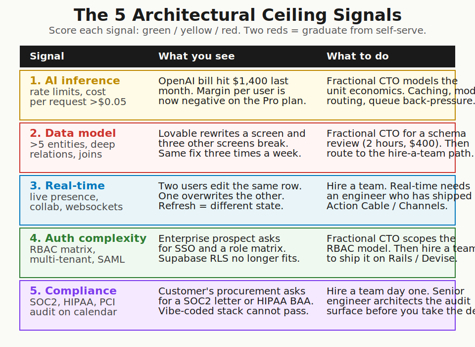
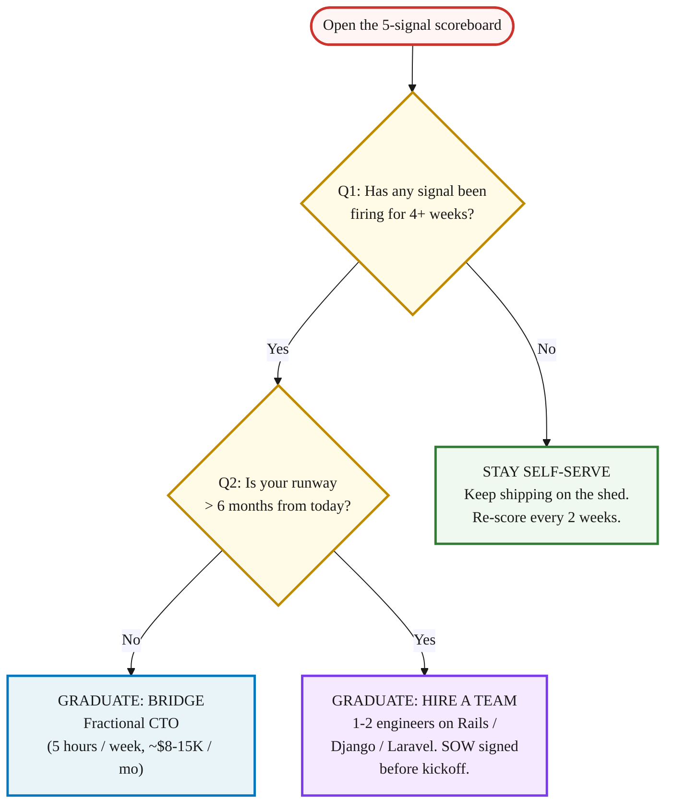

> **Module 4 · Step 4 of 4** · [From Idea to First Paying Customer](/course/tech-for-non-technical-founders-2026/)
>
> **Input:** a live MVP on the self-serve stack (from Chapter 4.3)
>
> **Output:** a yes/no decision on whether to graduate to Module 5 (First Paying Customer) or hire or stay self-serve

> **TL;DR:** Five architectural signals that mean the self-serve stack is maxed out. Two firing for 4+ weeks = graduate to a fractional CTO or hire. Run this check monthly once your MVP is live.

A working morning. Your [Lovable](https://lovable.dev) app is live (Lovable is an AI app builder that generates a working web app from a prompt - free trial, paid plans from $25/month, no coding required). 47 paying coaches on the platform. The dashboard takes 11 seconds to load for your largest account, a coach managing 80 clients. The Stripe webhook fired twice on three of yesterday's payments and you spent the morning refunding duplicates.

Two of your users keep landing on each other's data because the [Supabase](https://supabase.com) row-level security drifted last week when a contractor patched the check-in form (Supabase is a database + auth service that Lovable connects to automatically - free tier covers early-stage usage, paid plans from $25/month). The ceiling is visible now, but it was visible two months earlier too. That's when this check should have caught it.

**Vibe Coding** is shipping a real product with AI-generated code from tools like Lovable, Cursor, or Bolt - no engineer, no dev shop, no months of build. The term comes from indie founder Pieter Levels and describes the 2026 default for solo non-technical founders. This chapter is about the moment the shed stops holding.

Once your build goes live, run this 5-signal check monthly. Each signal that fires earlier saves rebuilds later. This is a proactive monitoring habit, not a post-mortem - the goal is to catch the ceiling before you slam into it.

> **This chapter is a monthly review reference, not an action-today chapter.** Your only action today: open your calendar and add a recurring monthly block titled "Vibe-coding 5-signal check." The first run is once the live MVP is up (Ch 4.3); until then, the chapter sits on the shelf. If you haven't shipped a live MVP yet, bookmark this and come back the moment you have real users clicking around. The morning scene above is what the ceiling looks like when it actually arrives.

## Who this 5-signal check is for

The Lovable + Supabase + Stripe shed from [The Self-Serve MVP Stack](/course/tech-for-non-technical-founders-2026/self-serve-mvp-stack-lovable-supabase-stripe-2026/) holds 80% of pre-seed B2B SaaS workloads. The other 20% is what this post is about. Run this check monthly once your MVP is live and the ceiling shows up while it is still a tuning problem. Wait until something breaks - slow dashboard, duplicate webhooks, support tickets climbing - and you are paying late-fix prices on what was an early-fix problem. The 5 signals below are the early-warning system. Run them before you need them.

## The 5 architectural ceiling signals

Each signal has the same shape: a visible symptom you can see in your dashboard tonight, the thing that is actually happening underneath, the cost of leaving it alone for another month, the cost of addressing it now. Score each one green / yellow / red. Two reds means you graduate. Signals are ordered by when they typically become detectable - run Signal 1 from Week 2, Signal 5 at Week 8+.

Skim this table to spot which signals might fire for you now; deep-read the ones below it.

| # | Signal | Detectable | Routes to |
|---|---|---|---|
| 1 | AI inference cost or rate limits | Week 2-4 | Fractional CTO (unit economics) |
| 2 | Data model passes 5 entities | Week 4-6 | Fractional CTO schema review |
| 3 | Real-time becomes non-negotiable | Week 4-8 | Hire engineering team |
| 4 | Auth complexity beyond email + OAuth | Week 6-10 | Fractional CTO scope → hire |
| 5 | Compliance audit on the calendar | Week 8-12+ | Hire engineering team |

### Signal 1: AI inference cost or rate limits eating your margin (detectable: Week 2-4)

**What you see**: your OpenAI bill for last month was $1,400. You have 200 paying users at $29/month. Your gross margin per user just went negative on the Pro plan. Or: the OpenAI rate limit on your tier hits at 11am on weekdays and your "AI summary" feature returns errors for 90 minutes until usage drops.

**What is happening underneath**: a Lovable app that calls an LLM on every screen load (or every form submit) racks up per-request cost no founder modeled. The naive integration sends the full context every call, no caching, no model routing, no queue back-pressure when rate limits hit. Anthropic and OpenAI both publish per-token pricing; founders rarely run the per-user math until the credit-card statement arrives.

**Cost of leaving it alone**: a coach-facing AI features startup we spoke with in Q4 2025 was burning $2,200/month on OpenAI for 180 paying users at $19/month. They were $2,000 underwater before they paid for hosting, before the founder paid herself. Eight months of runway went to AI cost they never modeled early enough to change course.

**Cost of addressing now**: a Fractional CTO models the unit economics in a spreadsheet (~$800 of work). The conversation that follows is about caching, model routing (cheap-model for the first pass, expensive-model only when needed), token budgets per plan tier, and queue back-pressure that fails gracefully when the rate limit hits. If the math says the unit economics are unfixable at the current price, the conversation is about pricing, not engineering. Better to have it at week four of noticing the problem than at month six.

### Signal 2: Data model complexity passing 5 entities with deep relations (detectable: Week 4-6)

**What you see**: you ask Lovable to add a "tags" feature to your client list. Lovable rewrites the client detail screen and now the check-in form, the export-to-CSV, and the weekly email digest are all subtly off. You fix the same join error three times in one week. New features take twice as long as they did in month two.

**What is happening underneath**: Lovable's generated schema treats every prompt as a fresh design. When your data model crosses roughly 5 core entities (`coaches`, `clients`, `check_ins`, `programs`, `tags`, plus their joins), the implicit foreign-key reasoning the LLM holds in its head per-prompt no longer covers the full graph. It writes a query that ignores a join, or it adds a column to one screen but not the migration. The schema decays from edits.

**Cost of leaving it alone**: a fitness-coaching SaaS we picked up in Q1 2026 had 11,000 lines of Lovable-generated code, no foreign keys, every model named in the singular, and three customer accounts with corrupted data because a webhook had retried a Stripe charge update four times. The founder shipped six features in month four and zero in months five and six because every change surfaced something else.

**Cost of addressing now**: a 2-hour [Fractional CTO](/course/tech-for-non-technical-founders-2026/hire-track-supplementary-reference/#the-fractional-cto-bridge) schema review (~$400 at $200/hour). They sketch the proper entity-relationship diagram, identify the joins your current schema is missing, and tell you whether the next 10 features fit on the current schema or need a redesign. If the verdict is "rebuild on a real ORM," route to [Reading the SOW](/course/tech-for-non-technical-founders-2026/hire-track-supplementary-reference/#reading-the-sow).

### Signal 3: Real-time features becoming non-negotiable (detectable: Week 4-8)

**What you see**: two coaches open the same client record. One adds a note. The other adds a note. Whoever saves second wins - the first note is gone. Your Slack fills with "the app is acting weird again." A wellness platform we talked to in late 2025 was getting 4-5 of these support tickets per week. The founder had patched the same save-collision bug three times. Each patch changed the behavior without fixing the architecture underneath.

**What is happening underneath**: the Lovable + Supabase REST loop is request-response: every screen reads on load and writes on submit. Real-time presence, collaborative editing, and live-updating feeds are not what auto-generated REST endpoints serve. Supabase does have a Realtime product, but wiring it into a Lovable-generated frontend that was never designed around subscriptions means rebuilding every screen the feature touches.

**Cost of leaving it alone**: the save-collision bug becomes a churn driver inside three months. Customers who collaborate (coaches sharing clients, teams sharing accounts) lose work weekly. Each ticket costs you an hour of founder time and erodes the trust that brought the user in. By the time real-time becomes a deal-breaker for a $30K customer, the rebuild estimate is the same - you just spent six months patching first.

**Cost of addressing now**: this signal routes directly to a hire-a-team decision, not a Fractional CTO bridge. Real-time done right needs an engineer who has shipped Action Cable on Rails or Channels on Django and knows the queue, broadcast, and reconnection edge cases. The [SOW reading guide](/course/tech-for-non-technical-founders-2026/hire-track-supplementary-reference/#reading-the-sow) walks the contract. Estimated rebuild on Rails: 6 to 10 weeks for one senior + one mid engineer.

### Signal 4: Auth complexity passing the email + OAuth ceiling (detectable: Week 6-10)

**What you see**: an enterprise prospect asks: "do you support SAML SSO with our Okta tenant, with role-based access where managers see their direct reports' data but not the whole organization, and an audit log of every read?" You answer yes because the deal is $50K ARR. You then realize Supabase RLS does not model that role hierarchy without writing your own policy DSL on top. A B2B HR tools founder we spoke with in February 2026 answered yes to exactly this question, spent 6 weeks building a workaround in Supabase, shipped it to the customer, and watched their security team find a read-through gap in the policy on week 2. The contract had a data-handling clause. The workaround had not been reviewed by anyone with security experience.

**What is happening underneath**: Supabase's row-level security is excellent for "user X can only read rows where user_id = X." It strains under role matrices (manager-reads-team, admin-reads-org, super-admin-reads-everything), multi-tenant isolation across an organization, SAML federation, and audit trails. Each of those needs first-class engineering, not a configurable policy.

**Cost of leaving it alone**: you write the SOC2 letter and the SAML promise into the contract and ship a workaround. Six months later, the workaround becomes the breach incident. The [vibe-coded auth shape](/blog/vibe-coding-disposable-by-design/) - 47 startups with public URL-based access controls, BOLA-class vulnerabilities (BOLA = broken-object-level-authorization, the bug where User A can read User B's data by changing a number in the URL), no audit log to diagnose what got read - is what deferred auth complexity produces.

**Cost of addressing now**: a Fractional CTO scopes the role matrix on paper (1-2 weeks of part-time work, ~$8-15K), then hands the spec to a hired engineering team for the production build on Devise + Pundit (Rails) or django-allauth + django-guardian. Total auth-shaped rebuild: 4 to 8 weeks.

### Signal 5: Compliance or security audit landing on the calendar (detectable: Week 8-12+)

**What you see**: a customer's procurement team emails you the SOC2 questionnaire. Or HIPAA: they need a Business Associate Agreement before they can send a single PHI record. Or PCI: you wanted to handle card data directly instead of using Stripe Checkout and now you need to pass a quarterly scan. The self-serve stack cannot pass any of these, not because it is insecure in every way, but because it has no audit log, no documented data handling, no formally reviewed access control.

**What is happening underneath**: compliance is mostly process plus a small amount of code. The process is documented data flow, access logs, encryption at rest and in transit, vulnerability disclosure, vendor reviews. The code is the implementation underneath. A Lovable + Supabase stack passes some checks (Supabase encrypts at rest, Stripe handles PCI-sensitive paths) and misses others (no audit log, no documented data lifecycle, no senior engineer to sign the security policy). The auditor needs a person to ask "show me how you decommission a leaver's access" and a non-technical founder cannot answer that question alone.

**Cost of leaving it alone**: you either pass on the deal or sign it with a workaround, which becomes the breach narrative when the customer's auditor finds it 11 months in.

**Cost of addressing now**: this is a hire-a-team decision from day one, not a bridge. A senior engineer architects the audit surface (audit logs, access controls, vendor inventory, data flow diagrams) before you take the deal. Vanta, [Drata](https://drata.com), and [Secureframe](https://secureframe.com) automate the SOC2 paperwork; the engineering work underneath them needs a real architect, not a Lovable rebuild. Budget: 8 to 16 weeks to first-time SOC2 readiness, plus ongoing process work.

> **What to bring to Vanta / Drata / Secureframe onboarding from your existing artifacts.** Your [Ch 4.2 ownership audit](/course/tech-for-non-technical-founders-2026/github-aws-database-ownership-checklist/) third-party-API-keys section is your starting vendor inventory (Lovable, Supabase, Stripe, Resend, OpenAI, etc.). Your one-page brief Section 1 (problem, named persona, data flow) feeds the data-flow diagram. Without these two inputs ready, the first onboarding call burns on collecting basics the audit could have surfaced in 15 minutes.

**What to say to the customer this week** (when they ask for SOC2 / HIPAA BAA / PCI before you can deliver it): respond within 48 hours with a 3-sentence email - do not ghost. Use this template:

> *"Thank you for the SOC2 / [BAA / PCI] questionnaire. We are pre-SOC2 [or pre-BAA] today and are starting the readiness work in Q3. In the meantime, I can share our security one-pager (encryption at rest via Supabase, payments via Stripe Checkout, data deletion on request) and offer a 90-day pilot with the data-handling restrictions of your choice - including hosting in a sandboxed instance if that helps your security team approve. Would that bridge work while we complete the formal certification?"*

This buys you 60-90 days to start the engineering work. About 30-40% of enterprise security teams will accept a documented bridge for a small pilot; the rest will say "come back when SOC2 is done" - which is the same answer you would get from ghosting them, plus you have preserved the relationship for the rebid 6 months later. Keep the security one-pager as a shared Google Doc with: data flow diagram, encryption-at-rest summary, vendor list (Supabase, Stripe, Lovable, Loom, etc.), and a one-line incident-response contact. 30 minutes to draft; reusable across every enterprise sales conversation.

## Shed → House → Skyscraper

[Rob Walling's shed analogy](https://podcast.creatorscience.com/rob-walling/) from [Should You Hire?](/course/tech-for-non-technical-founders-2026/should-you-hire-2026-decision-tree/) is the right map. A shed holds one workflow with one persona moving down a single happy path. Add a second story (a second workflow, a second persona, a real data model) and you have a house that needs a structural engineer to plan the load. A skyscraper - compliance-bound, multi-tenant, real-time, AI-heavy - needs a hired engineering team and an architect from day one. You can't add ten more floors to a shed. When the load requires a skyscraper, you start a new building.

## The decision: stay self-serve or graduate

The 2-question test runs in 90 seconds. Print it. Tape it inside the laptop case.

Q1 No: stay self-serve. The shed is holding. Re-score every two weeks. The cost of being wrong is two weeks of lost lead time, which is recoverable.

Q1 Yes + Q2 Yes: graduate to the hire-a-team path. You have the runway to scope, hire, and onboard a 1-2 engineer team on Rails, Django, or Laravel. The [SOW reading guide](/course/tech-for-non-technical-founders-2026/hire-track-supplementary-reference/#reading-the-sow) is your starting page.

Q1 Yes + Q2 No: graduate to the [Fractional CTO bridge](/course/tech-for-non-technical-founders-2026/hire-track-supplementary-reference/#the-fractional-cto-bridge). Five hours a week of senior eyes for the next two to three months while you raise or grow into the runway needed for a hire. The [Salvage vs Rebuild decision tree](/course/tech-for-non-technical-founders-2026/salvage-vs-rebuild-decision-tree/) tells you which signal-firing pieces salvage and which the Fractional CTO triages first.

> Two ceiling signals firing for 4+ weeks means the shed is no longer holding. Either hire a team if you have runway, or bridge with a Fractional CTO until you do. Both beat watching the codebase get worse.

## What to do tomorrow

Three actions. The first is tonight.

- **Open your Lovable + Supabase admin dashboard tonight.** Pull up: the 30-day request error rate, the 30-day Stripe webhook retry log, the active user count, and last month's OpenAI / Anthropic invoice if you use one. Five minutes of dashboard time is the input to the scoreboard.
- **Score each of the 5 signals: green / yellow / red, AND log Date first observed + Date last observed per signal.** Use the scoreboard above. Green = no symptom yet. Yellow = symptom showing in the last 30 days but recoverable. Red = symptom firing 4+ weeks AND you've patched it more than once. Without dated observation windows you cannot tell the "fired once this week" from the "fired every week for two months" signal, and the 4-week graduation rule below collapses. Keep the scoreboard as a Notion table or a sheet with columns: Signal | Status | Date first observed | Date last observed | Notes. Score green when the symptoms are firing and you arrive at the [salvage-or-rebuild thread](/course/tech-for-non-technical-founders-2026/salvage-vs-rebuild-decision-tree/) at month nine - by then the rebuild estimate is months of work you could have caught in days.
- **If 2 or more signals are red AND have been red for ≥4 consecutive weeks (per the flowchart Q1 above), start the [Fractional CTO bridge](/course/tech-for-non-technical-founders-2026/hire-track-supplementary-reference/#the-fractional-cto-bridge) THIS WEEK.** The 4-week window is the load-bearing qualifier; two reds in one week is a tuning problem, not a graduation signal. Not next month, not after the next sprint - once the 4-week mark hits, the Fractional CTO conversation is one Calendly invite away and the first call is usually free. The bridge holds until you have the runway clarity for a full hire.

## Artifacts you carry out of Module 4

After finishing Ch 4.1-4.4, Sam has five artifacts. Each one feeds a specific downstream destination - this table is the map:

| Artifact | Where it goes next |
|---|---|
| **Build-path decision** (validate / self-serve / fractional CTO / hire - chosen and dated, from Ch 4.1) | Module 5 outbound posture. The build path determines whether you sell a live MVP (self-serve, hire) or a Carrd + Stripe pre-sale (validate path), which decides the Ch 5.2-5.5 scripts you use. |
| **Ownership audit results** (12-item checklist - GitHub, AWS root, billing, IAM, DB credentials, secrets store, backups, domain, DNS, third-party keys, monitoring, status page - all on your company email, from Ch 4.2) | Module 5 contract foundations. The Ch 5.4 Design Partner Agreement assumes you own the production environment. If ownership is split, fix that before sending any DPA. |
| **Shipped MVP** (live URL + first 4-6 user accounts if self-serve, OR live URL + contractor weekly demo cadence if hired, from Ch 4.3) | Ch 5.1 must-have test denominator. The 40% test needs 10-30 users who actually touched the MVP; the first 4-6 are the starting cohort. |
| **Monthly ceiling-signal scorecard** (the 5 signals from Ch 4.4, first run once the live MVP is up) | Recurring monthly check from live launch onward. The scorecard is the early-warning system that decides whether you stay self-serve or graduate while you sell. |
| **Output for Module 5: 4-6 active users you can survey** (from Ch 4.3 onboarding) | Ch 5.1 Sean Ellis 40% test input. These are the users who get the 5-question survey first; their Q2-Q3 verbatims become the persona language for Ch 5.2-5.5 outbound. |

Two ceiling signals firing for 4+ weeks means the shed is no longer holding. Both beat watching the codebase get worse.

## Further reading

- Rob Walling, [Vibe Coding interview on Creator Science](https://podcast.creatorscience.com/rob-walling/) - the shed-vs-skyscraper analogy that frames every architectural ceiling decision. 35-minute listen.
- DHH, [The One-Person Framework](https://world.hey.com/dhh/the-one-person-framework-711e6318) - the Rails case for keeping the production rebuild small enough that one engineer can operate end-to-end.
- Veracode, [GenAI Code Security Report 2025](https://www.veracode.com/blog/genai-code-security-report/) - 45% of LLM-generated code shipped at least one exploitable security flaw. The data behind why the compliance signal fires.
- Supabase, [Realtime documentation](https://supabase.com/docs/guides/realtime) and [Row-Level Security guide](https://supabase.com/docs/guides/database/postgres/row-level-security) - the official boundary between what Supabase serves well and where the data-model and real-time signals begin.
- OpenAI, [Rate limits documentation](https://platform.openai.com/docs/guides/rate-limits) - the per-tier request and token caps that drive the AI-inference signal once your traffic crosses a threshold.
- Vanta, [SOC2 readiness for early-stage SaaS](https://www.vanta.com/resources/soc-2-compliance-checklist) - the audit-surface checklist most founders see for the first time when their first enterprise customer asks for a SOC2 letter.
- Y Combinator, [Startup School Library + 2026 Founder Resources](https://www.ycombinator.com/library/) - the YC stance on validating without code and the changing role of the technical co-founder. Read before any framework decision.

> **Done when:** You have scored all 5 signals (green/yellow/red) with dated observation windows and set a recurring monthly calendar block titled "Vibe-coding 5-signal check."
> **Next click:** [5.1 · Your First Customer Is Not a Marketing Problem](/course/tech-for-non-technical-founders-2026/must-have-segment-pmf-test/)
> **If blocked:** If 2+ signals are red but you are not sure whether to hire, book one free Fractional CTO call. The first call is usually free and the diagnosis alone is worth the hour.

---

*Built by [JetThoughts](https://jetthoughts.com) as part of the [From Idea to First Paying Customer](/course/tech-for-non-technical-founders-2026/) curriculum.*
