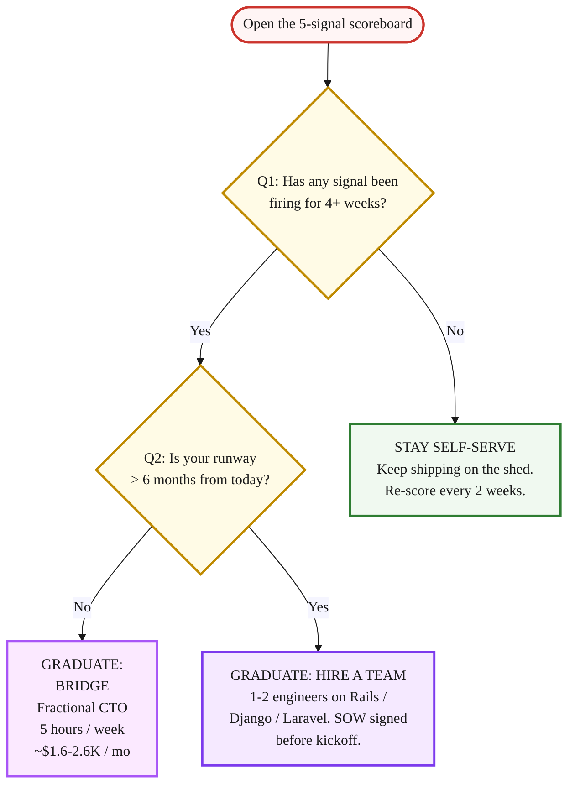

> **Module 4 · Lesson 4.5 · [OPTIONAL] - a monthly review reference** · [From Idea to First Paying Customer](/course/tech-for-non-technical-founders-2026/)
>
> **Input:** a live MVP on the self-serve stack (from [Lesson 4.3 · Stack](/course/tech-for-non-technical-founders-2026/self-serve-mvp-stack-lovable-supabase-stripe-2026/) + [4.4 · Build Phases](/course/tech-for-non-technical-founders-2026/self-serve-mvp-stack-build-phases/))
>
> **Output:** a yes/no decision on whether to graduate to Module 5 (First Paying Customer) or hire or stay self-serve
>
> **Progress:** M4 · 5 of 5 · [OPTIONAL] - a recurring monthly check once your MVP is live; the core path continues at 5.1

> **TL;DR:** Five architectural signals that mean the self-serve stack is maxed out. Two firing for 4+ weeks = graduate to a fractional CTO or hire. Run this check monthly once your MVP is live.

---

Your Lovable app is live and the first coaches are paying. The stack that got you here has a ceiling, and it shows up in your dashboard weeks before a customer feels it. This lesson is the monthly check that catches the ceiling early, while it is still a tuning problem and not a rebuild.

After this lesson you will be able to: **score five architectural signals each month and decide, on a dated rule, whether to stay self-serve, bridge to a fractional CTO, or hire a team.**

**Vibe Coding** is shipping a real product with AI-generated code from tools like [Lovable](https://lovable.dev), Cursor, or Bolt - no engineer, no dev shop, no months of build. The term was coined by Andrej Karpathy in early 2025; indie founder Pieter Levels made it famous in practice. Done right, it carries you to your first paying users. This lesson is about the moment the shed stops holding.

> **This is a monthly review reference, not an action-today lesson.** Your only action today: open your calendar and add a recurring monthly block titled "Vibe-coding 5-signal check." The first run is once the live MVP is up (Lesson 4.3-4.4); until then, this sits on the shelf. If you haven't shipped a live MVP yet, bookmark this and come back the moment you have real users clicking around.

## The 5 architectural ceiling signals

Each signal has a visible symptom you can see in your dashboard tonight, a real cause underneath, and a route to the right kind of help. Score each one green / yellow / red. Signals are ordered by when they typically become detectable - Signal 1 from Week 2, Signal 5 at Week 8+.

| # | Signal (and what you notice) | Detectable | Routes to |
|---|---|---|---|
| 1 | AI inference cost or rate limits - runtime AI bill outruns revenue, or the feature errors at peak | Week 2-4 | Fractional CTO (unit economics) |
| 2 | Data model passes 5 entities - one new feature breaks three old ones | Week 4-6 | Fractional CTO schema review |
| 3 | Real-time becomes non-negotiable - two users edit one record, second save wins | Week 4-8 | Hire engineering team |
| 4 | Auth beyond email + OAuth - a buyer asks for SAML SSO + role access + audit log | Week 6-10 | Fractional CTO scope, then hire |
| 5 | Compliance audit on the calendar - a SOC2 / HIPAA / PCI questionnaire arrives | Week 8-12+ | Hire engineering team |

Run this check monthly and the ceiling shows up while it is still a tuning problem. Wait until something breaks - slow dashboard, duplicate charges, support tickets climbing - and you pay late-fix prices on what was an early-fix problem. The [full signal guide](/course/tech-for-non-technical-founders-2026/reference/ceiling-signals-full/) walks each signal in depth: the symptom, what is happening underneath, the cost of leaving it a month, and the cost of addressing it now.

## The decision: stay self-serve or graduate

The 2-question test runs in 90 seconds. Print it. Tape it inside the laptop case. Two reds count only when each has been firing for 4+ weeks - two reds in a single week is a tuning problem, not a graduation signal.

- **Q1 No:** stay self-serve. The shed is holding. Re-score every two weeks. Being wrong costs you two weeks of lead time, which is recoverable.
- **Q1 Yes + Q2 Yes:** graduate to the hire-a-team path. You have the runway to scope, hire, and onboard 1-2 engineers on Rails, Django, or Laravel. The [SOW reading guide](/course/tech-for-non-technical-founders-2026/hire-track-supplementary-reference/#reading-the-sow) is your starting page.
- **Q1 Yes + Q2 No:** graduate to the [Fractional CTO bridge](/course/tech-for-non-technical-founders-2026/hire-track-supplementary-reference/#the-fractional-cto-bridge). Five hours a week of senior eyes for the next two to three months while you raise or grow into the runway for a hire.

## Do this now

Three actions. The first is tonight.

1. **Open your Lovable + Supabase admin dashboard tonight.** Pull up the 30-day request error rate, the 30-day Stripe webhook retry log, the active user count, and last month's OpenAI / Anthropic invoice if you use one. Five minutes of dashboard time is the input to the scoreboard.
2. **Score each of the 5 signals green / yellow / red, AND log Date first observed + Date last observed per signal.** Green = no symptom yet. Yellow = symptom in the last 30 days but recoverable. Red = symptom firing 4+ weeks AND you've patched it more than once. Keep it as a Notion table or a sheet: Signal | Status | Date first observed | Date last observed | Notes. Without dated windows you cannot tell "fired once this week" from "fired every week for two months," and the 4-week rule collapses.
3. **If 2+ signals are red AND have been red for 4+ consecutive weeks, start the [Fractional CTO bridge](/course/tech-for-non-technical-founders-2026/hire-track-supplementary-reference/#the-fractional-cto-bridge) THIS WEEK.** Not next month, not after the next sprint. The first call is usually free.

> **Success check:** all 5 signals scored (green/yellow/red) with dated observation windows, and a recurring monthly calendar block titled "Vibe-coding 5-signal check."

**If this fails: every signal reads yellow and you cannot decide.**
- **Why:** yellow with no dates is a guess, not a reading - you are scoring mood, not symptoms.
- **Fix:** for each yellow, write the exact date you first saw the symptom and the last date you saw it. A symptom you cannot date to a specific dashboard number is a green, not a yellow. Only a symptom firing 4+ weeks with more than one patch is a red.

Look at your reddest signal. Is it firing because of load you actually have, or load you are afraid you might get? Graduate on the load you have - the shed holds longer than most founders fear.

## Artifacts you carry out of Module 4

After finishing Lesson 4.1-4.5, you have five artifacts. Each one feeds a specific downstream destination - this table is the map:

| Artifact | Where it goes next |
|---|---|
| **Build-path decision** (validate / self-serve / fractional CTO / hire - chosen and dated, from Lesson 4.1) | Module 5 outbound posture. The build path determines whether you sell a live MVP (self-serve, hire) or a Carrd + Stripe pre-sale (validate path), which decides the Lesson 5.2-5.7 scripts you use. |
| **Ownership audit results** (12-item checklist - GitHub org owner, repo collaborators, branch protection, AWS root, billing, IAM, DB credentials, secrets store, backups, domain, DNS, third-party keys - all on your company email, from Lesson 4.2) | Module 5 contract foundations. The Lesson 5.6 Design Partner Agreement assumes you own the production environment. If ownership is split, fix that before sending any DPA. |
| **Shipped MVP** (live URL + first 4-6 user accounts if self-serve, OR live URL + contractor weekly demo cadence if hired, from Lesson 4.3-4.4) | Lesson 5.1 must-have test denominator. The 40% test needs 10-30 users who actually touched the MVP; the first 4-6 are the starting cohort. |
| **Monthly ceiling-signal scorecard** (the 5 signals from Lesson 4.5, first run once the live MVP is up) | Recurring monthly check from live launch onward. The scorecard is the early-warning system that decides whether you stay self-serve or graduate while you sell. |
| **Output for Module 5: 4-6 active users as the starting cohort + a path to 10+ via Lesson 2.3-2.4 outreach** (from Lesson 4.3-4.4 onboarding) | Lesson 5.1 Sean Ellis 40% test input. 4-6 is the directional starting cohort - Lesson 5.1's "Under-10 respondents" sidebar reads that as MAYBE, not a verdict. Re-engage your Lesson 2.3-2.4 interview leads as Lesson 5.1 invites to get above 10 for a confident reading. Their Q2-Q3 verbatims become the persona language for Lesson 5.7 outbound. |

> **Done:** you have scored all 5 signals (green/yellow/red) with dated observation windows and set a recurring monthly calendar block titled "Vibe-coding 5-signal check."
>
> **You have now:** a live MVP (4.3-4.4) + a monthly ceiling-signal scorecard (4.5) that tells you, each month, whether to stay self-serve, bridge to a fractional CTO, or hire. Module 4 is done. Whether to graduate is now a dated, repeatable check instead of a guess.
>
> **Next:** the core path continues at [5.1 · Your First Customer Is Not a Marketing Problem](/course/tech-for-non-technical-founders-2026/must-have-segment-pmf-test/) - it takes the first users on your live MVP and tests whether they would miss it before you spend on ads.
>
> **If blocked:** if 2+ signals are red but you are not sure whether to hire, book one free Fractional CTO call. The first call is usually free and the diagnosis alone is worth the hour.
>
> **Deeper reference:** [The full 5-signal guide - each signal's symptom, root cause, cost of waiting, and cost of fixing now, plus the shed-house-skyscraper map and the enterprise "we're pre-SOC2" reply template](/course/tech-for-non-technical-founders-2026/reference/ceiling-signals-full/)

> **Module 4 closes here.** Before opening Module 5, you should have: (1) a build-path decision from the Lesson 4.1 tree (self-serve / fractional CTO / hire), (2) a Day-1 ownership audit passed (Lesson 4.2 - GitHub + AWS + domain all in your name), (3) a live MVP at a real URL with 5 ICP users tested + 5 green lights lit (Lesson 4.4), and (4) a monthly 5-signal ceiling check on the calendar (this lesson). All four in your `Founder OS` folder. Missing one? Go back - Module 5 invites your Module 2 interviewees + smoke-test email list to your URL; if there's no URL, there's no Module 5.

---

*See it in action: [Module 4 walkthrough: Mia ships TutorMatch](/course/tech-for-non-technical-founders-2026/module-4-walkthrough-mia/)*

*Built by [JetThoughts](https://jetthoughts.com) as part of the [From Idea to First Paying Customer](/course/tech-for-non-technical-founders-2026/) curriculum.*
