# Hugo Mermaid Diagrams Implementation - Technical Guide

**COMPLETE MERMAID INTEGRATION FOR HUGO CONTENT DEVELOPMENT**

## 🎯 **Quick Start - Copy & Paste Ready**

### **Basic Mermaid Syntax in Hugo**
```markdown
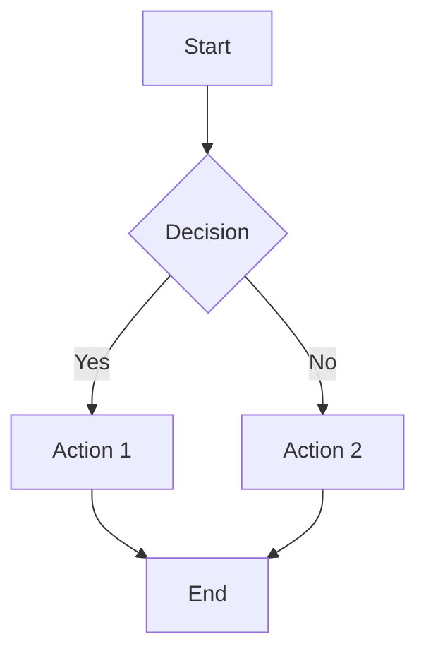
```

**Result**: Renders as an interactive diagram automatically in Hugo

## 📋 **Available Diagram Types**

### **1. Flowcharts (Most Common)**

**Use For**: Process flows, decision trees, user journeys, system workflows

```markdown
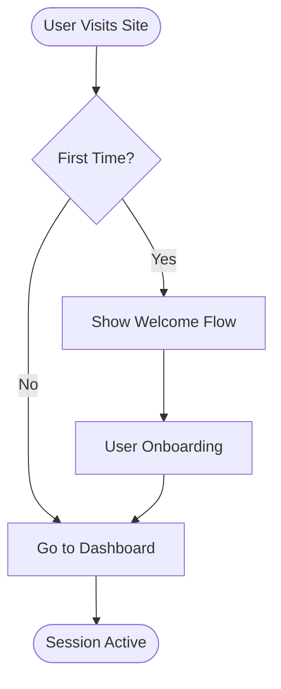
```

**Direction Options**:
- `TD` or `TB` = Top to Bottom
- `BT` = Bottom to Top
- `LR` = Left to Right
- `RL` = Right to Left

### **2. Sequence Diagrams**

**Use For**: API interactions, user flows, system communications

```markdown
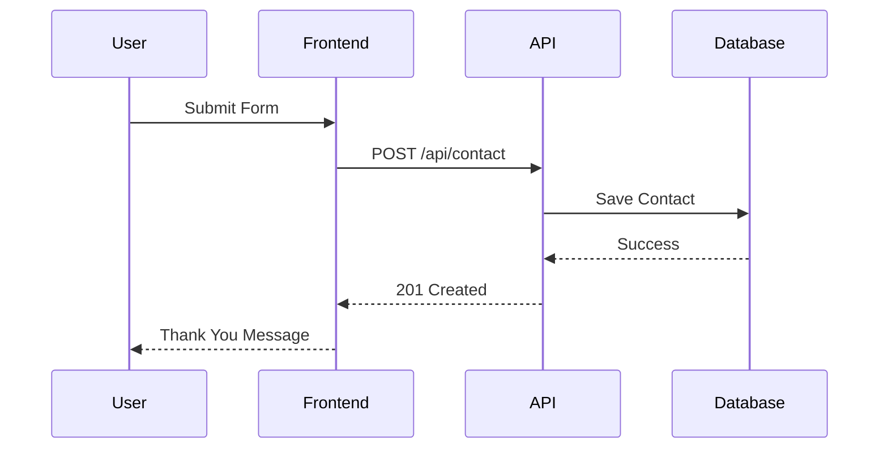
```

### **3. Class Diagrams**

**Use For**: Technical architecture, data relationships, system structure

```markdown
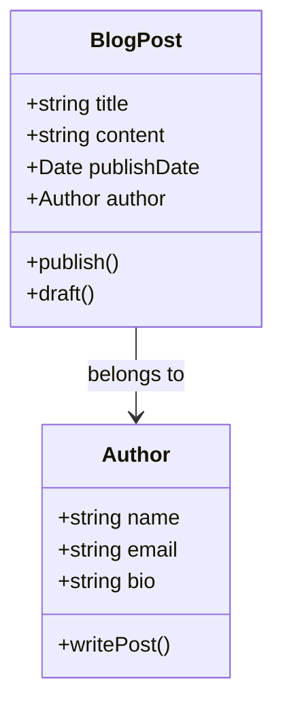
```

### **4. Entity Relationship Diagrams**

**Use For**: Database design, data modeling, system relationships

```markdown
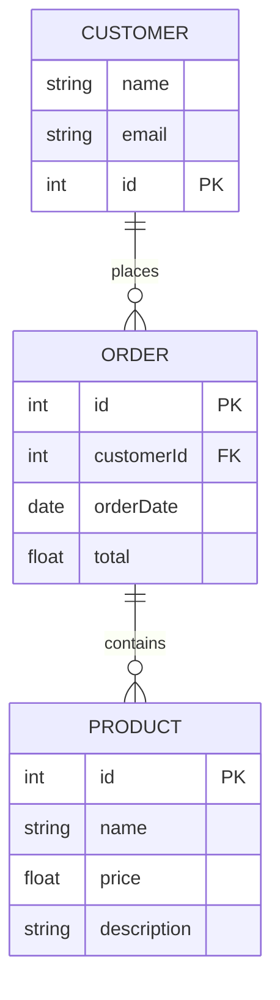
```

### **5. Gantt Charts**

**Use For**: Project timelines, content calendars, sprint planning

```markdown
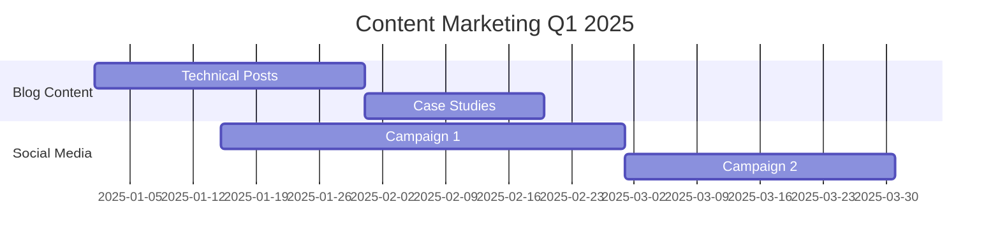
```

### **6. Pie Charts**

**Use For**: Data visualization, statistics, survey results

```markdown
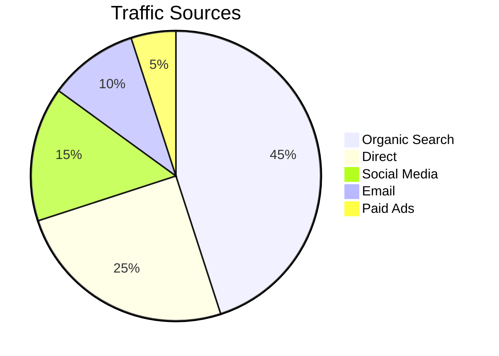
```

### **7. Journey Diagrams**

**Use For**: User experience flows, customer journeys

```markdown
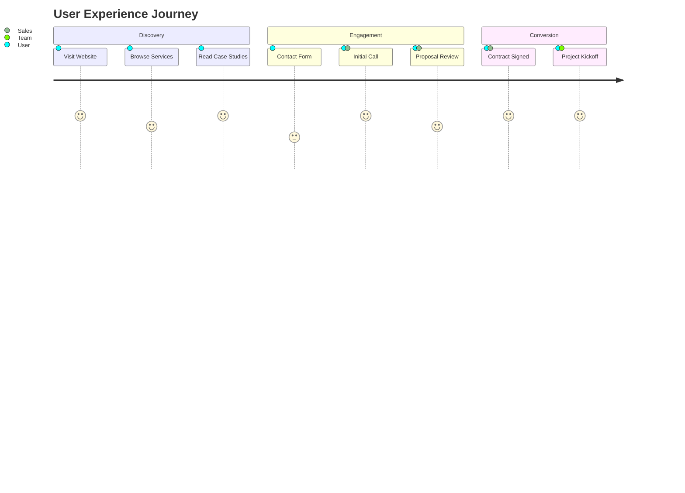
```

### **8. Git Graphs**

**Use For**: Development workflows, branching strategies

```markdown
```mermaid
gitgraph
    commit id: "Initial"
    branch feature
    checkout feature
    commit id: "Feature A"
    commit id: "Feature B"
    checkout main
    commit id: "Hotfix"
    merge feature
    commit id: "Release"
```
```

## 🛠️ **Content-Specific Examples**

### **Blog Post: "How We Deliver Software Projects"**

```markdown
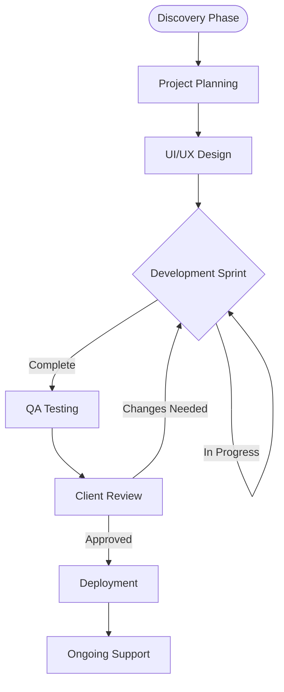
```

### **Service Page: "Fractional CTO Process"**

```markdown
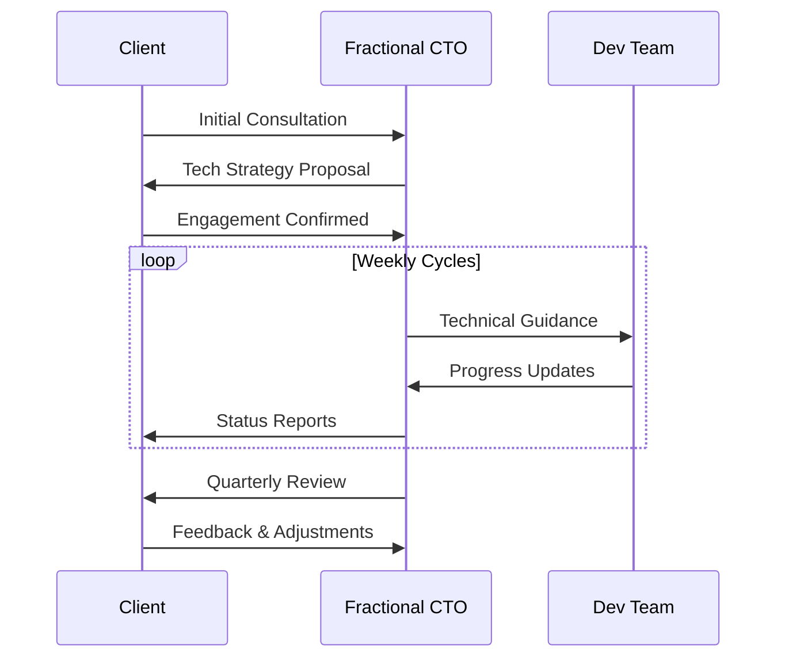
```

### **Case Study: "System Architecture"**

```markdown
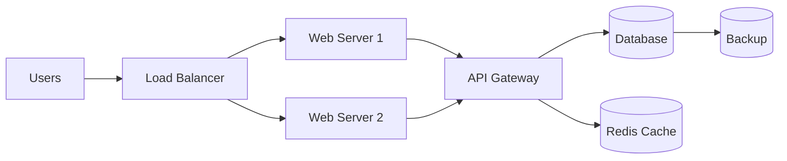
```

## 📝 **Content Writing Best Practices**

### **1. Diagram Placement**

**Effective Usage**:
```markdown
## The Development Process

Our proven development methodology follows these key stages:

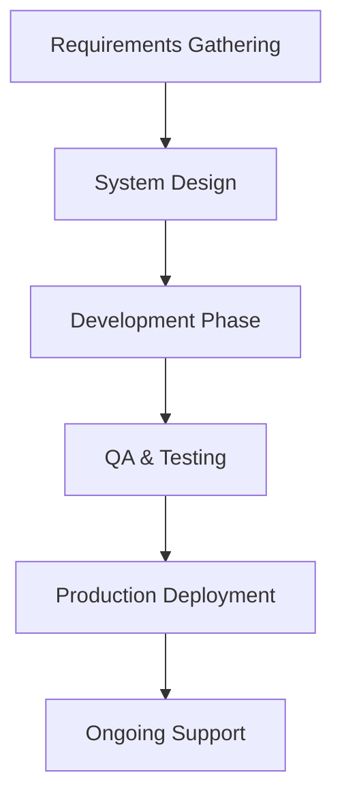

This structured approach ensures quality delivery...
```

### **2. Accessibility Considerations**

**Always Include Alt Text**:
```markdown
<!-- Diagram showing our 5-stage development process from requirements to support -->
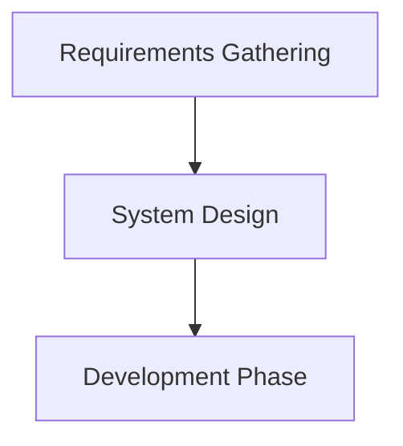

**Caption for Complex Diagrams**:
```markdown
```mermaid
[complex diagram]
```

*Figure 1: Complete system architecture showing user flow from frontend through API gateway to database layer*
```

### **3. Mobile-Friendly Diagrams**

**Keep It Simple**:
- Maximum 6-8 nodes per diagram
- Use short, clear labels
- Avoid overly complex relationships
- Test on mobile devices

**Good Example**:
```markdown
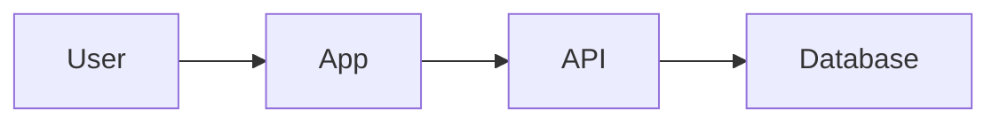

**Avoid**:
```markdown
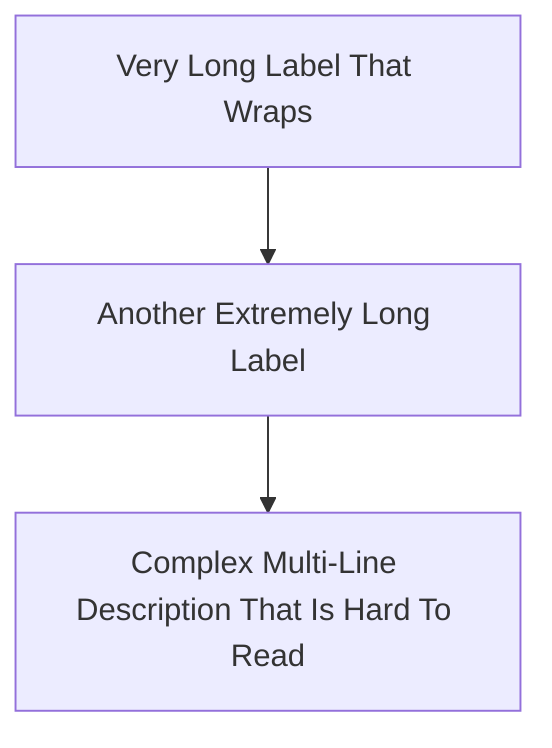

## 🎨 **Styling and Theming**

### **Custom Colors** (Advanced)

```markdown
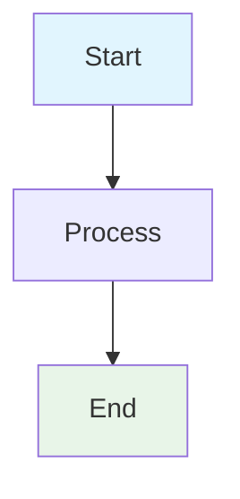
```

### **Professional Business Colors**

```markdown
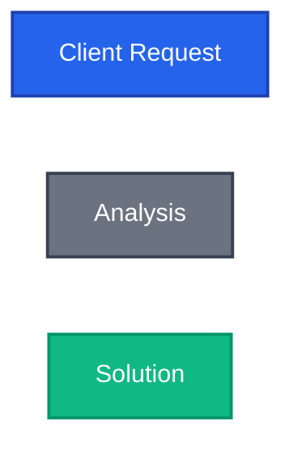
```

## 🐛 **Troubleshooting Common Issues**

### **Problem: Diagram Not Rendering**

**Check These Issues**:
1. **Syntax Error**: Validate Mermaid syntax at [mermaid.live](https://mermaid.live)
2. **Missing Code Block**: Must use triple backticks with `mermaid`
3. **Hugo Build Issue**: Check build logs for errors

**Solution**:
```markdown
<!-- ❌ Wrong -->
```
graph TD
    A --> B
```

<!-- ✅ Correct -->
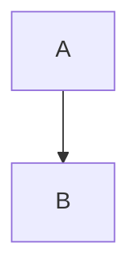
```

### **Problem: Diagram Too Large on Mobile**

**Solutions**:
1. Simplify the diagram
2. Split into multiple diagrams
3. Use horizontal layout for mobile

```markdown
<!-- Mobile-friendly approach -->
```mermaid
graph LR
    A --> B --> C
```
```

### **Problem: Special Characters Breaking Diagram**

**Use Quotes for Special Characters**:
```markdown
```mermaid
graph TD
    A["User's Journey"] --> B["API Response (JSON)"]
    B --> C["Success: 200 OK"]
```
```

### **Problem: Performance Issues**

**Optimization Tips**:
- Limit to 10-15 nodes per diagram
- Avoid overly complex relationships
- Use simpler diagram types when possible
- Consider static image alternative for very complex diagrams

## 📊 **Content Strategy Integration**

### **When to Use Mermaid Diagrams**

**Excellent For**:
- Technical blog posts explaining processes
- Service pages showing workflows
- Case studies demonstrating architecture
- Educational content with step-by-step flows
- Project methodology explanations

**Avoid For**:
- Simple lists (use bullet points instead)
- Single-step processes
- Purely decorative purposes
- When static images would be clearer

### **SEO Benefits**

**Structured Content**:
- Improves content scannability
- Increases time on page
- Enhanced user experience signals
- Visual content for featured snippets

**Implementation**:
```markdown
## Our Development Methodology

We follow a proven 5-stage process:

```mermaid
graph TD
    A[Discovery] --> B[Planning]
    B --> C[Development]
    C --> D[Testing]
    D --> E[Deployment]
```

### 1. Discovery Phase
[Detailed explanation...]

### 2. Planning Phase
[Detailed explanation...]
```

## 📋 **Quality Checklist**

### **Before Publishing**

- [ ] Diagram renders correctly in Hugo dev server
- [ ] Mobile responsiveness tested
- [ ] Alt text or caption provided
- [ ] Syntax validated at mermaid.live
- [ ] Diagram adds value (not just decoration)
- [ ] Labels are concise and clear
- [ ] Color scheme matches brand (if using custom colors)
- [ ] Performance impact considered (diagram complexity)

### **Content Review**

- [ ] Diagram supports the written content
- [ ] Technical accuracy verified
- [ ] Accessibility requirements met
- [ ] Cross-browser compatibility (if complex)

## 🚀 **Advanced Features**

### **Interactive Elements**

```markdown
```mermaid
graph TD
    A[Click Me] --> B[Next Step]
    click A "https://jetthoughts.com" "Visit JetThoughts"
```
```

### **Subgraphs for Organization**

```markdown
```mermaid
graph TD
    subgraph "Frontend"
        A[React App]
        B[Redux Store]
    end

    subgraph "Backend"
        C[API Server]
        D[Database]
    end

    A --> C
    C --> D
```
```

## 🔗 **Resources & References**

### **Official Documentation**
- [Mermaid Official Docs](https://mermaid.js.org/)
- [Live Editor](https://mermaid.live/)
- [Hugo Mermaid Integration](https://gohugo.io/content-management/diagrams/#mermaid-diagrams)

### **JetThoughts Resources**
- Content Style Guide: `../90.01-content-image-strategy.md`
- SEO Optimization: `../90-99-content-strategy/seo-optimization/90.09-emergency-cto-seo-audit-reference.md`
- Technical Writing Guidelines: `../70-79-templates-boilerplates/70.08-content-writing-guidelines-reference.md`

---

**Next Steps**: Start with simple flowcharts for your next blog post, then gradually explore more complex diagram types as needed. Always validate syntax before publishing and test on mobile devices.