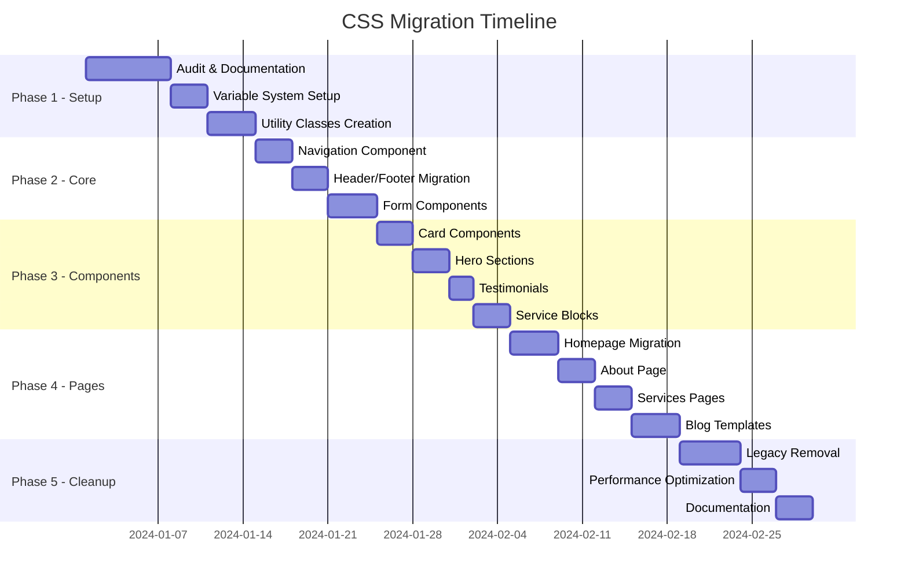

# CSS Migration Roadmap

## Executive Summary

This document provides a detailed, actionable roadmap for migrating from the legacy Beaver Builder CSS architecture to the new semantic CSS system. The migration is designed to be incremental, testable, and reversible at each stage.

## Migration Timeline Overview



## Phase 1: Foundation Setup (Week 1)

### Day 1-2: Complete CSS Audit

**Objective**: Document all existing CSS patterns and dependencies

**Actions**:
```bash
# Audit script to find all class usage
grep -r "class=" themes/beaver/layouts/ | \
  sed 's/.*class="\([^"]*\)".*/\1/' | \
  tr ' ' '\n' | sort | uniq > legacy-classes.txt

# Find all CSS files
find themes/beaver/assets/css -name "*.css" | \
  xargs wc -l | sort -nr > css-files-audit.txt
```

**Deliverable**: `legacy-class-mapping.csv`
```csv
Legacy Class,Semantic Replacement,Component,Status
fl-row,l-row,Layout,Pending
fl-col,l-col,Layout,Pending
fl-module,c-module,Component,Pending
pp-tabs,ui-tabs,UI,Pending
```

### Day 3-4: CSS Variable System

**Create**: `/themes/beaver/assets/css/settings/_variables.css`

```css
/* Design Tokens */
:root {
  /* Brand Colors */
  --brand-primary: #0066cc;
  --brand-primary-light: #3385d6;
  --brand-primary-dark: #004499;

  /* Semantic Colors */
  --color-text: #121212;
  --color-text-muted: #6c757d;
  --color-bg: #ffffff;
  --color-bg-alt: #f8f9fa;

  /* Spacing System (8px base) */
  --space-base: 8px;
  --space-xs: calc(var(--space-base) * 0.5);   /* 4px */
  --space-sm: calc(var(--space-base) * 1);     /* 8px */
  --space-md: calc(var(--space-base) * 2);     /* 16px */
  --space-lg: calc(var(--space-base) * 3);     /* 24px */
  --space-xl: calc(var(--space-base) * 4);     /* 32px */
  --space-2xl: calc(var(--space-base) * 6);    /* 48px */
  --space-3xl: calc(var(--space-base) * 8);    /* 64px */
}
```

### Day 5-7: Utility Class Framework

**Create**: `/themes/beaver/assets/css/utilities/index.css`

```css
/* Utility Class Generator */
@import '_spacing.css';
@import '_typography.css';
@import '_colors.css';
@import '_display.css';
@import '_flexbox.css';
@import '_responsive.css';
```

**Testing Checklist**:
- [ ] Variables load correctly
- [ ] Utilities apply without conflicts
- [ ] PostCSS processes utilities
- [ ] No performance regression

## Phase 2: Core Component Migration (Week 2)

### Navigation Component Migration

**Current Structure**:
```html
<!-- Legacy -->
<div class="pp-advanced-menu">
  <ul class="menu pp-advanced-menu-horizontal">
    <li class="menu-item">...</li>
  </ul>
</div>
```

**New Structure**:
```html
<!-- Semantic -->
<nav class="c-navigation c-navigation--primary" role="navigation">
  <ul class="c-navigation__list">
    <li class="c-navigation__item">
      <a class="c-navigation__link" href="#">...</a>
    </li>
  </ul>
</nav>
```

**Migration Steps**:
1. Create new partial: `partials/components/navigation-semantic.html`
2. Add compatibility CSS
3. Test both versions side-by-side
4. Switch templates to new partial
5. Remove old partial

### Header/Footer Components

**Files to Update**:
- `themes/beaver/layouts/partials/page/header.html`
- `themes/beaver/layouts/partials/page/footer.html`

**Class Mappings**:
```css
/* Temporary compatibility layer */
.fl-page { @apply .l-page; }
.fl-page-header { @apply .l-header; }
.fl-page-content { @apply .l-main; }
.fl-page-footer { @apply .l-footer; }
```

## Phase 3: Component Library (Week 3)

### Component Migration Priority

1. **High-Impact Components** (Used on every page):
   - Navigation
   - Header
   - Footer
   - Buttons

2. **Content Components** (Frequently used):
   - Cards
   - Heroes
   - Testimonials
   - Service blocks

3. **Interactive Components** (Complex):
   - Forms
   - Tabs
   - Modals
   - Accordions

### Card Component Example

**Before**:
```html
<div class="fl-module fl-module-uabb-info-box">
  <div class="uabb-module-content">
    <div class="uabb-info-box">
      <!-- content -->
    </div>
  </div>
</div>
```

**After**:
```html
<article class="c-card c-card--info">
  <header class="c-card__header">
    <h3 class="c-card__title">Title</h3>
  </header>
  <div class="c-card__body">
    <!-- content -->
  </div>
  <footer class="c-card__footer">
    <a href="#" class="ui-button ui-button--primary">Learn More</a>
  </footer>
</article>
```

## Phase 4: Template Migration (Week 4)

### Homepage Migration Plan

**File**: `themes/beaver/layouts/home.html`

**Steps**:
1. Create backup: `home.html.backup`
2. Identify all components used
3. Create semantic version of each component
4. Update template progressively
5. Test visual regression

**Component Checklist**:
- [ ] Hero section
- [ ] Services grid
- [ ] Testimonials slider
- [ ] Client logos
- [ ] Stats counter
- [ ] CTA section

### Blog Template Migration

**Files**:
- `themes/beaver/layouts/blog/list.html`
- `themes/beaver/layouts/blog/single.html`

**New Classes**:
```css
.c-blog-list {}
.c-blog-list__item {}
.c-blog-card {}
.c-blog-card__thumbnail {}
.c-blog-card__content {}
.c-blog-card__meta {}
.c-article {}
.c-article__header {}
.c-article__content {}
.c-article__footer {}
```

## Phase 5: Cleanup & Optimization (Week 5)

### Legacy Code Removal

**Step 1: Identify Unused CSS**
```bash
# Use PurgeCSS to find unused styles
purgecss --css themes/beaver/assets/css/**/*.css \
  --content themes/beaver/layouts/**/*.html \
  --output unused-css-report.txt
```

**Step 2: Remove Deprecated Files**
```bash
# Files to remove (after verification)
rm themes/beaver/assets/css/701-layout.css
rm themes/beaver/assets/css/586-dynamic.css
rm themes/beaver/assets/css/fl-*.css
```

**Step 3: Consolidate CSS Files**
```css
/* New structure */
main.css
├── settings.css
├── tools.css
├── generic.css
├── elements.css
├── objects.css
├── components.css
└── utilities.css
```

### Performance Optimization

**Metrics to Track**:
- CSS file size (before/after)
- First Contentful Paint
- Lighthouse scores
- Number of CSS files
- Critical CSS size

**Optimization Techniques**:
1. **Critical CSS Extraction**
2. **Component Code Splitting**
3. **Utility Class Deduplication**
4. **Variable Consolidation**
5. **Media Query Optimization**

## Testing Strategy

### Visual Regression Testing

**Tools**: Percy, BackstopJS, or Playwright

**Test Scenarios**:
```yaml
scenarios:
  - name: "Homepage Desktop"
    url: "/"
    viewport: { width: 1920, height: 1080 }
  - name: "Homepage Mobile"
    url: "/"
    viewport: { width: 375, height: 812 }
  - name: "Navigation Menu"
    url: "/"
    actions:
      - hover: ".c-navigation__item"
  - name: "Card Component"
    url: "/services/"
    selector: ".c-card"
```

### Cross-Browser Testing

**Browsers to Test**:
- Chrome (latest)
- Firefox (latest)
- Safari (latest)
- Edge (latest)
- Chrome Mobile
- Safari iOS

**Test Checklist**:
- [ ] Layout consistency
- [ ] Typography rendering
- [ ] Interactive elements
- [ ] Responsive behavior
- [ ] CSS Grid/Flexbox support

## Rollback Plan

### Rollback Triggers

1. **Performance Regression** > 10%
2. **Visual Breaking Changes**
3. **Browser Incompatibility**
4. **Build Process Failure**

### Rollback Steps

```bash
# 1. Restore backup files
git checkout main -- themes/beaver/assets/css/
git checkout main -- themes/beaver/layouts/

# 2. Clear Hugo cache
hugo mod clean
rm -rf resources/_gen/

# 3. Rebuild site
hugo --gc --minify

# 4. Verify restoration
npm run test:visual
```

## Migration Validation Checklist

### Pre-Migration
- [ ] Full backup created
- [ ] Baseline metrics recorded
- [ ] Visual screenshots captured
- [ ] Team notified
- [ ] Staging environment ready

### During Migration
- [ ] Components tested individually
- [ ] Responsive behavior verified
- [ ] Accessibility maintained
- [ ] Performance monitored
- [ ] Documentation updated

### Post-Migration
- [ ] Visual regression passed
- [ ] Performance improved/maintained
- [ ] Lighthouse scores verified
- [ ] Browser testing completed
- [ ] Documentation finalized

## Success Metrics

### Technical Metrics
- **CSS Size Reduction**: Target 30% reduction
- **Selector Performance**: < 3 levels deep
- **Specificity**: Average < 20
- **Duplication**: < 5% duplicate rules
- **Build Time**: < 5 seconds

### Quality Metrics
- **Maintainability Index**: > 80
- **Documentation Coverage**: 100%
- **Component Reusability**: > 70%
- **Developer Satisfaction**: Survey score > 4/5

## Support & Resources

### Documentation
- Semantic CSS Architecture Guide
- Component Library Documentation
- Utility Class Reference
- Migration Troubleshooting Guide

### Tools
- CSS Analyzer: Specificity and complexity analysis
- Visual Regression: Percy/BackstopJS setup
- Performance Monitor: Lighthouse CI
- Code Quality: Stylelint configuration

### Team Training
- Week 1: Architecture overview
- Week 2: Component development
- Week 3: Utility classes workshop
- Week 4: Migration best practices
- Week 5: Maintenance and extension

## Risk Mitigation

### Identified Risks

1. **Browser Compatibility Issues**
   - Mitigation: Progressive enhancement
   - Fallback: Compatibility layer

2. **Performance Regression**
   - Mitigation: Incremental migration
   - Fallback: Rollback procedure

3. **Visual Inconsistencies**
   - Mitigation: Visual regression testing
   - Fallback: Screenshot comparison

4. **Team Resistance**
   - Mitigation: Training and documentation
   - Fallback: Gradual adoption

## Conclusion

This migration roadmap provides a structured, low-risk approach to modernizing the CSS architecture. By following this incremental strategy, we ensure minimal disruption while achieving significant improvements in maintainability, performance, and developer experience.
